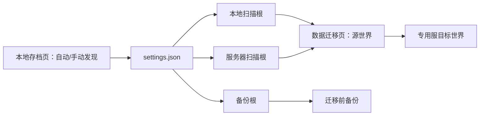
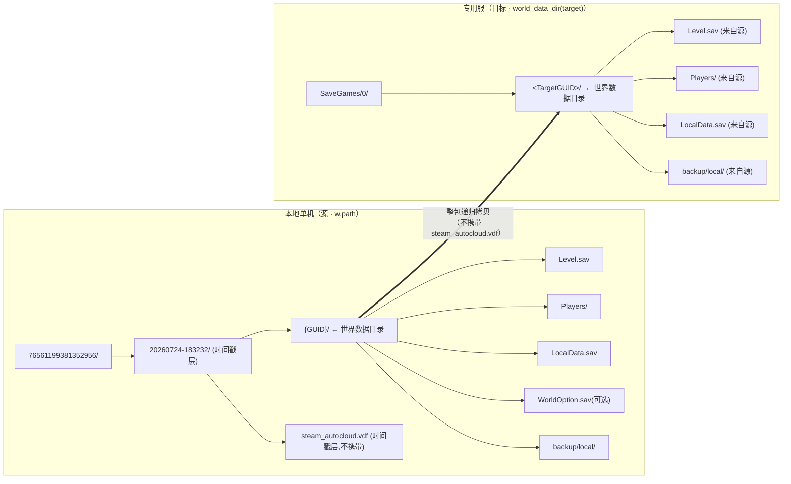
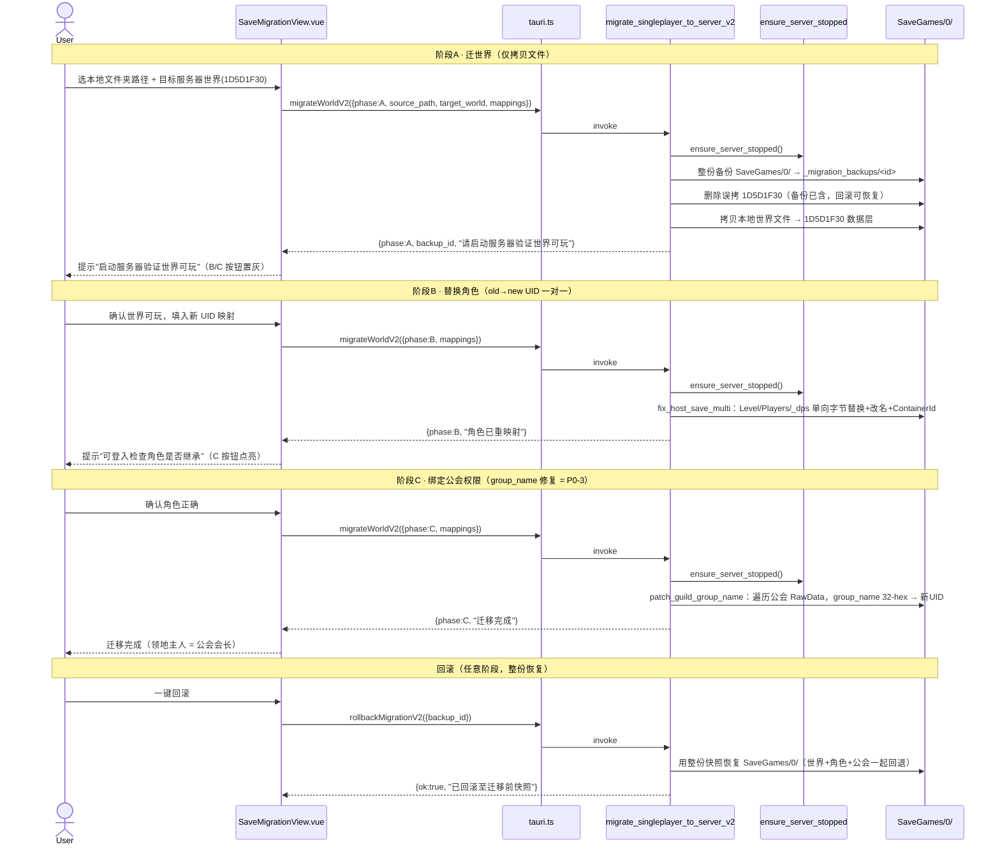
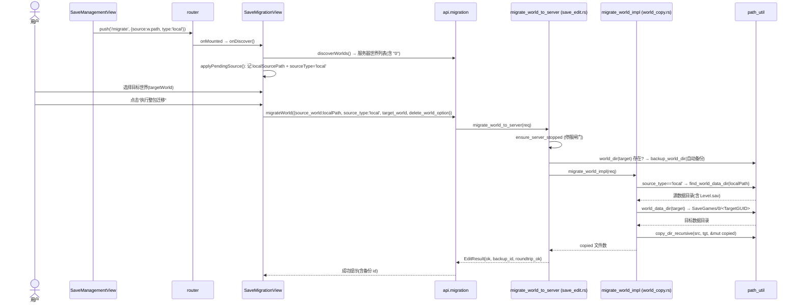
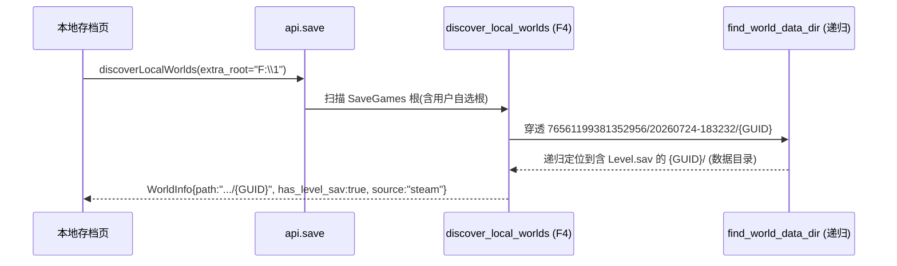
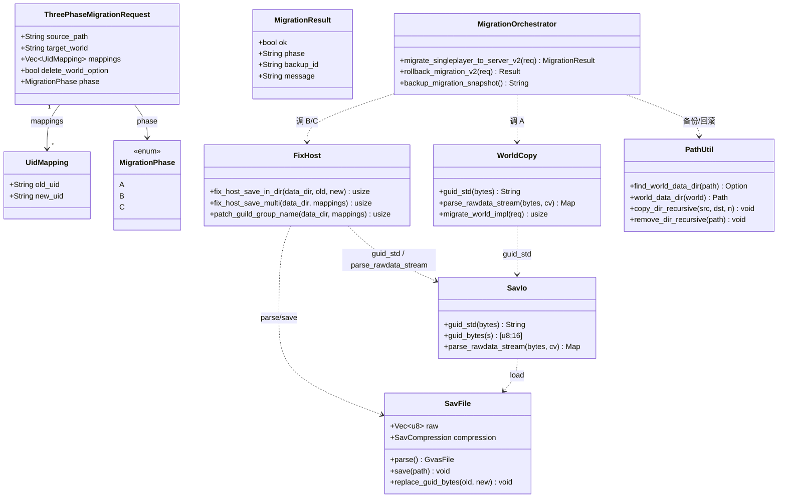
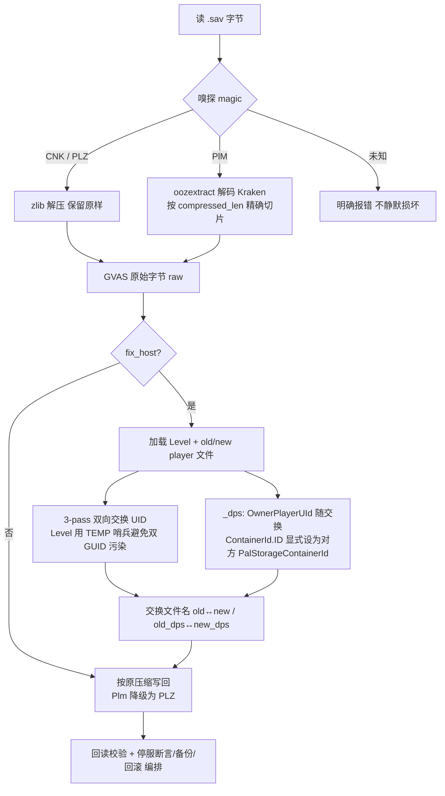
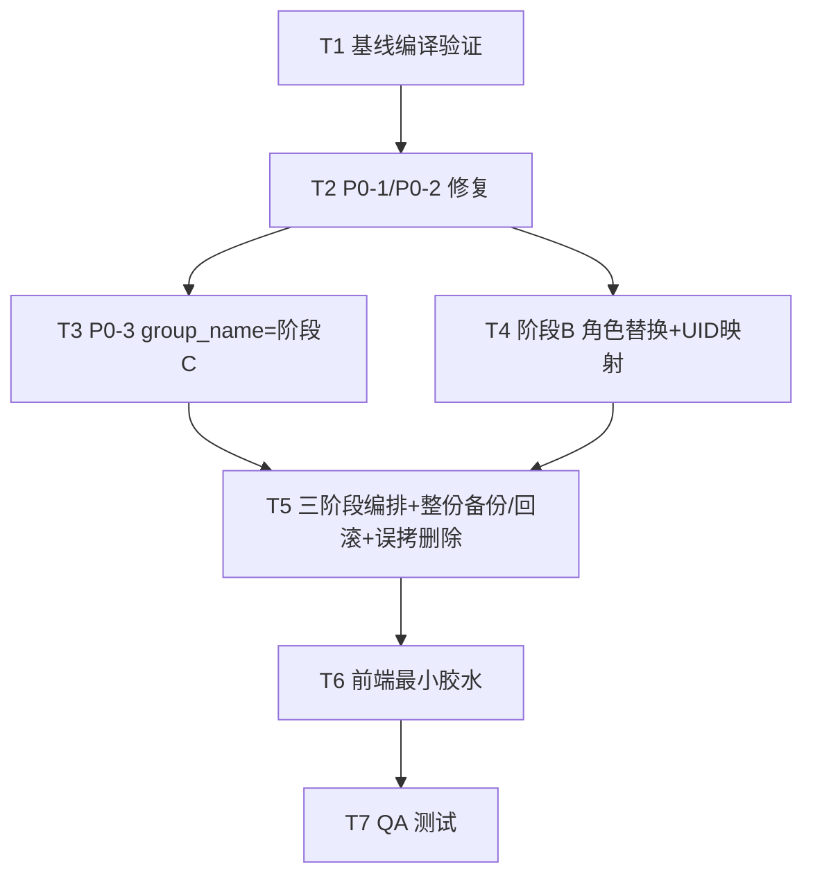

# Palworld 存档迁移设计文档

> **设计基线已更新（2026-07-27）**：本文保留为历史设计过程。实机成功证据、Fix Host/角色转移/公会绑定的边界及新备份策略，以 [`palworld-migration-success-record-2026-07-27.md`](./palworld-migration-success-record-2026-07-27.md) 为准。

> 本文档合并自四份设计文档与两份 Mermaid 图表，覆盖「本地存档与世界迁移」功能的完整设计链路：从功能总纲 → UI 诊断与实现设计 → Oodle 解码与 Fix Host 设计 → v2 三阶段正确迁移任务分解。
>
> **合并来源：**
> - **Part 1**：本地存档与世界迁移功能设计（审查稿）—— 功能总纲与验收标准
> - **Part 2**：迁移 UI「无法使用」诊断 + 世界迁移实现设计 —— 4 个断点定位与修复链路
> - **Part 3**：Oodle 解码 + Fix Host 双向交换设计 —— 推翻 R11 的技术决策
> - **Part 4**：v2 增量架构 + 三阶段正确迁移任务分解 —— P0-1/P0-2/P0-3 修复与 T1–T7 工程化落地
> - 嵌入图表：class-diagram（类图）、sequence-diagram（序列图）
>
> **统一范围边界**：本功能仅覆盖「发现本地/专用服世界、备份/恢复、单机世界整包迁移到专用服」。角色身份、公会和主机修复（Fix Host）在 Part 3/4 中作为独立阶段设计，且当前被 2 个 P0 阻塞，不得在世界验证前触发。

---

## 目录

- [Part 1 · 功能设计总纲](#part-1--功能设计总纲)
  - [1.1 用户目标](#11-用户目标)
  - [1.2 信息架构与单一入口](#12-信息架构与单一入口)
  - [1.3 存档识别规则](#13-存档识别规则)
  - [1.4 备份与去重](#14-备份与去重)
  - [1.5 整包世界迁移流程](#15-整包世界迁移流程)
  - [1.6 实际样本与已修复问题](#16-实际样本与已修复问题)
  - [1.7 明确不在本功能范围](#17-明确不在本功能范围)
  - [1.8 验收标准](#18-验收标准)
  - [1.9 供二次审查的决定点](#19-供二次审查的决定点)
  - [1.10 实现与测试证据](#110-实现与测试证据)
- [Part 2 · 迁移 UI 诊断与实现设计](#part-2--迁移-ui-诊断与实现设计)
  - [2.1 结论速览](#21-结论速览)
  - [2.2 现状诊断（4 个断点）](#22-现状诊断确切断点--文件行号)
  - [2.3 目标布局设计](#23-目标布局设计本地--专用服)
  - [2.4 调用流程图（序列图）](#24-调用流程图序列图)
  - [2.5 类/模块关系（类图）](#25-类模块关系类图)
  - [2.6 文件清单（改动点）](#26-文件清单改动点)
  - [2.7 任务分解](#27-任务分解有序依赖可立即交工程师执行)
  - [2.8 测试方案](#28-测试方案样本-f17222161199381352956)
  - [2.9 集成验收清单](#29-集成验收清单实机-r-real-1--用户执行)
- [Part 3 · Oodle 解码与 Fix Host 设计](#part-3--oodle-解码与-fix-host-设计)
  - [3.1 Oodle 解码路径决策 + 许可证审查](#31-oodle-解码路径决策--许可证审查结论)
  - [3.2 实现计划（分阶段）](#32-实现计划分阶段)
  - [3.3 有序任务清单](#33-有序任务清单)
  - [3.4 文件清单](#34-文件清单)
  - [3.5 开放风险](#35-开放风险明确列出不假装确定)
  - [3.6 对 R11 决策的建议措辞](#36-对-r11-决策的建议措辞正式修订)
  - [3.7 关键流程](#37-关键流程mermaid)
- [Part 4 · v2 增量架构与三阶段正确迁移任务分解](#part-4--v2-增量架构与三阶段正确迁移任务分解)
  - [4.0 背景与变更定位](#40-背景与变更定位必读)
  - [4.1 实现方案 + 框架](#41-实现方案--框架)
  - [4.2 文件列表](#42-文件列表要改--要加相对-palworld-根)
  - [4.3 数据结构与接口](#43-数据结构与接口)
  - [4.4 程序调用流程](#44-程序调用流程)
  - [4.5 任务列表（T1–T7）](#45-任务列表有序含依赖)
  - [4.6 依赖包列表](#46-依赖包列表)
  - [4.7 共享知识（跨文件约定）](#47-共享知识跨文件约定)
  - [4.8 待明确事项](#48-待明确事项仅当真阻塞时写)

---

# Part 1 · 功能设计总纲

> 来源：`local-save-and-world-migration-design.md`（审查稿，2026-07-25）

## 1.1 用户目标

新手应能先看到电脑上的一个单机世界与一个专用服世界，确认目标后把单机世界的文件整体复制进专用服；随后进入游戏验证世界可玩。迁移不解析、不改写 `.sav` 内部数据。

## 1.2 信息架构与单一入口

`本地存档`页是"发现与管理"的唯一入口，按来源分为：

- **本地单机**：Steam/AppData 自动发现；未找到时在本页手动选择目录。
- **服务器存档**：依据已配置 PalServer 的 `SaveGames` 发现；未找到时在本页手动选择目录。
- **世界备份/恢复**：对选中世界进行整目录备份或恢复，并记住自定义备份根目录。

`数据迁移`页不再有"手动选择本地目录"。它仅复用上述已保存的扫描根和发现结果，提供源世界、目标专用服世界及执行操作，避免两页各自保存一份不同的目录状态。

持久化契约为 `settings.json` 中的 `local_save_roots`、`server_save_roots`、`backup_root`。目录由本地存档页写入；迁移页只读并重新扫描。切换备份根时，应用必须将该路径从 `local_save_roots` 移除，防止历史备份被重新当成单机世界。



## 1.3 存档识别规则

世界数据层的判据是目录内直接存在 `Level.sav`；同层的 `Players/`、`WorldOption.sav` 随整包处理。专用服目标可为 `SaveGames/0/<GUID>/` 这类嵌套结构，迁移必须定位到含 `Level.sav` 的数据层，不能产生 `<目标 GUID>/<源 GUID>/Level.sav` 的双重嵌套。

手动扫描根可穿透 SteamID/时间戳/GUID 等包裹层，但**不得**扫描被设为备份根的目录；备份根里可能同时包含单机和专用服的历史副本，误扫会造成"多个本地单机存档"的假象。

## 1.4 备份与去重

备份根保存于 `settings.json` 的 `backup_root`；默认位置为世界同级 `_backups/<世界名>/<时间戳>/`。迁移、备份列表和恢复使用同一根目录。

迁移前先对目标专用服世界创建快照。系统以"世界名 + 逐文件相对路径 + 文件字节"比对已有快照：内容完全相同则复用已有备份，不创建重复目录；内容不同才创建新快照。迁移失败时从该快照回滚。

备份是**目标世界覆盖前的保护措施**，不是源世界的副本，也不应被迁移列表当成候选世界。恢复功能必须让用户选定目标世界与具体快照，并在写入前再次确认；不得根据名称猜测恢复目标。

## 1.5 整包世界迁移流程

1. 用户在数据迁移页选择本地源世界及专用服目标世界。
2. 应用确认 PalServer 未运行；运行中则拒绝写入。
3. 对目标世界执行上述去重备份。
4. 定位源、目标的 `Level.sav` 数据层，清理目标数据层并递归复制源的所有文件。源为本地绝对路径时允许有界穿透；源为服务器世界时同样必须定位数据层。
5. 用户可勾选删除复制后的 `WorldOption.sav`，避免旧世界设置覆盖专用服配置；默认不删除，以保持整包迁移的可预测性。
6. 返回已复制文件数和备份标识；发生错误时回滚目标。
7. 用户启动服务器、进入游戏验证世界。此阶段不执行角色迁移。

## 1.6 实际样本与已修复问题

- 单机：`C:\Users\pengq\AppData\Local\Pal\Saved\SaveGames\76561199381352956\1D5D1F304D3AA1FE2818BA98D5223DFE\`，1 名角色。
- 专用服：`E:\SteamLibrary\steamapps\common\PalServer\Pal\Saved\SaveGames\0\1A91A61548C7B6FD7B58B2B70710F7EE\`，2 名角色。
- 备份根 `F:\1` 曾被误当作本地扫描根，因其含单机和专用服历史副本而显示三条"AppData 单机"。现已在扫描时排除备份根。
- 已覆盖：三层目录穿透、local→server 文件保真、server→server 不双重嵌套、相同内容备份去重、前端复用持久化扫描根。

## 1.7 明确不在本功能范围

整包迁移只迁移世界文件，不解决"玩家进入后变为新角色""公会/领地归属"问题。那是后续 Fix Host/角色与公会关联迁移（见 Part 3），当前不得在世界验证前触发。

## 1.8 验收标准

1. 本地存档页显示 1 个真实单机世界、1 个真实专用服世界；备份不混入。
2. 数据迁移页显示同一批世界，且没有重复的手动本地目录按钮。
3. 迁移后目标 `SaveGames/0/<GUID>/Level.sav` 存在，文件清单与源数据层逐项一致，无额外 GUID 嵌套。
4. 再次迁移相同内容时不新增重复备份；改动目标后再迁移会生成新快照。
5. 只在用户进游戏验证世界后，才讨论角色/公会迁移。

## 1.9 供二次审查的决定点

1. **单一入口是否正确**：本地存档页负责"找目录"，迁移页负责"选已发现的世界并执行"，避免重复选择器和两套状态。
2. **迁移粒度是否正确**：本轮只做数据层整包复制，不解析 GVAS、不重写 GUID；因此它适合先验证地图、建筑、帕鲁与世界文件是否能被专用服读取。
3. **角色问题是否被正确隔离**：`Players/*.sav` 会随世界文件进入目标，但玩家 UID、角色 InstanceId、公会与世界引用的适配并不由本功能保证。若进服后成为新角色或领地归属异常，应进入独立的角色/公会迁移设计，不能把它误判为本轮世界复制失败。
4. **高风险操作是否可恢复**：迁移只允许停服时执行；必须先备份目标、失败回滚，并禁止源世界与目标世界相同。真正的最终验收仍是用户启动专用服并进入游戏。

## 1.10 实现与测试证据

- 前端发现和共享状态：`Palworld/src/views/SaveManagementView.vue`、`Palworld/src/views/SaveMigrationView.vue`、`Palworld/src/stores/settings.ts`。
- 持久化和后端迁移：`Palworld/src-tauri/src/settings.rs`、`Palworld/src-tauri/src/save_transfer.rs`、`Palworld/src-tauri/src/save_edit/world_copy.rs`。
- 自动化覆盖：本地扫描排除备份根、三层目录穿透、local→server 字节保真、server→server 无 GUID 双重嵌套、相同内容备份去重。
- 已通过的本轮检查：`npx vitest run`（42 通过）、`cargo test --quiet`（68 通过、1 忽略）、`npm run lint`、`npm run build`。

---

# Part 2 · 迁移 UI 诊断与实现设计

> 来源：`design-palworld-migration.md`（架构师 Bob 调研 + 设计 + 任务分解，仅打通世界文件整包拷贝链路）
>
> 实测样本（主理人已探勘 + 本架构师复核）：`F:\1\76561199381352956\20260724-183232\{GUID}\`，其中 `Level.sav` 位于 **两层嵌套**（SteamID 层 + 时间戳层 + GUID 层）之下。

## 2.1 结论速览

| 断点 | 位置 | 性质 | 一句话 |
|---|---|---|---|
| **断点 1** | `save_transfer.rs:298` `find_world_data_dir`（F4）/ `path_util.rs:154`（F5 副本） | 发现穿透 | `find_world_data_dir` 只查「直接层 + 一层子目录」，样本 `Level.sav` 在**两层**之下 → 选 `F:\1` 时本地世界被静默过滤 |
| **断点 2** ✅主因 | `SaveMigrationView.vue:382-394` + `:348-360` | 前端接线 | 本地路径 `route.query.source` 存进 `pendingLocalSource` 后**从未进入请求**；`onMigrate` 只发服务器世界**名** → 本地→专用服链路在 UI 上不存在 |
| **断点 3** ✅硬阻塞 | `world_copy.rs:668` `migrate_world_impl` + `path_util.rs:170` `world_dir` | 后端源解析 | 后端把 `source_world` 当「SaveGames 根下的世界名」拼路径；即便传本地绝对路径也会被 `safe_name_segment` 截成末段再拼到 SaveGames 根 → `世界目录不存在` |
| **断点 4** | `world_copy.rs:672` `migrate_world_impl` | 后端目标解析 | 目标拼成 `SaveGames/<tgt_name>`，忽略专用服 `SaveGames/0/<GUID>/` 的 `0/` + GUID 嵌套层 → 拷贝层级错位，专用服不识别 |

→ **修复链路 = 断点1（发现穿透）→ 断点3+4（后端源/目标解析）→ 断点2（前端透传本地路径 + source_type）**。

---

## 2.2 现状诊断（确切断点 + 文件:行号）

### 断点 1 — 本地世界发现穿透失败（F4 发现层）
- **代码**：`src-tauri/src/save_transfer.rs:298-313`（`find_world_data_dir`），以及 F5 独立副本 `src-tauri/src/save_edit/path_util.rs:154-167`。
- **逻辑**：函数只做两步——① `world_dir/Level.sav` 是否存在；② 遍历 `world_dir` 的**直接子目录**，找首个含 `Level.sav` 的子目录。即**最多向下一层**。
- **样本实测**：`76561199381352956/20260724-183232/{GUID}/Level.sav`（两层嵌套：SteamID + 时间戳 + GUID）。`find_world_data_dir("76561199381352956")`：直接层无 `Level.sav`；子目录 `20260724-183232` 下也无 `Level.sav`（它的子目录才是 `{GUID}`）→ 返回 `None`。
- **后果**：`discover_local_worlds`（`save_transfer.rs:470-535`）对 `world_info_from_dir` 结果做 `if info.has_level_sav` 过滤（`:377`、`:502`、`:525`）。当用户在本地存档发现里选 `F:\1`（或 `F:\1\76561199381352956`）时，世界被**静默丢弃**；只有手动选到 `.../20260724-183232` 这一层（或更深）才能发现。
- **断言**：`find_world_data_dir` 对两层以上嵌套返回 `None` → 样本世界被丢弃（除非精确选到时间戳层）。

### 断点 2 — 前端迁移页把本地源路径丢弃（F5 前端）★ 用户"无法使用"根因
- **代码**：`src/views/SaveMigrationView.vue`
  - `:48-59` 源世界 `<select>` 的 `:options` 仅来自 `onDiscover()` 中的 `api.save.discoverWorlds()`（`:250` → `worlds.value = res.worlds`），即**只有服务器世界**。
  - `:382-394` `applyPendingSource()`：把 `route.query.source`（本地真实路径）写入 `pendingLocalSource`，把末段写入 `pendingLocalName`；但只在「本地目录末段 == 某服务器世界名」时才 `sourceWorld = name`（`:390`）——本地 GUID 末段不可能等于服务器世界名，故 `sourceWorld` 始终为空/未选。
  - **关键**：`pendingLocalSource` 变量**从未被 `onMigrate` 读取**。
  - `:348-360` `onMigrate()`：发送 `source_world: sourceWorld.value`——永远是**服务器世界名**（下拉框选项），从不携带本地路径。
- **触发链**：`SaveManagementView.vue:304` `router.push({ path:'/migrate', query:{ source:w.path, type:'local' } })` → 进入迁移页 → 源下拉框只有服务器世界、**没有本地世界可选** → 点"执行整包迁移"实际是 server→server。
- **断言**：`route.query.source` 的本地真实路径**从未进入 `MigrateRequest`**；`onMigrate` 的 `source_world` 永远是 `sourceWorld.value`（服务器世界名）。本地→专用服链路在 UI 上完全不存在 → 这就是"数据迁移界面是为展示而做、无法使用"。

### 断点 3 — 后端源解析把路径当世界名（F5 后端）★ 硬阻塞
- **代码**：`src-tauri/src/save_edit/world_copy.rs:668` `let src = path_util::world_dir(&req.source_world)?;`；`path_util.rs:170-179` `world_dir`。
- **逻辑**：`world_dir` 假定 `source_world` 是 SaveGames 根下的**世界名**：`safe_name_segment(world)`（`:172`，取末路径段 + 白名单校验）→ `save_root.join(&w)`（`:174`）。
- **后果**：即便前端修好、传入本地绝对路径 `F:\1\76561199381352956\20260724-183232\{GUID}`：
  1. `safe_name_segment` 取末段 `{GUID}`（GUID 为 16 进制，白名单通过）；
  2. `join` 到 SaveGames 根 → `SaveGames/{GUID}`；
  3. `:175` `!dir.is_dir()` → `Err("世界目录不存在: .../SaveGames/{GUID}")`。
- **混淆点**：`world_dir`（按名字拼 SaveGames 根）与 `find_world_data_dir`（按真实路径定位含 Level.sav 的层）**语义不同**。本地源应是"真实路径 + `find_world_data_dir` 定位"，而非"世界名 + SaveGames 根拼接"。
- **断言**：后端**从根本上无法接受本地绝对路径**作为源；`migrate_world_impl` 的源解析对本地场景必失败。

### 断点 4 — 目标解析忽略专用服 `0/` 层（F5 后端）
- **代码**：`src-tauri/src/save_edit/world_copy.rs:672` `let tgt = save_root.join(&tgt_name);`，`:678-684` 把 `src` 拷入 `tgt`。
- **事实**：专用服世界实际位于 `SaveGames/0/<GUID>/`（已由 `save_transfer.rs:789-819` 测试 `discover_real_palserver_world` 在真实 PalServer 目录证实：`find_world_data_dir(SaveGames/0)` → `SaveGames/0/<GUID>`）。
- **后果**：
  - 若 `tgt_name="0"`（专用服默认世界），`tgt=SaveGames/0`，`copy_dir_recursive(src, SaveGames/0)` 把源**平铺**进 `SaveGames/0/` → 得到 `SaveGames/0/Level.sav`（破坏 GUID 嵌套）→ 专用服不识别。
  - 若 `tgt_name="SomeWorld"`，`SaveGames/SomeWorld` 不在专用服 `0/` 容器内 → 专用服读不到。
- **正确做法**：目标应经 `path_util::world_data_dir(&req.target_world)`（内部 `find_world_data_dir` 自动定位 `SaveGames/0/<GUID>`）。
- **断言**：当前目标解析对专用服布局错误，会把世界数据放错层级。

---

## 2.3 目标布局设计（本地 → 专用服）

### 目录映射图



### 拷贝规则（file 级整包拷贝，不解析、不改动 .sav 内容）
1. **拷贝单位 = 世界数据目录**（含 `Level.sav` 的那一层）。递归拷贝源数据目录的**全部内容** → 目标数据目录。
2. **GUID 层不重命名**：源 `{GUID}/` 的内容直接落入目标已有的 `<TargetGUID>/`。专用服世界槽名不变，仅内容换成单机世界的地图/建筑/帕鲁/公会数据。**严格不触碰 GUID 互换**（Fix Host，P0 阻塞，本次不做）。
3. **LocalData.sav**：携带（随整包拷贝自然带入；专用服会忽略或重建，无副作用）。
4. **steam_autocloud.vdf**：**不携带**——它在样本 `20260724-183232/` 层（数据目录之外），拷贝数据目录时自然被排除；且它是 Steam 云元数据，专用服不需要。
5. **WorldOption.sav**：沿用现有 `delete_world_option` 开关——开启则拷贝后删除目标 `WorldOption.sav`（让专用服从 `PalWorldSettings.ini` 重新生成，避免单机旧设置污染，符合 R5）；默认关（携带源 WorldOption.sav，保持世界设置一致）。**无需改语义**。
6. **backup/local/**：随整包携带（无害；专用服忽略）。本次保持忠实拷贝，后续如需瘦身再加排除开关。

### 源 / 目标解析（改造后 `migrate_world_impl` 伪码）
```rust
// —— 源 ——
let src = if req.source_type == "local" {
    path_util::find_world_data_dir(Path::new(&req.source_world))      // 本地：真实路径 → 定位 Level.sav 层
        .ok_or_else(|| format!("未找到本地世界数据(Level.sav)：{}", req.source_world))?
} else {
    path_util::world_data_dir(&req.source_world)?                     // 服务器：按名定位（兼容 0/<GUID> 嵌套）
};

// —— 目标（专用服 SaveGames/0/<GUID> 或服务器世界）——
let tgt = path_util::world_data_dir(&req.target_world).or_else(|_| {
    // 目标世界尚不存在：在专用服 0/ 容器（惯例）或 SaveGames 根下新建 <target_world>/
    let (save_root, _) = path_util::resolve_save_games_root()?;
    let name = path_util::safe_name_segment(&req.target_world)
        .ok_or_else(|| "目标世界名非法".to_string())?;
    let cand = save_root.join("0").join(&name);
    if !cand.exists() {
        std::fs::create_dir_all(&cand)
            .map_err(|e| format!("创建目标 {} 失败: {}", cand.display(), e))?;
    }
    Ok(cand)
})?;

if src == tgt { return Err("源世界与目标世界相同，无需迁移".into()); }
// 清理/创建 tgt 后 copy_dir_recursive(src, tgt, &mut copied)
// delete_world_option: 拷贝后删除 tgt/WorldOption.sav（沿用现有逻辑，无需改语义）
```

---

## 2.4 调用流程图（序列图）

> 嵌入自原 `sequence-diagram.mermaid`。该序列图同时描绘了 Part 3 的三阶段迁移（A 迁世界 / B 替换角色 / C 绑定公会），完整展示了从世界拷贝到 Fix Host 的端到端流程。



### 本地→专用服迁移 happy path（含修复后的本地源透传）



### 本地世界发现穿透（断点 1 修复后）



---

## 2.5 类/模块关系（类图）

> 嵌入自原 `class-diagram.mermaid`。



---

## 2.6 文件清单（改动点）

| 文件 | 行号（现状） | 改动 |
|---|---|---|
| `src-tauri/src/save_transfer.rs` | `298-313` | `find_world_data_dir` 改为**递归穿透**（BFS，限深 ~4 层）以定位任意中间层下的 `Level.sav`（断点 1，F4 发现层） |
| `src-tauri/src/save_edit/path_util.rs` | `154-167` | 同上，F5 副本同步递归穿透（与 F4 独立但保持一致） |
| `src-tauri/src/save_edit/models.rs` | `106-113` | `MigrateRequest` 增加 `source_type: String`（默认 `"server"`，向后兼容） |
| `src-tauri/src/save_edit/world_copy.rs` | `667-705` | `migrate_world_impl` 源解析按 `source_type` 分支（local→`find_world_data_dir`；server→`world_data_dir`）；目标解析改用 `world_data_dir`（+ 不存在时 `0/<name>` 兜底新建）。`delete_world_option` 语义沿用 |
| `src/views/SaveMigrationView.vue` | `348-360`、`382-394`、`244`、`48-59` | 新增 `sourceType`/`localSourcePath` ref；`applyPendingSource` 写 `sourceType='local'`+`localSourcePath`；`onMigrate` 按 `sourceType` 发 `source_world`(本地路径或服务器名) + `source_type`；源下拉框加本地源展示；`canMigrate` 兼容本地源 |
| `src/types/tauri.ts` | `406-411` | `MigrateRequest` 增加 `source_type: string` |
| `src/views/SaveManagementView.vue` | `302-306` | **无需改动**（已正确 `push('/migrate',{source:w.path,type:'local'})`）；仅复核 |
| `src/components/save/SaveDetailModal.vue` | `38,66` | **无需改动**（emit `'migrate', world` 已带完整 `WorldInfo` 含 `.path`，统一经 `SaveManagementView.onMigrateToServer` 处理）；仅复核 |

---

## 2.7 任务分解（有序、依赖、可立即交工程师执行）

> 原则：先打通发现穿透（T01）→ 后端源/目标解析（T02）→ 前端透传（T03）→ 测试（T04）→ 验收文档（T05）。T02/T03 必须落在 T01 之后。

### T01 · 路径穿透：让 `find_world_data_dir` 递归定位（断点 1）
- **源文件**：`src-tauri/src/save_transfer.rs`、`src-tauri/src/save_edit/path_util.rs`（含各自测试模块）
- **依赖**：无
- **优先级**：P0
- **内容**：
  - 把两份 `find_world_data_dir` 由「直接层 + 一层子目录」改为**有界递归 BFS**（限深 4 层），返回首个含 `Level.sav` 的目录。
  - 不破坏现有扁平 / 单层 GUID 嵌套行为（单测 `world_info_from_fake_steam_structure`、`discover_real_palserver_world` 仍须通过）。
  - 新增单测：构造 `SaveGames/<SteamID>/<TS>/<GUID>/Level.sav`（两层嵌套）断言能定位到 `<GUID>`。

### T02 · 后端源/目标解析改造（断点 3 + 断点 4）
- **源文件**：`src-tauri/src/save_edit/models.rs`、`src-tauri/src/save_edit/world_copy.rs`、`src-tauri/src/save_edit/save_edit.rs`（复核 `migrate_world_to_server` 备份路径一致性）
- **依赖**：T01
- **优先级**：P0
- **内容**：
  - `MigrateRequest` 增加 `source_type`（serde 默认 `"server"`）。
  - `migrate_world_impl` 源：`source_type=="local"` → `find_world_data_dir(Path::new(&source_world))`；否则 `world_data_dir`。
  - 目标：`world_data_dir(&target_world)`；不存在时 `SaveGames/0/<safe_name_segment(target)>` 兜底新建。
  - `src == tgt` 守卫保留（比较绝对路径）。
  - `delete_world_option` 沿用（拷贝后删 `tgt/WorldOption.sav`）。
  - 复核 `save_edit.rs:248` 备份检查 `world_dir(target)` 对 `"0"` 仍 `exists()`（是），无需改。

### T03 · 前端透传本地源路径 + 类型（断点 2）
- **源文件**：`src/views/SaveMigrationView.vue`、`src/types/tauri.ts`、`src/components/save/SaveDetailModal.vue`（复核无改）、`src/views/SaveManagementView.vue`（复核无改）
- **依赖**：T02（后端须接受 `source_type`）
- **优先级**：P0
- **内容**：
  - `types/tauri.ts`：`MigrateRequest` 增加 `source_type: string`。
  - `SaveMigrationView.vue`：
    - 新增 `const sourceType = ref('server')`、`const localSourcePath = ref('')`。
    - `applyPendingSource`：`src && type==='local'` 时写 `localSourcePath = src` + `sourceType = 'local'`（保留 `pendingLocalSource`/`pendingLocalName` 用于展示）。
    - 源 `<select>` 在 `sourceType==='local'` 时追加一个 disabled `<option>` 显示本地源名。
    - `canMigrate`：本地源分支校验 `localSourcePath && targetWorld`（路径不可能等于世界名，等号守卫等价恒真）。
    - `onMigrate`：`const source = sourceType==='local' ? localSourcePath : sourceWorld`；发 `{source_world: source, source_type: sourceType, target_world, delete_world_option}`。

### T04 · 测试（样本副本实验 + 防御式）
- **源文件**：`src-tauri/src/save_edit/world_copy.rs`（测试模块）、`src-tauri/src/save_edit/path_util.rs`（测试模块）、`src-tauri/src/save_transfer.rs`（测试模块）
- **依赖**：T01、T02
- **优先级**：P0
- **内容**（复用现有 `path_util` 测试风格：临时副本、字节比对、`[skip]` 守卫样本缺失）：
  1. **样本整包迁移**：把 `F:\1\76561199381352956\20260724-183232\{GUID}` 拷到临时专用服布局 `SaveGames/0/<RANDOM>/`，断言 `Level.sav`/`Players/` 存在、`dirs_byte_equal` 字节一致、`copied>0`。
  2. **缺 Level.sav / 路径非法不 panic**：源指向空目录或非法路径 → `find_world_data_dir` 返回 `None` → `migrate_world_impl` 返回明确 `Err`，**不 panic**。
  3. **递归穿透单测**（T01 已含）。
  4. **`safe_name_segment` 对本地绝对路径**：确认 `world_dir` 仍拒绝对路径输入（防御），而 `find_world_data_dir` 接受。

### T05 · 集成验收清单 + 边界明示（文档）
- **源文件**：本文档（§2.9 集成验收章节）
- **依赖**：T03、T04
- **优先级**：P1
- **内容**：
  - 实机验收清单：停服 → 选本地源（自动带入）→ 选目标世界 `0` → 执行 → 启服 → 进服确认世界地图/建筑/帕鲁在。
  - **明示不含 Fix Host**：迁移后玩家为新建角色、公会主人身份未迁移，需后续 Fix Host（P0 阻塞中）解决，本次仅交付世界文件拷贝。

---

## 2.8 测试方案（样本 `F:\1\76561199381352956`）

1. **整包迁移字节保真**（T04-1）：源 `.../20260724-183232/{GUID}` → 临时 `SaveGames/0/<RANDOM>`，`dirs_byte_equal` 断言 `Level.sav`/`Players/*.sav` 等逐字节一致；`steam_autocloud.vdf` 不应出现于目标（`find` 断言缺失）。
2. **防御式**（T04-2）：源为不含 `Level.sav` 的目录 → `migrate_world_impl` 返回 `Err("未找到本地世界数据...")`；源为非法/空字符串 → 不 panic、返回 `Err`。
3. **递归穿透**（T04-3）：构造两层嵌套 `SaveGames/<ID>/<TS>/<GUID>/Level.sav`，`find_world_data_dir` 返回 `<GUID>`。
4. **回归**：现有 `world_info_from_fake_steam_structure`、`discover_real_palserver_world`、`backup_rollback_simulation` 全部保持通过（不破坏扁平 / 单层 GUID 嵌套）。

---

## 2.9 集成验收清单（实机 R-REAL-1 · 用户执行）

> 进入本清单的门槛：**工程师 T01–T04 已通过**（`cargo test` 全绿 + 样本 `F:\1\76561199381352956` 整包迁移字节保真测试通过 + `steam_autocloud.vdf` 确认被排除）。
> 本清单为**用户在真实专用服上的手动验收步骤**，由人工执行——主理人/QA 不碰真实存档（Fix Host 当前 P0 阻塞，更严禁对真实存档跑）。

### 前置
- 专用服已**停止**（`migrate_world_to_server` 内置 `ensure_server_stopped` 停服闸门，未停会先尝试停服；停服失败则不执行迁移）。
- 已知本地单机存档路径（本次样本 `F:\1\76561199381352956\20260724-183232\{GUID}`）。

### 步骤
1. **发现本地世界**：存档管理页 → 额外根目录选 `F:\1`（断点 1 已修，`find_world_data_dir` 递归穿透 SteamID/时间戳/GUID 三层）→ 世界出现在列表（`has_level_sav:true`）。
2. **进入迁移页**：点该世界「迁移」→ 路由带 `{source:w.path, type:'local'}`（断点 2 已修，`pendingLocalSource` 不再被丢弃，本地源进入请求）。
3. **选择目标**：目标世界下拉选专用服 `0`（或已存在的专用服世界槽）。
4. **执行整包迁移**：点「执行整包迁移」→ 后端停服 → 自动备份 → `copy_dir_recursive` 整包拷贝 → 返回 `backup_id`（断点 3/4 已修：源=真实路径经 `find_world_data_dir` 定位、目标=`world_data_dir` → `SaveGames/0/<TargetGUID>`）。
5. **启服进服**：启动专用服 → 进入世界 → 确认地图 / 建筑 / 帕鲁 / 公会据点数据在。

### ⚠️ 预期现象（本次不修复，属 Fix Host 范畴）
- 进入后**两人都是新建角色**——角色 UID / 实例 ID 未迁移。
- 领地需**公会主人**身份才能用——公会 `admin_player_uid` 未迁移。
- 这是**预期且已知**的：本次只交付**世界文件整包拷贝**；角色 / 公会身份转移是 Fix Host（当前 2 个 P0 阻塞：① GUID 字节序未转换 `fix_host.rs:245-246`、② PLZ 头 `compressed_len` 格式不符 `sav_io.rs:120-126`）范畴，暂不能对真实存档执行。

### 回滚
- 迁移前已自动备份（返回 `backup_id`）；若世界异常，用备份回滚（复用 `restore_world_dir`）。

### 验证闭环（非实机，工程师侧已完成）
- 样本字节保真：`F:\1\76561199381352956\20260724-183232\{GUID}` → 临时 `SaveGames/0/<RANDOM>/`，断言 `Level.sav`/`Players/` 等逐字节一致，`steam_autocloud.vdf` 不出现在目标。
- 防御式：源缺 `Level.sav` / 非法路径 → `migrate_world_impl` 返回明确 `Err`，**不 panic**。
- 回归：现有 `world_info_from_fake_steam_structure`、`discover_real_palserver_world`、`backup_rollback_simulation` 全部保持通过。

---

# Part 3 · Oodle 解码与 Fix Host 设计

> 来源：`design-palworld-oodle-fixhost.md`（架构师 Bob，仅设计不写应用代码）
>
> 目标：把同行成熟项目 `PalworldSaveTools`（本地参考实现）验证过的逻辑"抄"进我们的 Rust 项目，打通 Oodle(PLM) 阻塞并修正 `fix_host` 为双向交换。
>
> 配套实测样本：`F:\1\0\20260723-235259\1A91A61548C7B6FD7B58B2B70710F7EE\`（magic=PlM / save_type=49，zlib 系=0）。

## 3.1 Oodle 解码路径决策 + 许可证审查结论

### 调研结论（基于实测读码 + 联网）

| 候选方案 | 是什么 | 许可证 | 能否随 MIT/Tauri 分发 | 评估 |
|---|---|---|---|---|
| **A. 纯 Rust Kraken 解码器 `oozextract`** | `lvlvllvlvllvlvl/oozextract` v0.5.4，是 C++ 开源 `ooz`(ryandrake08) 的 Rust 移植；`crate-type=["cdylib","rlib"]`；依赖 `bytemuck/bytes/wide/log` | **MIT**（已核验 Cargo.toml `license = "MIT"`） | ✅ **可以**，无商业/闭源成分 | **首选**。纯 Rust、零外部二进制、覆盖 Kraken/Mermaid/Selkie/Leviathan |
| B. FFI 调官方 Oodle `oo2core` DLL | `meszmate/oodle-rs` 等 wrapper | wrapper 本身 MIT，但**被包装的 `oo2core` 是 Epic 商业闭源库** | ❌ 不能再分发（d-air1 在 PST issue#214 明确："publishing them publicly raises legal concerns"） | 放弃：需用户本机恰好有 Warframe/Steam 的 `oo2core`，且分发违法 |
| C. `sehnryr/oodle-rs` | "Rust reimplementation" | Apache-2.0/MIT | ❌ 其 README 明说需 `download and patch oodle's source code`（即真实 Oodle 源码） | 放弃：本质仍依赖商业 Oodle 源码 |
| D. pyo3 嵌/调参考 Python(`palsav`+`palooz`) | 100% 能用（参考已验证） | MIT（参考） | ✅ 可分发，但违反我们 Q5"无 Python 运行时"、显著增大体积 | 最后兜底，不推荐 |
| E. `kraken-decompressor`(PyPI) | Python 包 | **GPLv3** | ❌ 传染性 copyleft，污染我们 MIT 发布物 | 直接排除 |

### 首选方案（明确推荐）

**方案 A：`oozextract`（MIT，纯 Rust）作为 Oodle(PlM/Kraken) 解码器 + 写回归级为 PLZ(zlib)。**

- **解码（读路径）**：用 `oozextract::decompress(compressed, uncompressed_len)` 替换我们 `sav_io.rs` 里 `PlM → Err(OODLE_ERROR)` 的死路。这与参考 `oozlib.py::OozLib.decompress` 调 `palooz.decompress(compressed_data, uncompressed_len)` **逐字节同构**——`palooz` 本就是同一支开源 Kraken 逆向实现，`oozextract` 是其 Rust 版，完全符合老板"抄同行成熟实现"的指示。
- **编码（写路径）**：开源 Kraken 只有**解码**、没有**压缩**（压缩需真实 Oodle）。但经两处独立社区实证，**把改完的 GVAS 重新压成 PLZ(zlib) 写回，游戏完全读得进，并在下次自动存档时自动升级回 PlM，零数据损失**：
  - `supercraft.host` 存档转换器官方说明："Output is PlZ, which every Palworld version reads and transparently upgrades on its next save."
  - `ibug.io` 实测（Palworld 0.6/Oodle 之后手工改公会箱）："used the previous zlib-based compression method … after sending the edited Level.sav back to the game, our Guild Chest containing 270 slots" ✅
- **许可证结论**：`oozextract` 为 **MIT**，可自由修改/再分发，只需保留版权与许可声明。我们将其 **vendoring 进仓库**（见文件清单），不引入任何 commercial/copyleft 成分，**完全可在 MIT/Tauri 发布物中分发**。

### 风险（已识别）

- **R-OODLE-1（最高优先·开放）**：`oozextract` 覆盖的 Kraken 是否包含最新 Palworld（"Tides of Terraria"/1.0 之后）所用的全部 opcode？`ooz` 上游标注了 "Latest Kraken" 且 `oozextract` 2026-05 仍在维护，样本（save_type=49）实测应能解；但**未来 Oodle 版本可能引入新特性导致解码失败**。→ 缓解：T1 用老板真实样本做字节级保真验收；保留"未知 magic / 解码失败 → 明确报错"的兜底（不静默损坏）。
- **R-OODLE-2**：PLZ 回写是否被某些严格校验的专用服拒绝？目前无证据（社区已大量实跑）。→ 缓解：T5 实机验收；若被发现拒绝，再评估 FFI 加载用户本机 `oo2core`（不分发）。

---

## 3.2 实现计划（分阶段）

> 原则：先打通**解码保真**（解除 F5 100% 阻塞），再修**摘要读源**，再重写**双向交换**，最后**编排加固 + 端到端验收**。

### 阶段 1：Oodle 解/编码保真（解除阻塞）
- 将 `oozextract` vendoring 为 `src-tauri/crates/oozextract/`（MIT + LICENSE-MIT）。
- `sav_io.rs`：`SavCompression::Plm` 解码分支调用 `oozextract`；写回时 `Plm → PLZ`（降级）。新增 `src/save_edit/oodle.rs` 薄封装。
- **验收**：老板样本 `Level.sav` / `Players/*.sav` / `LevelMeta.sav` 解出的 GVAS 字节，与参考 `palsav`（`sav_to_json`）解出的结构**逻辑一致**；回写 PLZ 后文件可被参考 `palsav` 重新解开（往返无损）。

### 阶段 2：修 `world_copy` 摘要读源
- `read_player_entry` 不再读 `Players/*.sav` 顶层 `Level/NickName`。
- 等级来源 = `Level.sav → worldSaveData → CharacterSaveParameterMap`，按 `key.PlayerUId` 匹配 `SaveParameter.Level`（参照参考 `get_player_level_from_cspm`）。
- 昵称来源 = `GroupSaveDataMap` 公会 `players[].player_info.player_name`（参照参考 `_build_player_list_from_level`）。
- **验收**：摘要等级/昵称与参考 `_build_player_list_from_level` 输出一致。

### 阶段 3：重写 `fix_host` 为双向交换（推翻单向字节替换）
- 删除"单向 `replace_guid_bytes(old→new)`"做法，按参考 `fix_host_save.py::combined_task` / `fix_save` 算法实现**双向交换**：
  1. 加载 `Level.sav` + `Players/<old>.sav` + `Players/<new>.sav`；
  2. 对 **Level.sav**（同时含 old/new 两个 GUID）做 **3-pass 交换**（old→TEMP→new→old 的对称交换，避免单缓冲双 GUID 互相污染）；对两个 player 文件各自做单向 old→new / new→old；
  3. `_dps.sav`：交换 `OwnerPlayerUId`（UID 字面量，随 3-pass 一起处理）+ **显式赋值** `SlotId.ContainerId.ID = 对方角色的 PalStorageContainerId`（容器 ID 不是 UID，不能互换，必须按参考 `copy_dps_file` 设值）；
  4. **最后交换文件名**：`<old>.sav ↔ <new>.sav`、`<old>_dps.sav ↔ <new>_dps.sav`（保证"文件名=身份"一致）。
- **为什么用字节级双向交换而非逐字段**：参考靠完整自定义属性 schema 才能逐字段解析公会/角色 RawData；我们 `gvas` crate（`GameVersion::Palworld`）未必能完整解析这些嵌套 RawData（见 R-GVAS-1）。UID 在 GVAS 中均以 16 字节字面量出现，**字节级双向交换 + 文件名交换 + `_dps` 容器 ID 显式赋值** 能产生与参考**完全相同的最终状态**，且对解析器差异免疫——这是对"抄同行验证过的算法"最稳健的 Rust 移植。
- **验收**：用参考 `fix_host_save.py` 对同一份存档跑一遍做**对拍**（结构一致）；实机：原账号登录后等级/帕鲁/公会/建筑/基地归属正确。

### 阶段 4：迁移编排加固（停服断言 + 自动备份 + 回滚）
- `save_transfer.rs` 整包复制本身稳健，**不改**；但在 `save_edit.rs` 编排入口加：①迁移/修复前**强制停服断言**（运行中替换会被自动存档覆盖，见 R3）；②**自动备份**（复用 `backup_world`）；③**F5 失败/中断自动回滚**到备份。
- **验收**：未停服时拒绝操作；任意步骤失败可一键回滚。

### 阶段 5：全量回滚 / 端到端验收
- 集成测试覆盖：Oodle 往返保真、CNK/PLZ 兼容、双向交换后文件名一致、`_dps` 容器 ID 正确。
- **实机验收（老板用原账号登录）**：这是唯一能确认"游戏内真实可玩"的闸门（见 R-REAL-1）。
- R11 修订文案随本文 §3.6 落地。

---

## 3.3 有序任务清单

> 角色均为**工程师（implementer）**；依赖指前置任务；验收标准可执行、可核验。

| ID | 任务 | 负责角色 | 依赖 | 对应文件 | 验收标准 |
|---|---|---|---|---|---|
| **T1** | Oodle(PlM) 解/编码打通 | 工程师 | — | `Cargo.toml`、`crates/oozextract/*`、`src/save_edit/oodle.rs`、`src/save_edit/sav_io.rs` | 老板样本 `Level.sav`/`Players/*.sav`/`LevelMeta.sav` 经 `oozextract` 解出的 GVAS，与参考 `palsav` 解出的**逻辑结构一致**；回写 PLZ 可被参考 `palsav` 重新解开（往返无损）；未知 magic 仍明确报错 |
| **T2** | `world_copy` 摘要改源 | 工程师 | T1 | `src/save_edit/world_copy.rs` | 摘要中的等级（来自 `CharacterSaveParameterMap` 按 `PlayerUId` 匹配）与昵称（来自公会 `players[].player_info.player_name`）与参考 `_build_player_list_from_level` 输出一致；不再从 `Players/*.sav` 顶层读等级 |
| **T3** | `fix_host` 双向交换重写 | 工程师 | T1 | `src/save_edit/fix_host.rs`、`src/save_edit/sav_io.rs`（3-pass 交换 + `_dps` 解析助手） | 迁移后文件名 `<old>↔<new>`、`<old>_dps↔<new>_dps` 已交换；`_dps` 的 `ContainerId.ID` 被设为对方 `PalStorageContainerId`；与参考 `fix_host_save.py` 对同一存档结果对拍一致；实机登录归属正确 |
| **T4** | 迁移编排加固（停服/备份/回滚） | 工程师 | T3 | `src/save_edit.rs`（编排入口）、`src/save_transfer.rs`（确认不改，仅被编排调用） | 未停服拒绝迁移/修复；执行前自动备份；F5 任意步骤失败自动回滚至备份 |
| **T5** | 全量回滚 + 端到端验收 | 工程师 + 老板 | T4 | `src-tauri/tests/*`、`docs/` | 集成测试全绿；**老板原账号实机登录验收通过**（R-REAL-1）；R11 修订文案落地；回滚脚本可用 |

---

## 3.4 文件清单

### 新增
- `src-tauri/Cargo.toml` — 新增 workspace member 或 git dep 指向 vendored `oozextract`。
- `src-tauri/crates/oozextract/Cargo.toml` — vendored 解码器清单（仅 `rlib` + 必需依赖 `bytemuck/bytes/wide/log`，去掉 `unoodle` bin 与 `wasm/cli/tokio` 可选特性）。
- `src-tauri/crates/oozextract/src/lib.rs` — 从上游拷贝的解压实现（`decompress(compressed, uncompressed_len)`）。
- `src-tauri/crates/oozextract/LICENSE-MIT` — 保留上游 MIT 版权与许可声明（分发合规必需）。
- `src-tauri/src/save_edit/oodle.rs` — 薄封装：`oodle_decompress(payload, uncompressed_len) -> Result<Vec<u8>,String>`（调 `oozextract`，错误中文化）；注明"仅解码，编码降级 PLZ"。

### 修改
- `src-tauri/src/save_edit/sav_io.rs`
  - `decode_sav`：逐文件嗅探 magic（保留 CNK/PLZ）；`PlM` 分支改调 `oodle::oodle_decompress(data[12..12+compressed_len], uncompressed_len)`（注意 **按 `compressed_len` 精确切片**，勿传整个剩余字节——Kraken 不像 zlib 会忽略尾部）。
  - `encode_payload`：`Plm → PLZ`（降级写回）；保留 `Cnk/Plz` 原样。
  - 删除 `OODLE_ERROR` 常量（或改文案为"已支持 Oodle"）；`SavCompression::Plm` 注释改为"Oodle(Kraken)，解码用 oozextract(MIT)，写回归级 PLZ"。
  - 新增 `swap_guids(raw, old, new)`：3-pass 双向交换（old→TEMP→new→old），TEMP 由 `old` 末字节翻转派生并校验不在缓冲区内、且 ≠ new。
  - （一致性）对齐参考 `_parse_sav_header`：CNK 为 24 字节头（magic 在 [20:23]），如现有代码尚未处理需补。
- `src-tauri/src/save_edit/fix_host.rs`
  - 删除单向 `replace_guid_bytes(old→new)` 调用；改为 `fix_host_save_impl`：加载 Level + 两 player 文件 → `swap_guids` 双向交换（Level 用 3-pass）→ 解析并赋值两 `_dps.sav` 的 `ContainerId.ID`/`OwnerPlayerUId` → **交换文件名** → 回写 PLZ → 回读校验。
  - 保留 `contains_guid` 防御；新增 `_dps` 解析助手（读 `SaveParameterArray.values[].SaveParameter.value.SlotId.value.ContainerId.value.ID` 与 `OwnerPlayerUId`）。
- `src-tauri/src/save_edit/world_copy.rs`
  - `read_world_summary_from`：先加载 `Level.sav` 一次，构建 `player_uid→level`（来自 `CharacterSaveParameterMap`）与 `player_uid→nickname`（来自公会 `players[].player_info.player_name`）两张表；
  - `read_player_entry(guid, sav_path, &level_map, &name_map)`：从 `Players/*.sav` 的 `SaveData.PlayerUId` 取 uid，查表填 `level`/`nickname`；不再读顶层 `Level/NickName`。
- `src-tauri/src/save_edit.rs`（编排入口，确认存在）
  - 在迁移/修复命令前加**停服断言 + 自动备份 + 失败回滚**包装（T4）。

### 不修改（确认稳健）
- `src-tauri/src/save_transfer.rs` — 整包复制稳健，仅被编排调用。

---

## 3.5 开放风险（明确列出，不假装确定）

- **R-REAL-1（最高优先·实机验收）**：所有"游戏内真实可玩"结论（等级/帕鲁/公会/建筑/基地归属、PLZ 回写被接受）**只能由老板用原账号登录实机验证**。任何离线字节对拍都不能替代。→ 设为 T5 验收闸门。
- **R-GVAS-1（gvas crate 保真度）**：参考靠 `PALWORLD_TYPE_HINTS` + `SKP_PALWORLD_CUSTOM_PROPERTIES` 全量自定义属性 schema 才能解析公会/角色 RawData 为结构化字段。我们 `gvas` crate（`GameVersion::Palworld`）未必覆盖全部嵌套结构。影响：① T2 结构化读等级/昵称可能取不到（需字节模式兜底）；② T3 若改用逐字段而非字节级，会失败。→ 采用本文"字节级双向交换 + `_dps` 有界解析"规避大部分；T2 等级/昵称若结构化失败，提供 RawData 字节模式最佳努力提取（显示功能，非破坏性）。
- **R-OODLE-1**：`oozextract` 对新版 Kraken opcode 的覆盖度（见 §3.1）。→ T1 字节级保真验收 + 保留报错兜底。
- **R-OODLE-2**：PLZ 回写在极少数严格校验专用服被拒的可能（无证据）。→ T5 实机验收；必要时才评估 FFI 加载用户本机 `oo2core`（不分发）。
- **R-INST-1（InstanceId 冲突）**：若 `old_inst == new_inst` 或两角色 InstanceId 相同（理论极端），3-pass 交换与 CSPM 匹配会退化。→ `fix_host_save_impl` 加 `old_inst != new_inst` 校验，冲突时报错而非损坏。
- **R-VER-1（跨版本 GVAS 字段差异）**：不同 Palworld 版本 `CharacterSaveParameterMap`/`GroupSaveDataMap` 字段可能增减（参考 `ibug.io` 提到 1.0 的 `ByteProperty` 异常）。→ 解析失败仅影响摘要/T3 结构体定位，保持防御式（单文件失败不整体崩溃），靠 R-REAL-1 兜底。
- **R-DPS-1（`_dps` 结构解析）**：`_dps.sav` 的 `SaveParameterArray` 路径依赖 gvas 解析；若解析不到，退化为"仅做 UID 字节交换、不动 ContainerId"（功能降级但可玩，PL 箱子归属可能需手动整理）。→ 标注降级行为，T5 验收关注。

---

## 3.6 对 R11 决策的建议措辞（正式修订）

> **R11（原）**：Oodle(PLM) 存档必须明确报错，绝不停默损坏（`sav_io.rs` 遇 `PlM` 直接 `Err(OODLE_ERROR)`）。
>
> **R11（修订版，建议落地文案）**：
>
> R11 · Oodle(PLM) 存档兼容性
> 1. **Oodle(PLM / save_type=49 / Kraken) 现已支持**。解码通过 `oozextract`（MIT，纯 Rust，无商业 Oodle 依赖）实现，与参考 `PalworldSaveTools` 的 `palooz` 同宗同源、逐字节同构。
> 2. **写回统一降级为 PLZ(zlib)**：经社区实证（supercraft.host 转换器、ibug.io 实测），PLZ 可被所有 Palworld 版本读取，并在下次自动存档时透明升级回 PlM，零数据损失。原 R11"Oodle 直接报错"条款**作废**。
> 3. **保留铁律**：任何**无法解码**的格式（未知 magic、解码失败、长度不符）仍须**明确报错、绝不停默损坏**；异常路径不得静默产生损坏存档。
> 4. 原 `OODLE_ERROR` 常量移除或改为"Oodle 已支持（解码 oozextract / 写回归级 PLZ）"。

---

## 3.7 关键流程（mermaid）



---

> **三部分关系说明**：
> - Part 1 是产品总纲，定义"做什么、不做什么、验收什么"。
> - Part 2 是 Part 1 的实现诊断，定位 4 个断点并给出修复链路（已完成 T01–T04，世界整包拷贝链路已通）。
> - Part 3 是 Part 1 §1.7"不在本功能范围"的 Fix Host 的独立设计，当前被 2 个 P0 阻塞（P0-1 文件名字节序、P0-2 PLZ 头 compressed_len），详见 `palworld-save-research.md` §4.1。
> - 序列图（§2.4）描绘的三阶段迁移（A/B/C）正是 Part 1 → Part 3 的完整路径：A=Part 1/2 的世界拷贝，B/C=Part 3 的 Fix Host。
> - **Part 4 是 v2 增量架构**：在 Part 1–3 基础上，把"错误整包拷贝"修正为"PalworldSaveTools 风格的三阶段正确迁移"，含 P0-1/P0-2/P0-3 修复、UID 映射模型、有序任务分解 T1–T7。Part 4 是 Part 3 Fix Host 的工程化落地，与 Part 3 的 T1–T5 任务清单有演进关系。

---

# Part 4 · v2 增量架构与三阶段正确迁移任务分解

> 来源：`design-migration-v2-2026-07-25.md`（架构师 高见远，2026-07-25）
>
> 文档类型：**增量架构设计 + 任务分解**（在已有代码上修正/扩展，**非全新项目**）。
>
> 模块：F5 存档改写（`Palworld/src-tauri/src/save_edit/`）。
>
> 约束：**不写任何实现代码**，仅做设计 + 有序任务分解。

## 4.0 背景与变更定位（必读）

本次设计把"本地单机 → 专用服务器"的迁移，从**错误整包拷贝**（历史上把 `1D5D1F30` 整包拷过去，导致新角色 + 领地无主）修正为 **PalworldSaveTools 风格的三阶段正确迁移**：

- **阶段 A · 迁世界**：仅拷贝世界文件（已有的 `world_copy.rs` / `migrate_world_impl`，已验证）。
- **阶段 B · 替换角色**：把本地旧 UID 一对一重映射为服务器新 UID（扩展 `fix_host.rs` 的字节替换，使新 GUID 被认作旧角色）。
- **阶段 C · 绑定公会权限**：把公会 `group_name`（FString，32 位 hex ASCII，字节交换命中不了）显式替换为新 UID 的注册表格式 hex —— 即已锁定的 **P0-3** 缺口，也是"领地主人 = 公会会长"正确的核心。

> 关键事实基线（来自 PRD，详见 `palworld-migration-prd.md`）：本地真·世界为
> `C:\Users\pengq\AppData\Local\Pal\Saved\SaveGames\76561199381352956\1D5D1F304D3AA1FE2818BA98D5223DFE\`；
> 专用服 `SaveGames\0\` 下含 `1A91A615`（live 世界，保留）与 `1D5D1F30`（**错误整包拷贝，本次先删除再重建**）。

### 已锁定不可再质疑的 6 条需求（来自主理人）

1. 迁移分 **3 个独立阶段**，顺序重要：先验证世界可玩 → 再角色 → 再公会。
2. 多玩家 = 与单人相同的一对一替换；迁移源必须接受用户**任意选中的文件夹路径**（现有手动路径选择器已覆盖，保留）。
3. 当前选择 UI 挺好，**不要改 UX**，前端改动最小化/零。
4. 阶段 B 的新玩家 UID 由用户提供（来自登入服务器后的 UID）—— `fix_host` 的"旧→新 UID 显式映射"须作为参数入参。
5. 服务器冲突处理：**删除**误拷的 `1D5D1F30` 世界（整包拷贝那份），保留 `1A91A615`；随后用阶段 A→B→C 重建正确的 `1D5D1F30`。
6. 回滚 = **整份恢复**：恢复迁移前整个备份快照（世界文件 + 角色 + 公会改写一起回退），非部分回退。

### 既有代码盘点（已实现、未提交、待验证）

| 文件 | 现状 | 本次角色 |
|---|---|---|
| `src-tauri/src/save_edit/world_copy.rs` | `migrate_world_impl` 整包拷贝（阶段A，已测）；含 `guid_std`（注册表格式文件名，P0-1 修复要复用）；含 `parse_rawdata_stream`（P0-3 解析公会 RawData 要复用） | 复用 + 开放 `guid_std`/`parse_rawdata_stream` 可见性 |
| `src-tauri/src/save_edit/sav_io.rs` | `SavFile::parse()` **已修正**为 `GameVersion::Default`（GVAS 纯流）；`save()` 的 PLZ `compressed_len` 仍写外层 → **P0-2 未修** | 修 P0-2 |
| `src-tauri/src/save_edit/fix_host.rs` | 3-pass 双向交换 + `_dps` 结构化改 + 文件名交换；`guid_to_stem` 拼文件名 → **P0-1 未修**；缺 `group_name` 替换 → **P0-3 未修** | 修 P0-1、补 P0-3、重构为多映射 |
| `src-tauri/src/save_edit/transfer.rs`、`models.rs` | 角色转移脚手架 + 领域模型 | 新增 `UidMapping` / `ThreePhaseMigrationRequest` |
| `src-tauri/src/save_edit.rs` | `migrate_world_to_server` / `run_fix_host_with_guard`（停服守卫 + 自动备份 + 失败回滚） | 新增三阶段编排 + 整份回滚 |
| 前端 `SaveMigrationView.vue`(+136) / `SaveManagementView.vue`(+43) / `settings.ts` / `types/tauri.ts` | 本地源路径选择器已存在 | 最小胶水：透传路径 + UID 映射 + 阶段按钮 |

---

## 4.1 实现方案 + 框架

**技术栈**：Rust 后端（Tauri2 command）为主，前端基本不动（仅最小胶水）。无新增第三方依赖（见 §4.6）。

### 4.1.1 困难点分析

1. **字节交换命中不了 `group_name`（P0-3）**：公会 `GroupSaveDataMap` 各 Guild 的 `RawData` 内，`admin_player_uid` / `players[]` / `individual_character_handle_ids[]` 都是 16 字节 GUID，全局字节交换已覆盖；但 `group_name` 是 **32 字节 ASCII 十六进制字符串**（会长 UID 的 hex），非 16 字节 GUID，16 字节滑动窗口对其无效。修复：结构化解析公会 RawData，定位 `group_name` FString，显式字符串替换。
2. **文件名字节序不一致（P0-1）**：`fix_host.rs` 用 `guid_to_stem`（逐字节 `{:02X}`）拼 `Players/<guid>.sav`，但磁盘文件名用的是 `world_copy.rs::guid_std`（注册表格式：前三组小端、后两组大端）。结果路径拼错、函数直接报"存档不存在"。修复：复用 `guid_std`。
3. **PLZ 头 `compressed_len` 内外层不符（P0-2）**：`sav_io.rs::save()` 把 `compressed_len` 写成**外层**双 zlib payload 长度；参考实现要求写**内层** `zlib.compress(raw)` 长度。不修则写出文件可能被参考工具/引擎严格校验拒绝。修复：算内层长度写头。
4. **多玩家一对一 + 显式映射（需求 2/4）**：阶段 B 要从"对称双向交换两人"泛化为"对任意 N 条 old→new 映射做单向替换"，且新 UID 由用户显式传入。
5. **分阶段停等 + 整份回滚（需求 1/6）**：后端每阶段同步返回"阶段完成 + 待验证"状态，UI 顺序点亮按钮；回滚用**迁移前对 `SaveGames/0/` 的整份快照**一次性恢复。

### 4.1.2 框架与库选型

- 复用现有 `gvas` crate 解析 GVAS；`flate2` 做 zlib；`oozextract`（vendored，纯 Rust）解 Oodle，`sav_io` 写回归级 PLZ。
- 公会 RawData 解析复用 `world_copy.rs::parse_rawdata_stream`（已验证可解析 `group_id` 之后字段，含 `group_name` FString）。
- 三阶段编排复用 `save_edit.rs` 已有的 `ensure_server_stopped` + `StopServerAssertion` 停服守卫，以及 `path_util::copy_dir_recursive` / `remove_dir_recursive` 做整份备份/回滚。
- 架构模式：后端命令式编排（Orchestrator 调用 SavFile / FixHost / WorldCopy 三个能力模块），前端状态机仅做"阶段门控"（按钮置灰/点亮），不改 UX 形态。

---

## 4.2 文件列表（要改 / 要加，相对 `Palworld/` 根）

| 路径 | 操作 | 改动要点 |
|---|---|---|
| `src-tauri/src/save_edit/fix_host.rs` | 改 | (a) 拼文件名改 `guid_to_stem` → `guid_std`（P0-1）；(b) 新增 `patch_guild_group_name(data_dir, mappings)`（P0-3 核心 = 阶段C）；(c) 新增 `fix_host_save_multi(data_dir, mappings)`（多映射单向替换 = 阶段B）；保留旧 `fix_host_save_in_dir` 供 U01 兼容。 |
| `src-tauri/src/save_edit/sav_io.rs` | 改 | `save()` 对 PLZ 计算并写入**内层** `zlib.compress(raw)` 长度（P0-2）；其余不变。 |
| `src-tauri/src/save_edit/world_copy.rs` | 改 | 将 `guid_std`（L355）与 `parse_rawdata_stream`（L394）可见性由 `fn` 提升为 `pub(crate)`，供 `fix_host.rs` 复用。 |
| `src-tauri/src/save_edit/models.rs` | 改 | 新增 `UidMapping`、`MigrationPhase`（enum A/B/C）、`ThreePhaseMigrationRequest`、`MigrationResult`；其余模型保留。 |
| `src-tauri/src/save_edit.rs` | 改 | 新增 `migrate_singleplayer_to_server_v2`（三阶段编排：整份备份 → 删误拷 1D5D1F30 → A 拷贝 → 停等 → B 角色 → C 公会）、`rollback_migration_v2`（整份回滚）；复用 `ensure_server_stopped` + `StopServerAssertion` + `path_util` 备份原语。 |
| `src-tauri/src/main.rs` | 改 | 注册新 Tauri 命令 `migrate_singleplayer_to_server_v2` 与 `rollback_migration_v2`（同现有命令注册方式）。 |
| `src/api/tauri.ts` | 改 | 新增 `migrateWorldV2(req)`、`rollbackMigrationV2(req)` 两个 invoke 封装（复用 `tauriInvoke`）。 |
| `src/types/tauri.ts` | 改 | 新增 `UidMapping` / `MigrationPhase` / `ThreePhaseMigrationRequest` / `MigrationResult` 接口；扩展 `MigrationCommand` 联合类型。 |
| `src/views/SaveMigrationView.vue` | 改（最小） | 复用现有选择器；新增 (1) "UID 映射"小输入（旧本地 UID → 新服务器 UID，可多条）；(2) 三阶段步进按钮（A 验证 → B → C），未验证前 B/C 置灰；(3) 一键回滚按钮。不改现有 UX 结构。 |
| `src/stores/settings.ts` | 不变（仅列示） | 现有 `server_path` / `backup_root` 已够用；无需改动（列此以明示"零改动"）。 |

> 测试遵循现有约定：**内联**在各自 `.rs` 的 `#[cfg(test)] mod tests` 中，真实样本缺失时自动跳过；不新增独立测试文件。

---

## 4.3 数据结构与接口

> 重点：UID 映射模型、fix_host.rs 的改动点。以下为设计级结构（非实现代码）。
>
> 类 / 结构体图见 §2.5（class-diagram，已嵌入），不再重复。

### 4.3.1 UID 映射模型（核心新增）

`UidMapping { old_uid: String, new_uid: String }`
- `old_uid`：本地单机角色 UID（如 `00000000000000000000000000000001`），来自迁移源 `Players/<guid>.sav` 文件名或 `f5_world_summary_by_path` 枚举。
- `new_uid`：服务器上的新角色 UID，**由用户登入服务器后提供**（需求 4），经前端 UID 映射输入传入。
- 支持多条 → 多玩家一对一替换（需求 2）。每条独立、互不相同；构造时保证 `old != new` 且各 `new` 互不冲突。

`ThreePhaseMigrationRequest { source_path, target_world, mappings, delete_world_option, phase }`
- `source_path`：用户选中的本地世界**文件夹绝对路径**（需求 2：任意选中路径均可）→ 后端用 `find_world_data_dir` 有界穿透定位数据层（复用现有逻辑）。
- `target_world`：服务器世界名（如 `0` 或具体 GUID）；本次为重建 `1D5D1F30`。
- `phase`：`A` / `B` / `C` —— 告诉后端本次执行到哪一阶段（支持分步停等）。

### 4.3.2 fix_host.rs 的改动点（设计级）

1. **P0-1 修复**：拼 `Players/<guid>.sav` 路径时，用 `guid_std(old/new bytes)` 取代 `guid_to_stem`（`guid_std` 从 `world_copy` 以 `pub(crate)` 复用）。`guid_std` 产生的注册表格式 hex 才与磁盘文件名一致（测试 `real_sample_fix_host_swaps_and_verifies` 已用 `old_guid.to_uppercase()` 即注册表格式拼路径，恰证此点）。
2. **P0-3 修复 = 阶段 C 核心**：新增 `patch_guild_group_name(data_dir, mappings)`：
   - 解析 `Level.sav` 的 `GroupSaveDataMap`，对每个 Guild 取 `RawData` 二进制块，用 `parse_rawdata_stream` 定位 `group_name`（RawData 中 `group_id` 之后的**第一个 FString**，存储的是会长 UID 的 32 位 hex ASCII）。
   - 若 `group_name` 的当前值（小写化）等于某 mapping 的 `guid_std(old_uid)`，则将其**显式改写为 `guid_std(new_uid)`**（用 `set_str_in_custom` 或等价 FString 字节重写）；不匹配的公会不动。
   - **绝不触碰 `guild_name`**（第二个 FString，人类可读显示名）。
   - 遍历**所有**含旧 UID 的公会（不仅会长公会），保证多公会场景也正确（研究缺口 #12）。
3. **阶段 B 泛化**：新增 `fix_host_save_multi(data_dir, mappings)`：
   - 对 `Level.sav` 的 `raw` 做**单向**替换：对每条 mapping 把 `old` 16 字节替换为 `new` 16 字节（用带 TEMP 哨兵的多趟替换避免 `old_i` 与 `new_j` 互相污染）。
   - 对每个 `Players/<old>.sav`：内部 GUID 单向替换 + 文件名 `<old>.sav → <new>.sav`。
   - 对每个 `<old>_dps.sav`：沿用现有 `patch_dps`（改 `OwnerPlayerUId` + 显式设 `SlotId.ContainerId.ID` = 新玩家 `PalStorageContainerId`）+ 文件名交换。
   - 公会内 `admin_player_uid` / `players[]` / `individual_character_handle_ids[]` 的 16 字节 GUID 由 `Level.sav` 全局单向替换一并覆盖（已验证）。
   - 保留旧 `fix_host_save_in_dir`（U01 对称交换）做向后兼容，新迁移走 `fix_host_save_multi`。

---

## 4.4 程序调用流程

> 三阶段如何串联以及每个阶段停在哪等用户确认 / 验证，详见 §2.4 序列图（已嵌入）。

**阶段停等要点**：
- 阶段 A 完成 → 后端返回并**停下**，UI 显示"请启动服务器验证世界可玩"，B/C 按钮置灰。
- 阶段 B 完成 → 返回并停下，UI 提示"登入检查角色是否继承"，C 按钮点亮。
- 阶段 C 完成 → 返回"迁移完成"。
- 任意阶段后，用户均可点"一键回滚"→ 后端用迁移前整份快照恢复 `SaveGames/0/`（世界 + 角色 + 公会一起回退，满足需求 6）。

---

## 4.5 任务列表（有序、含依赖）

> 说明：本架构师默认角色规则为"任务数 ≤ 5"，但主理人已显式逐项锁定 6 条需求并枚举 T1–T8 可交付增量；此处**遵循主理人指令**拆分为 7 条（已合并主理人自述"T4 = T2 的 group_name 修复"的 T2/T4），每条均对应独立可执行的工程增量。
>
> **沙箱 / 实机分工**（依据：沙箱 headless 且 exFAT 锁、真机由用户用 `npm run tauri:dev` 验收）：标注【实机】的步骤**仅在用户本机执行**；标注【沙箱】的步骤可在沙箱以 `cargo test` 验证（真实样本缺失自动跳过）。

### T1 · 基线编译验证（沙箱）
- **源文件**：`src-tauri/src/save_edit/{fix_host,sav_io,world_copy,transfer,models}.rs`、`src-tauri/src/save_edit.rs`
- **依赖**：无
- **优先级**：P0
- **内容**：重跑 `cargo test`（save_edit 模块）验证既有 `fix_host.rs` / `sav_io.rs`（`SavFile::parse` 已修为 `GameVersion::Default`）能编译通过并运行；确认 `oozextract`（vendored，`crates/oozextract`）链接无误。产出可重复的"编译 + 测试绿灯"基线，作为后续改动的安全网。

### T2 · P0-1 / P0-2 硬阻塞修复（沙箱为主 + 实机验证）
- **源文件**：`src-tauri/src/save_edit/fix_host.rs`、`src-tauri/src/save_edit/sav_io.rs`、`src-tauri/src/save_edit/world_copy.rs`
- **依赖**：T1
- **优先级**：P0
- **内容**：
  1. **P0-1**：`fix_host.rs` 拼 `Players/<guid>.sav` 路径改用 `guid_std`（将 `world_copy::guid_std` 提升为 `pub(crate)` 复用），替换 `guid_to_stem`。
  2. **P0-2**：`sav_io.rs::save()` 对 PLZ 计算并写入**内层** `zlib.compress(raw)` 长度（先算内层 `inner`，外层 `outer = zlib.compress(inner)`；头写 `inner.len()`，payload 写 `outer`）；CNK 单层不受影响。
- 这是 fix_host 能真正跑通、写出游戏/参考工具可读取 `.sav` 的**前提**（否则函数直接报"存档不存在"或写出被拒）。

### T3 · P0-3 `group_name` 字符串替换 = 阶段 C 核心（沙箱 + 实机）
- **源文件**：`src-tauri/src/save_edit/fix_host.rs`（新增 `patch_guild_group_name`）、`src-tauri/src/save_edit/world_copy.rs`（`parse_rawdata_stream` 提 `pub(crate)`）
- **依赖**：T2
- **优先级**：P0
- **内容**：新增 `patch_guild_group_name(data_dir, mappings)`：解析每个含旧 UID 的公会 RawData，把 `group_name` FString（会长 UID 的 32 位 hex）显式改写为对应 `guid_std(new_uid)`；遍历所有公会（多公会场景）；绝不触碰 `guild_name`。即阶段 C 公会绑定核心，闭合 P0-3（[Guild bug] 根因）。

### T4 · 阶段 B 角色替换接线 + 显式 UID 映射入参（沙箱 + 实机）
- **源文件**：`src-tauri/src/save_edit/fix_host.rs`（新增 `fix_host_save_multi`）、`src-tauri/src/save_edit/models.rs`（新增 `UidMapping`）、`src-tauri/src/save_edit.rs`
- **依赖**：T2
- **优先级**：P0
- **内容**：重构角色替换以接受 `Vec<UidMapping>`（old→new 一对一，支持多玩家）；`fix_host_save_multi` 对 `Level.sav` / `Players/*.sav` / `*_dps.sav` 做**单向**替换（TEMP 哨兵多趟防污染）+ 文件名交换 + `_dps` 容器 ID 显式赋值；新 UID 由前端/用户显式传入（需求 4）。保留旧 `fix_host_save_in_dir` 兼容 U01。

### T5 · 三阶段编排 + 整份备份 + 整份回滚 + 误拷 1D5D1F30 删除（实机为主）
- **源文件**：`src-tauri/src/save_edit.rs`（新增 `migrate_singleplayer_to_server_v2` + `rollback_migration_v2` + `backup_migration_snapshot`）、`src-tauri/src/main.rs`（注册命令）、`src-tauri/src/save_edit/path_util.rs`（复用 `copy_dir_recursive` / `remove_dir_recursive`）
- **依赖**：T3、T4（A 阶段仅依赖既有 `world_copy`，故 T5 可与 T3/T4 并行起头，但"完整跑通"需 T3/T4 完成）
- **优先级**：P0
- **内容**：
  1. 迁移前对 `SaveGames/0/` 做**整份快照**（`_migration_backups/<id>/`）。
  2. 【实机】删除误拷的 `1D5D1F30`（备份已含，回滚可恢复）；保留 `1A91A615`。
  3. 阶段 A：复用 `migrate_world_impl`（source_type=local，穿透定位数据层）拷贝本地世界 → `1D5D1F30`；返回"请验证世界可玩"。
  4. 阶段 B：调 `fix_host_save_multi(mappings)`。
  5. 阶段 C：调 `patch_guild_group_name(mappings)`。
  6. 回滚：用整份快照恢复 `SaveGames/0/`（世界 + 角色 + 公会一起回退，满足需求 6）。
  - 全程复用 `ensure_server_stopped` + `StopServerAssertion` 停服守卫。

### T6 · 前端最小胶水（沙箱构建验证 + 实机验收）
- **源文件**：`src/views/SaveMigrationView.vue`、`src/api/tauri.ts`、`src/types/tauri.ts`（基本不改 `settings.ts`）
- **依赖**：T5（需后端命令与类型就绪）
- **优先级**：P1
- **内容**：复用现有源路径选择器；新增 (1) UID 映射小输入（旧本地 UID → 新服务器 UID，支持多条）；(2) 三阶段步进按钮（A 验证 → B → C 顺序门控，验证前置灰）；(3) 一键回滚按钮。透传 `source_path` + `mappings` + `phase` 给后端新命令，**不重做 UX 形态**（需求 3）。类型侧新增 `UidMapping` / `MigrationPhase` / `ThreePhaseMigrationRequest` / `MigrationResult` 并扩展 `MigrationCommand` 联合类型。

### T7 · QA 测试（沙箱 cargo test + 实机 tauri:dev 验收）
- **源文件**：既有各 `.rs` 的 `#[cfg(test)] mod tests`（内联扩展）、`src-tauri/src/save_edit.rs` 测试模块
- **依赖**：T1–T6
- **优先级**：P1
- **内容**：
  - 【沙箱】`cargo test`：P0-1 文件命中、P0-2 PLZ 头长度往返、P0-3 `group_name` 替换（合成公会 RawData）、多映射单向替换、三阶段编排（临时样本副本，不触真实存档）、整份回滚一致性。
  - 【实机】`npm run tauri:dev`：完整 A→B→C 走通 + 启服验证世界可玩/角色继承/领地归属 + 一键回滚验证。

### 任务依赖图



---

## 4.6 依赖包列表

**无新增第三方依赖。** 沿用现有 crate：

```
- gvas        （GVAS 解析，解析/序列化存档内部结构；已用于 world_copy/fix_host/sav_io）
- flate2      （zlib 单层/双层压缩，CnK/PlZ 编解码）
- oozextract  （vendored，纯 Rust，位于 Palworld/src-tauri/crates/oozextract；Oodle/Kraken 解码，写回归级 PLZ）
- tauri       （v2 命令框架；新增命令沿用既有注册方式）
- serde       （模型序列化；models.rs 既有派生）
```

> 注：`oozextract` 已是 **vendored 依赖**（非 crates.io 拉取），编译链路与既有 `cargo test` 一致，无需额外配置；T1 已含其链接检查。

---

## 4.7 共享知识（跨文件约定）

1. **GUID 字节序（最重要）**：
   - 磁盘文件名 / `group_name` 的 32 位 hex 用 **`guid_std`**（注册表格式：前三组小端、后两组大端），例如 `guid_std` 与 `Players/<guid>.sav` 的 stem 一致。
   - `gvas::Guid::to_u8()` / `to_string()` 采用**不同字节序**，不能直接当文件名用。
   - 解析用户输入的 hex 串 → 16 字节权威磁盘字节用 `sav_io::guid_bytes(s)`（内部 `parse_guid`）；拼文件名一律 `guid_std(bytes)`。
   - **`group_name` 是 FString（32 字节 ASCII hex），不是 16 字节 GUID**，字节交换命中不了，必须字符串显式替换（P0-3）。
2. **`GameVersion` 用法**：`SavFile::raw` 是已解压、已剥除 `.sav` 头的纯 GVAS 字节流，故 `SavFile::parse()` **必须用 `GameVersion::Default`**；误用 `GameVersion::Palworld`（期望完整 `.sav` 包装）会令 magic 断言永远 `Err`。该修正确认已落地。
3. **PLZ `compressed_len`**：写回 PLZ 时头部的 `compressed_len` = **内层** `zlib.compress(raw).len()`（P0-2 待修）；CNK 单层即唯一压缩层（当前正确）；PLM 写回归级 PLZ（双层 zlib），游戏下次自动存档升级回 PlM，零数据损失。
4. **备份路径方案**：
   - 单操作自动备份沿用 `SaveGames/_backups/<world>/<backup_id>`（既有 `backup_world_dir` / `restore_world_dir`）。
   - **迁移整份快照**= 对 `SaveGames/0/` 整体 `copy_dir_recursive` 到 `SaveGames/_migration_backups/<id>/`；回滚 = `remove_dir_recursive(SaveGames/0/)` 后整体拷回。保证世界文件 + 角色 + 公会改写作为**一个快照**一起回退（需求 6）。
5. **身份主键 = Player UID（16 字节）**：公会 `admin_player_uid` / `players[]` / `individual_character_handle_ids[]`、角色 `PlayerUId`、`_dps` 的 `OwnerPlayerUId` 均为玩家 UID；公会 `group_id` / 基地 `group_id_belong_to` / `base_ids[]` / 容器 `ContainerId.ID` / `PalStorageContainerId` / `OtomoCharacterContainerId` 是**其它 GUID**（公会/基地/容器/实例），≠ 玩家 UID，字节交换**不应**改动它们。
6. **停服守卫**：任何 `.sav` 改写前必须 `ensure_server_stopped` 通过 + 显式 `StopServerAssertion::DeclaredStopped`，避免自动存档覆盖导致损坏（既有契约保留）。
7. **防御式解析**：公会/角色 RawData 用 `parse_rawdata_stream` 容忍式解析，单字段失败仅跳过，绝不整体 panic / 静默损坏。

---

## 4.8 待明确事项（仅当真阻塞时写）

本设计**无硬性阻塞**。以下为已替主理人拍板的决策与需注意的执行约束（非阻塞）：

- **阶段 B 替换语义（已决策）**：采用**单向** `old → new` 替换（每条 mapping 独立），而非旧 `fix_host_save_in_dir` 的"对称双向交换两人"。理由：本次是"把本地旧 UID 一对一重映射为服务器指定新 UID"（含"别人把存档拷给我、我选中文件夹顶替"的场景），单向替换才语义正确；旧对称交换保留为 U01 兼容命令。
- **新 UID 来源（已明确，需求 4）**：由用户登入服务器后提供，经前端 UID 映射输入显式传入，后端不做派生。
- **执行约束（分工）**：T5 的"删除误拷 1D5D1F30 + 整份备份/回滚"与 T7 的实机验收**仅在用户本机（Windows + 真实 PalServer 存档）执行**；沙箱为 headless 且存在 exFAT 锁，仅做 `cargo test` 验证（真实样本缺失自动跳过）。所有【实机】步骤依赖用户用 `npm run tauri:dev` 自行验收。
- **向后兼容**：旧 `fix_host_save`（U01 双玩家对称交换）命令保留，不影响既有调用方；新三阶段迁移走新命令 `migrate_singleplayer_to_server_v2`。

---

> **Part 4 与 Part 1–3 的演进关系**：
> - Part 3 §3.3 的 T1–T5 是"Oodle 解码打通 + Fix Host 双向交换"的初版任务清单（侧重 Oodle 阻塞解除）。
> - Part 4 §4.5 的 T1–T7 是 v2 增量架构（侧重三阶段编排 + P0-1/P0-2/P0-3 修复 + 多映射单向替换），是 Part 3 任务清单的演进与超集。两份任务清单在历史时序上前后相继，本文合并保留以追溯决策演进。
> - 类图（§2.5）与序列图（§2.4）由 Part 4 v2 设计首次提出，Part 2 已嵌入；本文不重复。
