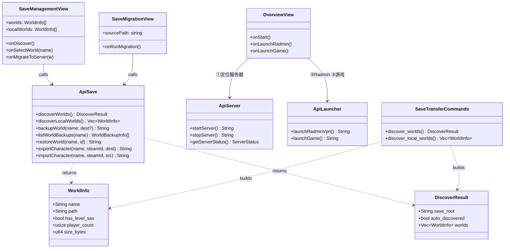
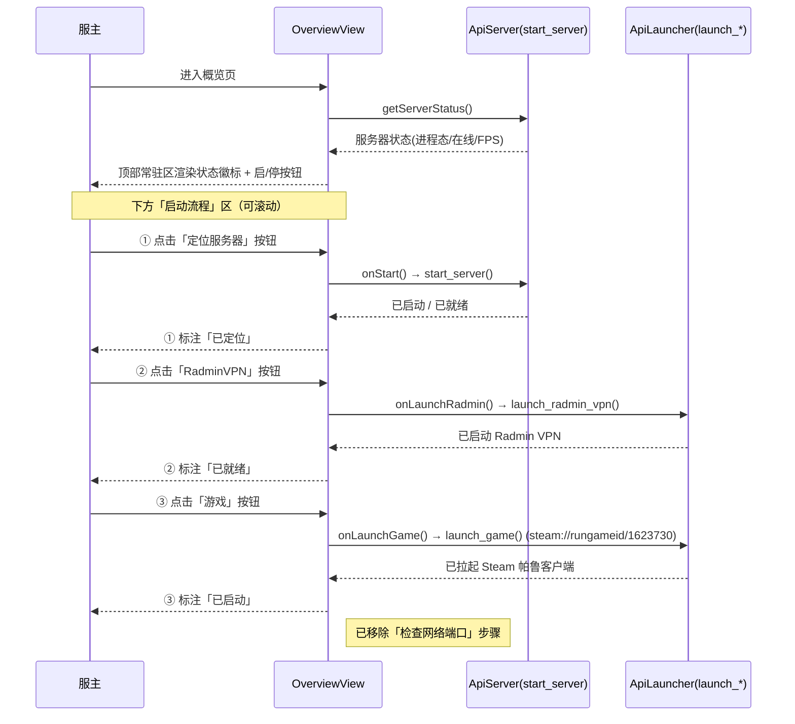
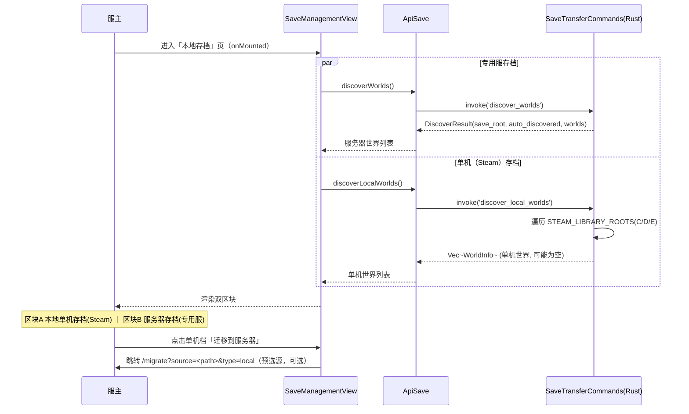
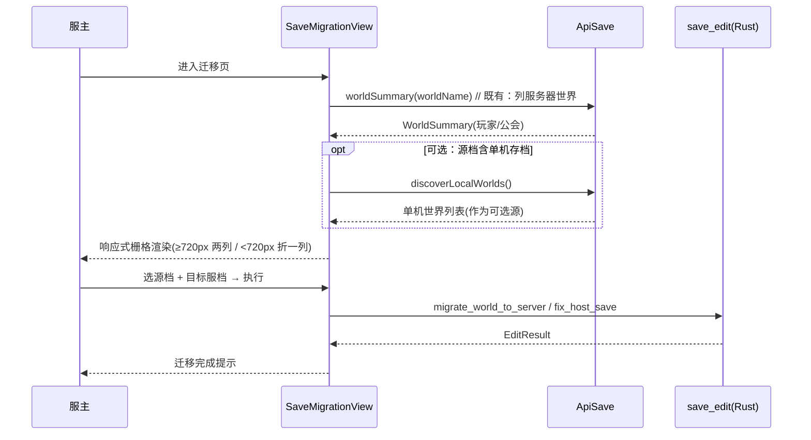
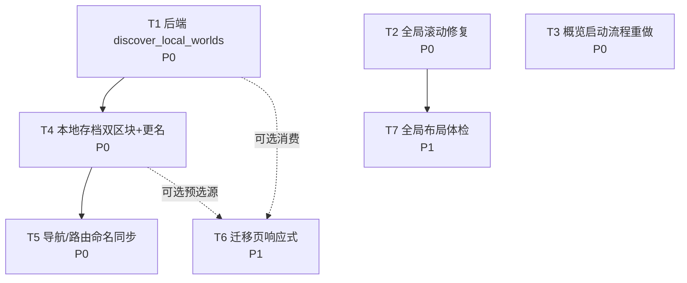

# Palworld 服务器管理器 · UI2 系统设计文档 + 任务分解

> 版本：UI2 增量修订（滚动 / 概览流程 / 本地存档双检测 / 迁移布局 / 全局体检）
> 架构师：高见远 ｜ 配套 PRD：`docs/prd-ui2-increment.md`
> 技术栈基线：Tauri2 + Vue3 + TypeScript（**不引入任何新框架 / 新依赖**）
> 关联调研结论：`docs/save-transfer-research.md`、`docs/f5-local-to-server-design.md`（A/B/C 三节，主理人已采信）

---

## 1. 实现方案 + 框架选型

### 1.1 总体原则
- **沿用既有技术栈**：Tauri2 + Vue3 + TypeScript + 既有设计令牌（CSS 变量 `--r-card` / `--glass-bg` / `--primary` 等），**本轮不新增 npm 包、不新增 Rust crate**。
- **最小改动、低耦合**：后端仅新增一个 Tauri 命令；前端仅新增一个 API 包装 + 调整少量视图与全局样式。迁移/备份/角色转移等既有命令按路径工作**完全不受影响**。
- **复用优先**：`discover_local_worlds` 直接复用 `save_transfer.rs` 中已存在的 `STEAM_LIBRARY_ROOTS`、`find_world_data_dir`、`world_info_from_dir`、`WorldInfo` 等，避免重复实现。

### 1.2 各需求实现策略

| 需求 | 技术难点 | 方案 | 框架/库 |
|---|---|---|---|
| **R1 配置页整页滚动** | `.screen` 的 flex 子项默认 `flex-shrink:1` 被压扁；`.cfg-group{overflow:hidden}` 裁切展开内容 | 新增全局规则 `.screen > * { flex-shrink: 0 }`；回退 `style.css:254` 的 `.cfg-group{min-height:0}` 与 `:425` 的 `overflow:hidden` | 纯 CSS |
| **R2 概览启动流程重做** | 顶部常驻状态/启停 + 下方三步流程，三步各一启动钮，移除端口检查 | 复用现有 `onStart`/`onLaunchRadmin`/`onLaunchGame` 三个 handler（对应 `start_server` / `launch_radmin_vpn` / `launch_game`），仅重构布局与文案，删除 Wizard 中「检查网络端口」StepCard | Vue3 + 现有 Tauri 命令 |
| **R3 本地存档双检测** | 单机（Steam）与专用服存档结构一致但磁盘根不同，需并列呈现 | 后端新增 `discover_local_worlds` 扫 C/D/E `SteamLibrary/steamapps/common/Palworld/.../SaveGames`；前端 `SaveManagementView` 并行调用 `discover_worlds`（服）+ `discover_local_worlds`（单机）渲染双区块 | Rust Tauri 命令 + Vue3 |
| **R5 迁移页响应式** | `.op-grid/.world-cols` 硬 `1fr 1fr` 无最小宽导致窄屏挤条 | 改为 `repeat(auto-fit, minmax(220px, 1fr))`；移除 `.op-field{min-width:0}` 压扁；解除 `.char-label{white-space:nowrap}` 截断 | 纯 CSS |
| **R6 全局布局体检** | 九页内边距/卡片间距/容器最大宽/标题层级不一致 | 统一间距与卡片规范，复用 R1 的全局滚动规则，逐页排查 flex 压扁/裁切/溢出 | 纯 CSS + Vue3 |

### 1.3 架构模式
保持现有「Tauri 命令层（Rust）→ `api/*.ts` 包装层 → Vue 视图层」三层结构，无新增抽象层。

---

## 2. 文件列表（相对路径，全部为改动/新增点）

```
# —— 后端（Rust / Tauri）——
src-tauri/src/save_transfer.rs      # 新增 discover_local_worlds 命令（复用既有辅助函数）
src-tauri/src/main.rs               # 在 generate_handler! 注册 discover_local_worlds

# —— 前端 API 包装层 ——
src/api/tauri.ts                    # 在 api.save 命名空间新增 discoverLocalWorlds 包装
src/types/tauri.ts                  # WorldInfo 等类型已存在，直接复用（无改动）

# —— 全局样式（R1 / R5 / R6 共用）——
src/style.css                       # 新增 .screen > * 规则；回退 .cfg-group 裁切；迁移页栅格

# —— 视图层 ——
src/views/OverviewView.vue          # R2：概览启动流程重做（三按钮 + 移除端口检查）
src/views/SaveManagementView.vue    # R3：双区块（单机/服务器）+ 更名「本服存档」→「本地存档」
src/views/SaveMigrationView.vue     # R5：响应式栅格；可选接入 localWorlds 作为源
src/components/layout/Sidebar.vue   # R3：导航文案「本服存档」→「本地存档」
src/router/index.ts                 # R3：路由 path/name/meta.title 三处命名同步

# —— 全局体检涉及页面（R6，仅样式/间距微调，不重写结构）——
src/views/OverviewView.vue          # S1
src/views/ConfigView.vue            # S2（含 CfgGroup 展开滚动，依赖 R1）
src/views/NetworkView.vue           # S3
src/views/PlayerManageView.vue      # S4
src/views/RconView.vue              # S5
src/views/LogView.vue               # S6
src/views/SaveManagementView.vue    # S7（即 R3 双检测页）
src/views/SaveMigrationView.vue     # S8（即 R5 迁移页）
src/views/ConfigBackupView.vue      # S9
```

---

## 3. 数据结构与接口

### 3.1 Rust 端（新增命令签名）

```rust
// === src-tauri/src/save_transfer.rs ===

/// R3：扫描本机单机（Steam）存档，与 discover_worlds（专用服）并列返回。
/// 仅扫 C/D/E 常见 Steam 库下的 steamapps/common/Palworld/Pal/Saved/SaveGames。
/// 完全复用既有 STEAM_LIBRARY_ROOTS / find_world_data_dir / world_info_from_dir。
/// 注意：未发现任何单机档时返回 Ok(vec![])（不报错，UI 优雅空态），
///       因为单机档缺失属于正常现象；仅当路径访问异常时才 Err。
#[command]
pub async fn discover_local_worlds() -> Result<Vec<WorldInfo>, String> {
    let mut worlds: Vec<WorldInfo> = Vec::new();
    let mut seen_paths: std::collections::HashSet<String> = std::collections::HashSet::new();

    for root in STEAM_LIBRARY_ROOTS {
        let save_games = Path::new(root)
            .join("steamapps")
            .join("common")
            .join("Palworld")
            .join("Pal")
            .join("Saved")
            .join("SaveGames");
        if !save_games.is_dir() {
            continue; // 该 Steam 库未装帕鲁，跳过
        }
        let entries = match std::fs::read_dir(&save_games) {
            Ok(e) => e,
            Err(_) => continue,
        };
        for entry in entries.flatten() {
            let path = entry.path();
            if !path.is_dir() {
                continue;
            }
            let info = world_info_from_dir(&path);
            if info.has_level_sav && seen_paths.insert(info.path.clone()) {
                worlds.push(info);
            }
        }
    }
    worlds.sort_by(|a, b| a.name.cmp(&b.name));
    Ok(worlds)
}
```

既有可复用结构（无需改动）：

```rust
// save_transfer.rs:22
pub struct WorldInfo {
    pub name: String,            // 世界名（= SaveGames 下子目录名）
    pub path: String,            // 世界目录绝对路径
    pub has_level_sav: bool,     // 是否含 Level.sav（世界主体）
    pub player_count: usize,     // Players/ 下角色存档数量
    pub size_bytes: u64,         // 整目录字节数
}

// save_transfer.rs:37
pub struct DiscoverResult {
    pub save_root: String,
    pub auto_discovered: bool,
    pub worlds: Vec<WorldInfo>,
}
```

辅助函数（直接复用，不改动）：
- `STEAM_LIBRARY_ROOTS: &[&str]`（save_transfer.rs:63）— 已含 E/D/C 常见盘。
- `find_world_data_dir(world_dir: &Path) -> Option<PathBuf>`（:284）— 兼容扁平 `<World>/Level.sav` 与 GUID 嵌套 `<World>/<GUID>/Level.sav`。
- `world_info_from_dir(world_dir: &Path) -> WorldInfo`（:305）— 构建 WorldInfo。

### 3.2 命令注册（`src-tauri/src/main.rs`）

在 `generate_handler!` 的 `save_transfer::` 分组内追加 `discover_local_worlds`：

```rust
save_transfer::discover_worlds, save_transfer::discover_local_worlds,  // 新增
save_transfer::backup_world,
save_transfer::list_world_backups, save_transfer::restore_world,
save_transfer::export_character, save_transfer::import_character,
```

### 3.3 前端 API 包装（`src/api/tauri.ts`）

在 `api.save` 命名空间（紧邻 `discoverWorlds`）新增：

```ts
// === 新增：R3 单机（Steam）存档发现 ===
discoverLocalWorlds: () => tauriInvoke<WorldInfo[]>('discover_local_worlds'),
```

复用类型：`import type { WorldInfo } from '@/types/tauri'`（类型已存在，无需新增）。

### 3.4 类图（Mermaid classDiagram）



---

## 4. 程序调用流程（Mermaid sequenceDiagram）

### 4.1 概览页三步启动流程（R2）



### 4.2 本地存档页双检测加载（R3）



### 4.3 数据迁移页源档选择（R5，含可选 localWorlds 源）



---

## 5. 任务列表（T1–T7，按依赖排序）

> 规则：每项含 **源文件 / 依赖 / 优先级**。实现顺序按编号，但可并行执行无依赖项（T1/T2/T3/T6 可并行起步；T4 等 T1；T5 等 T4；T7 最后收口）。

### T1 · 后端新增 `discover_local_worlds` 命令（R3 后端）
- **源文件**：`src-tauri/src/save_transfer.rs`、`src-tauri/src/main.rs`
- **依赖**：无
- **优先级**：P0
- **内容**：
  1. 在 `save_transfer.rs` 按 §3.1 新增 `discover_local_worlds()`，遍历 `STEAM_LIBRARY_ROOTS`（C/D/E），拼 `steamapps/common/Palworld/Pal/Saved/SaveGames`，用 `find_world_data_dir`+`world_info_from_dir` 收集 `WorldInfo`，按 `has_level_sav` 过滤、按 name 排序、去重。无档返回 `Ok(vec![])`。
  2. 在 `main.rs` `generate_handler!` 的 `save_transfer::` 组追加 `discover_local_worlds`。
  3. `cargo build` 通过，命令可被 invoke。

### T2 · 全局滚动修复（R1）
- **源文件**：`src/style.css`
- **依赖**：无
- **优先级**：P0
- **内容**：
  1. 新增全局规则 `.screen > * { flex-shrink: 0; }`。
  2. 回退 `style.css:254`：将 `.cfg-group, .sm-section, .op-grid { min-height: 0; }` 改为 `.sm-section, .op-grid { min-height: 0; }`（去掉 `.cfg-group`）。
  3. 回退 `style.css:425` 附近 `.cfg-group{...overflow:hidden}` 的 `overflow:hidden`（collapse 已由 `.cfg-group.collapsed .cfg-group-body{display:none}` 处理，无需在 base 裁切）。
  4. 验证：展开全部配置组，滚动条出现且内容完整无裁切。

### T3 · 概览页启动流程重做（R2）
- **源文件**：`src/views/OverviewView.vue`
- **依赖**：无
- **优先级**：P0
- **内容**：
  1. 顶部常驻区保留「服务器状态徽标 + 启/停按钮」（复用现有 `getServerStatus` + 现有启停 handler）。
  2. 下方新增「启动流程」区，三步卡片：①定位服务器（`onStart`/`start_server`，标注已定位态）②RadminVPN（`onLaunchRadmin`/`launch_radmin_vpn`）③游戏（`onLaunchGame`/`launch_game`，`steam://rungameid/1623730`），每步各一启动钮（共三个）并标注就绪态。
  3. 删除 Wizard 模式中「检查网络端口」StepCard（原 lines 139–144）。
  4. 保留顶层级启/停，移除流程内关服步骤。

### T4 · 本地存档页双区块 + 更名（R3 前端）
- **源文件**：`src/views/SaveManagementView.vue`、`src/api/tauri.ts`、`src/types/tauri.ts`（仅复用，无改）
- **依赖**：T1（需后端命令 + API 包装）
- **优先级**：P0
- **内容**：
  1. `tauri.ts` 在 `api.save` 新增 `discoverLocalWorlds`（§3.3）。
  2. `SaveManagementView`：`onDiscover` 并行调用 `discoverWorlds`（服）与 `discoverLocalWorlds`（单机），渲染两个区块——**本地单机存档（Steam）** / **服务器存档（专用服）**，各自列出世界（名称/槽/GUID/修改时间）。
  3. 单机区块提供「迁移到服务器」按钮（跳转 `/migrate?source=<path>&type=local`，可选预选）。
  4. 页面标题/提示文案「本服存档」→「本地存档」。

### T5 · 导航 / 路由三处命名同步（R3 命名）
- **源文件**：`src/components/layout/Sidebar.vue`、`src/router/index.ts`
- **依赖**：T4（等视图更名确定后统一）
- **优先级**：P0
- **内容**（三处必须一致，避免 404 / 歧义）：
  1. `Sidebar.vue`（~line 68）：`{ path: '/saves', label: '本服存档' }` → `label: '本地存档'`。
  2. `router/index.ts`（~lines 51–56）：`{ path: '/saves', name: 'saves', meta: { title: '本服存档' } }` → `meta.title: '本地存档'`（path/name 保持不变，仅 title 文案；如需更语义化可改为 `path:'/local-saves', name:'localSaves'`，但须同步 Sidebar 的 `path`，**注意保持三处一致**）。
  3. 确认 `SaveMigrationView` 中对「本服存档」的引用文案一并更新。

### T6 · 数据迁移页响应式布局（R5，可选接 localWorlds 源）
- **源文件**：`src/views/SaveMigrationView.vue`、`src/style.css`（全局栅格规则）
- **依赖**：无（可选消费 T1/T4 的 localWorlds 作为源，非强依赖）
- **优先级**：P1
- **内容**：
  1. `style.css` 将 `.op-grid/.world-cols` 的 `grid-template-columns:1fr 1fr` 改为 `repeat(auto-fit, minmax(220px, 1fr))`；移除 `.op-field{min-width:0}` 压扁；解除 `.char-label{white-space:nowrap}` 截断（改为 `white-space:normal` + `text-overflow:ellipsis` + tooltip）。各 section `margin-top` 适当加宽。
  2. `SaveMigrationView` 支持从 `route.query` 读取 `source`/`type`（来自 T4 的「迁移到服务器」），预选源档；可选将 `discoverLocalWorlds` 结果纳入源档候选。
  3. 验证：≤720px 下组件不再挤成细条、字段名不被截断。

### T7 · 全局布局体检优化（R6）
- **源文件**：全部 9 个视图（`OverviewView`/`ConfigView`/`NetworkView`/`PlayerManageView`/`RconView`/`LogView`/`SaveManagementView`/`SaveMigrationView`/`ConfigBackupView`）+ `src/style.css`
- **依赖**：T2（依赖全局滚动规则打底）
- **优先级**：P1
- **内容**：
  1. 统一内边距/卡片间距/容器最大宽/标题层级（参照既有设计令牌，不新建设计系统）。
  2. 逐页排查遗留 flex 压扁/裁切/溢出不一致；复用 T2 的 `.screen > *{flex-shrink:0}` 保证九页滚动一致。
  3. 验证：九页视觉节奏一致，无突兀留白/溢出/错位。

---

## 6. 依赖包列表

> **本轮不引入任何新依赖。**

```
# 后端（Rust / Tauri）—— 全部为项目既有 crate，无新增
#   tauri, serde, serde_json（已在 Cargo.toml）
#   复用：save_transfer.rs 内既有辅助（STEAM_LIBRARY_ROOTS / find_world_data_dir / world_info_from_dir）

# 前端（npm）—— 全部为项目既有包，无新增
#   vue@^3, typescript, @tauri-apps/api, @tauri-apps/plugin-dialog
#   复用：@/api/tauri 的 tauriInvoke 包装、@/types/tauri 的 WorldInfo 类型
```

---

## 7. 共享知识（跨文件约定，供工程师遵循）

- **命名三处同步（R3 关键）**：导航 Sidebar `label` / 路由 `meta.title`（及可选 `path`+`name`）/ 视图页面标题与文案，三者必须一致，避免 404 与歧义。
- **命令注册位置**：所有 Tauri 命令在 `src-tauri/src/main.rs` 的 `generate_handler!` 内按模块分组注册；新增 `discover_local_worlds` 必须放在 `save_transfer::` 组。
- **API 包装约定**：前端统一经 `src/api/tauri.ts` 的 `tauriInvoke<T>('command_name')` 包装；命令名 snake_case，包装方法 camelCase（如 `discover_worlds` → `discoverWorlds`，`discover_local_worlds` → `discoverLocalWorlds`）。
- **`WorldInfo` 复用**：前端类型来自 `@/types/tauri`，后端结构来自 `save_transfer.rs`，字段须严格对齐（name/path/has_level_sav/player_count/size_bytes）。
- **双检测职责分离**：`discover_worlds` 只管专用服（server_path 驱动）；`discover_local_worlds` 只管单机（Steam 库驱动）。两者并列返回，拷贝/备份/迁移命令按传入 `path` 工作，**互不干扰**。
- **空态语义**：`discover_local_worlds` 未发现单机档时返回 `Ok(vec![])`（非 Err），UI 应渲染「未发现本机单机存档」空态，不报错。
- **安全基线**：沿用既有路径穿越防护（`safe_name_segment`/`normalize_steam_id`）；新增命令仅读目录、不写盘，无新增安全风险。
- **全局滚动范式**：`.screen` 容器 `overflow-y:auto` + 直接子项 `flex-shrink:0`；任何新页面/区块追加到 `.screen` 内时遵守此范式。
- **响应式中断点**：迁移页以 `720px` 为窄屏折行阈值（与 `repeat(auto-fit, minmax(220px,1fr))` 协同）。

---

## 8. 待明确事项

**空（已全部拍板）。** PRD 第五节「待确认问题」均已有结论，无遗留歧义：

| PRD 待确认 | 裁定结论 |
|---|---|
| ① Oodle（R7）是否本轮红字引导 | **P2 本轮不做**（据 R11 Oodle 压缩存档不在本轮范围） |
| ② Fix Host 手动 GUID 简化 | **不在本轮范围**，迁移页沿用既有整包迁移 / Fix Host Save 能力，UI 不暴露简化版 |
| ③ 概览三按钮行为 | 复用现有 handler：①定位服务器=`onStart`(`start_server`)；②RadminVPN=`onLaunchRadmin`(`launch_radmin_vpn`)；③游戏=`onLaunchGame`(`launch_game`，`steam://rungameid/1623730`)；**移除「检查网络端口」步骤** |
| ④ 单机扫描盘符范围 | **仅 C/D/E 本轮**（F 盘留 P2）；`STEAM_LIBRARY_ROOTS` 已覆盖，无需改动 |

**用户已拍板的三项决策（写入设计基线）**：
1. 单机扫描 = 扫常见 Steam 库（C:/D:/E: `steamapps/common/Palworld/Pal/Saved/SaveGames`），无需手动录入。
2. 迁移页布局 = 响应式 `repeat(auto-fit, minmax(220px,1fr))`。
3. 配置页滚动 = 全局 `.screen > * { flex-shrink: 0 }`。

---

## 附：任务依赖图（Mermaid graph）



> 可并行启动：T1、T2、T3、T6（互不阻塞）；T4 等 T1；T5 等 T4；T7 最后收口（依赖 T2 打底，建议 T3/T4/T5/T6 完成后统一体检避免返工）。
