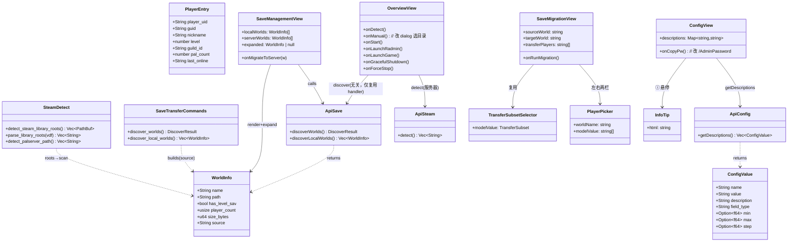
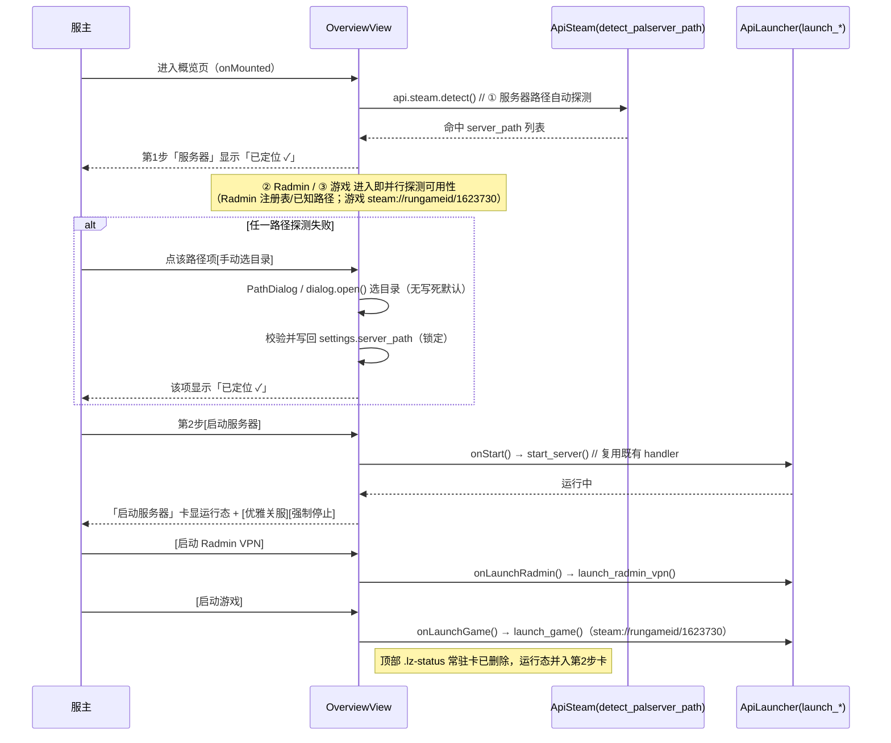
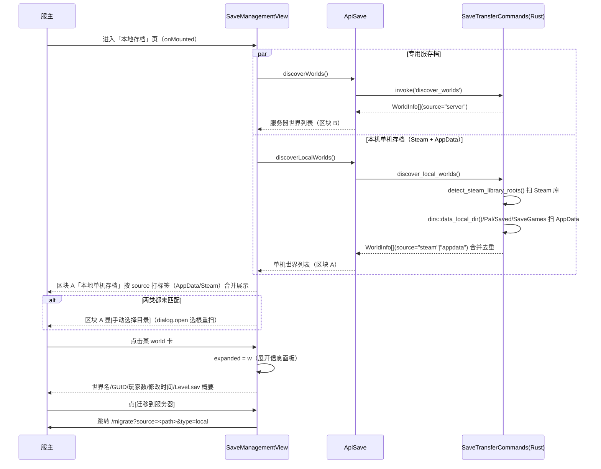
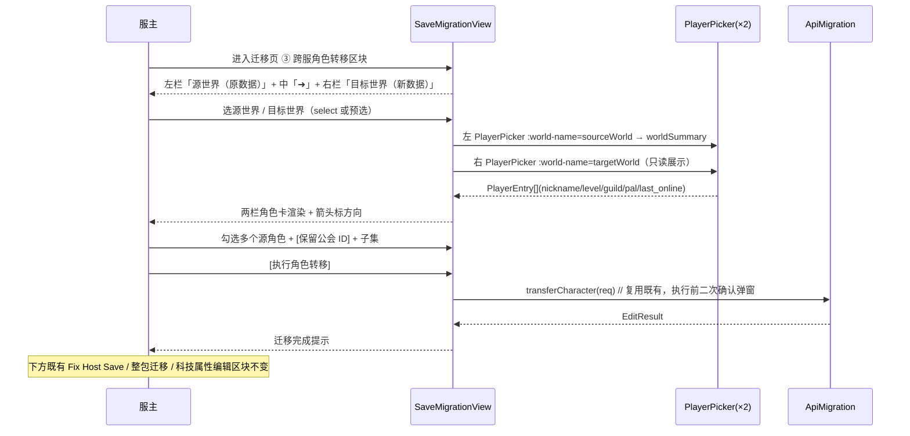
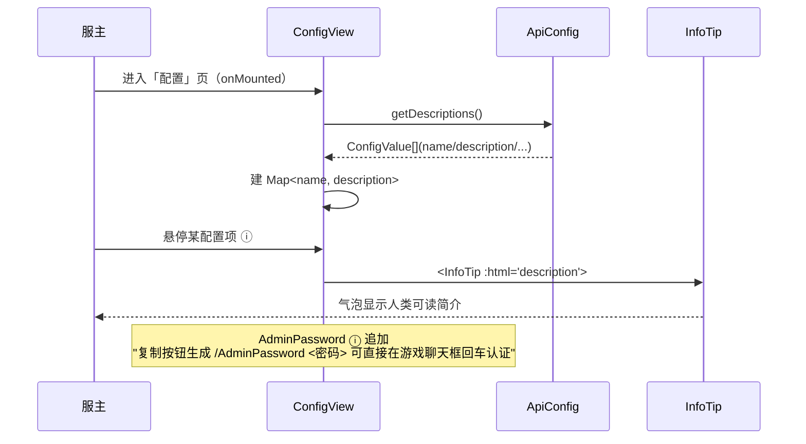
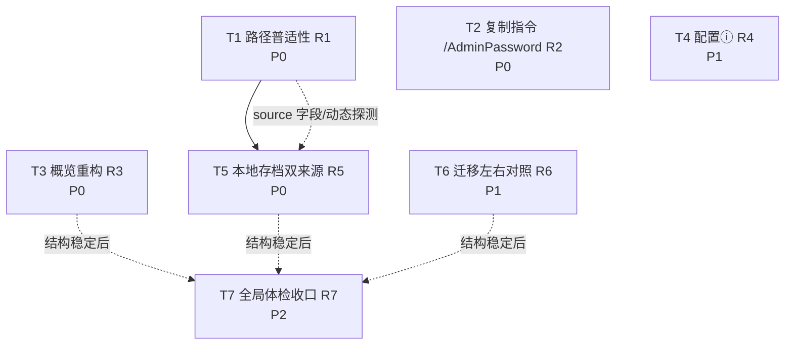

# Palworld 服务器管理器 · UI3 系统设计文档 + 任务分解

> 版本：UI3 增量修订（路径普适性 / 管理员复制指令 / 概览重构 / 配置ⓘ简介 / 本地存档双来源 / 数据迁移左右对照）
> 架构师：高见远（新 agent，已亲自读码核对）｜ 配套 PRD：`docs/prd-ui3-increment.md`
> 技术栈基线：**Tauri2 + Vue3 + TypeScript**（沿用，不引入任何新框架 / 新依赖）
> 关联：UI2 已完成 Tauri 命令 `discover_local_worlds` / `get_config_descriptions` / `detect_palserver_path` 的注册与前端包装；本轮在其上做增量修订。

---

## 0. 读码核实结论（先说事实，再设计）

> 本节所有结论均来自直接读取源码，非 PRD 假设。PRD 中部分文件名/行号与实际略有出入（见括号差异），以实际代码为准。

| 核实项 | PRD 描述 | 实际代码（已读） | 结论 |
|---|---|---|---|
| **R1② steam_detect** | 已有 `parse_library_roots` 动态读取 | `src-tauri/src/steam_detect.rs` 真实存在；`pub fn parse_library_roots(vdf_text: &str) -> Vec<String>`（行 30）为**纯 VDF 解析函数**；真正的注册表读取 + `libraryfolders.vdf` 读取逻辑在 `detect_palserver_path()`（行 116–158）内部，**并非独立可复用函数** | 需**新增** `pub fn detect_steam_library_roots() -> Vec<PathBuf>`，把 `detect_palserver_path` 内"注册表+双 VDF→库根列表"的逻辑抽出复用 |
| **R1 写死常量** | `save_transfer.rs:63-70` 与 `path_util.rs:16-21` 的 `STEAM_LIBRARY_ROOTS` | 与 PRD 一致：`save_transfer.rs:63`（6 项 E/D/C 盘写死）、`path_util.rs:15`（同款）；使用点：`save_transfer.rs:120`（resolve_save_games_root 兜底）、`save_transfer.rs:412`（discover_local_worlds）、`path_util.rs:69`（resolve_save_games_root 兜底） | 主探测路径改为动态探测；常量降级为"最后兜底"保留 |
| **R1③ OverviewView 写死** | `OverviewView.vue:351` 手动选目录 fallback `'D:\Steam\steamapps\common\Palworld\PalServer'` | 实际 `OverviewView.vue:351`：`const path = settingsStore.settings.server_path \|\| 'D:\\Steam\\steamapps\\common\\Palworld\\PalServer'`（与 PRD 一致） | `onManual` 改为调 `PathDialog`/dialog `open()` 让用户选，不写死默认路径 |
| **R2 onCopyPw** | `ConfigView.vue:46` 按钮 + `:171-199` 写纯密码 | 实际：`ConfigView.vue:46` `<button @click="onCopyPw">复制</button>`；`onCopyPw`（行 181–203）写 `navigator.clipboard.writeText(pw)`（纯密码）；`pw = adminPasswordDisplay.value`（已去引号） | 改写 `/AdminPassword ` + pw |
| **R4 getDescriptions** | `api.config.getDescriptions()` 已存在；`config.rs:584-637` 字段含 `description` | 实际：`src/api/tauri.ts:78` `getDescriptions: () => tauriInvoke<ConfigValue[]>('get_config_descriptions')` ✓；`config.rs:584` `get_config_descriptions()` 返回 `Vec<ConfigValue>`，约 50 项，`description` 字段为普通 `String`（非空）✓；`ConfigValue` 结构（config.rs:169）：`name/value/description/field_type/min:Option<f64>/max:Option<f64>/step:Option<f64>` | 纯前端接 `description` 到 ⓘ，后端零改动 |
| **R5 WorldInfo** | 扩展 `discover_local_worlds` 标 `source` | 当前 `discover_local_worlds`（`save_transfer.rs:411`）仅 `discover_local_worlds_in(STEAM_LIBRARY_ROOTS)`（行 412），**无 appdata、无 source**；`WorldInfo`（save_transfer.rs:22）无 `source` 字段；前端 `types/tauri.ts:274` 的 `WorldInfo` 也无 `source` | 后端加 `source` 字段 + 双来源扫描；前端类型同步 |
| **R6 PlayerEntry** | 复用 `PlayerPicker` 的 `PlayerEntry`（`nickname/level/guild_id/pal_count/last_online`） | 实际 `types/tauri.ts:353` `PlayerEntry` 含 `player_uid/instance_id/guid/nickname/level/guild_id:string|null/pal_count/last_online/is_host` ✓ 全部具备；`PlayerPicker.vue` 以 `world-name` prop + `v-model:string[]`（选中 guid 列表）工作，内部已渲染"名字/Lv/公会/帕鲁/最后在线" | 复用 `PlayerPicker` 作左右两栏 |
| **R6 SaveMigrationView** | 源/目标两个 `<select>` | 实际 `SaveMigrationView.vue:48/55/90/97/121/128/152` 多个 `<select v-model="sourceWorld/targetWorld">`，`:135 :159` 两处 `PlayerPicker`，`:137 TransferSubsetSelector`；`sourceWorld/targetWorld` 为 `ref('')`（世界名） | ③ 区块改左/右/箭头布局 |
| **依赖 `dirs` crate** | 确认 `dirs` 是否已引入 | `src-tauri/Cargo.toml:24` `dirs = "5.0"` ✓ 已存在；`config.rs:19` 备份目录已用 `dirs::data_dir()`（R1④ 合规） | 无需新增 crate |
| **前端 npm 包** | 预计不需新增 | 全部复用既有（`@tauri-apps/api`、`@tauri-apps/plugin-dialog` 的 `open()` 已在 `SaveManagementView.vue:154` 引入） | 零新增 npm 包 |
| **路由/导航** | 无新增路由/改名 | `src/router/index.ts`：`/saves` meta.title「本地存档」、`/migrate` meta.title「数据迁移」均已就绪，本轮仅视图内部调整 | 无需改动路由/Sidebar |
| **`discover_worlds` source** | — | `discover_worlds`（save_transfer.rs:334）同样经 `world_info_from_dir` 构造 `WorldInfo`；为前端区分来源，一并赋 `source="server"` | 见 §3.1 |

---

## 1. 实现方案 + 框架选型

### 1.1 总体原则
- **沿用既有技术栈**：Tauri2 + Vue3 + TypeScript + 既有设计令牌（`--palwarm-*` / `--glass-*` / `--primary` / `--r-card`，见 `src/style.css:9-82`）。**本轮不新增 npm 包、不新增 Rust crate**（`dirs` 已在 Cargo.toml）。
- **动态探测替代写死**（R1 核心）：Steam 库根不再写死 E/D/C 盘，改为由 `steam_detect::detect_steam_library_roots()` 动态读取（注册表 Steam 安装路径 + `libraryfolders.vdf` 双位置解析）。单机 AppData 路径用 `dirs::data_local_dir()` 推导。
- **最小改动、低耦合**：后端仅**新增 1 个 Rust 函数** `detect_steam_library_roots()` + 扩展既有 `discover_local_worlds`；前端仅改 4 个视图 + 1 个类型声明 + 复用既有 `InfoTip`/`PlayerPicker`/`TransferSubsetSelector`。
- **"写死兜底"处理**：`STEAM_LIBRARY_ROOTS` 常量**保留但降级为最后兜底**——仅在动态探测完全失败（注册表/VDF 全读不到）时启用，且明确注释"不应作为常规探测路径"，满足 PRD R1②"或仅作最后兜底且不在主探测路径"。

### 1.2 各需求实现策略

| 需求 | 技术难点 | 方案 | 框架/库 |
|---|---|---|---|
| **R1 路径普适性** | 写死盘符仅在作者机器可用 | 新增 `detect_steam_library_roots()`（注册表+VDF，复用 `parse_library_roots`）；`resolve_save_games_root`（save_transfer.rs/path_util.rs）与 `discover_local_worlds` 主路径改调它；常量降级兜底；`OverviewView.onManual` 改 dialog 选目录 | Rust `std::fs`/`winreg`/`dirs` |
| **R2 复制指令** | 复制内容需从纯密码变斜杠指令 | `ConfigView.onCopyPw` 改 `writeText('/AdminPassword ' + pw)`；空密码禁用+提示；成功提示文案更新 | 浏览器 `navigator.clipboard` + 原 execCommand 兜底 |
| **R3 概览重构** | 去顶部常驻卡，重排为"第1步探三路径+第2步三按钮" | 删除 `.lz-status` 区；新增"第1步"三路径探测卡（server 用 `api.steam.detect`、Radmin 注册表/已知路径、game 用 `steam://rungameid/1623730` 探测可用性），失败显 [手动选目录]；"第2步"三启动按钮复用 `onStart/onLaunchRadmin/onLaunchGame`；运行态在"启动服务器"卡表达 + 优雅/强制关服入口 | Vue3 + 既有 Tauri 命令 |
| **R4 配置ⓘ** | 把元数据接到每个配置项 ⓘ | `ConfigView` 进入时 `getDescriptions()` 建 `Map<name,description>`；每个配置行右侧 `<InfoTip :html="description">`；AdminPassword ⓘ 追加复制指令说明 | 复用 `InfoTip.vue`（`:html` prop） |
| **R5 本地存档双来源** | AppData + Steam 合并、去重、标注来源、点击展开 | 扩展 `discover_local_worlds`：Steam（动态根）+ AppData（`dirs::data_local_dir()/Pal/Saved/SaveGames`）合并去重，标 `source`；前端区块更名「本地单机存档」、按 source 打标签、[手动选目录] 兜底、点击卡展开信息面板 | Rust `dirs` + Vue3 |
| **R6 迁移左右对照** | 两栏角色卡 + 箭头方向 | ③ 区块由双 `<select>` 改为左（源世界 `PlayerPicker` 可勾选）/ 右（目标世界 `PlayerPicker` 只读）/ 中 `➜` 箭头；多选 + 复用 `TransferSubsetSelector`；加"先在目标世界建好角色"前置引导 | 复用 `PlayerPicker`/`TransferSubsetSelector` |

### 1.3 架构模式
保持现有「Tauri 命令层（Rust）→ `api/*.ts` 包装层 → Vue 视图层」三层结构，无新增抽象层。

---

## 2. 文件列表（相对路径，按改动/新增）

```
# —— 后端（Rust / Tauri）——
src-tauri/src/steam_detect.rs          # 新增 detect_steam_library_roots()（抽出 detect_palserver_path 内库根探测逻辑，复用 parse_library_roots）
src-tauri/src/save_transfer.rs         # WorldInfo 加 source 字段；discover_local_worlds 扩展为 Steam+AppData 双来源；resolve_save_games_root 兜底改动态
src-tauri/src/save_edit/path_util.rs   # resolve_save_games_root 兜底改用 detect_steam_library_roots()（常量降级）
（src-tauri/src/main.rs                # 仅核实：discover_local_worlds / get_config_descriptions 已注册，无需改）
（src-tauri/src/config.rs              # 仅核实：get_config_descriptions 已含 description，无需改）

# —— 前端 API 包装层 ——
（src/api/tauri.ts                     # 仅核实：discoverLocalWorlds / getDescriptions 已存在，无需改）
src/types/tauri.ts                     # WorldInfo 加 source: string 字段（与 Rust 对齐）

# —— 视图层 ——
src/views/OverviewView.vue             # R3：删 .lz-status 顶部卡；新增第1步三路径探测 + 第2步三按钮；onManual 改 dialog
src/views/ConfigView.vue               # R2：onCopyPw 改 /AdminPassword；R4：接 getDescriptions + ⓘ 悬停
src/views/SaveManagementView.vue       # R5：区块更名「本地单机存档」、source 标签、手动选目录兜底、点击展开信息面板
src/views/SaveMigrationView.vue        # R6：③ 区块改左/右/箭头对照布局

# —— 复用组件（核实存在，不改或仅消费）——
src/components/ui/InfoTip.vue          # R4 复用（:html prop）
src/components/save/PlayerPicker.vue   # R6 复用（world-name + v-model 选中 guid 列表）
src/components/save/TransferSubsetSelector.vue  # R6 复用（v-model subset）

# —— 仅核实不动 ——
src/router/index.ts                    # 无新增路由/改名
src/components/layout/Sidebar.vue      # 无改名（「本地存档」「数据迁移」已就绪）
src/style.css                          # 复用既有 --palwarm-* / --glass-* / --r-card 令牌（R4/R6 不新建系统）
```

> 括号 `()` 内为"仅核实、本轮不动"的文件。

---

## 3. 数据结构与接口（签名）

### 3.1 Rust 端

#### 3.1.1 `WorldInfo` 增加 `source` 字段（save_transfer.rs:22）

```rust
#[derive(Serialize, Clone, Debug)]
pub struct WorldInfo {
    pub name: String,
    pub path: String,
    pub has_level_sav: bool,
    pub player_count: usize,
    pub size_bytes: u64,
    /// 来源：专用服 = "server"；本机单机 = "appdata"（AppData Local）或 "steam"（Steam 库）
    pub source: String,
}
```

> `world_info_from_dir`（save_transfer.rs:305）结构体内新增 `source: String::new()`（保持签名不变，调用方赋具体来源，避免触动既有测试 `world_info_from_dir` 调用点）。`discover_worlds`（行 334）循环内 `info.source = "server".to_string()`；`discover_local_worlds` 对每个 world 赋 `"steam"`/`"appdata"`。

#### 3.1.2 新增 `detect_steam_library_roots()`（steam_detect.rs）

```rust
/// 动态探测全部 Steam 库根目录（注册表 Steam 安装路径 + 两处 libraryfolders.vdf）。
/// 抽出 detect_palserver_path 内的库根推导逻辑，供 save_transfer/path_util 的存档扫描复用。
/// 返回可能为空的列表；调用方应自行决定兜底策略（保留 STEAM_LIBRARY_ROOTS 作为最后兜底）。
#[cfg(windows)]
pub fn detect_steam_library_roots() -> Vec<PathBuf> {
    let mut roots: Vec<PathBuf> = Vec::new();
    let steam_root = match read_steam_install_path() {
        Some(p) => p,
        None => return roots,
    };
    roots.push(PathBuf::from(&steam_root));
    for vdf_rel in ["steamapps\\libraryfolders.vdf", "config\\libraryfolders.vdf"] {
        let vdf_path = Path::new(&steam_root).join(vdf_rel);
        if let Ok(text) = std::fs::read_to_string(&vdf_path) {
            for r in parse_library_roots(&text) {
                roots.push(PathBuf::from(r));
            }
        }
    }
    roots.sort();
    roots.dedup();
    roots
}

#[cfg(not(windows))]
pub fn detect_steam_library_roots() -> Vec<PathBuf> {
    Vec::new()
}
```

> `read_steam_install_path`（steam_detect.rs:83）与 `parse_library_roots`（:30）均为同文件既有函数，直接复用。

#### 3.1.3 扩展 `discover_local_worlds()`（save_transfer.rs:411）

```rust
/// R5：同时扫 Steam 库（动态根）与 AppData Local Pal 单机档，合并去重，标注 source。
/// 未发现任何单机档返回 Ok(vec![])（UI 优雅空态）；仅路径访问异常才 Err。
#[command]
pub async fn discover_local_worlds() -> Result<Vec<WorldInfo>, String> {
    let mut worlds: Vec<WorldInfo> = Vec::new();
    let mut seen: std::collections::HashSet<String> = std::collections::HashSet::new();

    // 1) Steam 库（动态探测，替代写死 STEAM_LIBRARY_ROOTS 主路径）
    let dyn_roots = crate::steam_detect::detect_steam_library_roots();
    let root_strs: Vec<&str> = dyn_roots.iter().map(|p| p.to_string_lossy().as_ref()).collect();
    for mut w in discover_local_worlds_in(&root_strs) {
        w.source = "steam".to_string();
        if seen.insert(w.path.clone()) { worlds.push(w); }
    }

    // 2) AppData Local Pal 单机档（可移植，不依赖机器专属路径）
    if let Some(local) = dirs::data_local_dir() {
        let appdata_sg = local.join("Pal").join("Saved").join("SaveGames");
        if appdata_sg.is_dir() {
            let entries = match std::fs::read_dir(&appdata_sg) {
                Ok(e) => e,
                Err(_) => { /* 异常跳过，不 panic */ }
            };
            for entry in entries.flatten() {
                let p = entry.path();
                if !p.is_dir() { continue; }
                let mut w = world_info_from_dir(&p);
                w.source = "appdata".to_string();
                if w.has_level_sav && seen.insert(w.path.clone()) { worlds.push(w); }
            }
        }
    }

    worlds.sort_by(|a, b| a.name.cmp(&b.name));
    Ok(worlds)
}
```

#### 3.1.4 `resolve_save_games_root` 兜底改动态（save_transfer.rs:119 / path_util.rs 同结构）

```rust
    // 3. 兜底：动态探测 Steam 库（替代写死 STEAM_LIBRARY_ROOTS 主路径）
    let dynamic = crate::steam_detect::detect_steam_library_roots();
    // 仅当动态探测完全失败时才回退到写死兜底（不在主探测路径）
    let fallback: Vec<std::path::PathBuf> = if dynamic.is_empty() {
        STEAM_LIBRARY_ROOTS.iter().map(std::path::PathBuf::from).collect()
    } else {
        dynamic
    };
    for root in &fallback {
        let cand = root.join("steamapps").join("common").join("Palworld")
            .join("Pal").join("Saved").join("SaveGames");
        if cand.is_dir() {
            return Ok((cand, true));
        }
    }
```

### 3.2 前端类型同步（src/types/tauri.ts:274）

```ts
export interface WorldInfo {
  name: string
  path: string
  has_level_sav: boolean
  player_count: number
  size_bytes: number
  /** 来源：专用服="server"；本机单机="appdata"(AppData) | "steam"(Steam 库) */
  source: string
}
```

> `PlayerEntry`（types/tauri.ts:353）、`ConfigValue`（:24）、`TransferSubset`（:382）**均无需改动**——R4/R6 直接复用。

### 3.3 类图（Mermaid classDiagram）



---

## 4. 程序调用流程（Mermaid sequenceDiagram）

### 4.1 概览三步流程（R3：进入自动探三路径 → 失败手动选目录锁定 → 三启动按钮）



### 4.2 本地存档双来源扫描 + 点击展开（R5）



### 4.3 数据迁移左右对照 + 箭头方向（R6）



### 4.4 配置 ⓘ 加载（R4）



---

## 5. 任务列表（T1–T7，按依赖排序）

> 规则：每项含 **源文件 / 依赖 / 优先级**。实现顺序按编号；无依赖项（T1/T2/T3/T4/T6）可并行起步；T5 依赖 T1（路径探测改动）；T7 收口。

### T1 · 路径普适性（R1）
- **源文件**：`src-tauri/src/steam_detect.rs`、`src-tauri/src/save_transfer.rs`、`src-tauri/src/save_edit/path_util.rs`
- **依赖**：无
- **优先级**：P0
- **内容**：
  1. `steam_detect.rs` 新增 `detect_steam_library_roots() -> Vec<PathBuf>`（windows 真实现 + non-windows 桩），复用既有 `read_steam_install_path` + `parse_library_roots`。
  2. `save_transfer.rs`：`WorldInfo` 加 `source: String` 字段；`discover_local_worlds` 改调 `detect_steam_library_roots()`（替代 `STEAM_LIBRARY_ROOTS` 主路径）；`resolve_save_games_root` 兜底 step3 改调动态探测、常量降级最后兜底；`discover_worlds` 循环内赋 `source="server"`。
  3. `path_util.rs`：`resolve_save_games_root` 兜底 step3 同改（常量降级）。
  4. `cargo build` + `cargo test` 通过（既有 `steam_detect` 单测与 `save_transfer` 单测 `discover_local_worlds_returns_ok` 等不受影响；写死路径测试 `save_transfer.rs:650` 已 `cfg(test)` + 优雅 skip，满足 R1⑤）。

### T2 · 复制指令改为 `/AdminPassword`（R2）
- **源文件**：`src/views/ConfigView.vue`
- **依赖**：无
- **优先级**：P0
- **内容**：
  1. `onCopyPw`（行 181）：`const cmd = '/AdminPassword ' + pw;`；`navigator.clipboard.writeText(cmd)`（保留 execCommand 兜底）。
  2. 空密码：禁用按钮 + `toast.warning('管理员密码为空')`（沿用）。
  3. 成功提示改为 `'管理员指令已复制，粘贴到游戏聊天框回车即可获管理员权限'`；失败提示 `'复制失败'`。
  4. 验证：剪贴板内容 = `/AdminPassword <密码>`（去引号）。

### T3 · 概览重构（R3）
- **源文件**：`src/views/OverviewView.vue`
- **依赖**：无
- **优先级**：P0
- **内容**：
  1. 删除顶部 `.lz-status` 区（行 15–41，含状态徽标 + 启/停按钮 + `onGracefulShutdown`/`onForceStop`）。
  2. 新增「第 1 步：自动获取三个应用路径」三卡片：①服务器（进入即 `api.steam.detect()` 或在 `settings.server_path` 已填时显示已定位）②Radmin（探测注册表/已知路径可用性）③游戏（`steam://rungameid/1623730` 探测可用性）；每项显「已定位 ✓ / 待定位」，失败在该项旁/下显 `[手动选目录]`。
  3. `onManual`（行 350）改为调 `PathDialog`/`dialog.open({ directory: true })` 选目录写回设置并锁定（**移除写死 `'D:\Steam\...PalServer'` 默认**，满足 R1③）。
  4. 新增「第 2 步：三个启动按钮」复用 `onStart`/`onLaunchRadmin`/`onLaunchGame`；「启动服务器」卡在运行态显示「运行中 · [优雅关服][强制停止]」（复用既有 `onGracefulShutdown`/`onForceStop`）。
  5. 仪表盘只读信息区（`.dash-*`）保留，不归入被删顶部卡。

### T4 · 配置 ⓘ 简介（R4）
- **源文件**：`src/views/ConfigView.vue`、`src/components/ui/InfoTip.vue`（复用）
- **依赖**：无
- **优先级**：P1
- **内容**：
  1. `ConfigView` onMounted 调 `api.config.getDescriptions()`，建 `Map<name, description>`。
  2. 每个配置项行（含常规选项与 AdminPassword 专属区）右侧加 `<InfoTip :html="description">`（复用 InfoTip，`:html` 为内联说明）。
  3. AdminPassword 的 ⓘ 文案追加："复制按钮生成 `/AdminPassword <密码>` 可直接在游戏聊天框回车认证"。
  4. `description` 缺失项用 PRD B 节 web 标准文档兜底文案（代码已列约 50 项，`ConfigValue.description` 均为非空 String，基本无需兜底）。
  5. 后端零改动（`get_config_descriptions` 已含 `description`）。

### T5 · 本地存档双来源（R5）
- **源文件**：`src/views/SaveManagementView.vue`、`src/types/tauri.ts`、`src-tauri/src/save_transfer.rs`（依赖 T1 的 source 字段与 discover_local_worlds 扩展）
- **依赖**：T1
- **优先级**：P0
- **内容**：
  1. 后端（T1 已完成）：`discover_local_worlds` 返回 Steam + AppData 合并、标 `source`；`types/tauri.ts` 的 `WorldInfo` 加 `source: string`。
  2. 区块 A 标题「本地单机存档（Steam）」→「本地单机存档」；按 `source` 打标签（AppData 单机 / Steam 单机），合并去重展示。
  3. 两类都未匹配时区块 A 显 `[手动选择目录]`（`dialog.open({ directory:true })` 选根作为额外扫描根重扫）。
  4. 点击某 world 卡 → 展开信息面板（`expanded = w`）：世界名 / GUID（`w.path` 解析或 `world_info_from_dir` 已知）/ 玩家数（`w.player_count`）/ 修改时间（`fs` 取 `w.path` mtime）/ `Level.sav` 解析概要（复用 `api.migration.worldSummary(w.name)`，受 save_edit 解析能力限制，不超范围）。
  5. `[迁移到服务器]` 保留（跳转 `/migrate?source=<path>&type=local`）。

### T6 · 数据迁移左右对照（R6）
- **源文件**：`src/views/SaveMigrationView.vue`、`src/components/save/PlayerPicker.vue`（复用）、`src/components/save/TransferSubsetSelector.vue`（复用）
- **依赖**：无（复用既有 PlayerPicker/TransferSubsetSelector；可选消费 T5 的 localWorlds 作源，非强依赖）
- **优先级**：P1
- **内容**：
  1. ③ 区块由双 `<select>`（源/目标世界）改为三段式：左「源世界（原数据）」`PlayerPicker :world-name="sourceWorld"`（可勾选，`v-model="transferPlayers"`）/ 中 `➜` 箭头标方向 / 右「目标世界（新数据）」`PlayerPicker :world-name="targetWorld"`（展示，可禁用勾选）。
  2. 角色卡信息直接复用 PlayerPicker 内部渲染（名字/Lv/公会/帕鲁/最后在线），满足 PRD 列项。
  3. 勾选多个源角色 + 复用 `TransferSubsetSelector`（保留公会 ID / 子集）。
  4. 区块顶部加前置引导："请先在目标世界用同一账号建好角色"。
  5. 下方既有 Fix Host Save / 整包迁移 / 科技属性编辑区块不变。
  6. 窄屏（<720px）自动折行：源栏 → 箭头(↓) → 目标栏 纵向排列（复用既有响应式范式）。

### T7 · 全局体检收口（可选，本轮 N/A 或轻量）
- **源文件**：九页视图 + `src/style.css`（复用既有令牌）
- **依赖**：T3/T5/T6（等结构稳定后统一体检，避免返工）
- **优先级**：P2
- **内容**：UI2 已完成全局滚动/间距/卡片规范（`--glass-*`/`--r-card` 等）；本轮仅新增区块（概览第1/2步、迁移左右栏、存档展开面板），沿用既有令牌即可，无新增设计系统。若发现新增区块与整体节奏不一致，做轻量对齐，**不重写既有体检结论**。

---

## 6. 依赖包列表

> **本轮不引入任何新依赖。**

```
# 后端（Rust / Tauri）—— 全部为项目既有 crate，R1 仅复用
#   tauri, serde, serde_json, dirs（已在 Cargo.toml:24）, winreg（已在 Cargo.toml:26）, std::fs
#   新增函数 detect_steam_library_roots 复用 steam_detect.rs 内既有 read_steam_install_path / parse_library_roots

# 前端（npm）—— 全部为项目既有包，无新增
#   vue@^3, typescript, @tauri-apps/api, @tauri-apps/plugin-dialog（open 已用于 SaveManagementView）
#   复用：InfoTip.vue / PlayerPicker.vue / TransferSubsetSelector.vue / GlassPanel 等
```

---

## 7. 共享知识（跨文件约定）

- **`WorldInfo.source` 字段约定**（R5 关键）：取值 `"server"`（专用服，由 `discover_worlds` 赋）/ `"appdata"`（AppData Local Pal 单机，由 `discover_local_worlds` 赋）/ `"steam"`（Steam 库单机，由 `discover_local_worlds` 赋）。Rust 与前端 `types/tauri.ts` 必须字段名/取值严格对齐。前端据此打来源标签、去重合并。
- **动态探测唯一入口**：所有 Steam 库根探测统一走 `steam_detect::detect_steam_library_roots()`；`STEAM_LIBRARY_ROOTS` 仅作"最后兜底"（动态全失败时），**不得**作为常规主探测路径，违者即 R1 写死隐患。
- **AppData 路径推导**：单机档统一用 `dirs::data_local_dir().join("Pal").join("Saved").join("SaveGames")`，**禁止**任何机器专属绝对路径写死（如 `C:\Users\xxx\...` 字面量）。
- **命令注册位置**：所有 Tauri 命令在 `src-tauri/src/main.rs` 的 `generate_handler!` 内按模块分组注册。`discover_local_worlds` / `get_config_descriptions` 已注册，**本轮新增的 `detect_steam_library_roots` 不是 `#[command]`（内部工具函数，无需注册）**。
- **API 包装约定**：前端统一经 `src/api/tauri.ts` 的 `tauriInvoke<T>('command_name')`；R5 复用 `api.save.discoverLocalWorlds()`，R4 复用 `api.config.getDescriptions()`，均**已存在无需新增**。
- **`PlayerEntry` 字段约定**（R6）：`nickname`/`level`/`guild_id:string|null`/`pal_count`/`last_online`（外加 `guid`/`is_host` 图标用）。左右两栏角色卡均消费该结构，文字稿列项全覆盖。
- **`ConfigValue.description` 约定**（R4）：后端 `get_config_descriptions` 已为约 50 项提供中文 `description`（非空 String）；前端直接建 `Map<name,description>`，缺失项用 PRD B 节 web 文档兜底。AdminPassword ⓘ 额外追加复制指令说明（前端拼接，不改后端）。
- **复制指令文案**（R2）：剪贴板固定为 `/AdminPassword ` + 去引号密码（形如 `/AdminPassword mypassword`），成功提示"粘贴到游戏聊天框回车即可获管理员权限"。
- **设计令牌体系**：沿用 `--palwarm-*`（`src/style.css:9-36`）/ `--glass-*`（`39-43`）/ `--primary`/`--primary-active`/`--primary-soft`（`56-58`）/ `--r-card`（`82`）。R3/R5/R6 新增区块均引用既有令牌，不新建设计系统。
- **命名同步（本轮零改名）**：无新增路由/导航改名。概览页名、本地存档页名「本地存档」、迁移页名「数据迁移」均沿用；仅视图内部结构调整（区块 A 标题去掉"（Steam）"限定词）。`router/index.ts` 与 `Sidebar.vue` **无需改动**。
- **安全基线**：沿用既有路径穿越防护（`safe_name_segment`/`normalize_within`）；`discover_local_worlds` 仅读目录、不写盘，无新增安全风险；`detect_steam_library_roots` 仅读注册表/VDF，安全降级不 panic。
- **空态语义**：`discover_local_worlds` 未发现单机档返回 `Ok(vec![])`（非 Err），UI 渲染「本地单机存档」空态 + [手动选择目录]，不报错。

---

## 8. 待明确事项

**空（已全部拍板）。** 主理人已对 PRD 第八节"待确认问题"逐项裁定，无遗留歧义：

| PRD 待确认 | 裁定结论（已按此设计） |
|---|---|
| ① R7 Oodle 红字引导 | **P2，本轮不做** |
| ② R3 关服入口形态 | 接受 PRD 建议——「启动服务器」卡运行态变"运行中 · [优雅关服][强制停止]"，复用既有 `onGracefulShutdown`/`onForceStop`（已核实函数名，OverviewView.vue:400/416） |
| ③ R5 点击存档信息深度 | 按 PRD 列项（世界名/GUID/玩家数/修改时间/Level.sav 解析概要），受 save_edit 解析能力限制，不超范围深挖 |
| ④ R8 迁移前预览面板 | **P2，本轮不加**（执行前已有二次确认弹窗） |
| ⑤ R3 游戏路径探测方式 | 仅探测可用性（`steam://rungameid/1623730` 能否拉起），**不需要**解析本地 Steam 客户端 exe 绝对路径 |

---

## 附：任务依赖图（Mermaid graph）



> 可并行启动：T1、T2、T3、T4、T6（互不阻塞）；T5 依赖 T1（source 字段与 discover_local_worlds 扩展）；T7 最后收口（依赖 T3/T5/T6 结构稳定，建议统一体检避免返工）。

---

## 附：sequence / class 图单独落盘

- 时序图：`docs/sequence-diagram.mermaid`
- 类图：`docs/class-diagram.mermaid`
