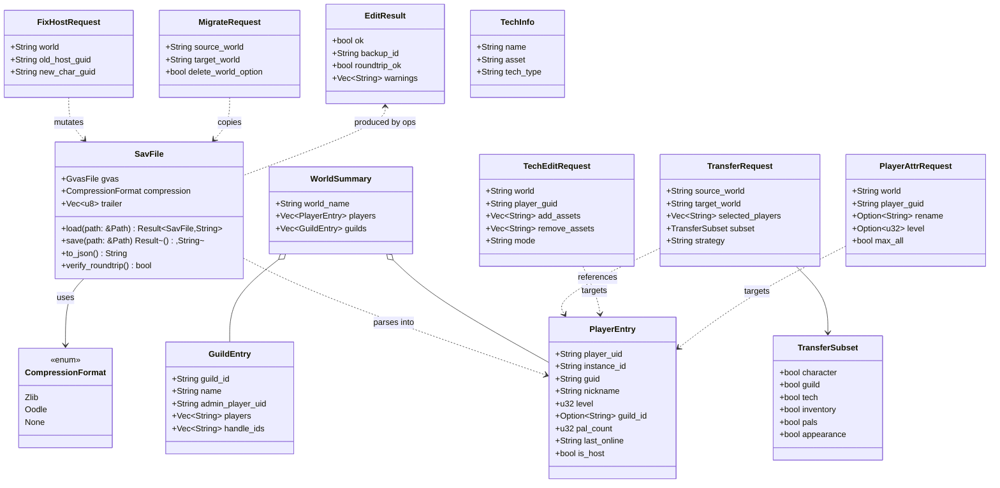
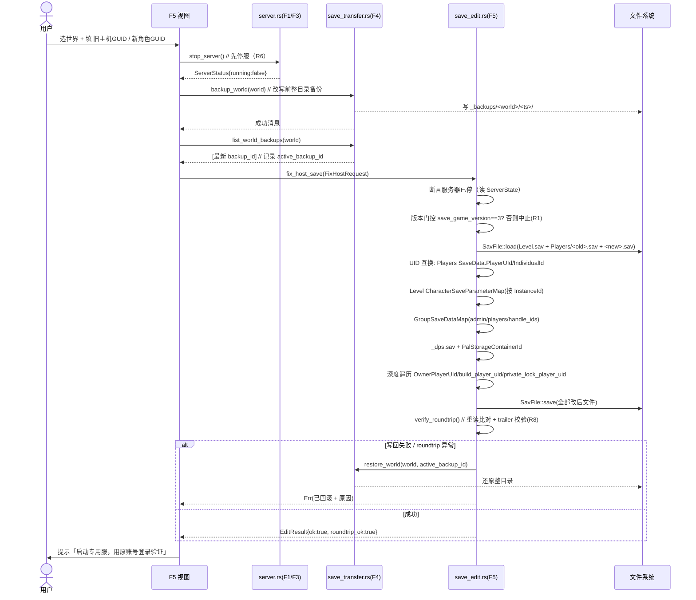
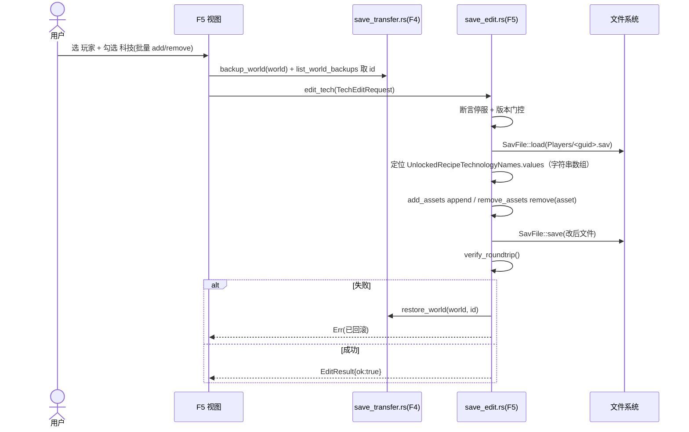
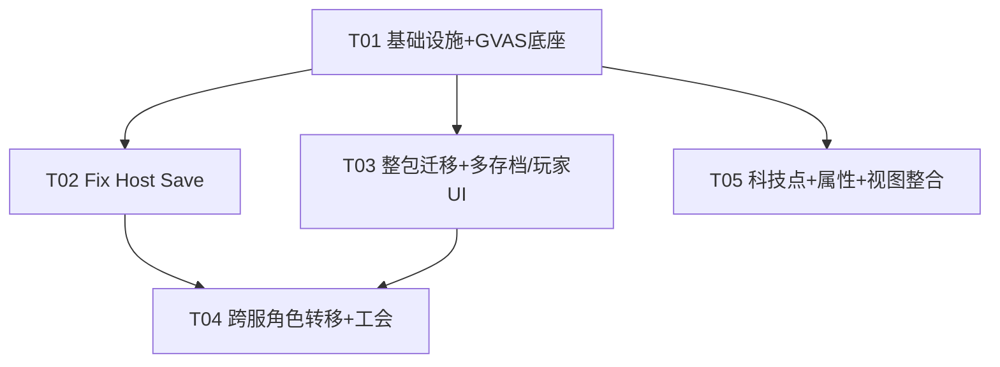

# F5 系统架构设计 + 任务分解

> 架构师：高见远（Gao）· 基于 `docs/f5-local-to-server-design.md`（许清楚调研）+ 老板拍板结果
> 主项目：`F:\study\Palworld-Server-Manager\Palworld\`（Tauri2 + Vue3 + Rust）
> **铁律：本文档仅做设计，不修改主项目任何代码；F5 新建独立模块，不复用/不破坏 F4 写逻辑。**

---

## 0. 范围与定位

F5 在 F4（纯 `std::fs` 拷贝、不解析 .sav）地基之上，新增一条**解析改写**支线：

- **本地存档 → 专用服迁移**（灵魂步骤 = Fix Host Save / UID 互换，让专用服识别迁移角色）。
- **三类数据转移**：主角 / 工会 / 存档（世界数据 + 科技 + 背包 + 帕鲁）。
- **数据修改**：科技点（解锁/移除，单项 + 批量）、玩家基础属性（改名/等级/Max All）。
- **多存档/多玩家选择**：世界级 L1/L2 + 玩家多选 L3 + 转移子集勾选 L4。

与 F4 边界（见第 7 节）：F5 只读复用 F4 的 `discover_worlds` / `backup_world` / `restore_world` / `list_world_backups`，**绝不调用 F4 任何写命令内部的逻辑、绝不修改 F4 文件**。F5 的写逻辑全部落在新增模块，改写前强制走 F4 备份 + 失败自动回滚。

---

## 1. 实现方案与依赖选型

### 1.1 核心技术难点

| 难点 | 说明 | 对应风险 |
|---|---|---|
| GVAS 二进制解析与保真 | `.sav` = 压缩后的 UE 存档（GVAS），需解析 Header/Properties/Trailer 并改后无损写回 | R8 隐性损坏 |
| 双压缩格式 | zlib（`PLZ`/`CNK`）vs Oodle（`PLM`），需 magic 嗅探分别解压 | R7 |
| UID 互换深度遍历 | Fix Host Save 需改写 `Players` + `Level`（Character/Group）+ `_dps` + 全量 `OwnerPlayerUId` 等引用 | R3 |
| GUID/实例 ID 防碰撞 | 迁移帕鲁/角色时 InstanceId 重复导致互相覆盖 | R9 |
| 与 F4 共存 | 不破坏"纯拷贝安全"承诺，命令不混用 | C1/C2 |
| 停服前置 | 运行中替换会被自动保存覆盖 | R6 |
| 单人/联机 → 专用服结构差异 | 专用服外层多 `SaveGames/0/`；`WorldOption.sav` 覆盖 `PalWorldSettings.ini`；`DedicatedServerName` 须匹配目录名 | R5 |
| 版本门控 | `save_game_version != 3` 直接中止 | R1 |

### 1.2 Rust GVAS 解析库选型对比（palworld-uesave-rs vs gvas）

| 维度 | `palworld-uesave-rs`（DKingAlpha，ueave-rs 的 Palworld fork） | `gvas`（localcc，v0.11） |
|---|---|---|
| 定位 | 高层封装：`PalworldGvas::load/save` + 自动压缩识别 + `try_into_unreal` | 通用 GVAS 解析器：`GvasFile{ header, properties: HashableIndexMap }` + `GvasValue` 树 |
| 成熟度/维护 | 社区 fork（~17★），维护不确定；大概率仅 git 发布、非 crates.io 稳定版 | 主流（crates.io #1 uasset 类），0.11 稳定，MIT，持续维护 |
| 压缩支持 | 内置双分支（zlib + Oodle）自动识别 | 内置 **zlib（PLZ/CNK，单/双压缩）**；Oodle（PLM）需外接 `ooz` |
| API 形态 | 高层、开箱即用，但黑盒 | 底层、完全透明，路径式 `GvasValue` 树遍历（适合深度 UID 互换） |
| 保真度控制 | 封装好，但自定义 round-trip/trailer 校验需绕开其封装 | 可精确控制 trailer 与未知字段保留（**R8 最友好**） |
| 许可证 | 视上游（ueave-rs MIT） | MIT |

**推荐结论（满足老板 Q5「Rust 原生」）：以 `gvas` 为解析内核，自封装 `SavFile` 做 magic 嗅探 + 双压缩 + round-trip 校验；`palworld-uesave-rs` 作为可选 I/O 便利层（若团队偏好高层 API 且接受其维护/发布状态）。**

理由：
1. `gvas` 稳定、MIT、crates.io 可锁定版本，规避对未发布 fork 的依赖风险；
2. F5 的灵魂是**深度、路径式的 UID 互换与字段增删**，`gvas` 的 `GvasValue` 树遍历 API 比高层封装更可控；
3. round-trip 保真（R8）是头号风险，透明内核才能做精确 trailer/未知字段保留与比对；
4. Oodle（PLM）仅作"检测到则处理、未支持则优雅拒绝"的扩展点（见 R11），不阻塞 MVP。

### 1.3 压缩格式双分支（magic 嗅探）

`.sav` 文件头形如：`[4B magic][4B LE decompressed_size][压缩流]`；GVAS 明文以 `GVAS`(0x53415647) 开头。

> ⚠️ 精确 magic 字节与 decompressed-size 头布局，实现时以参考项目 `PalworldSaveTools/.../io.py::Compressor.check_sav_format` 校准（记 R7 待校准项）。

```
load(path):
  head = read 4 bytes
  if head ∈ {PLZ, CNK}:  # zlib
      dec = flate2::inflate(read rest)        # 解压得 GVAS 明文
      gvas = GvasFile::read(dec, GameVersion::Palworld)
      return SavFile { gvas, compression: Zlib, trailer }
  if head == PLM:        # Oodle/Kraken
      dec = ooz::decompress(read rest)        # 依赖 ooz（见 R11）
      gvas = GvasFile::read(dec, GameVersion::Palworld)
      return SavFile { gvas, compression: Oodle, trailer }
  else:                  # 已解压 / 明文
      gvas = GvasFile::read(file, GameVersion::Palworld)
      return SavFile { gvas, compression: None, trailer }

save(path):
  bin = gvas.write()                       # 含 trailer 原样写回
  match compression:
      Zlib  => write [PLZ][size][flate2::deflate(bin)]
      Oodle => write [PLM][size][ooz::compress(bin)]
      None  => write bin
```

**MVP 策略**：Steam 版 Palworld `.sav` 绝大多数为 zlib（`PLZ`/`CNK`）。MVP 必须支持 zlib 全链路；对 `PLM`（Oodle）检测到即返回明确错误「该存档为 Oodle 压缩，当前版本暂不支持，请用 Steam 客户端重新保存后再迁移」，避免静默损坏（与 R10 精神一致）。

### 1.4 依赖包列表

`src-tauri/Cargo.toml` 新增（其余既有依赖不变）：

```toml
# ---- F5 新增：GVAS 解析 / .sav 读写 ----
gvas = "0.11"        # 核心 GVAS 解析/序列化（含 Palworld zlib 压缩 + serde JSON 用于 round-trip 比对）
flate2 = "1.0"       # zlib 解压/压缩（PLZ/CNK；gvas 已传递依赖，显式声明以固定版本）
ooz = "0.9"          # Oodle/Kraken 解压/压缩（PLM）⚠️ 许可证 GPL-3.0，见风险 R11
serde_json = "1.0"   # 既有；F5 用于 world.json 解析与 round-trip JSON 比对
```

> `ooz` 确切 crate 名（即 `palworld-save-pal/ooz-rs` 的发布名）实现时核对；若非 crates.io 稳定版则改用 git 依赖。前端（`src/`）**不新增 npm 依赖**，复用既有 `api/tauri`、`useToast`、`AppIcon`、`ConfirmDialog` 体系。

---

## 2. 文件列表及相对路径

### 2.1 新增 Rust 模块（`src-tauri/`）

| 路径 | 作用 |
|---|---|
| `src-tauri/Cargo.toml` | 修改：新增上述依赖 |
| `src-tauri/src/save_edit.rs` | **新增主模块**：`mod save_edit;` 注册到 main.rs；承载 F5 Tauri 命令与编排 |
| `src-tauri/src/save_edit/sav_io.rs` | **新增**：`SavFile` 封装（load/save/magic 嗅探/压缩分支/trailer/round-trip 校验） |
| `src-tauri/src/save_edit/models.rs` | **新增**：领域类型（`PlayerEntry`/`GuildEntry`/`WorldSummary`/各请求/结果/枚举） |
| `src-tauri/src/save_edit/path_util.rs` | **新增**：`safe_name_segment`/`normalize_within` 的**副本**（白名单算法同 F4，但不改 F4） |
| `src-tauri/src/save_edit/fix_host.rs` | **新增**：Fix Host Save UID 互换核心算法 |
| `src-tauri/src/save_edit/transfer.rs` | **新增**：跨服角色转移 + 工会同世界保留 |
| `src-tauri/src/save_edit/tech_edit.rs` | **新增**：科技点编辑 + 玩家基础属性编辑 |
| `src-tauri/src/save_edit/world_copy.rs` | **新增**：整包世界迁移（文件级拷贝 + WorldOption/DedicatedServerName 提示） |
| `src-tauri/resources/world_data.json` | **新增**：vendored `technology[]`（取自参考项目 `world.json`，仅科技列表，用于科技名↔asset 映射） |
| `src-tauri/src/main.rs` | 修改：`mod save_edit;` + `generate_handler!` 注册 F5 命令 |

### 2.2 新增/修改前端（`src/`）

| 路径 | 作用 |
|---|---|
| `src/views/SaveMigrationView.vue` | **新增 F5 主视图**（本地→服务器迁移 + 数据修改；**不复用 F4 写逻辑**） |
| `src/components/save/PlayerPicker.vue` | **新增**：L3 玩家多选（显示名称/等级/公会/帕鲁数/最近在线） |
| `src/components/save/TransferSubsetSelector.vue` | **新增**：L4 转移子集勾选（主角/工会/科技/背包/帕鲁/外观） |
| `src/components/save/TechEditorPanel.vue` | **新增**：科技点批量解锁/移除面板 |
| `src/api/tauri.ts` | 修改：新增 `migration` 命名空间（F5 命令封装） |
| `src/types/tauri.ts` | 修改：新增 F5 类型 + `SaveEditCommand` 联合类型 |
| `src/router/index.ts` | 修改：新增 `/migration` 路由 |
| `src/App.vue` | 修改：主导航新增「存档迁移」入口 |

> 边界：F4 的 `SaveManagementView.vue` 与其 `api.save.*` 命令**完全不动**；F5 走独立的 `SaveMigrationView.vue` + `api.migration.*`。

---

## 3. 数据结构与接口（Mermaid 类图）

> 完整类图另存 `docs/f5-class-diagram.mermaid`。下方为正交表达，二者一致。



### 3.1 Tauri 命令签名（输入/输出 JSON Schema）

所有命令返回 `Result<T, String>`（错误为中文人话）。请求示例 JSON 见下：

| 命令（save_edit.rs） | 输入（JSON） | 输出（JSON） |
|---|---|---|
| `f5_world_summary` | `{ "world_name": "0" }` | `WorldSummary`（players + guilds） |
| `f5_tech_list` | `{}` | `[TechInfo]`（来自 world_data.json） |
| `fix_host_save` | `FixHostRequest` | `EditResult` |
| `migrate_world_to_server` | `MigrateRequest` | `EditResult` |
| `transfer_character` | `TransferRequest` | `EditResult` |
| `edit_tech` | `TechEditRequest` | `EditResult` |
| `edit_player_attr` | `PlayerAttrRequest` | `EditResult` |

关键请求/响应 schema：

```jsonc
// FixHostRequest
{ "world": "0", "old_host_guid": "00000001", "new_char_guid": "2E85FD38..." }
// → EditResult
{ "ok": true, "backup_id": "20260722-143000", "roundtrip_ok": true, "warnings": [] }

// TransferRequest
{
  "source_world": "CoopWorld", "target_world": "0",
  "selected_players": ["7656119xxxxxxxxxx"],
  "subset": { "character": true, "guild": true, "tech": true,
              "inventory": true, "pals": true, "appearance": false },
  "strategy": "overwrite"   // | "new_instance"
}
// MigrateRequest
{ "source_world": "CoopWorld", "target_world": "0", "delete_world_option": true }
// TechEditRequest
{ "world": "0", "player_guid": "2E85FD38...",
  "add_assets": ["StonePile"], "remove_assets": [], "mode": "batch" } // | "single"
// PlayerAttrRequest
{ "world": "0", "player_guid": "2E85FD38...",
  "rename": "新名字", "level": null, "max_all": true }
```

> `player_guid` = `Players/<guid>.sav` 的文件名（去 `.sav`）；`player_uid` = 存档内 `SaveData.PlayerUId`（UID 互换的改写的就是它）。UX 不暴露 UID 术语（老板 Q1）。

---

## 4. 程序调用流程（Mermaid 时序图）

> 完整时序图另存 `docs/f5-sequence-diagram.mermaid`（含三图）。下方为三张核心图。

### 4.1 Fix Host Save 主链路（P0 灵魂步骤）



### 4.2 跨服角色转移 transfer_character（P1）

```mermaid
sequenceDiagram
    actor U as 用户
    participant FE as F5 视图
    participant B as save_transfer.rs(F4)
    participant E as save_edit.rs(F5)
    participant FS as 文件系统
    U->>FE: 选 源/目标世界 + 玩家 + 子集(L4)
    FE->>B: backup_world(目标世界) + list_world_backups 取 id
    FE->>E: transfer_character(TransferRequest)
    E->>E: 断言停服 + 版本门控
    E->>FS: 解析 源 Level.sav + 源 Players/<guid>.sav
    E->>FS: 解析 目标 Level.sav
    E->>E: 按 subset 拷贝 character/tech/inventory/pals
    E->>E: 同世界→保留公会; 跨世界→公会留 P2(仅提示)
    E->>E: GUID/实例ID 防碰撞 bump(≤1000, R9)
    E->>FS: 写回 目标 Level.sav + Players/<newguid>.sav
    E->>E: verify_roundtrip()
    alt 失败
        E->>B: restore_world(目标, id)
        E-->>FE: Err(已回滚)
    else 成功
        E-->>FE: EditResult{ok:true}
    end
```

### 4.3 科技点编辑（P1，老板点名）



---

## 5. 任务列表（有序、依赖、P0/P1/P2）

> 硬约束：≤5 个顶层任务、每任务 ≥3 文件、首任务为基础设施。P2 功能（帕鲁全属性/背包深度/公会管理 UI/基地/地图迷雾/GamePass）**明确超出 MVP**，列入「后续」不拆任务。

### T01 · 项目基础设施 + GVAS 解析底座（P0）
- **Source Files**：`src-tauri/Cargo.toml`、`src-tauri/src/save_edit.rs`（骨架 + `mod` 注册位）、`src-tauri/src/save_edit/sav_io.rs`、`src-tauri/src/save_edit/models.rs`、`src-tauri/src/save_edit/path_util.rs`、`src-tauri/resources/world_data.json`、`src-tauri/src/main.rs`（加 `mod save_edit;`）
- **Dependencies**：无
- **Priority**：P0
- **内容**：引入 `gvas`/`flate2`/`ooz`/`serde_json`；实现 `SavFile`（load/save/magic 嗅探/压缩双分支/trailer/round-trip 校验）；定义领域类型；复制 F4 路径白名单（`path_util.rs`）；vendored `world_data.json`（tech 列表）；`main.rs` 注册空模块；冒烟测试读真实 `.sav` 解压成功。

### T02 · Fix Host Save 核心（UID 互换）（P0）
- **Source Files**：`src-tauri/src/save_edit/fix_host.rs`、`src-tauri/src/save_edit.rs`（`fix_host_save` 命令 + 编排）、`src-tauri/src/save_edit/models.rs`（FixHostRequest/EditResult 完善）
- **Dependencies**：T01
- **Priority**：P0
- **内容**：实现 UID 互换（Players + Level Character/Group + `_dps` + 深度 `OwnerPlayerUId` 等引用）；版本门控 + 停服断言 + `verify_roundtrip`；失败时由调用方走 F4 回滚（见第 7 节契约）。**UX 不暴露 UID 术语**（老板 Q1）。

### T03 · 整包世界迁移 + 多存档/玩家发现 UI（P0）
- **Source Files**：`src-tauri/src/save_edit/world_copy.rs`、`src-tauri/src/save_edit.rs`（`migrate_world_to_server` + `f5_world_summary` 命令）、`src/views/SaveMigrationView.vue`、`src/components/save/PlayerPicker.vue`、`src/router/index.ts`、`src/App.vue`
- **Dependencies**：T01
- **Priority**：P0
- **内容**：文件级整包迁移（兼容 GUID 嵌套），提示处理 `WorldOption.sav` 与 `DedicatedServerName` 一致性（R5）；`f5_world_summary` 解析 Level.sav 出玩家/公会列表（L1–L3）；新增 F5 视图骨架 + 玩家多选组件 + 路由/导航。

### T04 · 跨服角色转移 + 工会同世界保留（P1）
- **Source Files**：`src-tauri/src/save_edit/transfer.rs`、`src-tauri/src/save_edit.rs`（`transfer_character` 命令）、`src/components/save/TransferSubsetSelector.vue`
- **Dependencies**：T01、T02、T03
- **Priority**：P1
- **内容**：按 L4 子集拷贝 character/tech/inventory/pals；同世界自动保留工会、跨世界合并留 P2 仅提示（Q3）；GUID/实例 ID 防碰撞 bump（R9）；子集勾选 UI。

### T05 · 数据修改（科技点 + 玩家属性）+ F5 视图整合（P1）
- **Source Files**：`src-tauri/src/save_edit/tech_edit.rs`、`src-tauri/src/save_edit.rs`（`edit_tech`/`edit_player_attr`/`f5_tech_list` 命令）、`src/components/save/TechEditorPanel.vue`、`src/api/tauri.ts`、`src/types/tauri.ts`
- **Dependencies**：T01、T03
- **Priority**：P1
- **内容**：科技点解锁/移除（单项+批量，纯列表 append/remove）；玩家改名/等级/Max All；`f5_tech_list` 由 `world_data.json` 提供科技名↔asset；科技编辑面板 + `api.migration.*` + F5 类型整合进主视图。

### 5.1 任务依赖图



> **任务总数：5（P0=3：T01/T02/T03；P1=2：T04/T05）。P2 功能不拆任务，列「后续」。**

---

## 6. 共享知识（跨文件约定）

1. **路径安全**：F5 自带 `save_edit/path_util.rs`，**复制** F4 的 `safe_name_segment`/`normalize_within` 白名单算法（字母/数字/`_`/`-`/`.`），不修改 F4 文件。所有 world/player/guid 输入须经此校验，杜绝穿越。
2. **停服前置**：改写类命令前置条件 = 服务器已停止。前端在调 F5 前先 `api.server.stop()`；F5 命令内部再读 `ServerState` 做运行态断言（复用 `server::is_server_process_running`）防御。
3. **备份 + 回滚契约**：任何 F5 改写前**必须**先 `backup_world` → `list_world_backups` 取最新 `backup_id` 记为 `active_backup_id`；失败即 `restore_world(world, active_backup_id)`（详见第 7 节）。
4. **round-trip 校验**：写回后重读文件并比对关键字段；trailer 应全 0，若非空 → `warnings` 追加「可能未完全解析」，R8 防御。
5. **GUID/实例 ID 防碰撞**：迁移生成新条目时 `bump_guid_str`（≤1000 次重试，检测 `used_ids`），避免 InstanceId 重复（R9）。
6. **版本门控**：`save_game_version != 3` 立即中止并提示升级工具（R1）。
7. **压缩分支**：magic 嗅探（§1.3）；MVP 必须支持 zlib，检测 `PLM` 优雅拒绝（R7/R11）。
8. **专用服结构差异**：迁移到专用服时校验 `SaveGames/0/` 外层与 `DedicatedServerName` 一致性；提示删除 `WorldOption.sav`（R5）。
9. **UX 用语**：统称「迁移角色 / 工会 / 世界数据」，不暴露 UID/PlayerUId/InstanceId 等术语（老板 Q1）。
10. **错误风格**：统一 `Result<T, String>`，中文人话；warning 进 `EditResult.warnings` 不阻断成功。

---

## 7. 与 F4 的接口契约（F5 如何调用 F4，不修改 F4）

F5 **只读调用**以下 F4 命令（签名取自 `save_transfer.rs`，均 `pub async fn`，返回 `Result<_, String>`）：

| F4 命令 | 签名 | F5 用法 |
|---|---|---|
| `discover_worlds` | `() -> Result<DiscoverResult, String>` | 填充 L1（源世界）/L2（目标世界）下拉；读 `worlds[].name` + `.path`。**不调用 F4 写命令。** |
| `backup_world` | `(world_name: String, dest: Option<String>) -> Result<String, String>` | 改写前整目录备份。F5 传 `dest=None` 让 F4 落 `<save_root>/_backups/<world>/<ts>/`。 |
| `list_world_backups` | `(world_name: String) -> Result<Vec<WorldBackupInfo>, String>` | 备份后立即调用，取 `backups[0].backup_id`（已倒序）作为 `active_backup_id`。 |
| `restore_world` | `(world_name: String, backup_id: String) -> Result<String, String>` | 失败时回滚：`restore_world(world, active_backup_id)`。 |

**回滚标准时序（函数级约定）**：
```
let _ = backup_world(world, None).await?;
let backups = list_world_backups(world).await?;
let active_backup_id = backups.first().map(|b| b.backup_id.clone());
// ... 改写 ...
if failed {
    if let Some(id) = active_backup_id {
        restore_world(world, id).await?;   // 原子回滚
    }
    return Err(...);
}
```

> `find_world_data_dir` / `safe_name_segment` / `normalize_within` 在 F4 中为私有函数，F5 **不跨模块调用**，改为在 `save_edit/path_util.rs` 复制同算法（§6.1）。`discover_worlds` 返回的 `path` 可直接喂给 F5 的 `SavFile::load`，二者对世界数据层（扁平/GUID 嵌套）理解一致。

---

## 8. 待明确事项（UNCLEAR）

1. **`palworld-uesave-rs` 确切发布渠道**：GitHub 实为 `DKingAlpha/palworld-uesave-rs`（fork），crates.io 稳定性待确认。已据老板 Q5「Rust 原生」在 `gvas` 与 wrapper 间二选一，**推荐 `gvas` 直连**（§1.2）。
2. **Oodle 依赖许可证（R11）**：`ooz`（palworld-save-pal/ooz-rs）为 **GPL-3.0**；本项目 MIT，静态链接存在传染风险。需老板/法务确认；否则 MVP 仅 zlib + `PLM` 优雅拒绝。
3. **精确 magic 字节 / decompressed-size 头**：实现时以 `PalworldSaveTools/.../io.py::Compressor.check_sav_format` 校准（R7）。
4. **`_dps.sav` 字段路径与 `PalStorageContainerId` 互换细节**：以 `fix_host_save.py` 校准（R3）。
5. **`world_data.json` vendoring 范围**：仅 `technology[]` 即可（约数百项），无需 `structures`/`pals` 全量；用 `include_str!("../resources/world_data.json")` 编译期嵌入。
6. **`DedicatedServerName` 一致性读取方式**：读 `PalWorldSettings.ini` 或 `WorldOption.sav` 字段，实现时定（R5）。
7. **跨世界工会合并（P2）**：老板仅确认「同世界保留=P0，跨世界合并=P2」，本设计 P2 仅留接口与提示，不实现。

---

## 附录 · 风险映射（R1–R11）

| 风险 | F5 缓解（落点） |
|---|---|
| R1 版本变化 | 版本门控 `save_game_version==3`（T02/T04/T05 通用） |
| R2 GUID 嵌套 | 复用 `find_world_data_dir` 同款逻辑（`sav_io` 解析 Level.sav 所在层） |
| R3 跨账号身份 | `fix_host.rs` UID 互换；UI 引导「先建 ≥Lv2 角色」 |
| R4 工会归属 | 同世界保留（T04）；跨世界合并 P2 仅提示 |
| R5 结构差异 | `world_copy.rs` 提示 `WorldOption.sav`/`DedicatedServerName`（T03） |
| R6 运行中替换 | 停服前置（§6.2，复用 F1/F3） |
| R7 双压缩 | magic 嗅探（§1.3）；PLM 优雅拒绝 |
| R8 round-trip | `verify_roundtrip` + trailer 校验（§6.4，sav_io） |
| R9 GUID 碰撞 | `bump_guid_str` ≤1000（§6.5，transfer） |
| R10 GamePass 加密 | MVP 排除；UI 检测 `.wgs` 提示 |
| **R11 Oodle 许可证** | `ooz` GPL-3.0 风险；MVP 可仅 zlib（§8.2） |
