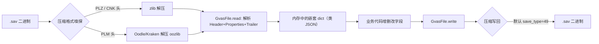
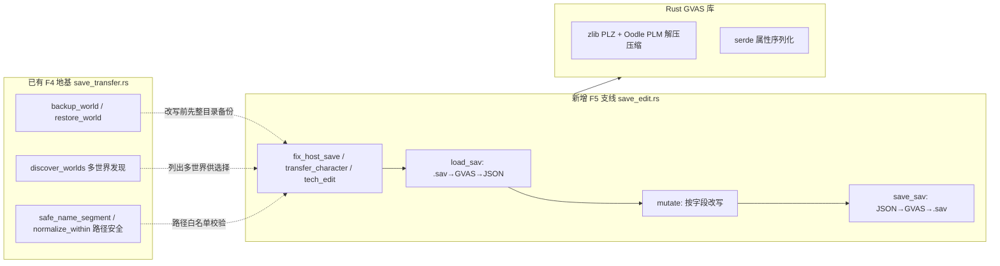
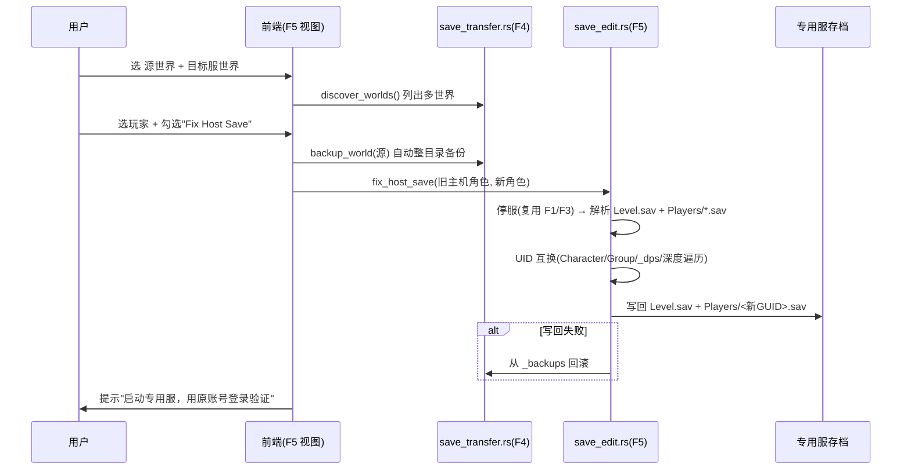

# F5 设计文档：本地存档 → 服务器存档（主角/工会/存档转移 + 数据修改）

> 调研 & 设计产出 · 产品经理：许清楚（Xu）
> 阅读依据：`reference-projects/PalworldSaveTools-main`（已存在并深度逆向）、主项目 `src-tauri/src/save_transfer.rs`（F4）、`docs/save-transfer-research.md`、同行 `palworld-save-pal`（Tauri2+Rust 同架构竞品）、社区迁移指南（GhostCap / DoomHosting / xNul palworld-host-save-fix）。
> **范围声明：本文档仅做调研与设计，未修改主项目任何代码、未触碰 F4 文件。**

---

## 一、需求目标与背景（F5 是什么，与 F4 的关系）

### 1.1 老板原话拆解
> (1) 将本地存档转化为服务器存档，需经三类数据转移：**主角转移 / 工会转移 / 存档转移**（参考 PalworldSaveTools 的成功案例）。
> (2) 加一些数据修改功能，如**科技点**等，合理融入本项目。
> (3) 存档可能有多个，需添加**用户选择**。

### 1.2 F5 与 F4 的定位关系

| 维度 | F4（已完成） | F5（本设计） |
|---|---|---|
| 核心能力 | 整包世界备份/恢复、角色文件导出/导入 | 本地档→专用服迁移、跨服角色/公会/世界数据转移、数据改写 |
| 对 .sav 的处理 | **纯 `std::fs` 文件拷贝，不解析、不改写内容**（版本无关、绝对安全） | **必须解析 + 改写 .sav 内部结构**（GVAS 属性层） |
| 工会 | 明确不处理（`import_character` 注释写明"公会归属未迁移，属预期"） | 需处理（同世界保留 / 跨世界合并） |
| SteamID | 保持不变（假设同账号同 SteamID） | 需做 UID 互换（host-save-fix）以适配"本地主机角色 → 专用服" |
| 多存档 | `discover_worlds` 已能列出多个世界 | 在 F4 之上扩展"选源世界 + 选目标世界 + 选玩家" |

**结论**：F5 不是推翻 F4，而是**在 F4 的"发现/备份/路径安全"地基之上，新增一条"解析改写"的能力支线**。F4 的"纯拷贝"作为安全兜底保留；F5 的"解析改写"作为高级能力新增，二者命令不混用（见第三章）。

---

## 二、参考项目 PalworldSaveTools 分析

> 项目路径：`F:\study\Palworld-Server-Manager\reference-projects\PalworldSaveTools-main\PalworldSaveTools-main` ✅ 已确认存在，技术栈 **Python + PySide6 + `palsav` 解析库**。

### 2.1 其 .sav 解析 / 改写机制（F5 的核心差异点）

Palworld 的 `.sav` = **压缩后的 GVAS（Unreal Engine 存档）**。PalworldSaveTools 的处理管线（`palsav` 库）：

**关键结构（来自 `gvas.py` / `core.py` / `io.py`）：**
- **Header**：magic = `0x53415647`（ASCII "GVAS"，小端存储），`save_game_version` 必须为 **3**，含引擎版本、`custom_versions`、`save_game_class_name`。
- **Properties**：UE 属性序列化序列，name-value 对，以 "None" 字符串结尾（属性区终止符）。
- **Trailer**：尾部 4 字节（完全解析应为 `0x00000000`）；未解析干净则告警"可能未完全解析"——这是**编辑保真度的命门**。
- **Round-trip**：`load_sav(path)` = 读字节 → 解压 → `GvasFile.read`；`save_sav(gvas, path, save_type=49)` = `write` → 压缩 → 写字节（>100MB 大文件走 mmap）。

**两大文件承载的数据（决定三类转移）：**

| 文件 | 关键字段（properties 路径） | 对应"三类转移" |
|---|---|---|
| `Level.sav` | `worldSaveData.value.CharacterSaveParameterMap`（角色条目，key=PlayerUId+InstanceId，value=SaveParameter{IsPlayer,Level,NickName,…}） | 主角 / 存档 |
| `Level.sav` | `worldSaveData.value.GroupSaveDataMap`（公会，EPalGroupType::Guild，含 `players[]`、`admin_player_uid`、`individual_character_handle_ids[]`） | 工会 |
| `Level.sav` | `worldSaveData.value.MapObjectSaveData`（建筑/箱子/对象）、`CharacterContainerSaveData`（帕鲁箱）、`GameTimeSaveData.RealDateTimeTicks` | 存档（世界） |
| `Players/<guid>.sav` | `SaveData.value.{PlayerUId, IndividualId, PalStorageContainerId, InventoryInfo, UnlockedRecipeTechnologyNames, …}` | 主角 / 科技点 |

### 2.2 三类转移的实现原理

#### (a) 主角转移 — `character_transfer.py :: transfer_character_only`
把源玩家条目以**目标 UID 重新挂接**进目标世界的 `CharacterSaveParameterMap` 与 `CharacterContainerSaveData`；源数据来自 `Level.sav` 的 `CharacterSaveParameterMap` + 该玩家的 `Players/<guid>.sav`（含背包/帕鲁容器 ID）。
- 配套步骤（`_TRANSFER_STEPS` 全集）：`character / tech_data / inventory / guild / pals / dynamics / timestamps`——即"主角"实际是 7 个子步骤的组合。

#### (b) 工会转移 — `transfer_guild`
修改目标世界 `GroupSaveDataMap`：把玩家加入 `players[]`、写 `individual_character_handle_ids[]`、必要时改 `admin_player_uid`。
- ⚠️ **重要事实**：PalworldSaveTools 的"Character Transfer（跨服）"**刻意不包含公会**（官方 README 明确："Guilds do not transfer… this is intentional"）。工会只在**同一存档内**（Fix Host Save）才保留。这意味着老板说的"工会转移"在跨服场景下技术成本陡增。

#### (c) 存档转移 — 世界数据 + tech/inventory/pals
- `transfer_tech_and_data`：复制科技解锁（见 2.4）。
- `transfer_inventory_only` / `migrate_inventory_via_player_inventory`：按 `ItemContainerSaveData` 容器 ID 迁移背包/关键物品/装备。
- `transfer_pals_only` / `migrate_pal_via_api`：为新帕鲁生成骨架、重算 `OwnerPlayerUId`/`SlotId` 容器、追加进 `CharacterSaveParameterMap`+`CharacterContainerSaveData`+公会 `handle_ids`，并对 GUID 做**防碰撞 bump**（`bump_guid_str`，最多 1000 次重试避免重复实例 ID）。
- `gather_and_update_dynamic_containers` / `sync_player_timestamps`：收尾修正。

#### (d) 本地→服务器 的"灵魂一步"：Fix Host Save — `fix_host_save.py`
这正是老板说的"本地存档转化为服务器存档"的**标准解法**（README "Host → Server Transfer" 章节）：
1. 拷贝本地 `Level.sav` + `Players/` 到专用服目录；
2. 启服 → 用同一账号**建新角色** → 等自动存档（≥2 分钟）→ 停服；
3. 用 **Fix Host Save** 把"旧主角（host 的 `00000001.sav`）"与"新角色（专用服 GUID）"的 **UID 互换**：
   - 改写 `Players/<guid>.sav` 的 `SaveData.PlayerUId` / `IndividualId.PlayerUId`；
   - 改写 `Level.sav` 的 `CharacterSaveParameterMap`（按 InstanceId 匹配）、`GroupSaveDataMap`（公会引用、admin、players[].player_uid）；
   - 改写 `_dps.sav`（帕鲁仓库）、`PalStorageContainerId`；
   - **深度遍历** `OwnerPlayerUId` / `build_player_uid` / `private_lock_player_uid` 全量互换。
4. 写回并启服，原角色进度/背包/帕鲁/公会 intact。
- 前置约束：**新旧两个角色都必须 ≥ Level 2**（否则 Fix Host Save 拒绝）；必须**先停服**。

**SteamID ↔ PlayerUId 换算**：`convertids.py` 提供 `steamIdToPlayerUid(steam_id)` 与 UUID 互转（仅展示/计算用，真正改写落在 fix_host_save）。社区等价工具：`xNul/palworld-host-save-fix`、`wonjoonSeol-WS/Palworld-fix-uuid`。

### 2.3 同行（非 PalworldSaveTools）数据修改能力速览

| 项目 | 技术栈 | 与本项目架构相似度 | 数据修改能力亮点 |
|---|---|---|---|
| **palworld-save-pal**（oMaN-Rod） | **Rust workspace + Tauri2 + Vite**（Web/桌面/Docker） | ⭐⭐⭐⭐⭐ 几乎同构 | Player Transfer（可选 character/inventory/pals/technology/appearance，覆盖/新建）、**Player UID Swap**、科技点/Ancient 科技点、**SteamID 转换**、Guild 改名/领袖/等级/实验室、**帕鲁全属性编辑**、背包、基地、地图迷雾、SAV↔JSON、GamePass↔Steam、**直接管理专用服** |
| zaigie/palworld-server-tool | Go + Python `sav_cli` | ⭐⭐ | 仅文件级备份；`sav_cli` 只读解析展示，无改写 |
| amantu-qbit/palworld-server-manager | **Rust + Tauri** | ⭐⭐⭐⭐ | Rust 直接 GVAS 解析+编辑（定位→修补→重打包，保留未改字节），含角色/公会编辑 |
| PalworldCharacterTransfer | Python GUI | ⭐⭐ | 跨服角色转移，提供 "Keep Old Guild ID" 选项 |

> **结论**：`palworld-save-pal` 是本项目最该对标的竞品——**同样 Rust+Tauri2+Vite**，且已把 F5 想要的"转移 + 科技点 + 公会 + UID 互换"全部实现为可参考的产品形态。

### 2.4 数据修改功能清单（含科技点，可融入项）

源自 PalworldSaveTools + palworld-save-pal 的功能并集：

| 类别 | 具体功能 | 存储位置（改写点） | 融入本项目难度 |
|---|---|---|---|
| **科技点** ⭐老板点名 | 解锁/移除单项科技、批量解锁、Ancient 科技点 | `Players/<id>.sav` → `SaveData.value.UnlockedRecipeTechnologyNames.value.values`（字符串数组，追加/删除 asset 名即可） | **低**（纯列表增删） |
| 玩家属性 | 改名、等级、HP/耐力/攻/防/工作速度/负重、Max All | `Players/<id>.sav` SaveParameter | 中 |
| 帕鲁编辑 | 等级/_rank/魂/IV/技能/被动/工作适应/幸运/BOSS 旗标、导入导出、修非法帕鲁 | `Level.sav` CharacterSaveParameterMap + `Players` 帕鲁箱 | **高** |
| 公会管理 | 改名、换领袖、设等级、解锁实验室、跨公会移人、删空公会 | `Level.sav` GroupSaveDataMap | 中 |
| 营地/基地 | 查看、导出/导入蓝图、克隆到其他公会、位移、调半径、删基地 | `Level.sav` MapObjectSaveData | 高 |
| 背包/物品 | 编辑物品/装备数量、解锁全快速旅行点、基地容器 | `Level.sav` ItemContainerSaveData + `Players` InventoryInfo | 中 |
| 地图 | 解锁迷雾、快速旅行点 | `LocalData.sav` / `Level.sav` | 低-中 |
| 工具类 | SAV↔JSON、GamePass↔Steam、SteamID 换算、UID Swap、槽位注入、地图还原 | 多文件 | 视项 |

**科技点的实操写法（来自 `player_technology_dialog.py`）**：科技名→asset 映射来自 `resources/game_data/world.json` 的 `technology[]`；对玩家文件做 `sav_to_gvasfile` → 递归找到 `UnlockedRecipeTechnologyNames` → `values.append(asset)` / `remove(asset)` → `gvasfile_to_sav` 写回。**这是 F5 数据修改最易落地、ROI 最高的入口。**

---

## 三、路线差异：F4 纯拷贝 vs F5 解析改写，演进建议

**演进建议（铁律：不破坏 F4 的"安全拷贝"承诺）：**
1. **保留 F4 命令不动**：`discover_worlds` / `backup_world` / `restore_world` / `export/import_character` 作为"安全路径"。
2. **新增独立模块 `src-tauri/src/save_edit.rs`**（或 `save_migrate.rs`），专门承载"解析改写"，与 `save_transfer.rs` 并存、不互相调用写逻辑。
3. **所有改写类命令强制"先调 F4 的整目录备份 → 再改写 → 失败回滚"**，复用 `backup_world` 的 `_backups/` 机制。
4. **解析库选型：Rust 原生**（见 Q5），不引入 Python 运行时，保持单二进制、与 Tauri2 同架构。

---

## 四、多存档选择的 UX / 技术方案（老板明确要求）

### 4.1 现状
F4 的 `discover_worlds` 已能列出 `SaveGames/` 下**所有含 `Level.sav` 的世界**（兼容扁平 `<World>/` 与 GUID 嵌套 `<World>/<GUID>/`）。**"多个存档"的"世界级"选择 F4 已具备**。

### 4.2 F5 需补足的"选择层级"

| 层级 | 选择对象 | 数据来源 | 前端控件 |
|---|---|---|---|
| L1 源世界 | 哪个本地/联机存档 | `discover_worlds`（复用） | 下拉/卡片 |
| L2 目标世界 | 哪个专用服世界（或"新建"） | `discover_worlds`（复用） | 下拉 + "新建世界" |
| L3 玩家 | 源世界中的哪些玩家（可多选） | 解析 `Level.sav` 的 `GroupSaveDataMap.players[]` + `CharacterSaveParameterMap`（按 IsPlayer） | 可勾选列表（显示 名称/等级/公会/帕鲁数/最近在线） |
| L4 转移子集 | 勾选 主角/工会/科技/背包/帕鲁/外观 | `_TRANSFER_STEPS` 风格复选 | 多选 Checkbox |
| L5 覆盖策略 | 覆盖目标同名玩家 / 生成新实例 | 业务参数 | 单选 |

### 4.3 技术方案要点
- **沿用 F4 的 `find_world_data_dir`**：自动定位扁平或 GUID 嵌套的 `Level.sav`，避免"找不到世界数据层"。
- **玩家列表解析**：解析 `Level.sav` 后缓存 `worldSaveData.GroupSaveDataMap` + `CharacterSaveParameterMap`，与 PalworldSaveTools 的 `_build_player_list_from_level` 同口径（过滤 `EPalGroupType::Guild`、取 `players[].player_uid/player_name`、算等级/帕鲁数/最近在线）。
- **安全**：玩家 GUID 仍走 F4 的 `safe_name_segment` 白名单；目标路径走 `normalize_within` 防穿越。

---

## 五、数据修改功能设计（科技点等，融入建议清单与优先级）

> 原则：**先"增删类"（低风险、纯字段操作），后"重构类"（帕鲁/基地，需生成骨架、GUID 防碰撞）**。

| 优先级 | 功能 | 改写点 | 说明 |
|---|---|---|---|
| **P1** | **科技点 解锁/移除（单项+批量）** | `Players/<id>.sav` → `UnlockedRecipeTechnologyNames.values` | 老板点名项；纯列表 append/remove；科技名表来自 `world.json` 的 `technology[]` |
| P1 | 玩家改名 / 等级 / Max All 属性 | `Players/<id>.sav` SaveParameter | 字段直写，风险可控 |
| P1 | 解锁全快速旅行 / 收集全供奉石 | `Level.sav` / 玩家字段 | 常见"爽服"需求 |
| **P2** | 背包/物品编辑（数量、增删、装备槽） | `Level.sav` ItemContainerSaveData + `Players` InventoryInfo | 需按容器 ID 定位 |
| P2 | 公会管理（改名/领袖/等级/实验室/跨公会移人） | `Level.sav` GroupSaveDataMap | 与"工会转移"复用同一改写逻辑 |
| P2 | 帕鲁全属性编辑（等级/魂/IV/技能/被动/工作适应/幸运） | `Level.sav` CharacterSaveParameterMap + 帕鲁箱 | 高复杂度，需骨架生成+GUID 防碰撞 |
| P2 | 基地 导出/导入/克隆/位移 | `Level.sav` MapObjectSaveData | 高复杂度 |
| P2 | 地图迷雾解锁 | `LocalData.sav` | 中 |
| P3 | GamePass(.wgs) ↔ Steam 转换 | 多文件 + 解密 | 加密格式，MVP 排除 |
| P3 | 槽位注入（扩大帕鲁箱） | `Level.sav` | 兼容性敏感 |

**推荐 MVP 数据修改 = 科技点（P1 首选）+ 玩家基础属性（P1）**，与 F5 的"转移"共享同一套 `save_edit.rs` 解析底座。

---

## 六、技术风险

| ID | 风险 | 影响 | 缓解（参考 PalworldSaveTools 做法） |
|---|---|---|---|
| **R1** | **.sav 格式随游戏版本变化**，GVAS 结构/属性名变动导致解析失败 | 改写直接报错或静默损坏 | 改写前**强制整目录备份**（复用 F4）；写回后做 **round-trip 校验**；对 GVAS `save_game_version != 3` 或 trailer 非空时告警并中止；版本门控（工具版本随 Palworld 更新） |
| **R2** | **GUID 嵌套布局** `SaveGames/<World>/<GUID>/Level.sav` | 找不到世界数据层 | 复用 F4 `find_world_data_dir`（扁平/GUID 双兼容） |
| **R3** | **跨账号身份**：本地主机角色是 `00000001.sav`，专用服用随机 GUID；需先建新角色 + Fix Host Save | 不处理则玩家登录被强制新建角色、旧数据"消失" | 实现 `fix_host_save`（UID 互换）；UI 引导"先建 ≥Lv2 角色再迁移"；校验源/目标 `.sav` 均存在 |
| **R4** | **公会归属**：跨世界 Character Transfer **刻意不含公会**；仅同世界拷贝才保留 | 跨服迁移丢失公会 | P0 仅做"同世界保留"；跨世界合并公会列为 P2；UI 明示 |
| **R5** | **单人/联机档 → 专用服结构差异**：专用服在外层多一层 `SaveGames/0/`；`WorldOption.sav` 会覆盖 `PalWorldSettings.ini`；`DedicatedServerName` 须匹配文件夹名 | 加载成空世界 / 服设被旧世界覆盖 | 迁移时**提示删除 `WorldOption.sav`**；校验 `DedicatedServerName` 与目录名一致 |
| **R6** | **服务器运行中替换被自动保存覆盖** | 迁移无效/回滚 | 改写/恢复前**强制停服**（复用 F1/F3 启停逻辑），失败回滚 |
| **R7** | **压缩格式双分支**（zlib `PLZ/CNK` vs Oodle `PLM`） | 用错解压器→解析失败 | 解析库按 magic 嗅探（参考 `Compressor.check_sav_format`）；Rust 侧 `palworld-uesave-rs` 同样双支持 |
| **R8** | **Round-trip 保真度**：serde 序列化可能丢弃未知字段/字节 | 存档"看起来正常但隐性损坏" | 仅改动已知路径、保留 trailer；写回后对比关键字段；先小范围试点 |
| **R9** | **GUID/实例 ID 碰撞**：迁移帕鲁/角色时 InstanceId 重复 | 帕鲁/角色互相覆盖 | 参考 `bump_guid_str` 防碰撞（最多 1000 次重试，检测 `used_ids`） |
| **R10** | **Xbox/GamePass 加密 `.wgs`** 无法迁入 Steam 服 | 数据不可读 | MVP 明确排除；UI 检测并提示 |

---

## 七、建议的 MVP 范围（P0/P1/P2）

### P0（MVP 必做 — "本地→服务器"主链路 + 地基）
1. **复用 F4**：`discover_worlds`（多世界发现）、`backup_world`（改写前自动整目录备份）、`safe_name_segment`/`normalize_within`（路径安全）。
2. **本地→专用服 整包迁移（文件级）**：拷贝 `Level.sav` + `Players/` 到目标服目录（兼容 GUID 嵌套），停服后操作，提示处理 `WorldOption.sav` 与 `DedicatedServerName`。
3. **Fix Host Save（UID 互换，Rust 实现）**：旧主机角色 ↔ 新角色 UID 互换（覆盖 `Players/<guid>.sav` + `Level.sav` 的 Character/Group 引用 + `_dps.sav` + 深度 `OwnerPlayerUId` 遍历）。**这是"本地存档转化为服务器存档"的灵魂步骤。**
4. **多存档/多玩家选择 UI**（第四章 L1–L3）。

### P1（MVP 增强 — 三类转移 + 数据修改）
1. **跨服角色转移** `transfer_character`：主角 + 科技 + 背包 + 帕鲁（`_TRANSFER_STEPS` 可选子集）。
2. **科技点编辑**（老板点名）：解锁/移除单项 + 批量（P1 数据修改首选）。
3. **玩家基础属性**：改名/等级/Max All。
4. **工会保留/同世界处理**（同世界自动保留；跨世界合并留接口）。

### P2（后续迭代）
- 帕鲁全属性编辑、背包深度编辑、公会管理 UI、基地导出/导入、地图迷雾解锁、GamePass 转换、槽位注入。

---

## 八、待老板拍板的二次确认点（Q1–Qn）

> 以下每点含**推荐选项**（★），请拍板后我再细化 PRD/任务拆分。

- **Q1「本地→服务器」的精确含义**：是 (a) 联机/单机存档 → 专用服（需 host-fix UID 互换），还是 (b) 仅跨专用服整包世界复制？★**推荐 (a)+(b) 都做，(a) 的 host-fix 是 P0 核心**。
- **Q2「三类转移」定义对齐**：老板的"主角/工会/存档"与实现层（CharacterSaveParameterMap / GroupSaveDataMap / 世界 MapObjectSaveData+tech+inventory+pals）是否一致？尤其"**存档转移**"指"整个世界数据（建筑/帕鲁）"还是"仅整包拷贝"？★**推荐：存档转移 = 世界数据 + 科技/背包/帕鲁；整包拷贝归 P0 文件级**。
- **Q3 工会转移范围**：跨世界合并（复杂、PST 刻意不做）还是同世界保留（自动）？★**推荐：同世界保留=P0；跨世界合并=P2**。
- **Q4 SteamID 改写/跨账号**：仅同账号（文件重命名级）还是完整 UID 重映射（host-fix）？★**推荐：实现 host-fix（本地→服务器必需）；不同 Steam 账号跨迁=MVP 排除**。
- **Q5 实现语言/依赖（关键架构决策）**：Rust 原生（`palworld-uesave-rs` 或 `gvas` crate，单二进制、同 Tauri2 架构）vs 内嵌 Python（直接复用 PalworldSaveTools 的 `palsav`，但引入 Python 运行时）？★**推荐 Rust 原生**（主项目已 Rust+Tauri2，且竞品 `palworld-save-pal` 已验证此路线可行）。
- **Q6 MVP 数据修改范围**：仅科技点，还是连同玩家属性/背包/帕鲁？★**推荐：科技点 + 玩家基础属性（P1）；帕鲁/背包编辑留 P2**。
- **Q7 多存档选择粒度**：仅世界级（L1/L2），还是也要玩家级多选（L3）与转移子集勾选（L4）？★**推荐：MVP 做 世界级 + 玩家级多选 + 子集勾选（对齐 PST 体验）**。
- **Q8 GamePass/Xbox 源支持**：加密 `.wgs` 无法迁入 Steam 服。★**推荐 MVP 排除**，UI 检测并提示。
- **Q9 F4 与 F5 命令共存策略**：确认"F4 纯拷贝保留为安全路径，F5 新增 `save_edit.rs` 独立模块、不混用写逻辑、改写前强制调 F4 备份"？★**推荐：按本文第三章并存方案**。
- **Q10 备份/回滚策略**：F5 改写是否复用 F4 的 `_backups/<world>/<时间戳>/` 机制？失败是否自动回滚？★**推荐：复用 + 自动回滚**。

---

### 附录 A：F5「本地→服务器」主链路时序（P0）

### 附录 B：与 F4 的冲突/前置重构标注
- **冲突点 C1**：F4 `import_character` 注释承诺"SteamID 不变、不处理公会"；F5 的 host-fix/character-transfer **必然改写 UID 并处理公会**。→ 不修改 F4，F5 新建命令，避免破坏 F4 既有语义与调用方。
- **冲突点 C2**：F4 的"纯拷贝、版本无关、绝对安全"定位，与 F5"解析改写、版本敏感"本质对立。→ 用"两条命令、改写前必备份"隔离风险（见 Q9/第三章）。
- **前置复用（非冲突，是利好）**：F4 的 `discover_worlds`/`backup_world`/`find_world_data_dir`/`safe_name_segment`/`normalize_within` **全部可直接被 F5 复用**，无需重写。
