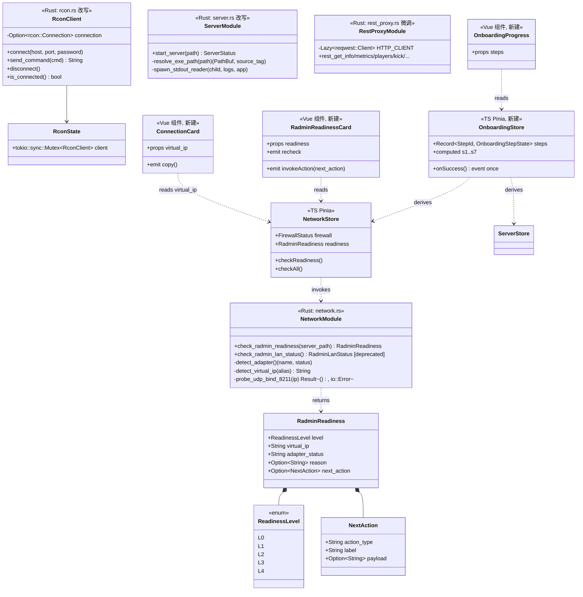
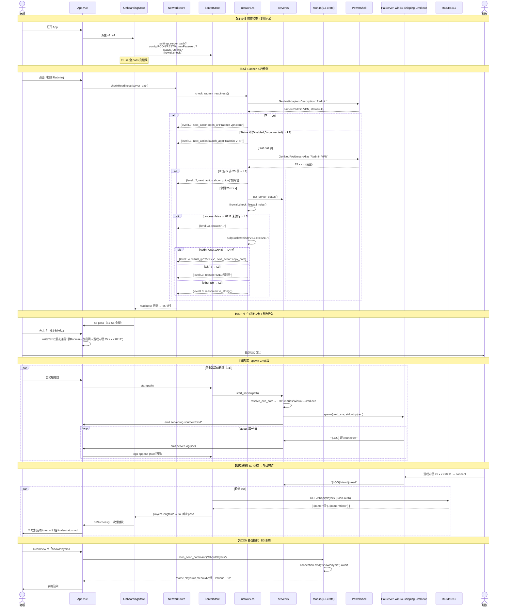
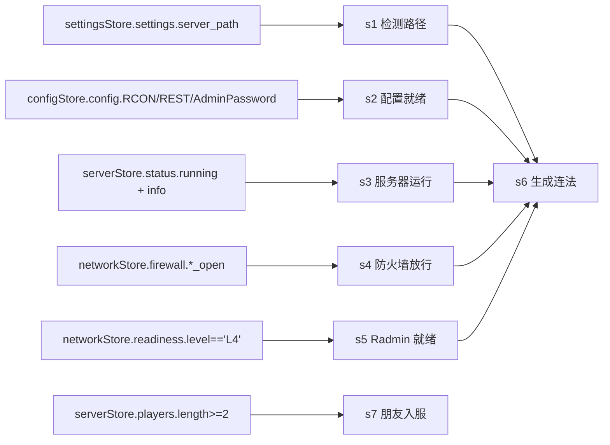
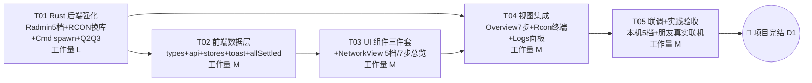

# 帕鲁服务器管理器 · 收官增量系统设计（Finale · 实践收官）

> **范围**：把 R2 已交付的 T01-T05 真数据版推进到"能真拉朋友进服"的收官形态。基于 4 条 ★ 决策（D1-D4）与许清楚的 finale-prd.md。
> **纪律**：增量最小变更；不推翻 R2 T01-T05；严格遵守 D1-D4；不写代码实现，只出方案 + 接口 + 任务。
> 创建：2026-07-22 ｜ 架构师 高见远 ｜ 主理人 齐活林 ｜ 上游 PRD：许清楚

---

## 0. 决策基线（本轮设计的四条硬约束）

| # | 决策 | 本设计如何遵守 |
|---|------|----------------|
| **D1** | 完结 = 老板 + ≥1 朋友真实联机、`/players` 出现 2 条真实行 | 联机链路（Radmin 5 档 + 8211 放行 + 连法卡）在 UI 引导上必须能一步步到位（M2 7 步流程 § 4.1） |
| **D2** | L4 强检测门槛 = 本机 `UdpSocket::bind("25.x.x.x:8211")` 拿 `AddrInUse`(WSAEADDRINUSE=10048) | § 1.1 给出 Rust 侧 API 选型 + 错误码判定表；§ 7.2 常量约定；R2 缓解措施保留 |
| **D3** | RCON 换 `rcon = "0.6"` crate（不再手工修） | § 1.3 给出 crate 选型对比 + rewrite 方案；§ 3.4 保留现有 Tauri 命令签名前端零改动；§ 6 依赖包新增 |
| **D4** | spawn `PalServer-Win64-Shipping-Cmd.exe`（Cmd 版）+ stdout 读线程 + `emit_all("server-log")` + 500 行环形缓冲 | § 1.4 给出路径推断 + 线程生命周期 + 回退方案；§ 3.5 LogEvent 结构；§ 7.4 事件命名约定 |

---

## 1. 实现方案 + 框架选型

### 1.1 M1 · Radmin 5 档分级检测（真实入网就绪度）

**核心难题**：把 R2 单档"installed=true"精确拆到 5 档，最后一档必须靠 UDP bind 试探拿到"服真在 25.x.x.x:8211 上监听"的硬信号。

#### 1.1.1 网卡枚举方案对比

| 方案 | 原理 | 优点 | 缺点 | 采纳 |
|------|------|------|------|------|
| **A. PowerShell 一次调用**（`powershell -Command`，串行拿 name/status/ip） | 复用 R2 现有模式 | 无新依赖；跨版本兼容 | 每次 ~200ms；5 档要连调 3-4 次 PS | ✅ **P0 采纳**（低风险最小变更） |
| B. Rust `ipconfig` crate | 原生 Windows API 枚举适配器 | 快（<10ms）、结构化 | 新增依赖；`Status`(Up/Disabled) 语义需拼多个 API 结果 | ⏳ P1 优化，本轮不上 |
| C. `netsh interface show interface` | 命令行拿 Admin/Connect State | 稳定输出格式 | 中文 Windows 下输出会乱码，不再是 UTF-8 | ❌ 否 |

**采纳 A 的分层检测链**（Rust 侧一次命令入口 `check_radmin_readiness()`）：

```
Step1 · 网卡存在？
   PowerShell: Get-NetAdapter -InterfaceDescription '*Radmin*' | Select Name,Status
   → 空输出 → L0 未装（返回）
Step2 · 网卡状态 Up？
   已从 Step1 拿到 Status 字段
   → Status ∈ {Disabled, Disconnected} → L1 已装未启动（返回）
Step3 · 拿到 25.x.x.x 段虚拟 IP？
   PowerShell: Get-NetIPAddress -InterfaceAlias 'Radmin VPN' -AddressFamily IPv4
   → IP 空 or 不匹配 ^25\. → L2 已启动未入网（返回）
Step4 · 服务器进程运行 + 防火墙 8211 已放行？
   复用现有 server::get_server_status() + firewall::check_firewall_rules()
   → 任一为 false → L3 已入网（返回）
Step5 · UDP bind 试探（★D2）
   std::net::UdpSocket::bind("25.x.x.x:8211")
   → Err AddrInUse (WSAEADDRINUSE=10048) → L4 联机就绪 ✅
   → Ok(_) → 意味着 8211 空着（PalServer 没监听在虚拟 IP）→ 降回 L3
   → 其他 Err → 降回 L3 并携带 last_error 字段透传给前端
```

**兼容性通配**：`InterfaceDescription -like '*Radmin*'`（不写死 Famatech，兼容改名版本）；`InterfaceAlias -like '*Radmin*'`。

#### 1.1.2 UDP bind 试探的错误码判定（★D2）

| Rust `bind` 返回 | Windows raw error | 语义 | 档位 |
|------------------|-------------------|------|------|
| `Err(io::ErrorKind::AddrInUse)` | 10048 `WSAEADDRINUSE` | 8211 被占（=PalServer 在监听）| **L4 就绪 ✅** |
| `Ok(socket)` | — | 8211 空 = 服未监听 25.x.x.x | L3（带 reason="8211 未监听"）|
| `Err(io::ErrorKind::AddrNotAvailable)` | 10049 `WSAEADDRNOTAVAIL` | 该 IP 未绑到本机（虚拟卡还没就绪）| L3（带 reason="虚拟 IP 未就绪"）|
| `Err(PermissionDenied)` | 10013 | 权限（一般不出现在 UDP bind）| L3（带 reason="权限异常"）|
| `Err(_)` | 其他 | 其他 | L3（带 reason=e.to_string()）|

**Rust API 选型**：`std::net::UdpSocket::bind((ip:&str, 8211u16))` + `io::ErrorKind` 匹配；无需 tokio async（bind 本身瞬时完成）；无需超时（bind 不阻塞）。**必须显式 drop socket**（走出作用域即可）避免占住端口。

#### 1.1.3 结构体（详见 § 3.5）

前端拿到的是一个 `RadminReadiness` 结构：`level: L0-L4` + `virtual_ip` + `adapter_status` + `reason?` + `next_action?`（每档下一步引导 payload）。

### 1.2 M2 · 联机流程 UI 编排（7 步）

**核心难题**：`onboardingStore` 要从 R2 的 3 步扩到 7 步（S1-S7），且状态**派生**而不是手动 set，避免漂移。

**采纳方案**：

- 新增 `stores/onboarding.ts`：
  - `steps: Record<'s1'..'s7', OnboardingStepState>`，全部为 `computed`。
  - S1 派生自 `settingsStore.settings.server_path` + Rust `check_path_exists`（复用现有）。
  - S2 派生自 `configStore.config` 关键字段（`RCONEnabled/RESTAPIEnabled/AdminPassword`）。
  - S3 派生自 `serverStore.status.running` && `serverStore.info != null`（首次 REST 成功后置）。
  - S4 派生自 `networkStore.firewall.{port_8211_open, port_25575_open, port_8212_open}`。
  - S5 派生自 `networkStore.readiness.level === 'L4'`。
  - S6 = S1-S5 全绿 → pass；否则 idle。
  - S7 = `serverStore.players.length >= 2`（首次跨越 2 触发一次性 `onSuccess` 事件）。
- 每步失败时的 `failReason` 从底层 store 计算（如 S4 fail 时报"UDP 8211 未放行"）。
- **不持久化**：状态是实时的，页面刷新即重算。
- **UI 双模式**（R2 已有 `uiStore.wizard.mode`）：wizard=首跑全屏；dashboard=常驻"联机健康总览卡"。

### 1.3 M3-A · P1 收尾：RCON 换 `rcon = "0.6"` crate（★D3）

**核心难题**：R2 手工 `rcon.rs::send_command` 只读 1 包、不处理空包+多包，`Info` 会超时（老板 23:36 raw dump 已确认）。

#### 1.3.1 crate 选型对比

| crate | 版本 | 星标 | Palworld 兼容 | 采纳 |
|-------|------|------|---------------|------|
| **`rcon`** | 0.6.0 | 100+ | ✅ 直接可用（`enable_minecraft_quirks(false)` 走 Valve Source RCON 协议）；已被 zaigie 的 gorcon 同源思路验证 | **✅ 采纳** |
| `rcon-cli` | 0.3.x | 少 | 主要面向命令行工具，非 lib，不合适 | ❌ |
| `srcds_rcon` | 0.1.x | 极少 | 老、维护弱、缺 Minecraft quirk 开关 | ❌ |

#### 1.3.2 `rcon.rs` rewrite 方案

- **删除**：`RconClient::send_packet` / `receive_packet` / `connect` 里的手工协议实现（约 90 行）。
- **保留**：`RconClient` struct、`RconState` wrapper、4 个 `#[command]` 签名（`rcon_connect / rcon_send_command / rcon_disconnect / rcon_is_connected`）；**前端零改动**。
- **改写 `RconClient` 内部**：把 `stream: Option<TcpStream>` 换成 `connection: Option<rcon::Connection<TcpStream>>`（crate 的类型）。
- 关键调用：
  ```
  connect: rcon::Connection::builder()
              .enable_minecraft_quirks(false)   // 走标准 Valve 协议
              .enable_factorio_quirks(false)
              .connect(format!("{host}:{port}"), password)
              // ⚠️ 该 API 是 async——需在 rcon_connect 里 tokio spawn_blocking 或直接用 async fn
  send_command: connection.cmd(command).await
  disconnect: drop(connection); self.connection = None
  ```
- **同步/异步桥接**：`rcon = "0.6"` 用 async API（依赖 tokio），Tauri `#[command]` 已经是 `async fn`，直接 `.await` 即可。**移除**当前的 `Mutex<RconClient>`（因为 tokio Mutex 更合适 async），改用 `tokio::sync::Mutex`。
- **错误映射**：`rcon::Error` → String，人话中文：
  - `Auth` → `"RCON 认证失败：AdminPassword 错误"`
  - `Io(_)` → `"RCON 连接失败：{详细 io 错误}"`
  - `CommandTooLong` → `"RCON 命令过长"`
  - `Timeout` → `"RCON 响应超时"`
- **base64 处理**：帕鲁 RCON 对非 ASCII 返回 base64（zaigie 实测）。本轮 P1 命令都是 ASCII（`Info/ShowPlayers/Save/Shutdown/Broadcast <文本>`），**不强制**做 base64 解码；广播中文若乱码 → 记入 R5 风险，P1 优化再补 `UseBase64` 兼容层。

### 1.4 M3-B · P1 收尾：Cmd 版日志捕获（★D4）

**核心难题**：R2 spawn `PalServer.exe` 是包装器，它开新控制台给 `PalServer-Win64-Shipping-Cmd.exe`，stdout 捕获管道拿不到 `[LOG]` 行（老板 23:19 实测坐实）。

#### 1.4.1 Cmd 版路径推断

```
{server_path}/Pal/Binaries/Win64/PalServer-Win64-Shipping-Cmd.exe
```

与老 `PalServer.exe`（在 `{server_path}` 根目录）**不同目录**。Rust 侧路径拼接：

```rust
let cmd_exe = Path::new(&path)
    .join("Pal").join("Binaries").join("Win64")
    .join("PalServer-Win64-Shipping-Cmd.exe");
```

#### 1.4.2 路径回退策略

```
if cmd_exe.exists() {
    spawn cmd_exe   // ★ 主路径
    emit "server-log-source" = "cmd"
} else if legacy_exe.exists() {
    spawn legacy_exe (R2 老路径 PalServer.exe)
    emit "server-log-source" = "wrapper"   // 前端提示"日志不可用（wrapper 模式，请更新专用服）"
} else {
    return Err("找不到 PalServer 可执行文件...")
}
```

`working_dir` 保持 `{server_path}` 根目录（不改，避免相对路径解析问题）；启动参数 `-useperfthreads -NoAsyncLoadingThread -UseMultithreadForDS` 不变。

#### 1.4.3 stdout 读线程生命周期

R2 已有 stdout reader 线程（`server.rs` 68-102 行），本轮**沿用**该线程模型（不动 tokio async），仅改 `Command::new` 的 exe 路径：

- 线程启动：`Command::spawn` 成功后立即 `std::thread::spawn(reader_loop)`。
- 线程终止：`BufReader::lines()` 迭代器在子进程退出后返回 `None`，for 循环自然结束；末尾 emit `server-status-change {running: false}`（R2 已有）。
- 线程数量：stdout + stderr 各一，共 2 个后台线程。
- 崩溃恢复：`line.is_err()` 时跳过继续读（不 break），避免单行乱码杀掉整个日志流。

#### 1.4.4 环形缓冲区

R2 的 `Vec<String>` + 手动 `while > 500 remove(0)` 是 O(n) 移动，本轮**保留**（500 行的开销可忽略，不引入 `VecDeque`）。前端订阅只订最近 N 行避免 UI 爆内存：新组件 `LogsView.vue` 挂载时先调 `get_server_logs` 拉一次全量（最多 500 行），之后走 `listen('server-log')` 流式 append，同时前端也做 500 行截断。

#### 1.4.5 事件命名约定（见 § 7.4）

- `server-log`: 单行日志（string payload），已存在于 R2。
- `server-log-source`: 一次性事件，值为 `"cmd" | "wrapper"`，前端据此决定是否显示"日志不可用"提示。
- `server-log-clear`: 前端主动清屏时不需要（前端直接清 store），保留为 Rust 侧未来能主动清屏的口子（本轮不实现）。
- `server-status-change`: R2 已有，不改。

### 1.5 M3-C · P1 收尾：全局错误分类 toast

#### 1.5.1 错误类型划分（`ErrorClass` enum，前端定义）

| ErrorClass | 匹配特征（前缀/关键字） | 图标 | 中文文案模板 |
|-----------|------------------------|------|--------------|
| `NetworkUnreachable` | `"REST API 不可达"` / `"连接失败"` / `"connection refused"` | wifi-off | 服务器 REST/RCON 不可达，请确认服务器已启动 |
| `AuthFailed` | `"REST 认证失败"` / `"RCON 认证失败"` / `"401"` | lock | 认证失败，请检查 AdminPassword 是否已保存到配置 |
| `PortBlocked` | `"未放行"` / `"blocked"` | shield-off | 端口被防火墙拦截，请点「一键放行」 |
| `ProcessDown` | `"服务器未运行"` / `"进程不存在"` | power-off | 服务器进程未运行，请启动服务器 |
| `Other` | — | warning | 操作失败：{原始错误消息} |

#### 1.5.2 防抖（60s Map）

`useToast()` 内部维护 `Map<errorClass, lastShownAt>`，同一 class 60s 内只弹一次；轮询失败（`server-log` 高频）不弹（`pollOnce` catch 内主动 stop、不 rethrow）。

### 1.6 M5 · 遗留清理 3 条（顺手做）

| Q# | 方案 |
|----|------|
| Q1 · `Promise.allSettled` | `stores/server.ts::pollOnce` 内把 `Promise.all([info,metrics,players])` 改 `allSettled`，遍历结果分别处理 fulfilled/rejected；任何一项 rejected 只清对应 state，不停整体轮询（stopPolling 只在**全部 rejected** 时触发） |
| Q2 · reqwest Client 全局复用 | `rest_proxy.rs` 顶部加 `static HTTP_CLIENT: Lazy<reqwest::Client> = Lazy::new(\|\| Client::builder().timeout(30s).build().unwrap());`，所有 8 个 REST 命令改用 `&HTTP_CLIENT` |
| Q3 · AdminPassword 引号转义 | `config.rs::extract_admin_password` 内 `.trim().trim_matches('"').trim_matches('\'').to_string()`；即便模板存了 `"pass"` 也能吃掉引号 |

---

## 2. 文件列表（新建 · 改写 · 微调）

> 相对路径以 `Palworld/` 为基准。类别：**新建** · **改写**（大改） · **微调**（小改）。R2 已有文件不重复列。

### 2.1 Rust 后端（`src-tauri/`）

| # | 文件 | 类别 | 关键改动要点 |
|---|------|------|--------------|
| 1 | `src-tauri/Cargo.toml` | 微调 | 加 `rcon = "0.6"`；确认 `once_cell = "1"`（R2 应已有，若无补上）；确认 `tokio` features 含 `sync`（Mutex 用） |
| 2 | `src-tauri/src/network.rs` | **改写** | 新增 `RadminReadiness` 结构（level/virtual_ip/adapter_status/reason/next_action）+ `ReadinessLevel` enum(L0-L4)；新增 `#[command] check_radmin_readiness(server_path: String)`；实现 5 档判定链（PowerShell 单次拿 Status/IP + UDP bind 试探）；**保留** R2 的 `check_radmin_lan_status` 用作兼容期入口（可标 `#[deprecated]`） |
| 3 | `src-tauri/src/rcon.rs` | **改写** | 删除 `send_packet/receive_packet/`手工 connect 协议逻辑；`RconClient.stream` 换 `connection: Option<rcon::Connection<TcpStream>>`；`Mutex` 换 `tokio::sync::Mutex`；4 个 `#[command]` 签名保持不变；错误映射 `rcon::Error → String` |
| 4 | `src-tauri/src/server.rs` | **改写** | `start_server` 的 exe 路径推断：先试 `Pal/Binaries/Win64/PalServer-Win64-Shipping-Cmd.exe`，回退 `PalServer.exe`；spawn 后 emit 一次性 `server-log-source` 事件（`"cmd" or "wrapper"`）；stdout 读线程沿用 R2 逻辑不动 |
| 5 | `src-tauri/src/rest_proxy.rs` | 微调 | 加 `static HTTP_CLIENT: Lazy<reqwest::Client>` 全局单例（Q2）；8 命令改用 `&HTTP_CLIENT.get/post` |
| 6 | `src-tauri/src/config.rs` | 微调 | `extract_admin_password` 加 `.trim_matches('"').trim_matches('\'')`（Q3） |
| 7 | `src-tauri/src/main.rs` | 微调 | `invoke_handler` 注册新增 `check_radmin_readiness`；`RconState::new()` 改造后如需 tokio Mutex 则 wrap 处调整 |

### 2.2 前端（`src/`）

| # | 文件 | 类别 | 关键改动要点 |
|---|------|------|--------------|
| 8 | `src/types/tauri.ts` | 微调 | 加 `ReadinessLevel = 'L0'\|'L1'\|'L2'\|'L3'\|'L4'`；加 `RadminReadiness { level; virtual_ip; adapter_status; reason?; next_action? }`；加 `LogEvent`（若前端需强类型，本轮 payload 是 string 可暂时不加） |
| 9 | `src/api/tauri.ts` | 微调 | `api.network` 加 `checkReadiness(serverPath: string)`；`tauriInvoke` wrapper 加全局错误分类逻辑（前缀匹配 → toast，见 § 1.5） |
| 10 | `src/stores/network.ts` | **改写** | state 加 `readiness: RadminReadiness \| null`；action 加 `checkReadiness()`（调新命令）；`checkAll()` 内并行加入 readiness 检测；R2 的 `checkRadmin` 保留（兼容期），逐步过渡到 readiness |
| 11 | `src/stores/onboarding.ts` | **新建** | 7 步 store，全 `computed` 派生自 settings/config/server/network stores；`onSuccess` callback 挂载（S7 首次 2 玩家里程碑触发一次） |
| 12 | `src/stores/server.ts` | 微调 | `pollOnce` 内 `Promise.all` → `Promise.allSettled`（Q1）；stopPolling 触发条件改"全部 rejected"；订阅 `server-log-source` 事件透传到 UI；日志本地环形缓冲 500 行截断 |
| 13 | `src/composables/useToast.ts` | 微调 | 加 `errorClassMap: Map<ErrorClass, number>` 60s 防抖；加 `classifyError(msg: string): ErrorClass` |
| 14 | `src/views/NetworkView.vue` | **改写** | Radmin 卡从"三档"（未装/未连/已连）改 5 档渲染；每档配色 + 图标 + 下一步引导按钮（L0→打开官网，L1→打开 Radmin，L2→截图引导，L3→自动 5s 复查，L4→复制连法）；4 步引导改 7 步"联机健康总览"卡（复用新组件 `OnboardingProgress`） |
| 15 | `src/views/OverviewView.vue` | 微调 | wizard 模式从 3 步扩到 7 步（S1 检测路径 → S2 配置就绪 → S3 启动服务器 → S4 放行防火墙 → S5 Radmin 就绪 → S6 生成连法 → S7 等待朋友）；dashboard 模式不动 |
| 16 | `src/views/RconView.vue` | **改写** | 从 R2 占位屏改回真实终端：连 `127.0.0.1:25575`（密码 Rust 侧从 ini 读，前端只调 rcon_connect 传空 password？—— 见待明确 Q3）；常用命令按钮（Info/ShowPlayers/Save/Broadcast/Shutdown）+ 输入框 + 命令历史（本地 store，前端 20 条）+ 输出面板 |
| 17 | `src/views/LogsView.vue` | **改写** | 从 PlaceholderView 之下的 logs 路由改回真实日志面板：挂载调 `get_server_logs` 拉一次；`listen('server-log')` 流式 append；显示 `server-log-source` 状态提示条（"cmd 模式：日志可用" / "wrapper 模式：日志不可用，请更新专用服"）；自动滚底 + 停止滚底 toggle |
| 18 | `src/components/ui/RadminReadinessCard.vue` | **新建** | 5 档状态卡：颜色（红/橙/橙/黄/绿）+ 图标 + 主文案 + 下一步按钮 + "重新检测"按钮 + reason 折叠区 |
| 19 | `src/components/ui/ConnectionCard.vue` | **新建** | 给朋友的连法卡：`{virtual_ip}:8211` + Radmin 网络名（若能读取）+ 一键复制按钮 + 示例截图入口 |
| 20 | `src/components/ui/OnboardingProgress.vue` | **新建** | 7 步横向 stepper：每步显示 idle/pass/fail 图标 + 名称 + failReason（fail 态展开） |
| 21 | `src/router/index.ts` | 微调 | 确认 `/logs` 路由指向 `LogsView.vue`（若 R2 已改则不动）；`/rcon` 路由指向真实 `RconView.vue` |

**文件总计**：Rust 7 个（3 改写 + 3 微调 + 1 依赖） · 前端 14 个（4 新建 + 4 改写 + 6 微调）。相较 R2 全新的 21 个，本轮增量约 21 处触点。

---

## 3. 数据结构和接口

### 3.1 Rust 结构体（`network.rs` 新增）

```rust
#[derive(Serialize, Deserialize, Clone, Debug, PartialEq)]
#[serde(rename_all = "UPPERCASE")]
pub enum ReadinessLevel {
    L0, // 未装
    L1, // 已装未启动
    L2, // 已启动未入网
    L3, // 已入网未就绪
    L4, // 联机就绪
}

#[derive(Serialize, Deserialize, Clone, Debug)]
pub struct RadminReadiness {
    pub level: ReadinessLevel,
    pub virtual_ip: String,           // L2 起才非空
    pub adapter_status: String,       // "Up" / "Disabled" / "Disconnected" / ""
    pub reason: Option<String>,       // 降档理由（如 "8211 未监听" / "虚拟 IP 未就绪"）
    pub next_action: Option<NextAction>, // 下一步引导 payload
}

#[derive(Serialize, Deserialize, Clone, Debug)]
pub struct NextAction {
    pub action_type: String,   // "open_url" | "launch_app" | "show_guide" | "auto_recheck" | "copy_card"
    pub label: String,         // "打开 Radmin 官网下载"
    pub payload: Option<String>, // action_type=open_url 时为 URL，等等
}

// 新增命令
#[command]
pub async fn check_radmin_readiness(server_path: String) -> Result<RadminReadiness, String>
```

### 3.2 Rust 结构体（`server.rs` LogEvent 隐式）

R2 `server-log` 事件的 payload 是 `String`，本轮不改（保持前端订阅逻辑）；新增一次性事件 `server-log-source`：

```rust
// 事件枚举（用字符串常量，无需专门结构体）
// emit "server-log-source" with payload: "cmd" | "wrapper"
```

### 3.3 Rust 结构体（`rcon.rs` 改写后）

```rust
pub struct RconClient {
    connection: Option<rcon::Connection<TcpStream>>,   // 换类型
}

pub struct RconState {
    pub client: tokio::sync::Mutex<RconClient>,        // 换 tokio Mutex
}

// 4 个 #[command] 签名保持 R2 完全一致（前端零改动）：
#[command] pub async fn rcon_connect(state, host, port, password) -> Result<String, String>
#[command] pub async fn rcon_send_command(state, command) -> Result<String, String>
#[command] pub async fn rcon_disconnect(state) -> Result<(), String>
#[command] pub async fn rcon_is_connected(state) -> Result<bool, String>
```

### 3.4 前端类型（`types/tauri.ts` 新增）

```typescript
export type ReadinessLevel = 'L0' | 'L1' | 'L2' | 'L3' | 'L4'

export interface NextAction {
  action_type: 'open_url' | 'launch_app' | 'show_guide' | 'auto_recheck' | 'copy_card'
  label: string
  payload?: string
}

export interface RadminReadiness {
  level: ReadinessLevel
  virtual_ip: string
  adapter_status: string
  reason?: string
  next_action?: NextAction
}

// 前端错误分类
export type ErrorClass =
  | 'NetworkUnreachable'
  | 'AuthFailed'
  | 'PortBlocked'
  | 'ProcessDown'
  | 'Other'

// onboarding 每步状态
export interface OnboardingStepState {
  status: 'idle' | 'pass' | 'fail'
  reason?: string
  action?: NextAction
}
```

### 3.5 类图（Mermaid）



---

## 4. 程序调用流程（时序图 Mermaid）

### 4.1 7 步联机流程 + Radmin 5 档 + Cmd 日志 + RCON 换库主时序



### 4.2 状态派生子图（OnboardingStore 内部 computed 关系）



---

## 5. 任务列表（有序 · 含依赖 · 分阶段）

> **纪律**：≤5 任务；每任务 ≥3 文件；按 PRD 5 阶段（F1 Rust / F2 前端数据层 / F3 UI 组件 / F4 视图集成 / F5 联调收官）对齐；工作量 S/M/L。

### T01 · Rust 后端强化（D2 + D3 + D4 + M5 三条清理）· PRD 阶段 F1

| 项 | 内容 |
|---|---|
| **名称** | Rust 后端强化：Radmin 5 档 + RCON 换库 + Cmd 版 spawn + 遗留清理 |
| **Source Files** | `src-tauri/Cargo.toml`（微调:加 rcon=0.6）· `src-tauri/src/network.rs`（改写:5 档 + UDP bind）· `src-tauri/src/rcon.rs`（改写:换 crate）· `src-tauri/src/server.rs`（改写:Cmd 版 + 回退）· `src-tauri/src/rest_proxy.rs`（微调:Lazy Client Q2）· `src-tauri/src/config.rs`（微调:引号转义 Q3）· `src-tauri/src/main.rs`（微调:注册 check_radmin_readiness） |
| **依赖** | 无（可最先启动） |
| **工作量** | **L** |
| **对应 PRD 模块** | M1（Radmin 5 档）+ M3-A（RCON）+ M3-B（Cmd 日志）+ M5-Q2/Q3 |
| **验收** | Rust 侧命令行/devtools 单跑：<br>①`check_radmin_readiness` 在断连/入网/未就绪/就绪 4 场景各返回正确 level；<br>②`rcon_send_command("Info")` + `("ShowPlayers")` 返回非空正确结果；<br>③启动后收到 `server-log-source="cmd"` + `[LOG] xxx` 行流；<br>④8 个 REST 命令仍能通过 |

### T02 · 前端数据层扩展（类型 + API + Store + 错误分类）· PRD 阶段 F2

| 项 | 内容 |
|---|---|
| **名称** | 前端数据层：readiness 类型/API/Store + onboarding 派生 store + 错误分类 toast + allSettled 轮询 |
| **Source Files** | `src/types/tauri.ts`（微调:加 ReadinessLevel/RadminReadiness/NextAction/ErrorClass）· `src/api/tauri.ts`（微调:加 network.checkReadiness + tauriInvoke 分类）· `src/stores/network.ts`（改写:加 readiness + checkReadiness）· `src/stores/onboarding.ts`（**新建**:7 步派生 store）· `src/stores/server.ts`（微调:allSettled + server-log-source 订阅）· `src/composables/useToast.ts`（微调:分类映射 + 60s 防抖 Map） |
| **依赖** | T01 |
| **工作量** | **M** |
| **对应 PRD 模块** | M1（前端映射）+ M2（onboarding）+ M3-C（错误 toast）+ M5-Q1 |
| **验收** | 前端 devtools 可见：<br>①`networkStore.readiness.level` 正确响应 Rust 5 档；<br>②`onboardingStore.steps.s1..s7` 派生正确；<br>③关掉服务器进程后，toast 弹一次 NetworkUnreachable（不刷屏）；<br>④断掉 REST 单项时 metrics/info 分开清 state，其它继续 |

### T03 · UI 组件三件套 + Radmin/网络视图升级 · PRD 阶段 F3+F4a

| 项 | 内容 |
|---|---|
| **名称** | 3 新组件 + NetworkView 5 档 + 7 步总览升级 |
| **Source Files** | `src/components/ui/RadminReadinessCard.vue`（**新建**）· `src/components/ui/ConnectionCard.vue`（**新建**）· `src/components/ui/OnboardingProgress.vue`（**新建**）· `src/views/NetworkView.vue`（改写:5 档卡 + 7 步总览 + 一键复制 + 每档下一步按钮） |
| **依赖** | T02 |
| **工作量** | **M** |
| **对应 PRD 模块** | M1（UI 呈现）+ M2（UI 编排） |
| **验收** | ①3 组件独立可视觉验证；②NetworkView 在 5 档场景各截图一次颜色/文案/按钮符合 § M1 表；③一键复制到剪贴板文案正确、含虚拟 IP |

### T04 · Overview 7 步向导 + RconView 真实终端 + LogsView 日志面板 · PRD 阶段 F4b

| 项 | 内容 |
|---|---|
| **名称** | 视图集成：概览 7 步向导 + RCON 终端复活 + 日志面板复活 |
| **Source Files** | `src/views/OverviewView.vue`（微调:wizard 3→7 步）· `src/views/RconView.vue`（改写:真实终端 + 常用命令 + 历史）· `src/views/LogsView.vue`（改写:实时日志 + source 提示条 + 自动滚底）· `src/router/index.ts`（微调:确认 /rcon /logs 路由） |
| **依赖** | T01（RCON、日志事件）+ T03（OnboardingProgress 复用） |
| **工作量** | **M** |
| **对应 PRD 模块** | M2 + M3-A + M3-B |
| **验收** | ①Overview wizard 从检测路径一路走到"等待朋友"共 7 步可视化；②RconView 连 25575 + `Info`/`ShowPlayers` 返回正确；③LogsView 启动服后能实时看到 `[LOG] xxx` 行，且顶部显示"cmd 模式：日志可用"横条 |

### T05 · 联调收官 + 实践验收（本机 + 朋友）· PRD 阶段 F5

| 项 | 内容 |
|---|---|
| **名称** | 收官联调 + Radmin 5 档实测 + 朋友真实联机（D1 验收）+ 归档 |
| **Source Files** | 无代码改动为主；如联调发现小 bug 在对应文件微调。**归档产出**：`docs/finale-status.md`（**新建/追加**:5 档实测截图路径 + 朋友联机时刻 + `/players` 2 条真实行记录） |
| **依赖** | T04 |
| **工作量** | **M** |
| **对应 PRD 模块** | M2 + G3 项目完结验收 |
| **验收** | 达成 D1 硬性验收标准：老板本机 + ≥1 朋友真实连入 Radmin，`/players` 出现 2 条真实行；5 档 UI 在实测中各出现一次截图归档 |

### 任务依赖图（Mermaid）



### 任务汇总表

| T# | 名称 | 文件数 | 依赖 | 工作量 | PRD 阶段 | PRD 模块 |
|---|---|---|---|---|---|---|
| T01 | Rust 后端强化 | 7 | 无 | L | F1 | M1+M3-A+M3-B+M5 |
| T02 | 前端数据层扩展 | 6 | T01 | M | F2 | M1+M2+M3-C+M5 |
| T03 | UI 组件 + NetworkView 升级 | 4 | T02 | M | F3+F4a | M1+M2 |
| T04 | Overview/Rcon/Logs 视图集成 | 4 | T01+T03 | M | F4b | M2+M3-A+M3-B |
| T05 | 联调 + 实践验收 + 归档 | 1（docs）| T04 | M | F5 | G3 完结 |

---

## 6. 依赖包列表

### Rust crate 新增（`src-tauri/Cargo.toml`）

| crate | 版本 | 用途 | 备注 |
|-------|------|------|------|
| **`rcon`** | `0.6` | ★D3 · Valve Source RCON 客户端；替换手工实现 | `default-features` 已包含 tokio；调用 `builder().enable_minecraft_quirks(false).connect(...)` |
| `once_cell` | `1`（若 R2 未加则补） | ★Q2 · `Lazy<reqwest::Client>` 全局单例 | R2 依赖树内应已有（Tauri 传递依赖）；若无显式声明则 Cargo.toml 补一行 |

**已有依赖**（本轮复用不改）：`tauri = 2` · `serde` · `serde_json` · `reqwest = 0.12` · `tokio`（features 含 `sync`，用其 Mutex）· `shell_escape`。

### npm 包（本轮**零新增**）

| 包 | 状态 | 用途 |
|---|---|---|
| `@tauri-apps/api` | 已有 | `invoke` / `listen` / `emit` |
| `@tauri-apps/plugin-clipboard-manager` | 已有 | ConnectionCard 一键复制 |
| `@tauri-apps/plugin-shell` | 已有 or 补 | `NextAction.action_type = 'open_url'` 打开外部浏览器（若 R2 未装则加，但优先用 `window.open` + Tauri 白名单方案避免新增） |
| `vue` / `pinia` / `vue-router` / `vite` | 已有 | 脚手架 |

---

## 7. 共享知识（跨文件约定）

### 7.1 Radmin 5 档常量

```typescript
// src/types/tauri.ts
export type ReadinessLevel = 'L0' | 'L1' | 'L2' | 'L3' | 'L4'
export const READINESS_LABEL: Record<ReadinessLevel, string> = {
  L0: '未装 Radmin',
  L1: 'Radmin 已装未启动',
  L2: 'Radmin 已启动未入网',
  L3: '已入网（等待就绪）',
  L4: '联机就绪 ✅',
}
export const READINESS_COLOR: Record<ReadinessLevel, string> = {
  L0: 'red',
  L1: 'orange',
  L2: 'orange',
  L3: 'yellow',
  L4: 'green',
}
export const RADMIN_IP_PATTERN = /^25\./
```

### 7.2 UDP bind 试探常量与错误码约定

```rust
// src-tauri/src/network.rs 顶部
pub const PAL_UDP_PORT: u16 = 8211;
pub const RADMIN_IP_PREFIX: &str = "25.";
// Windows WinSock 错误码（仅参考，Rust 侧优先用 io::ErrorKind）
pub const WSAEADDRINUSE: i32 = 10048;      // ← L4 通过信号
pub const WSAEADDRNOTAVAIL: i32 = 10049;   // ← L3 未就绪信号

// 判定伪代码
match UdpSocket::bind((ip, PAL_UDP_PORT)) {
    Err(e) if e.kind() == ErrorKind::AddrInUse => Level::L4,
    Ok(_) => Level::L3 with reason "8211 未监听",
    Err(e) => Level::L3 with reason format!("bind 失败: {}", e),
}
```

**无超时**（bind 本身不阻塞）；**无权限异常兜底**（UDP bind 不需管理员权限）；**socket drop**（走出作用域自动 close，不占用 8211）。

### 7.3 Tauri 事件命名约定

| 事件名 | payload 类型 | 触发时机 | 订阅方 |
|--------|-------------|---------|--------|
| `server-log` | `string`（单行）| stdout 每行到达 | `LogsView`、`serverStore.setupLogListener` |
| `server-log-source` | `"cmd" \| "wrapper"` | `start_server` spawn 成功后**一次性**发一次 | `LogsView` 顶部提示条 |
| `server-log-clear` | `()` (无) | 保留位（本轮不实现）| — |
| `server-status-change` | `ServerStatus` | 子进程退出时 stdout 线程末尾发 | `serverStore.setupStatusChangeListener` → stopPolling |

**约定**：所有事件通过 `app_handle.emit("event-name", payload)` 发；前端用 `import { listen } from '@tauri-apps/api/event'`。**不要**用 `emit_all`（Tauri 2 已弃用，用 `emit` 即广播到所有 window）。

### 7.4 RCON 错误映射约定

前端从 `rcon_send_command` catch 到的字符串，会被 `tauriInvoke` 分类映射到 toast：

| Rust 侧返回前缀 | ErrorClass | 用户看到 |
|-----------------|------------|----------|
| `RCON 认证失败`  | AuthFailed | 🔒 认证失败，请检查 AdminPassword |
| `RCON 连接失败`  | NetworkUnreachable | 📡 RCON 不可达，请确认服务器已启动 + 25575 已放行 |
| `RCON 响应超时`  | NetworkUnreachable | 📡 RCON 响应超时 |
| `RCON 未连接`    | ProcessDown | ⚡ 请先点连接按钮 |
| 其他 `RCON ...`  | Other | ⚠️ RCON: {原文} |

### 7.5 全局错误分类 toast 约定

见 § 1.5.1 表；`useToast().error(msg)` 内部：
1. `errorClass = classifyError(msg)`
2. `now - lastShownAt.get(errorClass) < 60_000` → 静默 return
3. 否则 `lastShownAt.set(errorClass, now)` + 展示 toast（图标 + 分类文案）

### 7.6 Cmd 版 exe 路径约定

```
主路径:  {server_path}\Pal\Binaries\Win64\PalServer-Win64-Shipping-Cmd.exe
回退:    {server_path}\PalServer.exe
```

- Rust 侧用 `PathBuf::join` 拼接（自动处理 `\` vs `/`）。
- `working_dir` 始终是 `{server_path}` 根目录（保证相对路径解析一致）。
- 启动参数不变：`-useperfthreads -NoAsyncLoadingThread -UseMultithreadForDS`。
- 一次性 emit `server-log-source` payload 让前端决定 UI 提示。

### 7.7 日志环形缓冲约定

- Rust 侧 `Vec<String>` 上限 500（超出 `remove(0)` 循环）——R2 已实现，本轮保持。
- 前端 `logsStore.logs` 亦上限 500（每次 append 判断长度截断头部）。
- 清屏：前端本地 `logs.length = 0`；Rust 侧不清（可留将来 event 口子）。

### 7.8 RCON 密码来源约定

- 前端 `RconView` **不**从前端 JS 存密码（AdminPassword 不进 JS，见 R2 决策 1）。
- 建议 Rust 侧新增内部辅助：`rcon_connect_using_config(server_path)`，内部读 ini 拿 AdminPassword + RCONPort 后调 `rcon::Connection::connect`；前端只调 `rcon_connect_using_config(serverPath)`。
- **保留**旧 `rcon_connect(host,port,password)` 签名兼容期不删（未来可能给"外部 RCON 客户端"预留）——见待明确 Q3。

---

## 8. 待明确事项（D5-D10 + 本轮新问题；每条含建议）

| # | 事项 | 建议 | 阻塞? |
|---|------|------|------|
| **Q1** | `rcon = "0.6"` crate 的 async API 与 R2 `std::sync::Mutex<RconClient>` 不兼容——是否允许把 `RconState` 换成 `tokio::sync::Mutex`？ | ✅ **允许**。R2 所有 `#[command] async fn` 内使用 `.lock().unwrap()` 是同步锁，切 tokio Mutex 后改成 `.lock().await`，前端零改动，Rust 侧变更集中在 rcon.rs + main.rs `manage()` 那一处。 | ★ 阻塞 T01 |
| **Q2** | RCON 密码从哪里来？三选一：<br>(a) 前端从 configStore 拿 AdminPassword 传给 `rcon_connect(host,port,password)`（会让密码进前端 JS，违背 R2 决策 1）<br>(b) 新增 Rust 命令 `rcon_connect_using_config(server_path)`，内部读 ini（推荐）<br>(c) 前端不管密码，Rust 用固定 host=127.0.0.1 + port=25575 + ini 密码；`rcon_connect()` 不接受任何参数 | 建议 **(b)**——新命令 `rcon_connect_using_config(serverPath)`；保留 R2 老命令 `rcon_connect(host,port,password)` 兼容期（未来给外部客户端用）；前端 RconView 只调 (b)。 | ★ 阻塞 T01 + T04 |
| **Q3** | RCON 非 ASCII 返回 base64 兼容（zaigie 的 `UseBase64`）本轮做不做？ | 建议 **不做**（本轮 P1 命令全 ASCII，`Broadcast <中文>` 若乱码则记入 R5，P1 优化再做）。 | 不阻塞 |
| **Q4** | Cmd 版找不到时的 UI 提示强度：只提示"日志不可用"，还是弹阻断式 modal 要求老板"更新专用服"？ | 建议 **只提示**（横条）+ 允许继续使用其它功能（REST + RCON 不受影响）；老板 first-launch 已证明 Cmd 版存在，回退路径 99% 不会走到。 | 不阻塞 |
| **Q5** | L5 联通已验证档（朋友端反向探测）本轮做不做？（对应 PRD D7）| 建议 **不做**（超单机管理器边界）；改用"朋友进服后 `/players` 出现 2 条行"这个软验证（=D1 验收标准，本身覆盖 L5 语义）。 | 不阻塞 |
| **Q6** | Overview 从 wizard 3 步扩到 7 步后，wizard 组件复用还是新写？ | 建议 **新组件 `OnboardingProgress.vue`**（横向 stepper）+ 每步的 slot 复用原有 wizard step 内容组件；OverviewView 只负责组合。 | 不阻塞 |
| **Q7** | 强制"管理员身份运行 app"（对应 PRD D8）本轮改不改？ | 建议 **不改**（保持 R2 弹窗引导策略）；本轮无该需求变化。 | 不阻塞 |
| **Q8** | AdminPassword "眼睛"图标（PRD D9）本轮做不做？ | 建议 **本轮不做**（M4 明确删除/推迟表未提；老板可从 ini 直接看，需要时 P2 再加）。 | 不阻塞 |
| **Q9** | `docs/finale-status.md` 归档格式（PRD D10）：只落时刻 + `/players` 表，还是含完整 5 档截图？ | 建议 **含 5 档截图 + 联机时刻 + `/players` JSON dump**（T05 明确产出，作为项目完结的仪式感留档）。 | 不阻塞 |
| **Q10** | R2 `check_radmin_lan_status` 命令本轮直接删还是保留兼容期？ | 建议 **保留 + 加 `#[deprecated]` 注释**（R2 阶段的前端代码若被覆盖不彻底可回退；F5 完结后 R3 起再删）。 | 不阻塞 |

---

## 附录 A · Mermaid 单文件产出

- 类图 → `docs/finale-class-diagram.mermaid`（提取自 § 3.5）
- 时序图 → `docs/finale-sequence-diagram.mermaid`（提取自 § 4.1）
- 状态派生图 → 内联在 § 4.2

## 附录 B · 与 R2 增量设计的差异摘要

| 层 | R2 R2 已完成 | 本轮新增/改写 |
|---|---|---|
| Rust | rest_proxy.rs / firewall.rs 加 8212 / server.rs stdout 读线程 / rcon.rs 手工协议 / network.rs 单档 Radmin | **+** rcon = "0.6" crate 替换 / **+** check_radmin_readiness 5 档 / **+** UDP bind 试探 / **+** Cmd 版 spawn 主路径 + wrapper 回退 / **+** Lazy Client / **+** AdminPassword 引号 |
| 前端 stores | server (轮询+关服) / settings / config / network (旧 3 档) / ui (双模式) | **+** onboarding (7 步派生 store) / **改** network (加 readiness) / **改** server (allSettled+log-source) / **改** useToast (分类+防抖) |
| 前端组件 | PortCard / ConfirmDialog / 4 个 view | **+** RadminReadinessCard / **+** ConnectionCard / **+** OnboardingProgress / **改写** NetworkView / RconView / LogsView |
| 事件 | server-log / server-status-change | **+** server-log-source / server-log-clear (占位) |

## 附录 C · 决策遵守自检

- ✅ **D1 验收**：T05 明确 `/players ≥2 真实行` 为完结条件；`onboardingStore.s7 = players.length>=2` 触发 `onSuccess`；`docs/finale-status.md` 归档时刻 + 玩家 JSON。
- ✅ **D2 UDP bind**：§ 1.1.2 给出 `UdpSocket::bind` + `ErrorKind::AddrInUse` 判定；§ 7.2 常量约定；§ 3.1 结构体带 `reason` 透传降档理由。
- ✅ **D3 RCON crate**：§ 1.3 crate 选型 + rewrite 方案；§ 3.3 保留 4 命令签名前端零改动；§ 6 依赖包新增 `rcon=0.6`。
- ✅ **D4 spawn Cmd 版**：§ 1.4 路径推断 + 回退 + 线程生命周期 + 环形缓冲 + 事件命名；§ 7.6 路径常量约定。

---

*本设计基于 finale-prd.md（许清楚，470 行）+ incremental-design.md（本人 R2 基线）+ first-launch-status.md（老板实测留痕）+ reference-projects（zaigie/amantu）逐文件审阅。所有决策严格遵守 D1-D4 硬约束，未擅自变更。*
