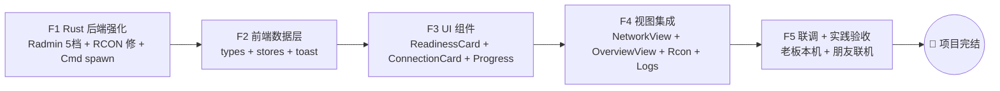
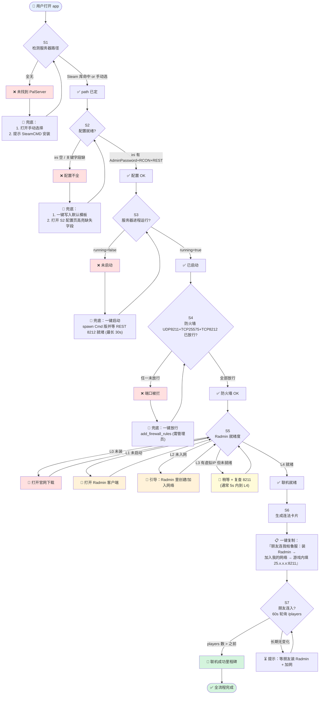

# 帕鲁服务器管理器 · 收官 PRD（Finale · 实践收官）

> 定位：**本项目最后一份需求文档**——把 R2 已完成的 T01-T05 真数据版推进到"能真正拿去联机、朋友能连上"的收官形态。
> 老板明确要求：**通过实践的方式完结项目**。本轮不追求功能齐全，只把用得上的 P1 收尾、把 P2 明确推迟或删除。
> 创建：2026-07-22 ｜ 产品经理 许清楚 ｜ 主理人 齐活林 ｜ 架构师接手：高见远

---

## 一、需求（问题 · 目标 · 非目标）

### 1.1 老板反馈的核心痛点

> **"Radmin VPN 已装并连入不能直接被 app 判定为'伪装成功'。"**

R2 现状（`network.rs::check_radmin_lan`）：
- 只用 PowerShell 查 `Famatech Radmin VPN` 网卡描述 → 拿 `Radmin VPN` 别名下的 IPv4 → 就返回 `installed=true`。
- **问题**：Radmin 客户端启动但没加入任何虚拟网络、或适配器状态是 Disabled、或虚拟 IP 拿到但 8211 端口没监听/防火墙拦——这些情况下 app 也会认为"就绪"，导致老板发出去的"连法卡片"是**空 IP 或死 IP**，朋友照抄进不来。

### 1.2 本轮要解决的三件事

| # | 事 | 说明 |
|---|---|---|
| 1 | **真实 Radmin 分级检测** | 把 "installed=true" 拆成 5 档（未装 / 已装未启动 / 已启动未入网 / 已入网(有虚拟IP) / 联机就绪(强检测通过)），只有最后一档才算"伪装成功" |
| 2 | **联机使用流程逐步逻辑** | 从"打开 app"到"朋友进服"的**每一步**：判定条件 + 通过态 + 失败兜底，用 Mermaid 流程图落地 |
| 3 | **通过实践方式完结项目** | 收尾必要 P1（RCON 终端 · 控制台日志 · 全局错误提示），明确删除 P2 及未做项，让项目"能真的用起来"就叫完结 |

### 1.3 目标（可度量）

- **G1**：Radmin 检测从"装了就 OK"升级到"5 档分级 + 联机就绪门槛"，误判率降到 0（客户端启动但未入网时**不得**显示"就绪"）。
- **G2**：联机流程的每一步都有清晰的判定和兜底动作，用户从 0 开始跟着 app 引导完成"朋友进服"，全程无需外部教程。
- **G3**：项目通过老板+至少 1 位朋友的**真实联机实测**（远端连入 8211，`/players` 出现两条真实玩家行）→ 项目完结。

### 1.4 非目标（本轮不做）

- 公网联机（端口映射 / UPnP / DDNS）——决策 3 已定 Radmin-only。
- 存档解析（角色 / 仓库 / 公会 / RawSave）。
- 世界地图、Trends 时序图、i18n、暗色模式、JWT。
- 自动更新推送、多服管理、任务计划。

---

## 二、功能模块

> 每模块 = 名称 + 目标 + 用户故事 + 验收标准。**表格化**，可直接给架构师拆任务。

### M1 · 真实 Radmin 分级检测（主线 A，最高优先级）

| 项 | 内容 |
|---|---|
| **名称** | Radmin 联机就绪度分级检测 |
| **目标** | 把 `installed=true` 拆成 5 档状态，且明确"联机就绪"的强检测门槛 |
| **用户故事** | 作为服主，我想让 app 告诉我 Radmin 到底"就绪没就绪"（而不是仅告诉我"客户端装了"），且当它说没就绪时，告诉我下一步要点哪个按钮 |
| **验收标准** | ①5 档状态在 UI 明确渲染（配色+文案）；②每档给出下一步引导（安装 / 启动 Radmin / 加网 / 放行 / 稍等）；③"就绪"档要求强检测全部通过 |

**分级定义（从弱到强，逐档收敛）**：

| 档位 | 名称 | 判定条件（AND 关系） | UI 颜色 | 下一步引导 |
|---|---|---|---|---|
| L0 | 未装 | Radmin 网卡不存在（`Get-NetAdapter` 找不到 `Famatech Radmin VPN`） | 红 | 「打开 Radmin 官网下载」按钮（`https://www.radmin-vpn.com/`） |
| L1 | 已装未启动 | 网卡存在 + 网卡状态 = `Disabled` / `Disconnected` | 橙 | 「打开 Radmin 客户端」按钮（`Start-Process 'Radmin VPN'`） |
| L2 | 已启动未入网 | 网卡状态 = `Up` + 未拿到 `25.x.x.x` 段 IP（或 IP 为 `0.0.0.0`） | 橙 | 文案：「在 Radmin 客户端里创建或加入一个虚拟网络」+ 截图/gif 引导 |
| L3 | 已入网（有虚拟IP） | 网卡 Up + 拿到有效 `25.x.x.x` 虚拟 IP + 服务器进程运行中 | 黄 | 文案：「联机链路快就绪了——请确认 8211 已放行 + 服务器已启动」+「一键放行 8211」按钮 |
| L4 | 联机就绪 | L3 全部 + 防火墙 UDP 8211 已放行 + 本机 `UDP 25.x.x.x:8211` 可绑（说明 PalServer 已监听且未被占用冲突） | 绿 | 文案：「联机就绪，把下面这段发给朋友」+「一键复制连法卡片」 |

**扩展档（可选，P1，需要朋友配合）**：

| 档位 | 名称 | 判定条件 | 说明 |
|---|---|---|---|
| L5 | 联通已验证 | 朋友端出 8211 探测响应 / 或本机对朋友 IP ping 通 | 需朋友端配合，本轮以 L4 为准出货，L5 作为 P1 增强 |

---

### M2 · 联机使用流程逐步逻辑（主线 B）

| 项 | 内容 |
|---|---|
| **名称** | 端到端联机流程（7 步 + 每步兜底） |
| **目标** | 打开 app → 朋友进服，全程 app 引导，每步判定明确、失败可修复 |
| **用户故事** | 作为服主，我第一次开 app，希望它像 checklist 一样带我一步一步：路径→配置→启动→防火墙→Radmin→连法卡片→朋友进入 |
| **验收标准** | ①流程图落地为 UI 引导（复用 S1 wizard + S3 引导卡）；②每步失败态有具体错误信息 + 一键修复按钮；③朋友真实连入后 UI 展示"联机成功"里程碑 |

> **详细分步表格 + Mermaid 流程图见第七节【特别块】**。

---

### M3 · P1 收尾清单（主线 C）

| 项 | 内容 |
|---|---|
| **名称** | 必收尾 P1 三件套 |
| **目标** | 补齐"真实使用"所必需的三项体验补强 |
| **用户故事** | 作为服主，希望有 RCON 终端做备份控制、能看到服务器控制台日志确认健康、错误时看到人话提示而不是白屏 |

**清单**：

| # | 功能 | 为什么收尾 | 简要方案 | 工作量 | 依赖 |
|---|---|---|---|---|---|
| P1-A | RCON 终端可用 | REST 挂时唯一备份控制面板 | 修 `rcon.rs::send_command` 多包 bug（参考 gorcon 处理空包+多包）；S4 加常用命令按钮（Info/ShowPlayers/Save/Shutdown/Broadcast） | M | T01 已完成的 rest_proxy 不受影响 |
| P1-B | 控制台日志捕获 | 老板确认专用服 [LOG] 只在 stdout，`Saved/Logs/` 是空的；无日志=盲飞 | 改 `server.rs::start_server` 直接 spawn `PalServer-Win64-Shipping-Cmd.exe`（Cmd 版）；捕获 stdout 管道；Tauri 事件推前端 LogPanel | M | 独立 |
| P1-C | 全局错误提示 | REST 断连/密码错的时候当前是静默失败，用户不知道发生啥 | 前端 `api/tauri.ts` 的 `tauriInvoke` 统一 catch → toast（区分：连接拒绝 / 401 认证 / 500 其他）；避免 60s 轮询重复弹（同错误 60s 内只弹一次） | S | 独立 |

**验收**：三项均可通过老板本机真机验证；RCON 能正确回显 `Info` 和 `ShowPlayers` 表头+数据；日志面板能实时看到 `[LOG] xxx connected` 行；REST 断连时前端弹一次 toast。

---

### M4 · 明确删除 / 推迟清单（主线 C 的负空间）

| 分类 | 项 | 处理 | 说明 |
|---|---|---|---|
| **本轮删除** | 存档解析（角色/仓库/公会/RawSave/世界地图） | ❌ 删除 | 不进入本轮，也不留占位屏 |
| **本轮删除** | 成就系统 | ❌ 删除 | 无需求来源，删掉 |
| **本轮删除** | 自动更新推送 | ❌ 删除 | 手动更新，app 不管 |
| **推迟 P2** | 存档备份/还原 | ⏳ 推迟 | 后端已有 `config.listBackups` 骨架，UI 不做 |
| **推迟 P2** | 公网联机（端口转发/UPnP/DDNS） | ⏳ 推迟 | 决策 3 已定 Radmin-only |
| **推迟 P2** | 封禁名单 UI（unban） | ⏳ 推迟 | 决策 5 已定不做本地列表；后端 `rest_unban` 保留可调，UI 不出 |
| **推迟 P2** | 任务计划（定时重启/公告） | ⏳ 推迟 | 无阻塞使用 |
| **推迟 P2** | 多语言 / 暗色模式 | ⏳ 推迟 | 无阻塞使用 |
| **推迟 P2** | 轮询间隔可配置 | ⏳ 推迟 | 硬编码 60s 够用 |

---

### M5 · 遗留清理（主线 D · QA 提出）

> 顺手做，不阻塞主线；不做的明写"推迟到 P2"。

| # | 项 | 处理 | 说明 |
|---|---|---|---|
| Q1 | `Promise.allSettled` 替换 `Promise.all` 做 60s 轮询 | ✅ 本轮做 | 当前 `Promise.all` 有一个失败全失败；改 `allSettled` 分别处理 info/metrics/players 的失败 |
| Q2 | reqwest `Client` 复用（`once_cell::Lazy` 全局） | ✅ 本轮做 | 决策 Q2 说 P1 优化，本轮顺手做（10 行代码，避免 TCP 频繁握手） |
| Q3 | AdminPassword 引号转义（读取时 `.trim_matches('"')`） | ✅ 本轮做 | 防御性，当前只 `trim()`，若模板保留引号会认证失败 |
| Q4 | unban UI | ⏳ 推迟 P2 | 已在 M4 说明 |

---

## 三、技术方案（关键点 · 方案选型 · 可行性）

> ⚠️ 本节只出**方案选型 + 可行性论证**，**不出代码/接口签名/文件行内改动**。落地接口由架构师高见远出。

### 3.1 真实 Radmin 分级检测 · 方案选型

**核心难题**：如何从"客户端启动"精确判定到"真实入网 + 8211 就绪"。

**候选方案对比**：

| 方案 | 原理 | 优点 | 缺点 | 采纳 |
|---|---|---|---|---|
| A. 纯 PowerShell 分层查询 | `Get-NetAdapter` → `Get-NetIPAddress` → 匹配 `25.x.x.x` → `Test-NetConnection -Port 8211` | 无新依赖；跨 Windows 版本兼容好 | 每次调 PS 有 ~200ms 开销；4 档要串行 4 次调用 | ✅ **采纳（P0）** |
| B. Rust 原生网络枚举（`if_addrs` crate） | 直接调 Windows API 拿网卡+IP | 快、无 PS 开销 | 拿不到"网卡状态"精确值（Up/Disabled/Disconnected 语义要多次调用 API 拼） | 备选，P1 优化 |
| C. Radmin 本地服务端口探测（Radmin 自身的进程 IPC） | 直接问 Radmin 客户端"你入网了吗" | 最精确 | Radmin 没公开 API，逆向风险高，跨版本易挂 | ❌ 否 |

**采纳方案 A 的分层判定链**：
1. **L0 判定**：`Get-NetAdapter -InterfaceDescription '*Famatech Radmin VPN*'` 空 → L0（未装）
2. **L1 判定**：网卡存在但 `Status ∈ {Disabled, Disconnected}` → L1（已装未启动）
3. **L2 判定**：`Status = Up` 但 `Get-NetIPAddress -InterfaceAlias 'Radmin VPN'` 拿不到 `25.x.x.x` 段 IP → L2（已启动未入网）
4. **L3 判定**：拿到有效虚拟 IP + `check_status()` 说服务器进程 running → L3
5. **L4 判定**：L3 全部 + `firewall.check().port_8211_open = true` + Rust 侧 `std::net::UdpSocket::bind("25.x.x.x:8211")` 试绑成功（说明监听/未冲突）→ L4

> **关于 L4 的 UDP bind 试探**：PalServer 已经在监听 `0.0.0.0:8211`，Rust 侧对 `25.x.x.x:8211` bind 会拿到"AddrInUse"—— **这不是 bug，这就是我们要的信号**（说明 8211 被 PalServer 占用，即"确实在监听"）。若返回其他错误（如无网卡、路由不通），说明虚拟 IP 尚未 ready。架构师需在实现时明确区分 `AddrInUse=OK` vs `AddrNotAvailable=Fail`。

**可行性**：现有 `network.rs::check_radmin_lan` 已用 PowerShell + `Get-NetAdapter` 模式，扩展到 5 档只是加判定分支和结构体字段，**技术上完全可行**。工作量估 M。

### 3.2 联机流程分步引导 · 方案选型

**核心难题**：如何让"7 步流程"既呈现清晰状态、又不打断已完成态用户的日常操作。

**采纳方案**：**分层双模式**——
- **首跑向导模式**（`uiStore.wizard.mode = 'wizard'`）：全屏引导，7 步逐步解锁（当前 R2 只有 3 步，需扩到 7 步）。
- **仪表盘常驻卡**（dashboard 模式）：S3 网络页显示"联机健康总览卡"（=当前 7 步状态的一览），出问题时红点闪，点开进 S3 排查。

**技术选型**：
- **状态存储**：新增 `stores/onboarding.ts`，字段 `stepStates: Record<StepId, 'idle' | 'pass' | 'fail'>` + 每步 `failReason` 字符串。
- **状态计算**：不引入 reactivity 复杂性，直接在 store 内 `computed` 读 `serverStore` / `networkStore` / `configStore` 派生。
- **流程持久化**：不持久化（每次启动重新检测）。理由：状态是"实时的"，不是"进度"，持久化反而误导。

**可行性**：R2 已有 `uiStore.wizard` 双模式骨架 + S1 wizard 三步组件，扩到 7 步是**微调**，工作量估 M。

### 3.3 RCON 多包 bug 修复 · 方案选型

**候选**：

| 方案 | 说明 | 采纳 |
|---|---|---|
| A. 手工修 `rcon.rs::send_command`（循环读+空包处理+超时） | 参考 gorcon 逻辑，我们自己写 30 行 | ✅ P1-A 主方案（工作量 M） |
| B. 换成 `rcon` crate（Rust 生态成熟包） | 直接 replace，减少维护 | 备选（若手工修反复出错则换） |

**可行性**：老板 23:36 raw dump 已证实协议对 + 服务器执行正常，只需在客户端侧补齐"多包/空包读取"，**低风险**。

### 3.4 控制台日志捕获 · 方案选型

**核心难题**：`PalServer.exe`（包装器）会开新控制台窗口给 `PalServer-Win64-Shipping-Cmd.exe`，stdout 不进 Rust 捕获管道。

**采纳方案**：直接 spawn `PalServer-Win64-Shipping-Cmd.exe`（Cmd 版），不走包装器。老板 first-launch 23:19 已实证此路径可行。

- 参数保持一致：`-useperfthreads -NoAsyncLoadingThread -UseMultithreadForDS`。
- stdout 管道用 R2 已有的 tokio async reader。
- 前端 LogPanel 复用现有组件，只需订阅 `server-log` 事件。

**可行性**：R2 后端已实现 stdout 事件推送框架，仅需改 `start_server` 的可执行文件路径。工作量估 S。

### 3.5 全局错误提示 · 方案选型

**采纳方案**：前端 `api/tauri.ts` 的 `tauriInvoke` wrapper 内统一 catch → 分类 → toast。

- 分类逻辑：字符串匹配 Rust 侧返回的错误前缀（`REST API 不可达` / `REST 认证失败` / `REST 请求失败`）→ 映射到 toast 图标（wifi-off / lock / warning）+ 中文说明。
- **防抖**：同一错误 ID 60s 内只弹一次（用 `useToast()` 内部 Map<errorId, lastTime>）。

**可行性**：R2 已有 `useToast` composable，加分类+防抖是**微调**。工作量估 S。

### 3.6 后端 reqwest Client 复用 · 方案选型

**采纳方案**：`once_cell::sync::Lazy<Client>` 全局单例；Client 配置 30s 超时 + connection pool 默认。

**可行性**：`once_cell` 已在依赖树内。10 行代码。工作量估 S。

---

## 四、目录结构（新增 / 修改 / 微调 · 文件级）

> ⚠️ 只列**文件清单**，不列行内改动细节（那是架构师的事）。

### 4.1 Rust 后端（`src-tauri/src/`）

| # | 路径 | 标注 | 用途 |
|---|---|---|---|
| 1 | `src-tauri/src/network.rs` | **改写** | 扩展 `check_radmin_lan` 为 5 档分级检测；新增 `RadminReadiness` 结构体（等级枚举 + 每档补充信息） |
| 2 | `src-tauri/src/rcon.rs` | **改写** | 修复 `send_command` 多包/空包处理 bug |
| 3 | `src-tauri/src/server.rs` | 改写 | `start_server` 改 spawn `PalServer-Win64-Shipping-Cmd.exe`；stdout 捕获链路验证 |
| 4 | `src-tauri/src/rest_proxy.rs` | 微调 | reqwest `Client` 全局 `once_cell::Lazy` 复用；AdminPassword `.trim_matches('"')` 转义 |
| 5 | `src-tauri/src/main.rs` | 微调 | 注册新增的 `check_radmin_readiness` 命令 |
| 6 | `src-tauri/Cargo.toml` | 微调 | 确认 `once_cell` 已在，若无则补 |

### 4.2 前端（`src/`）

| # | 路径 | 标注 | 用途 |
|---|---|---|---|
| 7 | `src/stores/onboarding.ts` | **新建** | 7 步联机流程状态派生 store |
| 8 | `src/stores/network.ts` | 改写 | 加 `readiness: RadminReadiness` state + `checkReadiness()` action |
| 9 | `src/types/tauri.ts` | 微调 | 加 `RadminReadiness` / `ReadinessLevel` 类型 |
| 10 | `src/api/tauri.ts` | 微调 | 加 `api.network.checkReadiness`；`tauriInvoke` 加全局错误分类+防抖 toast |
| 11 | `src/views/NetworkView.vue` | **改写** | Radmin 状态卡改为 5 档渲染 + 每档下一步引导按钮；4 步引导扩为 7 步"联机健康总览" |
| 12 | `src/views/OverviewView.vue` | 微调 | wizard 模式从 3 步扩到 7 步（新增：4 放行 / 5 检测 Radmin / 6 生成连法卡 / 7 等待朋友） |
| 13 | `src/views/RconView.vue` | **改写** | 从 P1 占位屏改回真实终端：连 25575 + 常用命令按钮 + 命令历史 |
| 14 | `src/views/LogsView.vue`（或 `PlaceholderView.vue` 之下的 logs 路由）| **改写** | 实时日志面板（订阅 `server-log` 事件，滚动展示） |
| 15 | `src/components/ui/RadminReadinessCard.vue` | **新建** | 5 档 Radmin 状态卡组件（颜色 + 图标 + 下一步按钮） |
| 16 | `src/components/ui/ConnectionCard.vue` | **新建** | "给朋友的连法卡片"组件（虚拟IP:8211 + Radmin 网络名 + 一键复制） |
| 17 | `src/components/ui/OnboardingProgress.vue` | **新建** | 7 步进度条组件（横向 stepper） |
| 18 | `src/components/ui/useToast.ts` | 微调 | 加错误分类映射 + 60s 防抖 Map |
| 19 | `src/stores/server.ts` | 微调 | 60s 轮询改 `Promise.allSettled`；日志面板订阅（若不在 App.vue） |

### 4.3 文档

| # | 路径 | 标注 | 用途 |
|---|---|---|---|
| 20 | `docs/finale-prd.md` | **新建** | 本文档 |
| 21 | `docs/finale-design.md` | **新建** | 架构师后续产出 |

---

## 五、风险点（描述 · 影响 · 缓解）

| # | 风险 | 影响 | 缓解措施 |
|---|---|---|---|
| R1 | **PowerShell 检测延时**：5 档判定链每次调 4-5 次 PS，累计 ~1s，UI 刷新有卡感 | S3 页刷新按钮点击后 1s 才反馈，用户以为卡死 | ①检测按钮加 loading 态；②在 store 侧做防抖（同类检测 3s 内不重复触发）；③P1 可换 Rust 原生 API（3.1 方案 B） |
| R2 | **UDP bind 试探误判**：`bind 25.x.x.x:8211` 拿到 `AddrInUse` 是"好"，`AddrNotAvailable` 是"坏"，实现时容易搞反 | L4 就绪档误判，绿灯了但朋友连不上 | ①架构师实现时单独出注释和单元测试；②增加"人肉复核"步骤：老板本机跑一次实测，5 档在真实环境下各截图一次；③失败兜底：若判定"就绪"但 60s 内没有 REST `/players` 增长 → 降级为"警告" |
| R3 | **Radmin 网卡别名不稳定**：不同 Radmin 版本可能改成 `Radmin VPN 2` / `Famatech VPN` 等 | 检测直接 fail 到 L0 | ①`InterfaceDescription -like '*Radmin*'` 用通配符；②文档记录已测版本；③L0→L1 加"人工覆盖"按钮："我确认已装但检测不到，跳过此步" |
| R4 | **stdout spawn 改动引入进程管理回归 bug**（Cmd 版行为可能与包装器不同） | 服务器起不来 / 关不掉 | ①保留旧 spawn 方式为 fallback（配置开关）；②`stop_server` 优先走 REST `/shutdown` 优雅关服；③老板本机 first-launch 已实证 Cmd 版路径可行，风险较低 |
| R5 | **RCON 多包修复引入新 bug** | S4 终端更烂 | ①老板 23:36 raw dump 是我们的黄金测试数据；②修复后先跑 `Info` + `ShowPlayers` 两个 case 通过再合入；③若 Rust 手写反复失败 → 换 `rcon` crate（3.3 方案 B） |
| R6 | **朋友端环境不可控**：Radmin 版本、防火墙、游戏版本不一致 | 本机 L4 绿灯但朋友仍进不来 | ①连法卡片文案中显式声明"服/客游戏版本必须一致 + 朋友端也要装 Radmin 并加入同一网络"；②S3 增加"朋友端排障 FAQ"折叠区（放本机不能替朋友解决的常见问题） |
| R7 | **老板"实践收官"的验收标准模糊**——啥叫"完结" | 反复返工 | 本 PRD 已明确 G3：老板 + 至少 1 位朋友真实联机（远端 8211 连入，`/players` 出现 2 条真实行）→ 项目完结。请老板拍板此标准。 |
| R8 | **PowerShell 输出编码乱码**（GBK vs UTF-8） | 中文网卡描述匹配失败 | 现有代码已用 `String::from_utf8_lossy`；架构师注意保持一致；必要时加 `[Console]::OutputEncoding = [Text.Encoding]::UTF8` 前置命令 |

---

## 六、开发顺序（分阶段 · 里程碑）

> 5 阶段，前后依赖递进；每阶段末尾有可交付里程碑。

### 阶段 F1 · Rust 后端强化（可并行 T1a / T1b / T1c）

| 子任务 | 文件 | 依赖 | 里程碑 |
|---|---|---|---|
| T1a · Radmin 5 档检测 | `network.rs` + `main.rs` | 无 | 后端命令 `check_radmin_readiness` 通过命令行调用返回正确 L0-L4 |
| T1b · RCON 多包修复 | `rcon.rs` | 无 | `send_command('Info')` 和 `('ShowPlayers')` 返回非空正确结果 |
| T1c · 控制台日志捕获改造 | `server.rs` | 无 | 启动服务器后 Tauri 事件流能拿到 `[LOG] xxx connected` 行 |
| T1d · 遗留清理 | `rest_proxy.rs` + `Cargo.toml` | 无 | Client 复用 + AdminPassword 引号转义 |

**F1 里程碑**：Rust 命令行层全部就绪，可用 Tauri devtools 逐个调用验证。

---

### 阶段 F2 · 前端数据层扩展

| 子任务 | 文件 | 依赖 |
|---|---|---|
| T2a · 类型 + API | `types/tauri.ts` + `api/tauri.ts` | F1-T1a |
| T2b · onboarding store | `stores/onboarding.ts` | T2a |
| T2c · network store 扩展 | `stores/network.ts` | T2a |
| T2d · 轮询 allSettled 改造 + 错误分类 toast | `stores/server.ts` + `useToast.ts` | T2a |

**F2 里程碑**：前端 devtools 可看到 `networkStore.readiness` 正确响应 Rust 端 5 档；`onboardingStore` 派生的 7 步状态与实际一致；toast 分类正常。

---

### 阶段 F3 · 核心 UI 组件

| 子任务 | 文件 | 依赖 |
|---|---|---|
| T3a · RadminReadinessCard | `components/ui/RadminReadinessCard.vue` | F2 |
| T3b · ConnectionCard | `components/ui/ConnectionCard.vue` | F2 |
| T3c · OnboardingProgress | `components/ui/OnboardingProgress.vue` | F2 |

**F3 里程碑**：3 个新组件在 Storybook / 独立测试页可视觉验证。

---

### 阶段 F4 · 视图集成

| 子任务 | 文件 | 依赖 |
|---|---|---|
| T4a · NetworkView 5 档 + 7 步总览 | `views/NetworkView.vue` | F3 |
| T4b · OverviewView wizard 扩 7 步 | `views/OverviewView.vue` | F3 |
| T4c · RconView 从占位改真实终端 | `views/RconView.vue` | F1-T1b |
| T4d · LogsView 实时日志面板 | `views/LogsView.vue` | F1-T1c |

**F4 里程碑**：跑通首跑向导→启动→放行→Radmin 就绪→复制连法卡→朋友进服 全流程 UI（**本机自测**）。

---

### 阶段 F5 · 联调收尾 + 实践验收

| 子任务 | 内容 | 依赖 |
|---|---|---|
| T5a · 老板本机 5 档实测 | Radmin 断连/入网/退网 3 场景各截图对比 UI 状态 | F4 |
| T5b · 老板 + 朋友真实联机 | 朋友装 Radmin → 加入网络 → 连 `25.x.x.x:8211` → 游戏内成功进入 → `/players` 出现两条行 | T5a |
| T5c · 5 档 UI 截图归档 | 落到 `docs/finale-status.md` | T5b |

**F5 里程碑**：**项目完结**。老板签字。

---

### 依赖图（Mermaid）

---

## 七、【特别块】联机使用流程逐步逻辑

> 老板明确要求：**每一步都要有清晰的逻辑**。此块是本 PRD 最重要的可视化产出，架构师直接依此设计 wizard/引导。

### 7.1 端到端流程图（Mermaid）

### 7.2 分步说明表（步骤号 · 名称 · 判定 · 通过态 · 失败态 · 兜底动作）

| # | 名称 | 判定条件 | 通过态 UI | 失败态 UI | 兜底动作 |
|---|---|---|---|---|---|
| **S1** | 检测服务器路径 | `settings.server_path` 非空 且 该路径下 `PalServer.exe` 存在 | 绿灯 + 显示路径 + "下一步"按钮解锁 | 红灯 + "未找到 PalServer.exe" | ①「自动探测（Steam 库）」按钮 → `api.steam.detect()`；②「手动选择」按钮 → 打开文件夹选择器；③文案："如果没安装，去 Steam 搜'幻兽帕鲁 专用服务器'安装" |
| **S2** | 编辑配置 | `PalWorldSettings.ini` 存在 且 `RCONEnabled=True` 且 `RESTAPIEnabled=True` 且 `AdminPassword` 非空 | 绿灯 + 显示关键字段（服名/端口/密码掩码） | 黄灯 + 缺失项列表 | ①「一键写入推荐默认」→ 从 `Default*.ini` 拷贝框架并填 AdminPassword=随机 16 位；②跳转 S2 配置页并高亮缺失字段 |
| **S3** | 启动服务器 + 等 REST 8212 就绪 | `server.getStatus().running=true` 且 `rest_get_info` 首次返回成功 | 绿灯 + 服名 + 版本 + 世界GUID + "已运行 Xs" | 红灯 + 具体错（进程未起 / REST 未响应） | ①「一键启动」→ `server.start()`；②启动后 poll REST 8212 最多 30s，超时提示"REST 未就绪，请检查 `RESTAPIEnabled=True` 已保存并重启" |
| **S4** | 一键放行防火墙 | `firewall.check()` 返回 `port_8211_open` && `port_25575_open` && `port_8212_open` 全 true | 3 张 PortCard 全绿 | 任一红色 → 显示"未放行" | 「一键放行」按钮 → `firewall.addRules()`（需管理员权限；若非管理员启动 → 提示"以管理员身份重启 app"） |
| **S5** | 检测 Radmin（5 档） | 见 §M1 分级定义 | L4 绿灯 + 显示虚拟 IP `25.x.x.x` | L0-L3 分别对应橙/橙/黄/黄颜色 + 每档具体引导 | L0→打开官网下载；L1→打开客户端；L2→截图引导加网；L3→自动 5s 复查；每档提供「重新检测」按钮 |
| **S6** | 生成连法卡片 + 一键复制 | S1-S5 全绿 | ConnectionCard 展示： 虚拟 IP `25.x.x.x` : 8211 Radmin 网络名 (若能读取) 密码提示（默认空 / 或用户设置） | (只在 S5 未 L4 时禁用复制按钮) | 「一键复制」→ 剪贴板；「查看示例截图」→ 展示游戏内多人服务器填 IP 的截图 |
| **S7** | 等待朋友连入 | 60s 轮询 `/players`，长度从 0/1 增长到 ≥2（或 `currentplayernum` 增加） | 绿色横幅"🎉 联机成功！新玩家 XXX 加入" + 出现在 S5 玩家管理页 | 长期无变化 → 灰色文案"等待朋友..." + 显示已过时间 | ①提示朋友端排障 FAQ（Radmin 是否加入同一网络？游戏版本是否一致？填的 IP 是否是**你的**虚拟 IP 而不是他的？）；②"重新检测 Radmin"按钮 |

### 7.3 状态派生规则（给架构师的实现提示）

- **S1-S7 状态**存在 `stores/onboarding.ts`，字段 `steps: Record<'s1'..'s7', {status: 'idle'|'pass'|'fail', reason?: string, action?: string}>`。
- **每步 status** 通过 `computed` 从底层 store（settings/server/network/config）派生，**不允许**在 store 外手动 setStatus——避免状态漂移。
- **S7 的"联机成功里程碑"**要**触发一次性事件**（`onSuccess` callback）：显示 5s toast + 播放音效（若允许）+ 归档到 `docs/finale-status.md` 的联机记录（可选）。

---

## 八、待老板拍板事项清单（编号 + 建议方案）

> 请老板齐活林逐条拍板。带 ★ 的是**必拍**（不定就阻塞开发）。

| # | 事项 | 我的建议 | 阻塞? |
|---|---|---|---|
| **D1** ★ | **实践收官的验收标准**：什么状态叫"项目完结"？ | 建议采用本 PRD G3：**老板本机 + 至少 1 位朋友真实联机成功**（朋友装 Radmin → 加网 → 游戏内填虚拟 IP:8211 → `/players` 出现 2 条行）→ 完结。 | ★ 阻塞 F5 |
| **D2** ★ | **L4 联机就绪档要不要包含 UDP bind 试探**（3.1 方案的最后一层） | 建议**包含**。理由：这是"PalServer 确实在监听"的最硬证据，L3→L4 有清晰门槛。风险 R2 已给缓解。 | ★ 阻塞 F1-T1a |
| **D3** ★ | **RCON 修复是手工修（方案 A）还是换 `rcon` crate（方案 B）** | 建议先试**方案 A（手工修）**，因为老板 raw dump 是黄金测试数据、可精确验证。若两轮修不好 → 换方案 B。 | ★ 阻塞 F1-T1b |
| **D4** ★ | **控制台日志改 spawn Cmd 版**是否本轮就做（P1-B） | 建议**做**。老板 23:19 已实证可行；无日志 = 盲飞，实践阶段会踩坑。工作量估 S。 | ★ 阻塞 F1-T1c |
| **D5** | **朋友端排障 FAQ** 是放 S3 页折叠区，还是单独出一个"排障"页 | 建议放 **S3 页折叠区**（本轮不新增页面，减少 UI 复杂度）。 | 不阻塞 |
| **D6** | **7 步 wizard 走完后要不要"隐藏"**（比如老板日常使用时不想再看到向导） | 建议**保留仪表盘常驻的"联机健康总览卡"**（在 S3 顶部）；wizard 全屏引导只在 `serverStore.status.running=false` 时出现；running 后自动切 dashboard 模式（R2 已有此逻辑）。 | 不阻塞 |
| **D7** | **L5 联通验证档**（朋友端反向探测）本轮做不做 | 建议**不做**。理由：需要朋友端配合运行 app 或至少响应 ping/8211 探测，超出"单机管理器"边界，L4 已足够；朋友进入后 `/players` 会活体验证。 | 不阻塞 |
| **D8** | **强制"以管理员身份运行 app"**（防火墙放行需要） | 建议 **不强制**，改为：检测无管理员权限 + 放行失败 → 弹窗引导"关闭 app → 右键 → 以管理员身份运行"。理由：日常使用（看状态、看玩家）不需要管理员权限，只放行那一下需要。 | 不阻塞 |
| **D9** | **AdminPassword 在 UI 上是否允许"眼睛"图标查看明文** | 建议**允许**。理由：老板本地单机 app，无泄露风险；不查看明文没法把密码告诉 RCON 客户端等外部工具。 | 不阻塞 |
| **D10** | **联机成功里程碑要不要写入 `docs/finale-status.md`**（把项目完结时刻留档） | 建议**要**。这就是"实践收官"的仪式感——文件里留一条"2026-XX-XX HH:MM 朋友 XXX 首次连入，项目完结"。 | 不阻塞 |

---

## 附录 · P0 / P1 / P2 收官总览

| 优先级 | 项目 | 状态 |
|---|---|---|
| P0（R2 已完成） | REST 代理 · Connect 首屏 · 4 屏真数据 · 60s 轮询 · 优雅关服 · 防火墙 8212 加固 · 自定义标题栏 | ✅ 已完 |
| **P0（本轮 · 收官）** | **真实 Radmin 5 档检测 · 7 步联机流程 · 连法卡片组件** | 🚧 本轮 |
| P1（本轮收尾） | RCON 终端修复 · 控制台日志 · 全局错误 toast · 遗留清理 4 条 | 🚧 本轮 |
| P2（明确推迟） | 存档备份 UI · 公网联机 · 封禁名单 UI · 任务计划 · i18n · 暗色模式 · 轮询间隔可配置 | ⏳ 后做 |
| ❌（本轮删除） | 存档解析 · 成就系统 · 自动更新推送 · 世界地图 · Trends 时序图 | ❌ 不做 |

---

*本 PRD 基于 R2 增量 PRD + 增量设计 + first-launch 实测 + 现有 Rust/Vue 代码