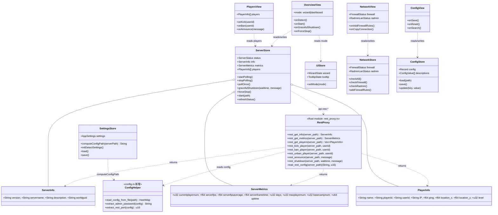
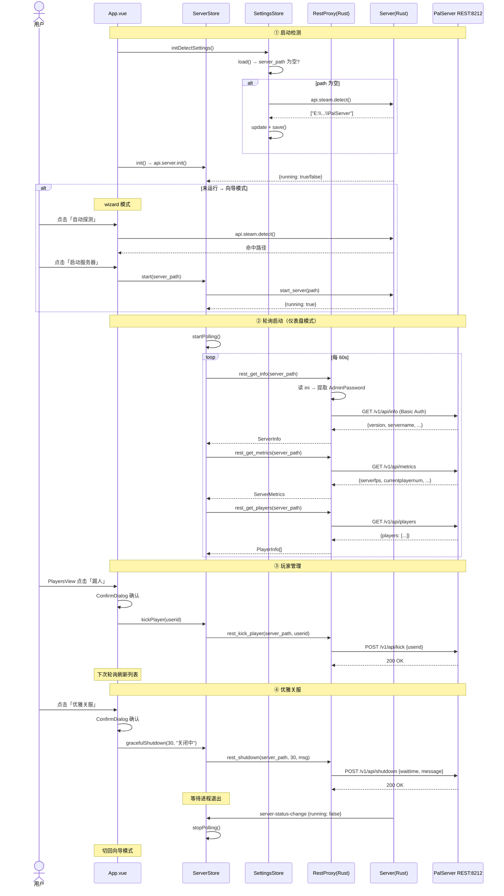
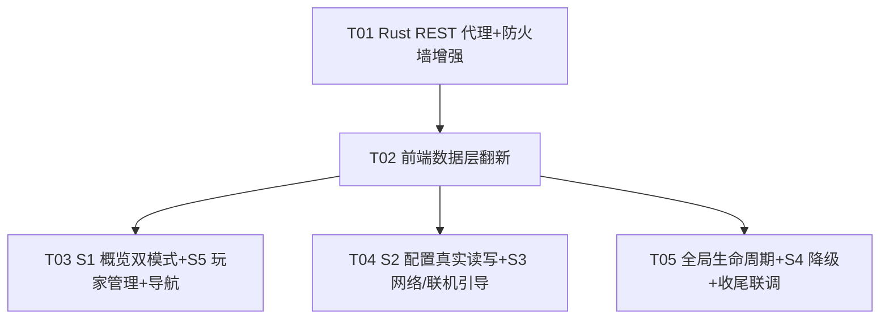

# 帕鲁服务器管理器 · 增量系统设计与任务分解（mock → 成品 app）

> **范围**：把现有 mock 前端推进到成品 app（本地真数据 + 异地联机引导），基于 5 个已拍板决策。
> **增量基线**：现有 Tauri2 + Vue3 + Vite + Pinia + Vue Router 工程，Rust 后端已有 steam_detect/server/config/rcon/firewall/network/settings/presets 真实实现。
> **P0 纪律**：不修 rcon.rs 多包 bug、不改 server.rs spawn 方式（这俩是 P1）。
> **创建**：2026-07-22 ｜ 架构师 高见远 ｜ 主理人 齐活林

---

## 1. 实现方案 + 框架选型

### 1.1 核心技术挑战

| 挑战 | 方案 |
|------|------|
| AdminPassword 不能进前端 JS（决策 1） | Rust 侧 `rest_proxy.rs` 代理所有 REST 调用，内部读 PalWorldSettings.ini 提取 AdminPassword，前端只传 `server_path` |
| 绕开浏览器 CORS（REST API 8212） | Rust reqwest 直连 `127.0.0.1:8212`，无浏览器 CORS 问题 |
| 前端 mock → 真数据无缝切换 | 翻 `VITE_MOCK=false`，`main.ts` 的 `bootstrapStores()` 走真实 `api.*` 调用链 |
| 60s 轮询引擎 + 服停自动停 | 前端 Pinia store 内 `setInterval(60s)`，REST 调用失败时自动 `clearInterval` + 刷新进程状态 |
| Connect 首屏双模式（向导/仪表盘） | `uiStore.wizard.mode` 状态驱动，`serverStore.status.running` 为 true 进仪表盘、false 进向导 |
| 优雅关服（REST /shutdown 带倒计时） | 前端先调 `rest_shutdown`，REST 失败兜底 `api.server.stop()`（force kill） |

### 1.2 Rust REST 代理设计（新增 `rest_proxy.rs`）

**模块定位**：所有帕鲁 REST API（端口 8212）调用经 Rust 代理，AdminPassword 在 Rust 侧读取、不传前端。

**AdminPassword 获取策略**：
1. `rest_proxy` 命令接收 `server_path: String` 参数。
2. Rust 内部拼接配置路径 `{server_path}/Pal/Saved/Config/WindowsServer/PalWorldSettings.ini`。
3. 调用 `config.rs` 新增的内部函数 `read_config_from_file()` 解析 ini → 提取 `AdminPassword`（去引号）+ `RESTAPIPort`（默认 8212）。
4. 用 `admin:AdminPassword` 构建 HTTP Basic Auth header，reqwest 发请求。
5. 返回反序列化后的结构体 JSON 给前端。

**HTTP 库选型**：`reqwest`（async，支持 JSON + Basic Auth，与 tokio runtime 兼容）。不选 `ureq`（同步阻塞，与 Tauri async 命令不搭）。

**reqwest Client 策略**：每次命令调用构建一次性 Client（P0 简化，60s 轮询间隔下开销可忽略；P1 可改为全局 Client 复用）。

**Tauri 命令签名（8 个）**：

```rust
// GET 类（读取状态）
#[command] pub async fn rest_get_info(server_path: String) -> Result<ServerInfo, String>
#[command] pub async fn rest_get_metrics(server_path: String) -> Result<ServerMetrics, String>
#[command] pub async fn rest_get_players(server_path: String) -> Result<Vec<PlayerInfo>, String>

// POST 类（管理动作）
#[command] pub async fn rest_kick_player(server_path: String, userid: String) -> Result<(), String>
#[command] pub async fn rest_ban_player(server_path: String, userid: String) -> Result<(), String>
#[command] pub async fn rest_unban_player(server_path: String, userid: String) -> Result<(), String>
#[command] pub async fn rest_announce(server_path: String, message: String) -> Result<(), String>
#[command] pub async fn rest_shutdown(server_path: String, waittime: u32, message: String) -> Result<(), String>
```

**错误处理**：
- 连接拒绝（server 未运行 / REST 未启用）→ 返回 `"REST API 不可达：请确认服务器已启动且 RESTAPIEnabled=True"`。
- 401 Unauthorized（AdminPassword 错误 / 配置为空）→ 返回 `"REST 认证失败：请检查 AdminPassword 配置"`。
- 其他 HTTP 错误 → 返回 `"REST 请求失败: {status} {body}"`。

### 1.3 前端 VITE_MOCK 翻转策略

**翻 mock 本质**：`main.ts` 的 `bootstrapStores()` 从「注入 mock 种子」改为「调真实 `api.*` 初始化各 store」。

**翻转步骤**：
1. `main.ts`：`const MOCK = false`（或环境变量 `VITE_MOCK=false`）。
2. `bootstrapStores()` 真实分支激活：
   - `settingsStore.load()` → 读 settings.json 获取 server_path
   - 若 server_path 为空 → `api.steam.detect()` → 命中则 `settingsStore.save()`
   - `serverStore.init()` → 获取进程状态
   - `serverStore.setupLogListener()` + `setupStatusChangeListener()` → 订阅 Rust 事件
   - `configStore.loadDescriptions()` → 加载配置项元信息
   - `networkStore.checkFirewall()` + `checkRadmin()` → 网络初始检测
   - 若 `serverStore.status.running` → `serverStore.startPolling()` → 仪表盘模式
3. `rconStore.seedMock()` 移除（RCON 终端降 P1）。

**各 store 现状评估**：
- `server.ts` / `config.ts` / `network.ts` / `settings.ts`：**已含真实 `api.*` 调用**，翻 MOCK 后直接可用，仅需增量补充（轮询、REST 数据、config_path 计算）。
- `rcon.ts`：当前纯 mock，P0 不动（S4 降 P1）。
- `ui.ts`：当前 wizard 纯本地 state，需加 `mode` 字段支持双模式。

### 1.4 Connect 首屏双模式判定逻辑

```
App 启动
  → settingsStore.load()
  → if server_path 为空:
      → api.steam.detect()
      → if 命中: settingsStore.update({ server_path }) + save()
  → serverStore.init()
  → serverStore.status.running?
      ├─ true  → uiStore.wizard.mode = 'dashboard' → serverStore.startPolling()
      └─ false → uiStore.wizard.mode = 'wizard'
```

**向导模式（wizard）**：
- Step 1 定位服务器：调 `api.steam.detect()`（真实，非 setTimeout），命中后显示路径 + 解锁 Step 2。
- Step 2 检查端口：调 `api.firewall.check()` + `api.network.checkRadminLan()`，显示放行态 + Radmin 状态。
- Step 3 启动并联机：调 `api.server.start(server_path)` → 成功后切仪表盘模式 + 启动轮询。

**仪表盘模式（dashboard）**：
- 顶部卡片区：服名 / 版本 / 世界 GUID（`rest_get_info`）。
- 指标卡片区：FPS / 平均 FPS / 在线人数 / 最大人数 / 游戏天数 / 运行时长 / 帧时间（`rest_get_metrics`）。
- 控制按钮区：[启动服务器] [优雅关服] [强制停止]。
- 数据来源：`serverStore.info` + `serverStore.metrics`，由 60s 轮询自动刷新。

### 1.5 60s 轮询引擎设计

**放前端 Pinia store**（非 Rust 事件），理由：
- 前端 `setInterval` 简单直接，UI 响应式自动刷新。
- Rust 事件推送需额外 Tauri event 机制，P0 不引入复杂度。
- 60s 间隔下前端定时器开销可忽略。

**轮询引擎（`serverStore`）**：

```
startPolling():
  if pollTimer !== null: return  // 防重复
  pollOnce()                     // 立即执行一次
  pollTimer = setInterval(pollOnce, 60_000)

pollOnce():
  try:
    [info, metrics, players] = Promise.all([
      api.rest.getInfo(server_path),
      api.rest.getMetrics(server_path),
      api.rest.getPlayers(server_path),
    ])
    serverInfo = info; serverMetrics = metrics; players = players
  catch e:
    console.error('轮询失败:', e)
    stopPolling()                // 自动停轮询
    await refreshStatus()        // 刷新进程状态

stopPolling():
  if pollTimer !== null:
    clearInterval(pollTimer); pollTimer = null
```

**轮询启停时机**：
| 事件 | 动作 |
|------|------|
| 服务器启动成功 (`serverStore.start()` 返回 running=true) | `startPolling()` |
| App 启动检测到服已在运行 | `startPolling()` |
| REST 轮询失败（连接拒绝） | `stopPolling()` + `refreshStatus()` |
| `server-status-change` 事件（进程退出） | `stopPolling()` |
| 用户手动优雅关服 | 关服命令发出后等 `server-status-change` → `stopPolling()` |
| App 卸载 / 路由离开 Overview | `stopPolling()` |

### 1.6 优雅关服策略

**两段式关服**：
1. **首选**：`api.rest.shutdown(server_path, waittime, message)` → REST API 告知服务器带倒计时关服（存档 → 广播 → 退出）。
2. **兜底**：REST 不可用时调 `api.server.stop()` → Rust 侧 `stop_server()` 尝试 RCON Shutdown（P0 RCON 未连，跳过）→ 3s 等待 → `child.kill()` 强制终止。

**前端流程**：
```
gracefulShutdown(waittime=30, message="服务器即将关闭"):
  try:
    await api.rest.shutdown(server_path, waittime, message)
    // REST /shutdown 是异步的——服务器在 waittime 秒后自行退出
    // UI 显示「服务器正在关闭...」状态
    // server-status-change 事件到达后自动 stopPolling + 切回向导模式
  catch e:
    // REST 不可用 → 兜底 force kill
    await api.server.stop()
```

**不动 `server.rs`**：P0 不改 `start_server` 的 spawn 方式（P1 才改 Cmd 版捕获 stdout），`stop_server` 保持现状（RCON 尝试 + force kill），前端用 REST /shutdown 做优雅关服。

### 1.7 防火墙增强

当前 `firewall.rs` 检查 3 端口（8211 UDP / 27015 UDP / 25575 TCP），**缺少 8212 TCP（REST API）**。P0 增强：
- `FirewallStatus` 加 `port_8212_open: bool`。
- `check_firewall_rules` 加 8212 TCP 检测。
- `add_firewall_rules` 加 8212 TCP 规则（共 4 条规则）。
- 前端 `FirewallStatus` 类型同步加 `port_8212_open: boolean`。

### 1.8 config_path 计算

配置文件路径 = `{server_path}/Pal/Saved/Config/WindowsServer/PalWorldSettings.ini`。

前端 `settingsStore` 加 `computeConfigPath(serverPath)` 方法，用于 `configStore.load(configPath)` 调用。Rust 侧 `rest_proxy.rs` 内部同样拼接此路径读 AdminPassword（不依赖前端传入 config_path，减少参数传递 + 避免前端篡改）。

---

## 2. 文件列表（新建 + 修改）

> 相对路径以工程根 `Palworld/` 为基准。标注：**新建** / **改写**（大改）/ **微调**（小改）。

### Rust 后端（src-tauri/src/）

| # | 文件 | 标注 | 说明 |
|---|------|------|------|
| 1 | `src-tauri/Cargo.toml` | 微调 | 加 `reqwest = { version = "0.12", features = ["json"] }` 依赖 |
| 2 | `src-tauri/src/rest_proxy.rs` | **新建** | REST 代理模块：8 个 Tauri 命令 + ServerInfo/ServerMetrics/PlayerInfo 结构体 + read_rest_config 辅助函数 |
| 3 | `src-tauri/src/main.rs` | 微调 | 加 `mod rest_proxy;` + `invoke_handler` 注册 8 个新命令 |
| 4 | `src-tauri/src/config.rs` | 微调 | 抽取 `pub fn read_config_from_file(path: &str) -> Result<HashMap<String,String>, String>` 供 rest_proxy 调用；加 `extract_admin_password` / `extract_rest_port` 辅助函数 |
| 5 | `src-tauri/src/firewall.rs` | 微调 | `FirewallStatus` 加 `port_8212_open: bool`；`check_firewall_rules` 加 8212 TCP；`add_firewall_rules` 加 8212 TCP 规则 |

### 前端（src/）

| # | 文件 | 标注 | 说明 |
|---|------|------|------|
| 6 | `src/api/tauri.ts` | 微调 | 加 `api.rest` 命名空间（8 个方法：getInfo/getMetrics/getPlayers/kick/ban/unban/announce/shutdown） |
| 7 | `src/types/tauri.ts` | 微调 | 加 ServerInfo / ServerMetrics / PlayerInfo 类型；FirewallStatus 加 port_8212_open |
| 8 | `src/stores/server.ts` | 改写 | 加 serverInfo/serverMetrics/players state + 60s 轮询引擎 startPolling/stopPolling/pollOnce + gracefulShutdown + forceStop |
| 9 | `src/stores/settings.ts` | 微调 | 加 computeConfigPath(serverPath) 方法 + initDetectSettings 启动探测逻辑 |
| 10 | `src/stores/ui.ts` | 微调 | WizardState 加 `mode: 'wizard' \| 'dashboard'` + setMode() action |
| 11 | `src/stores/network.ts` | 微调 | 加 checkAll() 统一检测封装（firewall + radmin 并行） |
| 12 | `src/stores/config.ts` | 微调 | 确保 load() 接收 settingsStore.computeConfigPath() 的结果 |
| 13 | `src/main.ts` | 改写 | 翻 MOCK=false + 真实 bootstrapStores()：settings.load → steam.detect → server.init → setupListeners → 条件 startPolling |
| 14 | `src/views/OverviewView.vue` | **改写** | 双模式：wizard（真实 detect + 端口检查 + 启动）/ dashboard（info + metrics 卡片 + 启停按钮 + 优雅关服） |
| 15 | `src/views/PlayersView.vue` | **新建** | 玩家管理新屏：在线玩家表（昵称/SteamID/等级/ping/坐标）+ 踢人/封人二次确认 + 广播输入框 |
| 16 | `src/views/ConfigView.vue` | **改写** | 从硬编码 mock 改为接 configStore.load/read/write 真实读写 + 停服警告 |
| 17 | `src/views/NetworkView.vue` | **改写** | 从硬编码 mock 改为真实 firewall.check + Radmin 状态 + 4 步引导进度卡 + 一键复制连法 |
| 18 | `src/views/RconView.vue` | 微调 | P0 降级为占位屏（标注「RCON 终端为 P1 功能，本轮通过 REST 管理玩家」） |
| 19 | `src/views/PlaceholderView.vue` | 微调 | 确保 logs/backup/settings 占位文案更新（标注本轮不做） |
| 20 | `src/router/index.ts` | 微调 | 加 `/players` 路由（name: 'players', component: PlayersView） |
| 21 | `src/components/layout/Sidebar.vue` | 微调 | 加「玩家管理」导航项 + 状态卡显示真实服名/在线人数/FPS |
| 22 | `src/components/ui/PortCard.vue` | 微调 | 加「一键放行」按钮（未放行时显示）+ emit 事件给父组件触发 addRules |
| 23 | `src/components/ui/ConfirmDialog.vue` | 微调 | 确保通用确认弹窗可用于关服/踢人/封人（已有组件，确认 props 接口） |
| 24 | `src/App.vue` | 微调 | onMounted 挂载 server-status-change 监听（自动停轮询）+ onUnmounted 清理 |

---

## 3. 数据结构和接口

### 3.1 Rust REST 代理结构体（`rest_proxy.rs`）

```rust
use serde::{Deserialize, Serialize};

/// GET /v1/api/info 响应
#[derive(Serialize, Deserialize, Clone, Debug)]
pub struct ServerInfo {
    pub version: String,
    pub servername: String,
    pub description: String,
    pub worldguid: String,
}

/// GET /v1/api/metrics 响应
#[derive(Serialize, Deserialize, Clone, Debug)]
pub struct ServerMetrics {
    pub currentplayernum: u32,
    pub serverfps: f64,
    pub serverfpsaverage: f64,
    pub serverframetime: f64,
    pub days: u32,
    pub maxplayernum: u32,
    pub basecampnum: u32,
    pub uptime: u64,
}

/// GET /v1/api/players 响应中的单个玩家
/// 注意：REST API 返回的字段名有大小写混合（iP / userId / playerId / location_x），
/// serde 直接按原字段名反序列化，透传给前端。
#[derive(Serialize, Deserialize, Clone, Debug)]
pub struct PlayerInfo {
    pub name: String,
    #[serde(rename = "playerId")]
    pub player_id: String,
    #[serde(rename = "userId")]
    pub user_id: String,
    #[serde(rename = "iP")]
    pub ip: String,
    pub ping: f64,
    pub location_x: f64,
    pub location_y: f64,
    pub level: u32,
}
```

> **字段命名说明**：REST API 返回的 JSON 字段名直接透传给前端（`playerId` / `userId` / `iP` / `location_x` / `location_y`）。Rust 侧用 `#[serde(rename)]` 映射 REST 原始字段名到 Rust snake_case 字段名；序列化给前端时 serde 输出 rename 后的名字（即与 REST API 一致）。前端 TS 类型与 REST API 字段名保持一致。

### 3.2 config.rs 新增辅助函数

```rust
/// 从文件读取并解析 PalWorldSettings.ini（非 #[command]，供 rest_proxy 调用）
pub fn read_config_from_file(path: &str) -> Result<HashMap<String, String>, String>

/// 从配置 HashMap 中提取 AdminPassword（去引号）
pub fn extract_admin_password(config: &HashMap<String, String>) -> String

/// 从配置 HashMap 中提取 RESTAPIPort（默认 8212）
pub fn extract_rest_port(config: &HashMap<String, String>) -> u16
```

### 3.3 前端 TypeScript 类型（`types/tauri.ts` 新增）

```typescript
// ==================== rest_proxy.rs ====================

/** GET /v1/api/info 响应 */
export interface ServerInfo {
  version: string
  servername: string
  description: string
  worldguid: string
}

/** GET /v1/api/metrics 响应 */
export interface ServerMetrics {
  currentplayernum: number
  serverfps: number
  serverfpsaverage: number
  serverframetime: number
  days: number
  maxplayernum: number
  basecampnum: number
  uptime: number
}

/** GET /v1/api/players 响应中的单个玩家 */
export interface PlayerInfo {
  name: string
  playerId: string
  userId: string
  iP: string
  ping: number
  location_x: number
  location_y: number
  level: number
}

// FirewallStatus 增加字段
export interface FirewallStatus {
  port_8211_open: boolean
  port_27015_open: boolean
  port_25575_open: boolean
  port_8212_open: boolean  // 新增
}
```

### 3.4 前端 API 层（`api/tauri.ts` 新增）

```typescript
// === rest_proxy.rs (8 个) ===
rest: {
  getInfo: (serverPath: string) => tauriInvoke<ServerInfo>('rest_get_info', { serverPath }),
  getMetrics: (serverPath: string) => tauriInvoke<ServerMetrics>('rest_get_metrics', { serverPath }),
  getPlayers: (serverPath: string) => tauriInvoke<PlayerInfo[]>('rest_get_players', { serverPath }),
  kick: (serverPath: string, userid: string) => tauriInvoke<void>('rest_kick_player', { serverPath, userid }),
  ban: (serverPath: string, userid: string) => tauriInvoke<void>('rest_ban_player', { serverPath, userid }),
  unban: (serverPath: string, userid: string) => tauriInvoke<void>('rest_unban_player', { serverPath, userid }),
  announce: (serverPath: string, message: string) => tauriInvoke<void>('rest_announce', { serverPath, message }),
  shutdown: (serverPath: string, waittime: number, message: string) =>
    tauriInvoke<void>('rest_shutdown', { serverPath, waittime, message }),
},
```

### 3.5 前端 Store 改造

#### serverStore（`stores/server.ts`）新增

```typescript
// 新增 state
const serverInfo = ref<ServerInfo | null>(null)
const serverMetrics = ref<ServerMetrics | null>(null)
const players = ref<PlayerInfo[]>([])

// 轮询引擎
let pollTimer: number | null = null
function startPolling(): void    // setInterval(60s) + 立即 pollOnce
function stopPolling(): void     // clearInterval
async function pollOnce(): Promise<void>  // Promise.all([getInfo, getMetrics, getPlayers])

// 优雅关服
async function gracefulShutdown(waittime: number, message: string): Promise<void>
// → api.rest.shutdown() 成功后等 server-status-change；失败兜底 api.server.stop()

// 强制停止（force kill 兜底）
async function forceStop(): Promise<void>  // → api.server.stop()
```

#### settingsStore（`stores/settings.ts`）新增

```typescript
function computeConfigPath(serverPath: string): string
// → `${serverPath}/Pal/Saved/Config/WindowsServer/PalWorldSettings.ini`

async function initDetectSettings(): Promise<void>
// → load() → if server_path 空 → api.steam.detect() → 命中则 save()
```

#### uiStore（`stores/ui.ts`）新增

```typescript
// WizardState 增加
interface WizardState {
  // ...existing fields...
  mode: 'wizard' | 'dashboard'  // 新增：双模式切换
}

function setMode(mode: 'wizard' | 'dashboard'): void
```

#### networkStore（`stores/network.ts`）新增

```typescript
async function checkAll(): Promise<void>
// → Promise.all([checkFirewall(), checkRadmin()])
```

### 3.6 类图（Mermaid）

> 完整 Mermaid 见 `docs/incremental-class-diagram.mermaid`。



---

## 4. 程序调用流程

### 4.1 App 启动 → 双模式判定

```
App.vue onMounted
  → settingsStore.initDetectSettings()
      → api.settings.load()  // 读 settings.json
      → if server_path 为空:
          → api.steam.detect()  // 注册表 + VDF 探测
          → if 命中: settingsStore.update + save()
  → serverStore.init()
      → api.server.init()  // 获取进程状态
  → serverStore.setupLogListener()  // 订阅 server-log 事件
  → serverStore.setupStatusChangeListener()  // 订阅 server-status-change
  → configStore.loadDescriptions()
  → networkStore.checkAll()  // firewall + radmin 并行检测
  → if serverStore.status.running:
      → uiStore.setMode('dashboard')
      → serverStore.startPolling()
  → else:
      → uiStore.setMode('wizard')
```

### 4.2 向导模式 → 启动服务器 → 切仪表盘

```
用户点击「自动探测」
  → api.steam.detect()  → ["E:\\SteamLibrary\\...\\PalServer"]
  → uiStore.finishDetect(path)
  → Step 2: networkStore.checkAll() → 显示端口/Radmin 状态
  → 用户点击「启动服务器」
  → serverStore.start(server_path)
      → api.server.start(path)  → Rust spawn PalServer.exe
      → 返回 {running: true, pid: xxx}
  → uiStore.setMode('dashboard')
  → serverStore.startPolling()
      → pollOnce() → api.rest.getInfo + getMetrics + getPlayers
      → 仪表盘显示服名/FPS/在线人数/玩家表
```

### 4.3 60s 轮询 → 玩家管理 → 优雅关服

```
轮询中（每 60s）:
  pollOnce() → Promise.all([getInfo, getMetrics, getPlayers])
  → serverStore.info / metrics / players 更新 → UI 响应式刷新

玩家管理（PlayersView）:
  用户点击玩家行「踢人」
  → ConfirmDialog 弹窗 → 用户确认
  → api.rest.kick(server_path, userid)  → POST /v1/api/kick {userid}
  → 下次轮询刷新玩家列表（被踢玩家消失）

  用户输入广播消息 → 点击「发送」
  → api.rest.announce(server_path, message)  → POST /v1/api/announce {message}

优雅关服:
  用户点击「优雅关服」
  → ConfirmDialog 弹窗 → 用户确认
  → serverStore.gracefulShutdown(30, "服务器即将关闭")
      → api.rest.shutdown(server_path, 30, message)  → POST /v1/api/shutdown
      → UI 显示「服务器正在关闭... (30s)」
      → 服务器进程退出 → server-status-change 事件
      → serverStore.stopPolling()
      → uiStore.setMode('wizard')  → 切回向导模式
  catch (REST 不可用):
      → api.server.stop()  → force kill 兜底
      → server-status-change → stopPolling → 切回向导
```

### 4.4 时序图（Mermaid）

> 完整 Mermaid 见 `docs/incremental-sequence-diagram.mermaid`。



---

## 5. 任务列表（有序、含依赖、按实现顺序）

> **纪律**：≤5 个任务，每个 ≥3 文件，T01 为后端基础设施，任务间尽量仅依赖 T01/T02。

### T01 · Rust REST 代理层 + 防火墙增强（后端基础设施）

| 项 | 内容 |
|---|---|
| **名称** | Rust REST 代理层 + 防火墙增强 |
| **Source Files** | `src-tauri/Cargo.toml`(微调:加 reqwest) · `src-tauri/src/rest_proxy.rs`(**新建**:8 命令+3 结构体) · `src-tauri/src/main.rs`(微调:mod+注册) · `src-tauri/src/config.rs`(微调:抽取 read_config_from_file+辅助函数) · `src-tauri/src/firewall.rs`(微调:加 8212 TCP) |
| **依赖** | 无 |
| **优先级** | P0 |
| **说明** | 后端基础设施：新增 REST 代理模块（8 个 Tauri 命令），AdminPassword 在 Rust 侧从 PalWorldSettings.ini 读取不进前端；config.rs 抽取内部函数供 rest_proxy 复用；firewall.rs 补 8212 TCP 检测+规则。 |

### T02 · 前端数据层翻新（API+类型+Store+翻 MOCK+轮询+关服）

| 项 | 内容 |
|---|---|
| **名称** | 前端数据层翻新 |
| **Source Files** | `src/api/tauri.ts`(微调:加 api.rest 8 方法) · `src/types/tauri.ts`(微调:加 REST 类型+8212) · `src/stores/server.ts`(改写:加轮询+REST 数据+优雅关服) · `src/stores/settings.ts`(微调:加 computeConfigPath+initDetectSettings) · `src/stores/ui.ts`(微调:加 mode 双模式) · `src/main.ts`(改写:翻 MOCK=false+真实 bootstrap) |
| **依赖** | T01 |
| **优先级** | P0 |
| **说明** | 数据层基础设施：API 层加 rest 命名空间；类型层加 REST 类型；server store 加 60s 轮询引擎+REST 数据 state+优雅关服/强制停止；settings store 加 config_path 计算+启动探测；ui store 加双模式；main.ts 翻 MOCK 走真实 bootstrap。 |

### T03 · S1 概览双模式仪表盘 + S5 玩家管理新屏 + 导航

| 项 | 内容 |
|---|---|
| **名称** | S1 概览双模式 + S5 玩家管理 + 导航侧栏 |
| **Source Files** | `src/views/OverviewView.vue`(**改写**:双模式 wizard/dashboard) · `src/views/PlayersView.vue`(**新建**:在线表+踢/封/广播) · `src/router/index.ts`(微调:加 /players) · `src/components/layout/Sidebar.vue`(微调:加玩家管理导航+真实状态卡) · `src/components/ui/ConfirmDialog.vue`(微调:确保可用于关服/踢/封确认) |
| **依赖** | T02 |
| **优先级** | P0 |
| **说明** | 核心业务屏：OverviewView 改双模式（向导:真实 detect+端口+启动 / 仪表盘:info+metrics 卡片+启停+关服）；新建 PlayersView 玩家管理屏（REST 在线表+踢人+封人+广播，二次确认）；路由加 /players；侧栏加玩家管理入口+状态卡显示真实服名/人数/FPS。 |

### T04 · S2 配置真实读写 + S3 网络真实检测 + 异地联机引导

| 项 | 内容 |
|---|---|
| **名称** | S2 配置真实读写 + S3 网络/联机引导 |
| **Source Files** | `src/views/ConfigView.vue`(**改写**:接 configStore 真实读写+停服警告) · `src/views/NetworkView.vue`(**改写**:真实 firewall+Radmin+4 步引导+一键复制) · `src/stores/network.ts`(微调:加 checkAll 封装) · `src/stores/config.ts`(微调:确保 config_path 传递) · `src/components/ui/PortCard.vue`(微调:加一键放行按钮) |
| **依赖** | T02 |
| **优先级** | P0 |
| **说明** | 配置+网络屏翻真数据：ConfigView 从硬编码 mock 改为 configStore.load/read/write 真实读写 PalWorldSettings.ini + 运行中改配置弹停服警告；NetworkView 从硬编码 mock 改为真实 firewall.check+Radmin 状态+4 步引导进度卡（放行→Radmin→复制连法→同学操作）+一键复制到剪贴板；PortCard 加一键放行按钮。 |

### T05 · 全局轮询生命周期 + RconView 降级 + 联调收尾

| 项 | 内容 |
|---|---|
| **名称** | 全局生命周期 + S4 降级 + 收尾联调 |
| **Source Files** | `src/App.vue`(微调:挂载 server-status-change 监听+onUnmounted 清理) · `src/views/RconView.vue`(微调:降级为 P1 占位屏) · `src/views/PlaceholderView.vue`(微调:占位文案更新) · `src/stores/server.ts`(微调:补 setupStatusChangeListener 联动 stopPolling) · `src/stores/network.ts`(微调:补 checkPort 封装确认) |
| **依赖** | T02 |
| **优先级** | P0 |
| **说明** | 收尾：App.vue 挂载全局 server-status-change 事件监听（进程退出→自动 stopPolling→切回向导）+ onUnmounted 清理定时器；RconView 降级为 P1 占位屏（标注「RCON 终端 P1，本轮通过 REST 管理玩家」）；PlaceholderView 更新文案；全局联调确认轮询启停/关服/玩家管理/配置读写/网络检测全链路通畅。 |

### 任务依赖图（Mermaid）



> T03 / T04 / T05 均仅依赖 T02，可并行推进。

---

## 6. 依赖包列表

### Rust crate（`src-tauri/Cargo.toml` 新增）

| crate | 版本 | 用途 |
|-------|------|------|
| `reqwest` | `0.12`（features: `["json"]`） | REST 代理 HTTP 客户端（Basic Auth + JSON 反序列化）；默认 native-tls（Windows SChannel），无需额外 TLS 依赖 |

### npm 包（本轮无新增）

| 包 | 状态 | 说明 |
|---|------|------|
| `@tauri-apps/api` | 已有（v2） | invoke / event / window 模块，本轮启用 event 监听 |
| `@tauri-apps/plugin-clipboard-manager` | 已有 | S3 一键复制连法说明 |
| `vue` / `pinia` / `vue-router` / `vite` | 已有 | 脚手架 |

---

## 7. 共享知识（跨文件约定）

### 7.1 REST 端点常量

| 端点 | 方法 | 用途 | Body |
|------|------|------|------|
| `/v1/api/info` | GET | 服名/版本/世界GUID | — |
| `/v1/api/metrics` | GET | FPS/人数/天数/运行时长 | — |
| `/v1/api/players` | GET | 在线玩家列表 | — |
| `/v1/api/kick` | POST | 踢人 | `{"userid": "steam_xxx"}` |
| `/v1/api/ban` | POST | 封人 | `{"userid": "steam_xxx"}` |
| `/v1/api/unban` | POST | 解封 | `{"userid": "steam_xxx"}` |
| `/v1/api/announce` | POST | 全服广播 | `{"message": "..."}` |
| `/v1/api/shutdown` | POST | 优雅关服（带倒计时） | `{"waittime": 30, "message": "..."}` |

- **Base URL**：`http://127.0.0.1:{RESTAPIPort}`（默认 8212，从配置读取）。
- **认证**：HTTP Basic Auth，username=`admin`，password=AdminPassword（从 PalWorldSettings.ini 读取）。
- **AdminPassword 不进前端 JS**：所有 REST 调用走 Rust `rest_proxy`，前端只传 `server_path`。

### 7.2 AdminPassword 存取约定

- **存储位置**：`{server_path}/Pal/Saved/Config/WindowsServer/PalWorldSettings.ini` 中的 `AdminPassword` 字段。
- **读取方**：Rust `rest_proxy.rs` → `config.rs::read_config_from_file()` → `extract_admin_password()`。
- **前端不接触**：前端不传 AdminPassword、不存储 AdminPassword、不在 JS 中出现明文密码。
- **配置页编辑**：ConfigView 可编辑 AdminPassword（通过 `configStore.save()` → `api.config.write()` 写入 ini），但不在 UI 中明文显示（用密码框掩码）。

### 7.3 config_path 计算约定

```
config_path = {server_path}/Pal/Saved/Config/WindowsServer/PalWorldSettings.ini
```

- **前端**：`settingsStore.computeConfigPath(serverPath)` → 传给 `configStore.load(configPath)`。
- **Rust**：`rest_proxy.rs` 内部拼接同一路径（不依赖前端传入，减少参数 + 防篡改）。
- **路径分隔符**：Windows 下用 `\`（Rust `Path::join` 自动处理）。

### 7.4 错误处理统一约定

- **Rust 侧**：所有 `#[command]` 返回 `Result<T, String>`，错误信息为人话中文（如 `"REST API 不可达：请确认服务器已启动且 RESTAPIEnabled=True"`）。
- **前端侧**：`api/tauri.ts` 的 `tauriInvoke` 统一捕获 Rust 错误 → 转 `Error` → 由调用方 `try/catch` + toast 提示。
- **轮询失败**：`pollOnce()` catch 后 `console.error` + `stopPolling()` + `refreshStatus()`，不弹 toast（避免 60s 重复弹窗）。
- **REST 不可达 vs 认证失败**：Rust 侧区分 `reqwest::Error::connect`（连接拒绝）vs HTTP 401，返回不同错误信息。

### 7.5 轮询引擎约定

- **间隔**：60 秒（`setInterval(pollOnce, 60_000)`）。
- **首次执行**：`startPolling()` 立即调一次 `pollOnce()`（不等 60s）。
- **并发请求**：`pollOnce()` 内 `Promise.all([getInfo, getMetrics, getPlayers])` 并行。
- **自动停止**：`pollOnce()` catch → `stopPolling()`；`server-status-change` 事件 → `stopPolling()`。
- **防重复**：`startPolling()` 检查 `pollTimer !== null` 防重复启动。
- **清理**：`App.vue` 的 `onUnmounted` 调 `serverStore.stopPolling()` + `destroyListener()`。

### 7.6 优雅关服约定

- **首选 REST /shutdown**：`waittime` 默认 30 秒，`message` 默认 `"服务器即将关闭，请保存进度"`。
- **REST /shutdown 是异步的**：服务器在 waittime 秒后自行退出，前端不等返回就显示「正在关闭」状态。
- **进程退出检测**：`server-status-change` 事件（server.rs stdout 线程检测到子进程退出）。
- **兜底 force kill**：REST 不可用时调 `api.server.stop()`（Rust 侧 RCON Shutdown 尝试→3s→kill）。
- **UI 状态切换**：关服后 `uiStore.setMode('wizard')` 切回向导模式。

### 7.7 玩家管理约定

- **数据源**：REST `/v1/api/players`（60s 轮询自动刷新）。
- **踢/封标识**：用 `userId`（= `steam_xxx`），POST body `{"userid": "steam_xxx"}`。
- **二次确认**：踢人/封人前弹 `ConfirmDialog`，显示玩家昵称 + 动作类型。
- **封禁名单**：P0 不做本地封禁名单（决策 5），只调 `/ban` `/unban` 动作。
- **广播**：输入框 + 发送按钮，调 `/announce`，发送后 toast 成功提示。

### 7.8 异地联机引导约定

- **引导 4 步**：A 放行防火墙 UDP 8211 → B Radmin 已装并连入 → C 复制连法给同学 → D 同学端操作。
- **一键复制文案**：`朋友连我帕鲁服：①装 Radmin VPN（radmin-vpn.com）②我拉你进我的虚拟网络 ③进游戏→多人→专用服务器→填 {虚拟IP}:8211 直连`。
- **复制实现**：`@tauri-apps/plugin-clipboard-manager` 的 `writeText()`。
- **Radmin 虚拟 IP 来源**：`api.network.checkRadminLan()` → `radmin.virtual_ip`。
- **ServerPassword 默认空**：Radmin 局域网场景（决策 3），引导文案不提服密码。

---

## 8. 待明确事项（给主理人）

| # | 问题 | 我的建议 |
|---|------|---------|
| Q1 | **reqwest native-tls vs rustls-tls**：Windows 上 native-tls 用 SChannel（系统内置），rustls-tls 纯 Rust 实现。当前建议用默认 native-tls（Windows-only 项目，SChannel 零额外依赖）。是否接受？ | 用默认 native-tls（`features = ["json"]`），不额外指定 TLS backend。 |
| Q2 | **REST 代理每次请求构建新 Client vs 全局复用**：P0 建议每次新建（简单，60s 间隔开销可忽略）。P1 可改为 `once_cell::sync::Lazy` 全局 Client 复用 + connection pool。是否 P0 先简单来？ | P0 每次新建，P1 优化。 |
| Q3 | **config.rs 重构幅度**：`read_config` 当前是 `#[command]` 内联解析逻辑。建议抽取 `pub fn read_config_from_file(path: &str)` 内部函数，`#[command] read_config` 改为调用它。这是最小重构（不改变外部行为），但需要改动 config.rs。是否允许？ | 允许，这是必要的最小重构（rest_proxy 需复用解析逻辑）。 |
| Q4 | **PlayersView 玩家表展示哪些列**：REST `/players` 返回 name/playerId/userId/iP/ping/location_x/location_y/level/building_count。建议展示：昵称 / SteamID(userId) / 等级 / ping / 坐标(x,y) / 操作按钮(踢/封)。building_count 是否展示？ | 建议展示 building_count（建筑数）作为附加信息列，可折叠。 |
| Q5 | **轮询间隔 60s 是否可配置**：PRD 写 60s。建议 P0 硬编码 60s，P1 在设置页加「轮询间隔」可配置项。是否同意？ | P0 硬编码 60s。 |
| Q6 | **OverviewView 仪表盘模式下的「强制停止」按钮是否暴露**：PRD 说优雅关服为主，「兜底 force kill」。建议仪表盘同时显示「优雅关服」(主) + 「强制停止」(次，红色，需二次确认)。是否同意？ | 同意，两个按钮都显示，强制停止用红色警示 + 二次确认。 |
| Q7 | **firewall.rs 的 27015 UDP 端口是否保留**：当前检查 27015（Steam Query 端口），但帕鲁专用服实际不用 27015。建议保留检测（不删，兼容性）但 S3 页面不展示 27015 卡片（只展示 8211/25575/8212 三张卡）。是否同意？ | 保留 Rust 端检测，S3 只展示 3 张卡（8211/25575/8212）。 |
| Q8 | **S4 RconView 降级后是否保留路由**：建议保留 `/rcon` 路由 + 侧栏入口，但内容改为 P1 占位屏（标注「RCON 终端为 P1 功能，本轮通过 REST 管理玩家」+ 引导去玩家管理页）。是否同意？ | 保留路由，内容降级为占位 + 引导。 |

---

## 附录：P0 范围与任务对照

| PRD P0 功能 | 落地任务 | 关键文件 |
|---|---|---|
| #1 翻 VITE_MOCK=false + REST client | T01+T02 | rest_proxy.rs / api/tauri.ts / main.ts |
| #2 Connect/首跑首屏（双模式） | T02+T03 | stores/ui.ts / OverviewView.vue |
| #3 概览仪表盘（info/metrics） | T03 | OverviewView.vue / stores/server.ts |
| #4 服务器启停 | T03 | OverviewView.vue / stores/server.ts |
| #5 60s 轮询引擎 | T02+T05 | stores/server.ts / App.vue |
| #6 玩家管理-在线列表 | T03 | PlayersView.vue / stores/server.ts |
| #7 玩家管理-踢人/封人 | T03 | PlayersView.vue / ConfirmDialog.vue |
| #8 玩家管理-广播 | T03 | PlayersView.vue |
| #9 配置编辑-真实读写 | T04 | ConfigView.vue / stores/config.ts |
| #10 RCON 终端-真实连接 | **P1 降级** | RconView.vue（占位） |
| #11 网络状态-真实检测 | T04 | NetworkView.vue / stores/network.ts |
| #12 防火墙一键放行 | T01+T04 | firewall.rs / PortCard.vue |
| #13 异地联机引导 | T04 | NetworkView.vue |
| #14 优雅关服 | T02+T03 | stores/server.ts / OverviewView.vue |

---

*本设计基于 `docs/incremental-prd.md`（5 决策锁定）+ `docs/first-launch-status.md`（实测留痕）+ 现有代码逐文件审阅。所有 REST 端点、AdminPassword、端口均为老板本机真实验证值。*
