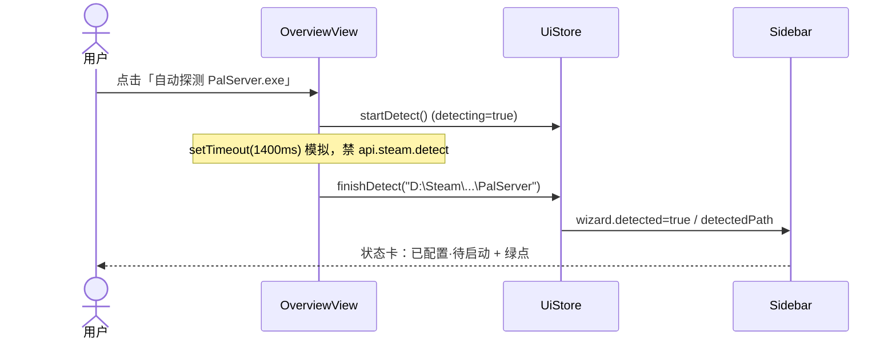
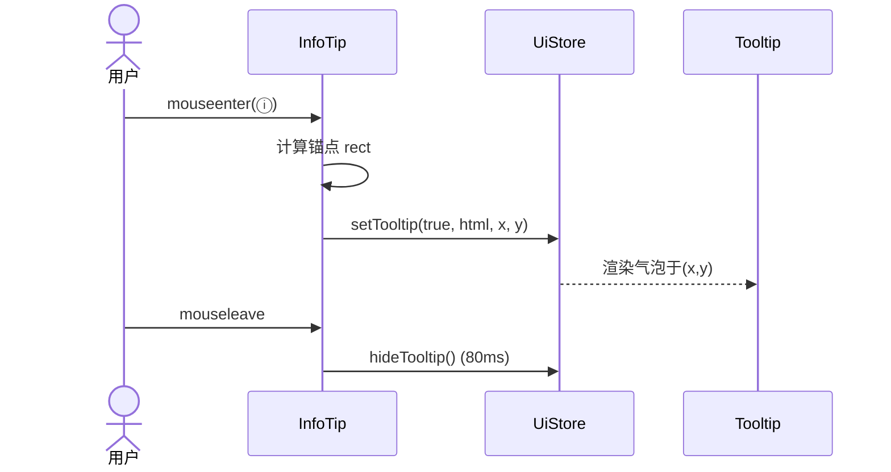
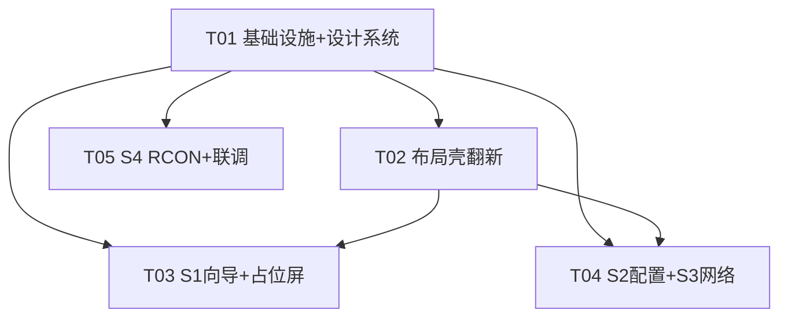

# Palworld 服务器管理器 · UI 重做（前端视觉还原）系统设计与任务分解

> **范围**：把 `ui-redesign/`（vanilla 原型，100% 还原设计稿）落成真实 Tauri 2 桌面 app 的界面。
> **本轮边界（铁律）**：纯视觉还原——所有数据用组件内本地 state / Pinia mock，**禁止调用任何真实 Tauri 命令**（`detect` / `config` 读写 / `rcon` 收发一律模拟）。真实后端接线留给下一轮。
> **输出语言**：简体中文。以下 8 块为对工程师（寇豆）的交付基准。

---

## 1. 实现方案 + 框架选型

### 1.1 总体策略
- **复用现有脚手架**：Vue 3 SFC + Vite + Pinia + Vue Router + Rust 后端 `src-tauri`。**不引入新框架**，只在现有工程上做「换皮 + 拆组件 + 加自定义标题栏 + mock 数据」。
- **设计基准**：以 `ui-redesign/{index.html, app.js, style.css}` 为逐像素还原基准（布局/配色/圆角/间距/文案/图标）。**现有工程的旧 "palwarm" 暖橙玻璃主题（`src/style.css` 的 `--palwarm-*` 变量）整体被替代**为原型的新深色蓝主题。
- **模拟边界统一**：`src/api/tauri.ts` 保持不动（下一轮接线用）；`main.ts` 的 `bootstrapStores()` 本轮改为 **mock 模式**（不调真实 `invoke`，改为注入样例数据）。所有交互逻辑沿用原型的 setTimeout / 正则匹配假响应。

### 1.2 vanilla → Vue 组件拆分策略

| 原型 DOM 块 | 组件/落点 | 处理方式 |
|---|---|---|
| `.window > .titlebar` | `TitleBar.vue`（新建） | 窗口控制栏（最小化/最大化/关闭 + `data-tauri-drag-region`） |
| `.window > .body` | `AppShell.vue`（重写） | flex 行：sidebar + main，去旧玻璃外边距，填满窗口 |
| `.sidebar`（状态卡 + 导航 + 版本） | `Sidebar.vue`（重写） | 状态卡读 `uiStore.wizard`；导航用 `router-link` + `AppIcon` |
| `.screen[data-screen]` | `views/*.vue` + `<router-view>` | 原型靠 `classList.toggle('active')`，Vue 改为路由切换 |
| S1 `.step-card` / `.step-badge` / 向导 | `OverviewView.vue` + `StepCard.vue` | 向导状态进 `uiStore.wizard` |
| S2 `.cfg-group` / `.cfg-item` / `.search-bar` | `ConfigView.vue` + `CfgGroup.vue` + `CfgItem.vue` | 分组折叠、内联编辑、搜索过滤均为本地 state |
| S2 `.tip`（ⓘ） / `#tooltip` | `InfoTip.vue` + `Tooltip.vue` | 单一全局浮动 tooltip，由 `uiStore.tooltip` 驱动 |
| S3 `.port-card` / `.status-pill` / `.vpn-card` / `.fw-card` | `NetworkView.vue` + `PortCard.vue` + `StatusPill.vue` | 端口状态用硬编码 mock（已通/未启用） |
| S4 `.terminal` / `.conn-form` / `.qbtn` / `.cmd-row` | `RconView.vue` + `Terminal.vue` | 收发用正则假响应；连接态用本地 state |
| 占位屏 `logs/backup/settings` | `PlaceholderView.vue`（通用，3 路由复用） | 统一占位文案 + 图标 |
| `.btn` / `.btn-primary` / `.btn-ghost` / `.btn-success` | 沿用 `BaseButton.vue` + `style.css` 重定义类 | 类名与原型一致，样式改新主题 |

### 1.3 自定义标题栏技术路径
- **Tauri 2 关闭系统边框**：在 `tauri.conf.json` 的 `app.windows[0]` 增加 `"decorations": false`（声明）。
- **运行时权威控制**：因 `src-tauri/src/main.rs` 在 `setup` 里用 `WebviewWindowBuilder` 手动建窗，需在 Rust 侧也加 `.decorations(false)`（否则 conf 不生效）。⚠️ 是否改 `main.rs` 见 §8 待明确事项；建议两处都设。
- **自建 `TitleBar.vue`**：拖拽区用 `data-tauri-drag-region` 属性（Tauri 识别为可拖拽）；三个按钮调用 `@tauri-apps/api/window` 的 `getCurrentWindow()` → `.minimize()` / `.toggleMaximize()` / `.close()`。
- 原型里「关闭=confirm 后变半透明」只是视觉模拟，本轮按钮直接调真实窗口 API（窗口控制是安全的，不属于"后端业务命令"）。

### 1.4 字体与图标
- **字体**：引入 `@fontsource/noto-sans-sc`（中文 UI）+ `@fontsource/jetbrains-mono`（端口/日志/指令等宽），本地打包，规避 Google Fonts CDN 的 CSP 放开与离线问题；在 `main.ts`/`style.css` 中 `@import`。
- **图标**：用原型内联 SVG（像素级还原）替代 `lucide-vue-next`。新建 `AppIcon.vue` 按 `name` 渲染原型 SVG path。

---

## 2. 文件列表（本轮新建 / 重写 / 弃用）

> 相对路径以工程根 `Palworld/` 为基准。

| # | 文件 | 状态 | 说明 |
|---|---|---|---|
| 1 | `src/style.css` | **重写** | 替换 `:root` 为原型深色蓝 token + 新增全局类（`.titlebar`/`.screen`/`.page-head`/`.status-pill`/`.cfg-*`/`.port-card`/`.step-card`/`.terminal`/`.app-tooltip`/按钮等），删除旧 `--palwarm-*` 体系 |
| 2 | `src-tauri/tauri.conf.json` | **修改** | 新增 `app.windows[0]`：`decorations:false`、`width:1200`、`height:760`、`minWidth:900`、`minHeight:720` |
| 3 | `src-tauri/src/main.rs` | **修改(待确认)** | `WebviewWindowBuilder` 增加 `.decorations(false)`（运行时权威） |
| 4 | `src/main.ts` | **修改** | `bootstrapStores()` 改 mock 模式：不调真实 `invoke`，注入原型样例数据到各 store |
| 5 | `src/App.vue` | **重写** | 结构：`TitleBar` + `AppShell(sidebar+router-view)` + `Toast`；移除 `HeaderBar` 引用 |
| 6 | `src/router/index.ts` | **重写** | 路由：`/overview`(S1) `/config`(S2) `/network`(S3) `/rcon`(S4) `/logs` `/backup` `/settings`；`/`→`/overview`；`troubleshoot` 移出主导航 |
| 7 | `src/stores/ui.ts` | **新建** | `uiStore`：`tooltip` 状态 + `wizard` 向导状态；`setTooltip/hideTooltip/startDetect/finishDetect/setManual` |
| 8 | `src/components/ui/Tooltip.vue` | **新建** | 全局浮动 tooltip，`Teleport` 到 body，读 `uiStore.tooltip` |
| 9 | `src/components/ui/InfoTip.vue` | **新建** | ⓘ 触发按钮，`mouseenter` 计算锚点 → `uiStore.setTooltip`；`mouseleave` → `hideTooltip` |
| 10 | `src/components/ui/AppIcon.vue` | **新建** | 按 `name` 渲染原型内联 SVG（导航/端口/标题栏等） |
| 11 | `src/components/layout/TitleBar.vue` | **新建** | 窗口控制栏：拖拽区 + 最小化/最大化/关闭（`@tauri-apps/api/window`） |
| 12 | `src/components/layout/Sidebar.vue` | **重写** | 状态卡（读 `uiStore.wizard`）+ 导航（6 项 + 设置）+ 版本 `v2.4.0` |
| 13 | `src/components/layout/AppShell.vue` | **重写** | flex 行布局，去玻璃外边距/圆角，填满窗口，对齐原型 `.body` |
| 14 | `src/components/layout/HeaderBar.vue` | **弃用** | 本轮不再渲染（页标题由各 View 的 `.page-head` 负责）；文件保留但解除引用 |
| 15 | `src/views/OverviewView.vue` | **重写/重命名** | 由 `DashboardView.vue` 重构为 S1 首屏向导（含 3 步卡片、自动探测 mock、手动选择） |
| 16 | `src/components/ui/StepCard.vue` | **新建** | 步骤卡：`num/title/desc/state(active\|locked\|done)` |
| 17 | `src/views/PlaceholderView.vue` | **新建** | 通用占位屏（标题/描述/图标），`logs`/`backup`/`settings` 三路由复用 |
| 18 | `src/views/ConfigView.vue` | **重写** | S2：搜索栏 + 分组折叠 + 内联编辑 + toggle + 保存/恢复默认（均本地 state） |
| 19 | `src/components/ui/CfgItem.vue` | **新建** | 配置项：`name` + `InfoTip` + `editable`（number/select/toggle） |
| 20 | `src/components/ui/CfgGroup.vue` | **新建** | 可折叠分组：`title` + `iconName` + `count` + `collapsed` |
| 21 | `src/views/NetworkView.vue` | **重写** | S3：3 张端口卡 + Radmin VPN 卡 + 防火墙说明卡（mock 状态） |
| 22 | `src/components/ui/PortCard.vue` | **新建** | 端口状态卡：`title` + `proto` + `desc` + `status(ok\|off\|block)` + `iconName` |
| 23 | `src/components/ui/StatusPill.vue` | **新建** | 状态药丸：`status(ok\|off\|block)` + `text` |
| 24 | `src/views/RconView.vue` | **重写** | S4：连接表单 + 快捷指令 + 终端输出 + 命令输入 + 历史 ↑↓（mock 收发） |
| 25 | `src/components/ui/Terminal.vue` | **新建** | 终端输出区：渲染 `RconLogLine[]`，等宽、彩色分级 |
| 26 | `src/stores/rcon.ts` | **修改** | 本轮 `send()` 改 mock：正则匹配假响应（沿用原型逻辑），不调 `api.rcon.send`；`connect/disconnect` 仅切本地 `connected` |
| 27 | `src/components/ui/BaseButton.vue` | **保留** | 不变；其样式类（`.btn-primary` 等）由 `style.css` 重定义为新主题 |

> **说明**：`DashboardView.vue`、`TroubleshootView.vue` 等旧文件：DashboardView 重命名为 `OverviewView.vue`；TroubleshootView 本轮不在重做范围，路由移出主导航（保留文件可选删除）。

---

## 3. 数据结构 / 接口

### 3.1 Pinia：`uiStore`（新建，`src/stores/ui.ts`）
```ts
interface TooltipState {
  visible: boolean
  html: string      // 允许内联 HTML（原型 data-tip 内容）
  x: number
  y: number
}
interface WizardState {
  step: number            // 当前激活步 1..3
  detected: boolean       // 是否已探测/手动指定
  detectedPath: string    // 例如 "D:\\Steam\\steamapps\\common\\Palworld\\PalServer"
  detecting: boolean      // 探测中（禁用按钮 + 文案）
  manual: boolean         // 是否手动模式
}
// actions: setTooltip(visible,html,x,y) / hideTooltip() / startDetect() / finishDetect(path) / setManual(path)
```

### 3.2 公共组件 Props 接口
```ts
// AppIcon.vue
defineProps<{ name: string; size?: number }>()

// InfoTip.vue
defineProps<{ html: string }>()   // 气泡 HTML

// Tooltip.vue  — 无 props，读 uiStore.tooltip

// TitleBar.vue — 无 props（内部用 getCurrentWindow）

// StepCard.vue
defineProps<{
  num: number
  title: string
  desc: string
  state: 'active' | 'locked' | 'done'
}>()

// PlaceholderView.vue
defineProps<{ title: string; desc: string; iconName: string }>()

// CfgGroup.vue
defineProps<{
  title: string
  iconName: string
  count: number
  collapsed?: boolean
}>()
// emits: toggle()

// CfgItem.vue
defineProps<{
  name: string                 // 如 "MaxPlayers 最大人数"
  editable: 'number' | 'select' | 'toggle'
  modelValue: string | boolean
  min?: number; max?: number; step?: number
  options?: string[]           // select 用："掉落物品|无|仅掉经验|掉经验"
  tipHtml?: string             // ⓘ 气泡
  defaultText?: string
}>()
// emits: update:modelValue(v)

// PortCard.vue
defineProps<{
  title: string
  proto: string                // "UDP · 入站(Inbound)"
  desc: string
  status: 'ok' | 'off' | 'block'
  iconName: string             // 'game' | 'rcon' | 'rest'
}>()

// StatusPill.vue
defineProps<{ status: 'ok' | 'off' | 'block'; text: string }>()

// Terminal.vue
defineProps<{ lines: RconLogLine[] }>()

// RconLogLine（本地 state 形状）
interface RconLogLine { kind: 'info' | 'cmd' | 'resp' | 'err' | 'sys'; text: string }
```

### 3.3 业务数据模型（驱动 S2/S3/S4 的 mock 种子）
```ts
// —— S2 配置项（CfgItemModel）——
interface ConfigItemModel {
  key: string                                  // "MaxPlayers"
  label: string                                // "MaxPlayers 最大人数"
  group: 'basic' | 'rules' | 'perf'
  type: 'number' | 'select' | 'toggle'
  value: string | boolean
  default: string
  min?: number; max?: number; step?: number
  options?: string[]
  tipHtml: string                              // 原型 data-tip 原文
}
// 原型种子（basic 5 / rules 8 / perf 4，本轮至少还原原型出现的项）：
// basic: MaxPlayers=16(1-32) | ExpRate=1.0x(step .1) | bEnablePvP=false | DeathPenalty="掉落物品"(选项)
// rules: GatherRate/BuildRate/DropRate=1.0x(step .5) | bEnablePalDamage=false
// perf: AutoSaveTime=30 | MaxBuildBaseNum=10

// —— S3 端口（PortCard 种子）——
const PORTS: PortSeed[] = [
  { title:'游戏端口 · UDP 8211', proto:'UDP · 入站(Inbound)', desc:'玩家游戏客户端连接入口 —— 朋友进服走这里', status:'ok',  iconName:'game' },
  { title:'RCON 控制台 · TCP 25575', proto:'TCP · 入站(Inbound)', desc:'管理器向服务器发管理员指令的通道', status:'ok', iconName:'rcon' },
  { title:'REST API · TCP 8212', proto:'TCP · 入站(Inbound)', desc:'RESTful API 接口 —— 可选开启', status:'off', iconName:'rest' },
]
const VPN = { connected:true, virtualIp:'10.42.0.100' }

// —— S4 RCON 初始行（原型 termBody）——
const RCON_SEED: RconLogLine[] = [
  { kind:'info', text:'> [INFO] RCON connected to 127.0.0.1:25575 (auth OK)' },
  { kind:'cmd',  text:'> [CMD]  Broadcast "服务器将在 5 分钟后维护重启，请提前保存"' },
  { kind:'resp', text:'< Response: Broadcast sent to 4 players' },
  { kind:'cmd',  text:'> [CMD]  SaveWorld' },
  { kind:'resp', text:'< Response: World saved successfully' },
]
```

### 3.4 类图（Mermaid）
```mermaid
classDiagram
    class UiStore {
        +TooltipState tooltip
        +WizardState wizard
        +setTooltip(v, html, x, y)
        +hideTooltip()
        +startDetect()
        +finishDetect(path)
        +setManual(path)
    }
    class TooltipState { +boolean visible; +string html; +number x; +number y }
    class WizardState { +number step; +boolean detected; +string detectedPath; +boolean detecting; +boolean manual }

    class Tooltip { <<Teleport body>> 读 UiStore.tooltip }
    class InfoTip { +string html; onEnter(); onLeave() }
    class TitleBar { minimize(); toggleMaximize(); close() }
    class AppIcon { +string name }

    class Sidebar { 状态卡读 UiStore.wizard; navItems[] }
    class AppShell { slot sidebar; slot default(router-view) }
    class OverviewView { onDetect() mock setTimeout; onManual() }
    class StepCard { +number num; +string title; +string desc; +state }
    class PlaceholderView { +string title; +string desc; +string iconName }

    class ConfigView { +string search; +CfgGroup[] groups; onSave() mock }
    class CfgGroup { +string title; +string iconName; +number count; +boolean collapsed; toggle() }
    class CfgItem { +string name; +editable; +modelValue; +min? max? step?; +options?; +tipHtml?; onCommit(v) }

    class NetworkView { +PortCard[] ports; +vpn }
    class PortCard { +string title; +string proto; +string desc; +status; +iconName }
    class StatusPill { +status; +string text }

    class RconView { +boolean connected; +RconLogLine[] lines; +history[]; send(cmd) mock; connect() }
    class Terminal { +RconLogLine[] lines }
    class RconLogLine { +kind; +string text }

    UiStore *-- TooltipState
    UiStore *-- WizardState
    Tooltip ..> UiStore : reads
    InfoTip ..> UiStore : writes
    OverviewView ..> UiStore : drives wizard
    Sidebar ..> UiStore : reads wizard
    AppShell o-- Sidebar
    AppShell o-- "router-view"
    ConfigView o-- CfgGroup
    CfgGroup o-- CfgItem
    NetworkView o-- PortCard
    PortCard o-- StatusPill
    RconView o-- Terminal
    Terminal o-- RconLogLine
```

---

## 4. 程序调用流程（关键时序）

> 完整 Mermaid 见 `docs/sequence-diagram.mermaid`。以下为文字 + 关键图。

### 4.1 首屏向导解锁（S1 自动探测，模拟）
```
用户点击「自动探测」→ OverviewView.startDetect()
  → uiStore.startDetect()（detecting=true，按钮文案="正在探测 PalServer.exe…"）
  → setTimeout(1400ms) 模拟（不调 api.steam.detect）
  → uiStore.finishDetect("D:\\Steam\\...\\PalServer")
      · wizard.detected=true, detectedPath=..., step=2
      · Sidebar 响应式刷新：状态卡="已配置 · 待启动" + 绿点(online)
      · StepCard#1 → locked，StepCard#2 → active
  → 按钮恢复"重新探测"
手动选择目录：uiStore.setManual(path) → 同样置 detected=true（文案"已配置（手动）·待启动"）
```

### 4.2 导航切换
```
Sidebar nav-item(router-link) 点击 → vue-router.push(path)
  → App.vue <router-view> 切换组件（Transition 淡入）
  → nav-item active-class 由 route 驱动（.nav-item.active 蓝底）
```

### 4.3 折叠分组 / 搜索过滤（S2）
```
CfgGroup head 点击 → emit toggle() → 本地 collapsed 翻转 → body v-show
搜索输入 → ConfigView.search 变化 → 强制展开所有 group，逐条按 data-name 过滤（命中显示/否则隐藏）
清空搜索 → 恢复各 group 折叠态 + 全部条目可见
```

### 4.4 Tooltip 显隐
```
InfoTip mouseenter(ⓘ) → 计算锚点 getBoundingClientRect → uiStore.setTooltip(true, html, x, y)
  → Tooltip(Teleport body) 于 (x,y) 渲染气泡（含原型 data-tip HTML）
InfoTip mouseleave → uiStore.hideTooltip()（80ms 延迟消失）
```

### 4.5 配置项内联编辑 + 保存态（S2，模拟）
```
CfgItem 点击数值 → 内联 input（number：校验 min/max，带 'x' 后缀；select：轮询 options）
  → 回车/失焦 commit → emit update:modelValue → 本地 config ref 更新 + 标记 dirty
点击「保存配置」→ mock：toast.success("配置已保存（模拟）")，不调 api.config.write()
点击「恢复默认」→ 本地重置为 default
```

### 4.6 模拟 RCON 收发（S4）
```
快捷指令/输入回车 → RconView.send(raw)
  → Terminal.appendLog({kind:'cmd', text:'> [CMD] '+raw})
  → 正则匹配（/^broadcast/i → "Broadcast sent to 4 players"；/^saveworld/i → "World saved successfully"；
     /^showplayers/i → "4 players online (Steve, Alex, Bob, Mia)"；/^shutdown/i → "Server shutting down gracefully…"；
     /^kick/i → "Player kicked"；else → "OK"）
  → Terminal.appendLog({kind:'resp', text:'< Response: ...'})
  → 不调 api.rcon.send()
连接按钮 → 本地 connected 翻转 + 状态药丸/日志同步
历史 ↑↓：本地 commandHistory + historyCursor（沿用原型逻辑）
```

### 4.7 关键时序图（Mermaid 节选）



---

## 5. 任务列表（有序、含依赖、按实现顺序）

> **模拟边界标注**：🔴=本轮纯模拟（不调真实 Tauri 命令）；🟢=下轮真实接线点。
> 任务数上限 5，每个 ≥3 文件；T01 为基础设施。

| Task | 名称 | Source Files（新建/重写） | 依赖 | 优先级 | 模拟边界 |
|---|---|---|---|---|---|
| **T01** | 项目基础设施 + 设计系统 | `src/style.css`(重写) · `src-tauri/tauri.conf.json`(改) · `src/main.ts`(改 mock) · `src/App.vue`(重写) · `src/router/index.ts`(重写) · `src/stores/ui.ts`(新) · `src/components/ui/Tooltip.vue`(新) · `src/components/ui/InfoTip.vue`(新) · `src/components/ui/AppIcon.vue`(新) · `src/components/layout/TitleBar.vue`(新) | — | P0 | 🔴 main.ts 禁真实 invoke，改 mock 种子；api/tauri.ts 不调用 |
| **T02** | 布局壳翻新（Sidebar + AppShell） | `src/components/layout/Sidebar.vue`(重写) · `src/components/layout/AppShell.vue`(重写) · `src/components/layout/HeaderBar.vue`(弃用移除) | T01 | P0 | — |
| **T03** | S1 概览/首屏引导 + 占位屏 | `src/views/OverviewView.vue`(重写/重命名) · `src/components/ui/StepCard.vue`(新) · `src/views/PlaceholderView.vue`(新) | T01,T02 | P1 | 🔴 自动探测=setTimeout 假结果；手动选择=本地 state；不调 api.steam.detect |
| **T04** | S2 配置 + S3 网络 | `src/views/ConfigView.vue`(重写) · `src/components/ui/CfgItem.vue`(新) · `src/components/ui/CfgGroup.vue`(新) · `src/views/NetworkView.vue`(重写) · `src/components/ui/PortCard.vue`(新) · `src/components/ui/StatusPill.vue`(新) | T01,T02 | P1 | 🔴 配置项=组件内硬编码不落盘（不调 api.config.write/read）；端口状态=硬编码 mock |
| **T05** | S4 RCON 终端 + 联调 | `src/views/RconView.vue`(重写) · `src/components/ui/Terminal.vue`(新) · `src/stores/rcon.ts`(改 mock) | T01 | P1 | 🔴 RCON=正则匹配假响应（不调 api.rcon.send）；连接态=本地 state。最后联调：确认全局无真实 invoke 调用、mock 数据贯通 |

### 任务依赖图（Mermaid）


### 下轮真实接线点（🟢 记录，本轮不做）
- `api.steam.detect()` → S1 自动探测
- `api.config.read/write/getDefault/getDescriptions` → S2
- `api.firewall.*` / `api.network.*` → S3
- `api.rcon.connect/send/disconnect/isConnected` → S4
- `serverStore.init/start/stop` 真实进程管理

---

## 6. 依赖包列表（本轮新增前端依赖）

| 包 | 版本/来源 | 用途 | 是否真实后端相关 |
|---|---|---|---|
| `@fontsource/noto-sans-sc` | npm（新增） | 本地中文字体（离线/CSP 安全） | 否 |
| `@fontsource/jetbrains-mono` | npm（新增） | 本地等宽字体（端口/日志/指令） | 否 |
| `@tauri-apps/api` | 已随模板存在（v2） | 本轮启用 `window` 模块（`getCurrentWindow`）做标题栏 | 仅窗口控制（安全） |
| `lucide-vue-next` | 已存在 | 本轮弃用导航图标（改用 `AppIcon` 内联 SVG）；旧 troubleshoot 页可能仍用 | 否 |
| `vue` / `vue-router` / `pinia` / `vite` | 已存在 | 脚手架 | 否 |

**严禁**：本轮不引入任何会触发真实后端调用的新依赖；`src/api/tauri.ts` 保持原样不调用。

---

## 7. 共享知识（跨文件约定）

1. **设计 token 集中为 CSS 变量**：所有颜色/圆角/间距/阴影一律引用 `src/style.css` 的 `:root` 变量（直接沿用原型的命名：`--bg`/`--sidebar`/`--panel`/`--primary`/`--primary-active`/`--green`/`--red`/`--amber`/`--purple`/`--text-hi`…`--r-win`/`--r-card`/`--r-btn`/`--r-input`/`--r-pill`/`--r-toggle`/`--font-ui`/`--font-mono`）。**禁止在组件里散写十六进制**。
2. **Tooltip 单一公共组件**：全局只有一个 `Tooltip.vue`（`Teleport` 到 body），由 `uiStore.tooltip` 驱动；所有 ⓘ 用 `InfoTip` 触发，不再各自实现浮动 div。
3. **标题栏拖拽区**：`TitleBar.vue` 的拖拽容器加 `data-tauri-drag-region`；按钮区域 `no-drag`。
4. **命名约定**：圆角 `r-win(16)/r-card(12)/r-btn(8)/r-btn-lg(10)/r-input(6)/r-pill(999)/r-toggle(11)`；间距走 4 的倍数体系（4/8/12/14/16/18/20/24）；语义状态色 `ok=绿 / off=黄(未启用) / block=红`。
5. **图标统一**：全部走 `AppIcon` 组件 + 原型内联 SVG（按 `name` 取），保证像素级还原；不要混用 lucide 风格。
6. **模拟数据集中**：所有 mock 种子（配置项/端口/Radmin IP/RCON 初始行/向导状态）集中在各 View 顶部或一个 `mock.ts`，便于下轮替换为 `api.*` 调用。
7. **字体引入**：在 `main.ts` 顶部 `@import '@fontsource/noto-sans-sc'` 与 `'@fontsource/jetbrains-mono'`，并在 `:root` 设 `--font-ui`/`--font-mono` 指向它们。
8. **窗口尺寸**：应用窗口固定 1200×760（`min 900×720`），与原型 `.window` 一致；本轮不做窄窗响应式（见 §8）。
9. **路由约定**：导航激活态由 `vue-router` 的 `active-class` 驱动，Sidebar 用 `router-link`；不要手动 `classList.toggle`。

---

## 8. 待明确事项（请老板/主理人裁决）

| # | 问题 | 我的建议 |
|---|---|---|
| Q1 | **占位屏 `logs`/`backup`/`settings` 本轮做到什么程度？** 原型仅是占位文案（图标+一句话）。 | 本轮用通用 `PlaceholderView` 出统一占位（带图标+文案），不接真实功能；`设置` 是否要放几个假 toggle 控件？请确认深度。 |
| Q2 | **Tooltip 气泡本轮是否出实物 mock？** S2 大量 ⓘ 依赖它。 | 建议出（`InfoTip`+`Tooltip` 含原型 `data-tip` 原文），否则 S2 信息不全。请确认。 |
| Q3 | **窄窗响应式本轮做不做？** 原型固定 1200×760，无响应式。 | 建议本轮不做响应式（固定窗口），下轮再考虑。请确认。 |
| Q4 | **窗口圆角**：`decorations:false` 后原型 `.window` 圆角 16px+阴影如何还原？Tauri 方形窗口需 `transparent:true`+自定义才能圆角。 | 建议本轮先方形窗口（保稳，避免透明窗口兼容坑），圆角作为下轮增强。请确认是否接受方形。 |
| Q5 | **`decorations` 控制点**：`main.rs` 用 `WebviewWindowBuilder` 手动建窗，仅在 `tauri.conf.json` 设 `decorations:false` 可能不生效。 | 建议在 **Rust 侧** `.decorations(false)`（运行时权威）**并**在 conf 同步声明。是否允许改 `main.rs`？请拍板。 |
| Q6 | **图标策略**：是否用原型内联 SVG 替换 `lucide-vue-next`？ | 建议用内联 SVG（`AppIcon`）做像素级还原；`lucide` 仅旧 troubleshoot 页可能用，可后续清理。请确认是否全量弃用。 |
| Q7 | **`troubleshoot`(故障排查) 路由**：原型无此屏，本轮是否在重做范围？ | 建议保留路由但**移出主导航**（不在本轮视觉重做范围）；文件可选删除。请确认。 |
| Q8 | **`HeaderBar.vue` 弃用**：原型无全局内容页头（页标题在各 View 的 `.page-head`）。 | 建议本轮从 `App.vue` 移除 `HeaderBar`，页标题由各 View 自行渲染。请确认。 |
| Q9 | **本轮回填 mock 数据后，是否仍保留 `main.ts` 中 `bootstrapStores` 的真实调用开关**（如 `VITE_MOCK` 环境变量）以便下轮一键切回真实？ | 建议保留一个 `VITE_MOCK` 开关：本轮 `true`（mock 种子），下轮置 `false` 走真实 `invoke`。请确认是否需要此开关。 |

---

## 附录：本轮可用的真实 Tauri 命令清单（供下轮架构参考，来自 `main.rs`）

> 共 26 个 `#[command]`（本轮**不调用**）：
- **server (7)**：`init_server_state` `start_server` `stop_server` `get_server_status` `get_server_logs` `clear_server_logs` `export_server_logs`
- **config (6)**：`read_config` `write_config` `get_default_config` `get_config_descriptions` `list_config_backups` `restore_config_backup`
- **presets (2)**：`list_presets` `apply_preset`
- **firewall (2)**：`check_firewall_rules` `add_firewall_rules`
- **network (2)**：`check_port_usage` `check_radmin_lan_status`
- **rcon (4)**：`rcon_connect` `rcon_send_command` `rcon_disconnect` `rcon_is_connected`
- **settings (2)**：`load_app_settings` `save_app_settings`
- **steam_detect (1)**：`detect_palserver_path`

（封装见 `src/api/tauri.ts` 的 `api.server / config / firewall / network / rcon / settings / steam`）
