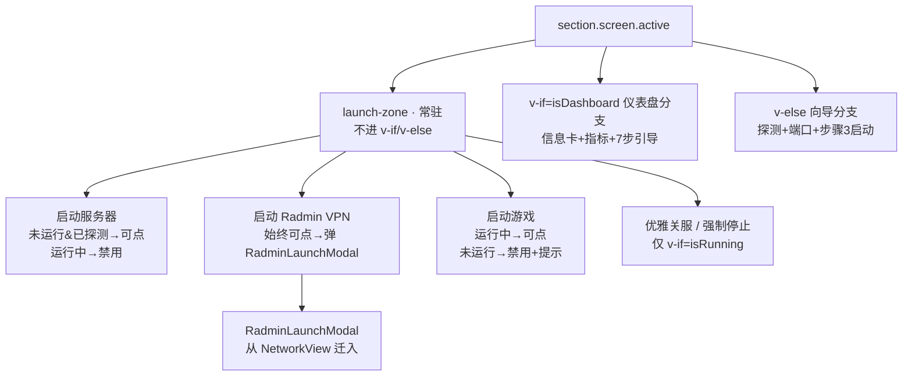
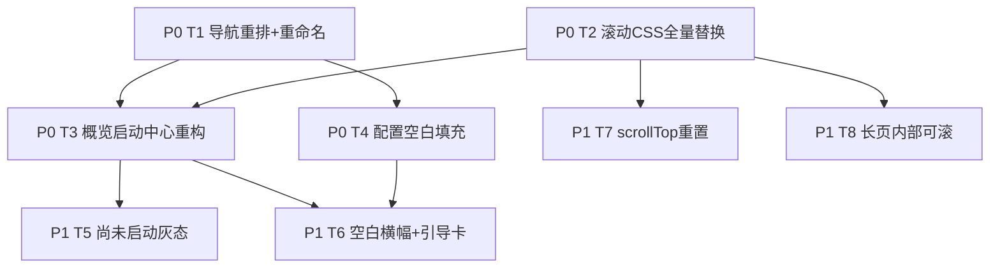

# Palworld 服务器管理器 · UI / 导航重构（修正架构设计 + 任务分解）

> 文档定位：**仅设计、不改代码**（`.vue` / `.rs` / `.css` 一律不动，本文只产出方案与文件:行标注）。
> 输入基线：`docs/ui-ia-redesign.md`（PM 重设计）+ 主理人代码核查结论 + **老板 6 点实机反馈 + 老板拍板硬约束**。
> 本文所有 `文件:行` 已对照真实源码走读核实（非凭记忆）。

---

## 1. 实现方案总览

**一句话目标**：把导航按"开服真实手感"重排成 `概览→配置→网络→玩家管理→RCON→实时日志→本服存档→数据迁移→配置备份→设置`，将"启动服务器 / 启动 Radmin / 启动游戏"三类启动动作**收敛到概览唯一启动中心常驻可见**，并用"全量替换 `.screen` 绝对定位为弹性滚动"根除"窗口限制、内容没展开"，最后补上**仅手动触发**的"一键填充默认配置"功能（后端 `fill_default_config` 命令 + 配置页/概览按钮），让用户首开服不再面对空白配置文件。

| 维度 | 本次重构内容 |
|---|---|
| **信息架构（IA）目标** | 导航顺序 = 开服手感；启动动作收敛到概览；双存档入口去"存档"叠词、职责切分（本服存档 vs 数据迁移） |
| **布局目标** | 全量替换 `position:absolute; inset:0` 脆弱滚动 → `relative + min-height:0` 弹性滚动，长表单不再被裁切 |
| **新功能** | "一键填充默认配置"（仅手动按钮触发，非启动前自动守卫）——解决首开服 `PalWorldSettings.ini` 空白痛点 |

---

## 2. 导航重排实现方案（标注具体文件:行）

### 2.1 主导航终态（按老板拍板序）


### 2.2 改 `src/components/layout/Sidebar.vue`

- **`navItems` 数组 `Sidebar.vue:61-71`**：当前 9 项顺序为 `overview / players / config / network / rcon / saves / migrate / logs / backup`。
  改为建议序（**仅调数组顺序 + 改两处 label**，图标/路径不变）：

  ```ts
  // Sidebar.vue:61-71 修改为：
  const navItems = [
    { path: '/overview', label: '概览',            icon: 'overview' },
    { path: '/config',   label: '配置',            icon: 'config' },
    { path: '/network',  label: '网络',            icon: 'network' },
    { path: '/players',  label: '玩家管理',         icon: 'players' },
    { path: '/rcon',     label: 'RCON 控制台',      icon: 'rcon' },
    { path: '/logs',     label: '实时日志',         icon: 'logs' },
    { path: '/saves',    label: '本服存档',         icon: 'save' },      // 原「存档管理」
    { path: '/migrate',  label: '数据迁移',         icon: 'migration' }, // 原「存档迁移」
    { path: '/backup',   label: '配置备份',         icon: 'backup' },
  ]
  ```

- **重命名两处 label**：`Sidebar.vue:67` `存档管理` → `本服存档`；`Sidebar.vue:68` `存档迁移` → `数据迁移`（已包含在上述数组内，单独点出以防漏改）。
- **底部设置不变**：`Sidebar.vue:39-46`（`<router-link to="/settings">…设置`）**保持原样**，固定底部。

### 2.3 改 `src/router/index.ts`（同步 `meta.title`）

- `router/index.ts:51-56`（`/saves`）`meta: { title: '存档管理' }` → `'本服存档'`。
- `router/index.ts:57-62`（`/migrate`）`meta: { title: '存档迁移' }` → `'数据迁移'`。
- **重定向无影响**：`router/index.ts:12-14` `/` → `/overview` 不变。
- **前置守卫无影响**：`router/index.ts:107-113` `beforeEach` 仅读取 `to.meta.title` 写 `document.title`，title 改了会自动同步页签，无需改逻辑。

### 2.4 网络页去启动按钮（详见第 4 点）

`src/views/NetworkView.vue:48-51` 的「启动 Radmin VPN」按钮 + `onLaunchRadmin`（`NetworkView.vue:113-125`）+ `RadminLaunchModal` 引用（`NetworkView.vue:69`、`95`）**整体移除**；网络页只保留端口放行（`PortCard`）与 Radmin 5 档就绪度检测/引导（`RadminReadinessCard`）。启动动作迁至概览。

---

## 3. 概览 = 一键启动中心重构（核心改动，标注 OverviewView.vue 具体行）

### 3.1 当前 Bug 复盘（已核实）

- `OverviewView.vue:4` `<template v-if="isDashboard">` 仪表盘分支的 `page-actions`（`OverviewView.vue:10-20`）**只有「启动游戏 / 优雅关服 / 强制停止」，没有「启动服务器」**。
- `OverviewView.vue:154-164`「启动服务器」按钮**只在向导分支 `v-else`（`OverviewView.vue:88`）内、`v-if="uiStore.wizard.detected"` 下渲染**。
- 结果：一旦探测完进入 dashboard（`uiStore.setMode('dashboard')`，`OverviewView.vue:297`），「启动服务器」消失 → 用户以为没功能（反馈②）。

### 3.2 重构方案：抽出**常驻启动区**（不进任一分枝）

在 `<section class="screen active">`（`OverviewView.vue:2`）内、**`v-if="isDashboard"`（行 4）与 `v-else`（行 88）之外**，新增一个独立于双模式的 `<div class="launch-zone">` 区块（建议作为 `<section>` 的第一个子节点，置于行 4 之前）。该区块在两种模式都渲染，彻底修复"进 dashboard 后启动按钮消失"。



### 3.3 三按钮按"运行状态"显隐（硬规则）

新增两个 computed（或直接复用既有 store）：
- `serverPathDetected = computed(() => !!settingsStore.settings.server_path)`
- `isRunning = computed(() => serverStore.status.running)`（与 `Sidebar.vue:73` 同源）

| 按钮 | 显隐/禁用规则 | 绑定事件 | 禁用/提示文案 |
|---|---|---|---|
| **启动服务器** | 始终显示；`isRunning` → 禁用（避免重复拉起）；`!serverPathDetected` → 禁用 | `onStart`（复用 `OverviewView.vue:288-304`） | `!serverPathDetected`：`请先在【设置】或向导定位服务器目录`；`isRunning`：`服务器运行中` |
| **启动 Radmin VPN** | 始终可点 | `onLaunchRadmin`（**从 NetworkView 迁入**，见 3.4） | 无；点击弹 `RadminLaunchModal` |
| **启动游戏** | `isRunning` → 可点；`!isRunning` → 禁用 | `onLaunchGame`（复用 `OverviewView.vue:224-235`） | `!isRunning`：`请先启动服务器` |
| **优雅关服 / 强制停止** | **仅 `v-if="isRunning"`** 显示 | 复用 `onGracefulShutdown` / `onForceStop` | — |

> 关键：原 `OverviewView.vue:10-20` 里的「启动游戏 / 优雅关服 / 强制停止」**移入** launch-zone 统一管理；向导分支里 `OverviewView.vue:154-164` 的「启动服务器」**移入** launch-zone（向导分支删除该段，避免重复）。

### 3.4 RadminLaunchModal 迁入概览

- 从 `NetworkView.vue` 移除 `RadminLaunchModal` 引用与 `onLaunchRadmin`，**迁到 `OverviewView.vue`**：
  - `OverviewView.vue` 的 `<script setup>` 增加 `import RadminLaunchModal from '@/components/ui/RadminLaunchModal.vue'` 与 `const radminLaunchVisible = ref(false)`；
  - 新增 `onLaunchRadmin`（逻辑照抄 `NetworkView.vue:113-125`，仅 `radminLaunchVisible.value = true`）。
- 网络页 `RadminReadinessCard` 的"下一步"动作分发（`NetworkView.vue:153-178`）保留在网络页，因为它只做检测/引导，不启动。

### 3.5 7 步联机引导保留

`OverviewView.vue:76-84` 的 `guide-section`（7 步引导）**保留在仪表盘分支内**，不删除。

### 3.6 指标"尚未启动"灰态（Q6，P1 细化，详见任务 T5）

仪表盘分支内指标卡（`OverviewView.vue:27,31,35,55`）与信息卡的 `—` 兜底，改为"尚未启动"灰态文案（见第 7 点 T5）。本期（P0）先保证启动区常驻；灰态文案细化放 P1。

---

## 4. 配置文件空白填充（仅手动按钮）后端设计

> **老板硬约束（Q3）**：后端**仍需**实现 `ensure_config_initialized` 逻辑（模板复制 → `default_config_map()` 兜底 → 明确报错），但**改为"按钮触发"，绝不**在 `start_server` 入口自动调用守卫。

### 4.1 路径约定（Q4：本期仅 Windows 专用服）

| 角色 | 路径（基于 `server_path` = PalServer 根目录） |
|---|---|
| live 目标 | `{server_path}/Pal/Saved/Config/WindowsServer/PalWorldSettings.ini`（与 `config.rs:148-153` `restore_config_backup` 目标一致） |
| 模板来源 | `{server_path}/Pal/Config/WindowsServer/DefaultPalWorldSettings.ini` |

### 4.2 新增后端命令 `fill_default_config`（config.rs）

- 位置：新增于 `src-tauri/src/config.rs`，建议放在 `get_default_config`（`config.rs:478-482`）之后。
- 复用既有：`backup_existing_config`（`config.rs:97-112`，先备份已有 live）、`default_config_map`（`config.rs:183-312`）、`read_config_from_file`（`config.rs:316`）的解析思路。

```rust
#[derive(Serialize, Clone)]
pub struct FillConfigResult {
    pub status: String,   // "already_filled" | "filled_from_template" | "filled_from_defaults"
    pub source: String,   // 实际命中/写入的来源路径
    pub message: String,  // 面向用户的中文提示
}

#[command]
pub async fn fill_default_config(server_path: String) -> Result<FillConfigResult, String> {
    if server_path.trim().is_empty() {
        return Err("未设置服务器路径（server_path 为空）。请到【设置】填写 PalServer.exe 所在根目录后再试。".into());
    }
    let live = PathBuf::from(&server_path)
        .join("Pal").join("Saved").join("Config").join("WindowsServer").join("PalWorldSettings.ini");
    let template = PathBuf::from(&server_path)
        .join("Pal").join("Config").join("WindowsServer").join("DefaultPalWorldSettings.ini");

    // ① 已填好（含 OptionSettings=( ）→ 跳过
    if live.exists() {
        if let Ok(content) = std::fs::read_to_string(&live) {
            if content.contains("OptionSettings=(") {
                return Ok(FillConfigResult {
                    status: "already_filled".into(),
                    source: live.to_string_lossy().into(),
                    message: "PalWorldSettings.ini 已含配置，无需填充。".into(),
                });
            }
        }
    }

    // ② 模板存在 → 先备份 live（若有），再复制模板
    if template.exists() {
        backup_existing_config(live.to_str().unwrap_or("")); // 复用 config.rs:97
        std::fs::copy(&template, &live).map_err(|e| format!("复制默认模板失败: {}", e))?;
        return Ok(FillConfigResult {
            status: "filled_from_template".into(),
            source: template.to_string_lossy().into(),
            message: "已从 DefaultPalWorldSettings.ini 填充 PalWorldSettings.ini，可正常开服。".into(),
        });
    }

    // ③ 模板缺失 → 用内置默认值物化兜底
    let map = default_config_map(); // config.rs:183
    if !map.is_empty() {
        let mut options: Vec<(String, String)> = map.into_iter().collect();
        options.sort_by(|a, b| a.0.cmp(&b.0));
        let lines: Vec<String> = options.into_iter().map(|(k, v)| format!("{}={}", k, v)).collect();
        let content = format!("[ /Script/Pal.PalGameWorldSettings ]\nOptionSettings=({})\n", lines.join(","));
        if let Some(parent) = live.parent() {
            if !parent.as_os_str().is_empty() && !parent.exists() {
                std::fs::create_dir_all(parent).map_err(|e| format!("创建配置目录失败: {}", e))?;
            }
        }
        std::fs::write(&live, content).map_err(|e| format!("写入默认配置失败: {}", e))?;
        return Ok(FillConfigResult {
            status: "filled_from_defaults".into(),
            source: "builtin default_config_map()".into(),
            message: "未找到默认模板，已用内置默认值初始化 PalWorldSettings.ini。".into(),
        });
    }

    // ④ 两者皆无 → 明确报错，绝不静默
    Err("未找到默认配置模板 DefaultPalWorldSettings.ini，且内置默认值不可用。请确认 server_path 指向 PalServer 根目录。".into())
}
```

> **不触碰 `start_server`**：`src-tauri/src/server.rs` 的 `start_server` **不调用** `fill_default_config`，保持现状（老板 Q3 明确仅手动）。

### 4.3 新增只读配套命令 `is_config_initialized`（用于横幅显隐）

为让"空白横幅"在用户点击前就能判断是否该显示，新增同模块只读命令（横幅不必要每次都写盘，仅探测）：

```rust
#[command]
pub async fn is_config_initialized(server_path: String) -> Result<bool, String> {
    if server_path.trim().is_empty() {
        return Ok(false);
    }
    let live = PathBuf::from(&server_path)
        .join("Pal").join("Saved").join("Config").join("WindowsServer").join("PalWorldSettings.ini");
    if !live.exists() {
        return Ok(false);
    }
    let content = std::fs::read_to_string(&live).map_err(|e| format!("读取配置文件失败: {}", e))?;
    Ok(content.contains("OptionSettings=("))
}
```

### 4.4 注册命令（main.rs）

在 `src-tauri/src/main.rs:56-83` 的 `generate_handler!` 的 `config::` 分组（`main.rs:60-62`）内追加两条，**不改动其他任何已注册命令（F4/F5 等）**：

```rust
config::read_config, config::write_config, config::get_default_config,
config::get_config_descriptions, config::list_config_backups,
config::restore_config_backup,
config::fill_default_config,        // 新增
config::is_config_initialized,      // 新增
```

### 4.5 前端手动按钮 + 横幅（仅手动触发）

- **配置页按钮**（P0）：`src/views/ConfigView.vue:10-14` 的 `page-actions` 内，在「保存配置」前/后新增「一键填充默认配置」按钮（`btn-ghost`），`@click="onFillDefault"`。
- **概览空白横幅**（P1，见 T6）：`OverviewView.vue` 顶部按需插入琥珀色横幅，条件 `!isConfigInitialized && serverPathDetected`。
- **前端 API 封装**：在 `src/api/tauri.ts:71-87` 的 `api.config` 命名空间新增：
  ```ts
  fillDefault: (serverPath: string) => tauriInvoke<FillConfigResult>('fill_default_config', { serverPath }),
  isInitialized: (serverPath: string) => tauriInvoke<boolean>('is_config_initialized', { serverPath }),
  ```
  类型 `FillConfigResult` 加入 `src/types/tauri.ts`。
- **文案**（照 `ui-ia-redesign.md` 第五章 5.5）：
  - 横幅（琥珀）：`⚠ 检测到 PalWorldSettings.ini 为空。可[点此立即填充默认配置]，或到 PalServer 目录手动复制 DefaultPalWorldSettings.ini。`
  - 成功 Toast：`已从默认配置模板初始化 PalWorldSettings.ini，可正常开服。`
  - 模板缺失 Toast（**非静默**）：`未找到默认配置模板 DefaultPalWorldSettings.ini，请确认 server_path 指向 PalServer 根目录。`

---

## 5. 滚动布局全量替换（标注 style.css 具体行）

### 5.1 根因（已核对 `style.css:174-249`）

```css
.body  { flex: 1; display: flex; min-height: 0; }                 /* style.css:174 */
.main  { flex: 1; position: relative; min-width: 0; overflow: hidden; } /* style.css:234-240 */
.screen{ position: absolute; inset: 0; display: none; flex-direction: column;
         padding: 24px 28px 28px; gap: 18px; overflow-y: auto; }  /* style.css:241-249 */
```

脆弱点：`.screen{position:absolute; inset:0}` 把滚动盒**绑死在 `.main` 尺寸**；一旦窗口缩放 / 父链 `min-height` 失效，滚动条落到可视区外 → 内容在窗口底边被裁、滚不到（用户"窗口限制、内容没展开"）。

### 5.2 修正方案（替换 `style.css:234-249`）

```css
.main {
  flex: 1;
  position: relative;
  min-width: 0;
  min-height: 0;        /* 新增：允许内部滚动 */
  overflow: hidden;
}
.screen {
  position: relative;   /* 改：不再 absolute */
  height: 100%;
  min-height: 0;        /* 关键：打破 flex 默认 min-height:auto */
  display: none;
  flex-direction: column;
  padding: 24px 28px 28px;
  gap: 18px;
  overflow-y: auto;     /* 滚动层唯一归属 .screen */
}
.screen.active { display: flex; }
/* 长分区卡片自身也需 min-height:0，避免被父 flex 裁切 */
.cfg-group, .sm-section, .op-grid { min-height: 0; }
```

### 5.3 需内部可滚的长页面（P1 微调，见 T8）

| 文件 | 长区块 | 处理 |
|---|---|---|
| `ConfigView.vue` | `CfgGroup`（4 组：基础/玩法/战斗/网络，`style.css:411-417` 已 `overflow:hidden`） | 加 `min-height:0`；极长组允许 `max-height + overflow-y:auto`（该组自身 `min-height:0`） |
| `SaveMigrationView.vue` | `op-grid`（操作网格） | 加 `min-height:0`；整体由 `.screen` 统一滚 |
| `SaveManagementView.vue` | 世界/角色列表区 | 长列表内部 `overflow-y:auto` + `min-height:0` |
| `NetworkView.vue` / `PlayersView.vue` / `RconView.vue` | 端口卡 / 玩家表 / 终端 | 终端已有自身滚动（`style.css:571-575`）；其余随 `.screen` 滚动即可 |

### 5.4 路由切换重置滚动（P1，见 T7）

在 `router/index.ts:107-113` 的 `beforeEach` 内，进入新路由后 `scrollTop = 0`（或对各 `.screen` 设 `scrollTop=0`），避免返回时长表单停在奇怪位置。

---

## 6. 本服存档 / 数据迁移职责分离 + 重命名落地清单

### 6.1 三处同步改（警告：只改其一会造成侧栏与页头不一致）

| 入口 | 改动点 | 当前 → 新 |
|---|---|---|
| 侧栏 label | `Sidebar.vue:67` | `存档管理` → `本服存档` |
| 路由 title | `router/index.ts:55` | `存档管理` → `本服存档` |
| 页内 title | `SaveManagementView.vue:5` `<div class="page-title">存档管理</div>` | → `本服存档` |
| 侧栏 label | `Sidebar.vue:68` | `存档迁移` → `数据迁移` |
| 路由 title | `router/index.ts:61` | `存档迁移` → `数据迁移` |
| 页内 title | `SaveMigrationView.vue:5` `<div class="page-title">存档迁移</div>` | → `数据迁移` |
| 页内描述 | `SaveMigrationView.vue:7`（提及"存档管理"） | `存档管理` → `本服存档`（措辞一致） |

### 6.2 职责切分与必须暴露的操作（均 100% 基于 `discover_worlds` + `settings.server_path`，不写死个人路径）

| 页面（新名） | 必须暴露的可点操作 | 后端命令（已注册，不新增） |
|---|---|---|
| **本服存档**（`SaveManagementView`） | ①刷新检测 ②选择世界 ③备份当前世界 ④恢复到此世界 ⑤角色导出 ⑥角色导入（SteamID 输入） | `discover_worlds` / `backup_world` / `restore_world` / `export_character` / `import_character` |
| **数据迁移**（`SaveMigrationView`） | ①Fix Host Save ②整包世界迁移 ③跨服角色转移 ④科技点编辑 ⑤玩家属性编辑 ⑥停止服务器（改写前置） | `fix_host_save` / `migrate_world_to_server` / `transfer_character` / `edit_tech` / `edit_player_attr` |

> 上述操作在主代码中**均已 `invoke` 后端**（主理人核查 + PM 走读确认），本修正只动 UI 暴露方式与文案，**不新增后端命令、不改写已有命令**。

### 6.3 普适性修正（Q8：server_path 缺失不静默扫默认目录）

- `server_path` 未设置时：`SaveManagementView` / `SaveMigrationView` 顶部显示**引导卡**——「尚未设置服务器路径，请到【设置】填写 PalServer 根目录后再来」，不静默扫默认目录。
- 操作常驻可见：未选世界也置灰展示按钮（附禁用原因"请先选择世界"），消除空态感。
- 每页顶部横幅显示 `存档根目录（基于 server_path 自动发现）：<save_root>`；`auto_discovered` 时换琥珀色提示"已自动向上扫描定位，请确认这正是你的帕鲁世界存档位置"。

---

## 7. 任务列表（有序、含依赖、按实现顺序，标注 P0/P1）

> 说明：T1–T4 为 P0（核心重构+新功能），T5–T8 为 P1（细化/文案/微调）。依赖关系见 §7.2 图。

| 任务 ID | 任务名 | 涉及文件（≥3） | 依赖 | 优先级 |
|---|---|---|---|---|
| **T1** | 导航重排 + 双存档入口重命名 | `Sidebar.vue:61-71`、`router/index.ts:51-62`、`SaveManagementView.vue:5`、`SaveMigrationView.vue:5,7` | 无 | **P0** |
| **T2** | 滚动布局全量替换（style.css） | `style.css:234-249`、`style.css:411-417`、`router/index.ts:107-113`（scrollTop 预留） | 无 | **P0** |
| **T3** | 概览启动中心重构（常驻启动区 + 网络去按钮） | `OverviewView.vue:2-4,10-20,88,154-164`、`NetworkView.vue:48-51,69,95,113-125`、`RadminLaunchModal.vue`（迁入引用） | T1 | **P0** |
| **T4** | 配置空白填充（后端命令 + 前端手动按钮） | `config.rs`（新增 `fill_default_config`/`is_config_initialized`）、`main.rs:60-62`、`api/tauri.ts:71-87`、`ConfigView.vue:10-14`、`types/tauri.ts` | 无（后端）/ T1（前端） | **P0** |
| **T5** | 指标"尚未启动"灰态细化 | `OverviewView.vue:27,31,35,55`、`Sidebar.vue:13-22`（指标卡）、`style.css`（新增 `.idle` 灰态样式） | T3 | **P1** |
| **T6** | 空白横幅文案 + server_path 引导卡 | `OverviewView.vue`（新增横幅）、`ConfigView.vue`（横幅）、`SaveManagementView.vue`、`SaveMigrationView.vue`（引导卡） | T3, T4 | **P1** |
| **T7** | 路由切换 scrollTop 重置 | `router/index.ts:107-113` | T2 | **P1** |
| **T8** | 各长页内部可滚微调 | `ConfigView.vue`（CfgGroup）、`SaveMigrationView.vue`（op-grid）、`SaveManagementView.vue`（列表）、`style.css` | T2 | **P1** |

### 7.1 依赖说明

- **T1 先于 T3**：导航顺序/重命名定稿后，概览启动中心与网络去按钮的语义才完整（尤其"启动收敛到概览"依赖导航序）。
- **T2 先于 T3/T7/T8**：滚动基座改完，概览长内容、scrollTop 重置、长表单微调才有承载。
- **T4 后端独立**，前端按钮落在 `ConfigView` 依赖 T1 的导航稳定；横幅（T6）依赖 T3/T4。
- **T5 依赖 T3**：灰态指标在启动区常驻化之后做细化最稳。

### 7.2 任务依赖图



---

## 8. 共享知识 / 跨文件约定

- **设计 token 沿用**：所有颜色/圆角统一引用 `style.css:8-94` 的 `--palwarm-*`（`--palwarm-primary` 珊瑚暖橙、`--palwarm-muted-foreground` 灰态、`--palwarm-state-warning` 琥珀）。新增灰态 `.idle` 用 `--text-lo` / `--palwarm-muted-foreground`，**禁止散写十六进制**。
- **RadminLaunchModal 复用**：弹窗组件 `@/components/ui/RadminLaunchModal.vue` 从网络页迁至概览，**组件本身不重写**，仅改引用位置（NetworkView 移除、OverviewView 引入）。
- **discover_worlds 动态发现复用**：本服存档/数据迁移两页均调用 `api.save.discoverWorlds()`（`src/api/tauri.ts:130`），路径 100% 来自 `settings.server_path`，UI 不写死任何个人目录。
- **backup_existing_config 复用**：`fill_default_config` 在覆盖 live 前调用 `config.rs:97` 的 `backup_existing_config` 做安全副本。
- **onboardingStore 7 步引导复用**：`OnboardingProgress`（`OverviewView.vue:78`、`NetworkView.vue:74`）共用同一 `onboardingStore.steps`，两页展示一致。
- **toast 约定**：统一用 `useToast()`（`toast.success/warning/error/info`），错误文案透传后端 `Err(String)`。

---

## 9. 与现有命令的接口契约

### 9.1 新增命令（均在 `config.rs`，注册于 `main.rs` config 分组）

| 命令 | 入参 | 返回（成功） | 返回（失败 / Err） |
|---|---|---|---|
| `fill_default_config` | `server_path: String`（PalServer 根目录） | `FillConfigResult`（见 §9.2） | `String`：`server_path` 空 / 复制失败 / 写入失败 / 模板与默认值皆缺（见 §4.2 ④） |
| `is_config_initialized` | `server_path: String` | `bool`（live 存在且含 `OptionSettings=(` 为 true） | `String`：读取失败 |

### 9.2 `FillConfigResult` JSON Schema

```json
{
  "$schema": "http://json-schema.org/draft-07/schema#",
  "title": "FillConfigResult",
  "type": "object",
  "properties": {
    "status": {
      "type": "string",
      "enum": ["already_filled", "filled_from_template", "filled_from_defaults"],
      "description": "already_filled=已含配置跳过；filled_from_template=从 DefaultPalWorldSettings.ini 复制；filled_from_defaults=内置默认值物化"
    },
    "source": {
      "type": "string",
      "description": "实际命中/写入的来源路径或来源标识"
    },
    "message": {
      "type": "string",
      "description": "面向用户的中文提示文案，直接用于 Toast"
    }
  },
  "required": ["status", "source", "message"]
}
```

### 9.3 硬约束

- **不新增其他后端模块**：仅扩展 `config.rs`，不新建 `.rs` 文件。
- **不动 F4/F5 已注册命令**：`save_transfer::*`、`save_edit::*` 等既有命令签名/行为不变。
- **不改动 `start_server`**：不在启动前自动调用 `fill_default_config`（老板 Q3 仅手动）。
- **路径仅 Windows**：本期 hardcode `WindowsServer/`，不做 `LinuxServer/` 平台分支（Q4 取舍）。

---

## 10. 待明确事项

1. **概览"尚未启动"灰态的展示层级**：当前 `isDashboard` 仅在启动成功后置真（`OverviewView.vue:297`），未运行用户实际落在向导分支。要让未运行用户也看到"指标灰态=尚未启动"，需**放宽模式门控**（让 detected-but-not-running 也渲染指标网格灰态）——建议 T5 内评估；若维持严格门控，则灰态仅在运行中指标缺失时显现。
2. **`is_config_initialized` 是否必要**：若团队希望严格"只加 `fill_default_config` 一个命令"，横幅显隐可改为"配置页加载后对比 `read_config` 返回值是否为纯默认"来推断——但 `read_config` 对空文件也返回默认（无法区分），故**推荐保留 `is_config_initialized`**（已在 §4.3 给出）。
3. **Q4 平台分支**：本期仅 Windows 专用服（`WindowsServer/`）。若后续要支持 Linux 服务端，需在 `fill_default_config` 内按平台选 `LinuxServer/`，属后续迭代。
4. **配置备份 / 设置页仍为 PlaceholderView**：`router/index.ts:64-92` 两页复用占位组件，本次仅改导航 label/title，不实现业务（与老板"启动收口在概览"一致，不在本轮范围）。

---

> 文档结束。所有改动均为设计标注，**未对任何源代码文件做修改**。实现由工程师按 §7 任务列表（T1–T8）执行。
