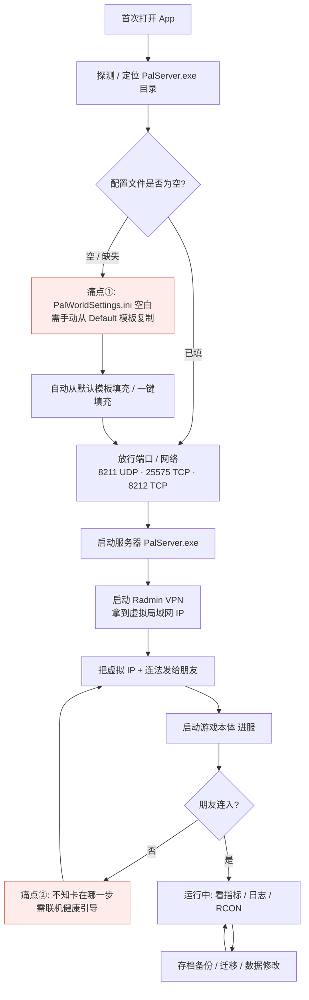
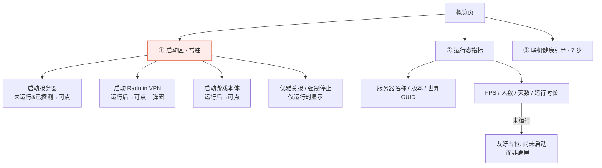

# Palworld 服务器管理器 · UI / 信息架构（IA）重设计文档

> 文档定位：仅调研 + 设计，**不修改任何代码**（`.vue` / `.rs` / `.css` 一律不动）。
> 调研基线：主理人代码核查结论（功能已全接上）+ 用户 6 点实机反馈 + 真实源码走读。
> 关键事实已在文中以 `文件:行` 标注，便于核对。

## 0. 设计总原则（先对齐，后面章节都服从它）

1. **流程优先于功能归类**：导航顺序 = 真实开服手感，不是"后端有哪些命令"。
2. **启动类操作收敛到一处**：①启动 PalServer ②启动 Radmin VPN ③启动游戏本体，三者统一在"概览 = 一键启动中心"常驻可见，**绝不分摊到 Network / 散落各处**。
3. **永不出现"假空态"**：指标/列表在服务器未运行时应显示友好占位（"尚未启动"），而不是一堆 `—` 让人以为"没功能"。
4. **路径 100% 用户可配、UI 100% 动态发现**：所有存档/配置路径来自 `settings.server_path` + `discover_worlds`，不写死任何个人目录；发现不到就引导用户去检查 `server_path`。
5. **长页面必须能滚、内容不许被裁切**：放弃 `position:absolute; inset:0` 的脆弱滚动方案，改用正常文档流 + `min-height:0` 弹性滚动。
6. **一词一义、不叠词**：两个存档入口去掉令人混淆的"存档"叠词，按"本服存档 vs 数据迁移"切分职责。

---

## 一、开服实际使用流程（用户手感地图）

基于 Palworld 专用服（Steam 下载的 PalServer）真实开服顺序，从"第一次打开 app"到"朋友连进来玩"，完整旅程如下。



| 阶段 | 用户动作 | 对应页面 / 后端命令 | 痛点标注 |
|---|---|---|---|
| 1 定位 | 自动探测或手动选 `PalServer.exe` 目录 | 概览·向导 / `steam.detect` | — |
| 2 初始化配置 | 填 `PalWorldSettings.ini` | 配置 / `config.*`；**启动前** `DefaultPalWorldSettings.ini` | **① 首开服配置文件空白**，需手动复制模板（本次新增自动填充，见第五章） |
| 3 放行网络 | 放行 3 个端口、检测 Radmin 就绪度 | 网络 / `network.checkAll` / `addFirewallRules` | 散落隐患：原"启动 Radmin"按钮在此页（本次移走，见二/四章） |
| 4 启动服务器 | 点"启动服务器" | 概览·启动区 / `start_server` | **② 进 dashboard 后"启动服务器"按钮消失**（本次修复，见四章） |
| 5 联机 | 启动 Radmin VPN、复制虚拟 IP 给朋友 | 概览·启动区 / `launch_radmin_vpn` + `RadminLaunchModal` | **② 原散落在网络页** |
| 6 进服 | 启动游戏本体 | 概览·启动区 / `launch_game` | **② 原只在 dashboard 头部** |
| 7 运行监控 | 看 FPS/人数/日志、发 RCON 指令、管玩家 | 概览指标 / 实时日志 / RCON / 玩家管理 | **② 仪表盘满屏 `—` 像空壳** |
| 8 存档维护 | 备份/恢复、角色导入导出、跨服转移、科技编辑 | 存档管理 / 存档迁移 / `discover_worlds` `backup_world` `restore_world` `export/import_character` `fix_host_save` `migrate_world` `transfer_character` `edit_tech` `edit_player_attr` | **⑤ 两个"存档"入口职责混淆、像空态** |

---

## 二、导航栏重排方案（按流程顺序）

### 2.1 当前顺序 vs 建议顺序对比

> 当前顺序来自 `Sidebar.vue:61-71`（主导航 9 项）+ `Sidebar.vue:39-46`（底部设置）。
> 核心问题：**"启动"散落在概览(向导) / 网络 / 概览(dashboard) 三处**，且顺序不按开服手感。

| # | 当前顺序 | 路径 / 标签 | 当前问题 | 建议顺序 | 调整说明 |
|---|---|---|---|---|---|
| 1 | 概览 | /overview | 启动服务器按钮只在向导态 | **概览** | 升为"启动中心"，三启动常驻 |
| 2 | 玩家管理 | /players | — | 配置 | 开服前先调参（含首启初始化） |
| 3 | 配置 | /config | — | 网络 | 放行端口 + Radmin 就绪度（**去启动按钮**） |
| 4 | 网络 | /network | **含"启动 Radmin"按钮，散落** | 玩家管理 | 运行中 RCON 玩家/公会管理 |
| 5 | RCON 控制台 | /rcon | — | RCON 控制台 | 运行中管理员指令 |
| 6 | 存档管理 | /saves | 与迁移职责混淆 | 实时日志 | 运行中看日志流 |
| 7 | 存档迁移 | /migrate | 与"管理"叠词 | **本服存档（原存档管理）** | 重命名 + 职责澄清 |
| 8 | 实时日志 | /logs | — | **数据迁移（原存档迁移）** | 重命名 + 职责澄清 |
| 9 | 配置备份 | /backup | 占位 | 配置备份 | 配置文件历史备份 |
| 10 | 设置（底部） | /settings | — | 设置（底部固定） | 不变，放路径/首选项 |

### 2.2 建议主导航终态（按开服手感串起来）


| # | 路径 | 标签（建议） | 图标 | 一句话职能 |
|---|---|---|---|---|
| 1 | /overview | 概览 | overview | **一键启动中心** + 运行态仪表盘 + 联机健康引导 |
| 2 | /config | 配置 | config | 编辑 `PalWorldSettings.ini`（首启初始化 + 随时调参） |
| 3 | /network | 网络 | network | 端口放行、**Radmin 就绪度检测/引导**（不含"启动"按钮） |
| 4 | /players | 玩家管理 | players | 在线玩家 / 公会（RCON，运行态） |
| 5 | /rcon | RCON 控制台 | rcon | 管理员指令（广播/踢人/关服通知） |
| 6 | /logs | 实时日志 | logs | 服务器日志流 |
| 7 | /saves | **本服存档** | save | 本服世界备份/恢复、单服角色导出导入 |
| 8 | /migrate | **数据迁移** | migration | 本地→专用服 / Fix Host Save / 跨服转移 / 科技·属性修改 |
| 9 | /backup | 配置备份 | backup | 配置文件历史备份列表与还原 |
| 10 | /settings | 设置（底部） | settings | 服务器路径 / 首选项 |

> 解决"网络里又是启动"：把 Radmin **启动**动作移到概览启动区，网络页只保留"检测/放行 + 就绪度引导"，启动链路不再跨页。

---

## 三、每个导航栏职能说明书

### 3.1 职责切分总表

| 导航 | 负责什么 | 不负责什么 | 与相邻页的边界 |
|---|---|---|---|
| **概览** | 三启动（服务器/Radmin/游戏）、运行态指标、联机 7 步引导、开关服 | 不编辑配置细节、不做存档操作 | 配置细节交给"配置"页；Radmin **检测/就绪度**在"网络"页，"启动"在本页 |
| **配置** | `PalWorldSettings.ini` 全部参数（基础/玩法/战斗/网络）、AdminPassword、保存即写盘 | 不负责端口放行、不负责启动 | 端口在网络；启动在概览；保存后需重启才生效（已有提示） |
| **网络** | 3 端口状态 + 一键放行；Radmin 5 档就绪度检测与"下一步"引导 | **不含"启动 Radmin"按钮**（已移走） | "启动 Radmin"在概览；放行结果影响概览联机引导 |
| **玩家管理** | 在线玩家列表、公会、白名单（RCON） | 不负责启动、不负责日志 | 数据来自 RCON；指令类去 RCON 页 |
| **RCON 控制台** | 自由指令、广播、关服通知、踢人 | 不做玩家列表展示 | 玩家列表在"玩家管理" |
| **实时日志** | 服务器 stdout/stderr 日志流、关键字高亮 | 不做指标聚合 | 指标在概览 |
| **本服存档**（原存档管理） | 本服世界**备份/恢复**（P0）+ 单服**角色导出/导入**（P1） | **不含跨服转移 / Fix Host / 科技编辑** | 跨服转移 / Fix Host / 科技编辑全在"数据迁移" |
| **数据迁移**（原存档迁移） | 本地→专用服整包迁移（P0）、Fix Host Save（P0）、跨服角色转移（P1）、科技点+属性修改（P1） | 不含"本服整包备份"（那是本服存档） | 与"本服存档"互补：拷贝安全路径 vs 改写/转换路径 |
| **配置备份** | 配置文件历史版本列表、一键还原 | 不编辑当前配置 | 当前编辑在"配置" |
| **设置** | `server_path`、`config_path`、RCON 等首选项 | 不含业务操作 | 路径是其他页动态发现的基础 |

### 3.2 "存档管理 vs 存档迁移"职责切分（重点澄清）

| 维度 | 本服存档（原"存档管理"） | 数据迁移（原"存档迁移"） |
|---|---|---|
| 核心隐喻 | **保险箱**：把当前服的存档**原样**存好、取回 | **加工厂**：把存档**搬来搬去 / 改写** |
| 安全性 | 纯文件拷贝，不解析/不改写（安全） | 解析改写（F4 自动整目录备份 + 失败回滚） |
| 暴露的真实操作 | ①世界备份 ②世界恢复 ③角色导出 ④角色导入 | ①Fix Host Save ②整包迁移 ③跨服角色转移 ④科技点编辑 ⑤玩家属性编辑 |
| 前提 | 选世界即可 | 改写前**自动停服**（已有 `ensureStopped`） |

### 3.3 两个入口的**重命名建议**（去掉"存档"叠词）

| 入口 | 现名 | 推荐新名 | 备选 | 推荐理由 |
|---|---|---|---|---|
| /saves | 存档管理 | **本服存档** | 存档备份 / 我的存档 | "本服"点明范围，与"迁移"不再叠词；用户一眼知道是"给当前服做备份/导出" |
| /migrate | 存档迁移 | **数据迁移** | 迁移与修改 / 数据工具 | 涵盖 Fix Host / 跨服 / 科技编辑等非"迁移"动作；"数据"更准 |

> **强烈建议同时改 `Sidebar.vue:67-68` 的 `label` 与 `meta.title`（`router/index.ts:51-62`），并同步页内 `page-title`**。仅改其一会造成侧栏与页头不一致。

---

## 四、概览 = 一键启动中心（解决散落 + 按钮消失坑）

### 4.1 当前 Bug 复盘（已走读确认）

- `OverviewView.vue:154-164`：**"启动服务器"按钮只在 `v-else`（向导模式）渲染**。
- `OverviewView.vue:11-19`：进 `v-if="isDashboard"`（仪表盘模式）后，头部只给"启动游戏 / 优雅关服 / 强制停止"，**"启动服务器"消失**。
- 结果：用户一旦探测完进入 dashboard，满屏 `—` 指标 + 找不到启动入口 → 以为"没功能"（反馈②）。

### 4.2 重构方案：概览信息层级



### 4.3 避免"进 dashboard 后启动按钮消失"的硬规则

1. **启动区是一个独立于双模式的常驻区块**：`isDashboard` / 向导模式都渲染它，不放进 `v-if="isDashboard"` 或 `v-else` 任一分支。
2. **三按钮按"状态"而非"模式"显隐**：
   - 启动服务器：未运行且 `server_path` 已探测 → 可点；运行中 → 禁用（避免重复拉起）。
   - 启动 Radmin VPN：始终可点（联机前置），点后弹 `RadminLaunchModal`。
   - 启动游戏：服务器运行中 → 可点；未运行 → 禁用并提示"请先启动服务器"。
3. **关服/停止仅运行时出现**："优雅关服 / 强制停止"放启动区右侧，仅 `isRunning` 时显示；向导态不显示（本来也没在运行）。
4. **指标不再满屏 `—`**：未运行时指标卡显示"尚未启动"文案 + 灰态，引导去点启动区，而不是一堆破折号让人误判为空壳。

### 4.4 概览页结构草图（信息优先级）

```
┌─────────────────────────────────────────────┐
│ [状态卡] 我的帕鲁服 · 已配置·待启动        │
├────────────── ① 启动区（常驻）─────────────┤
│ [🚀 启动服务器]  [🌐 启动 Radmin VPN]  [🎮 启动游戏]   │
│                              （运行中才显示：[优雅关服][强制停止]）│
├────────────── ② 运行态指标 ───────────────┤
│ 服务器名 │ 版本 │ 世界GUID │ FPS │ 人数 │ 天数 │ 时长 │
├────────────── ③ 联机健康引导（7步）────────┤
│ ● 探测目录 → ● 放行端口 → ○ 启动服 → ○ Radmin → ○ 发IP → ○ 进服 → ○ 朋友连入 │
└─────────────────────────────────────────────┘
```

---

## 五、配置文件空白自动填充（新功能 PRD）

### 5.1 痛点（反馈①，真实可复现）

Palworld 专用服标准目录里，`PalWorldSettings.ini` **默认是空的**，官服启动前必须手动把同目录 `DefaultPalWorldSettings.ini` 的内容复制进去。用户首开服时面对空白文件不知所措，攻略让他去某文件夹复制 → 体验断层。

### 5.2 已核实的后端事实（无需从零造轮子）

- 目标配置文件路径（已确认）：`{server_path}/Pal/Saved/Config/WindowsServer/PalWorldSettings.ini`
  - 依据：`config.rs:148-153`（restore 目标）、`rest_proxy.rs:78`。
- 默认模板来源（**待老板确认实际路径/平台分支**）：`{server_path}/Pal/Config/WindowsServer/DefaultPalWorldSettings.ini`
  - 这是 Palworld 专用服标准布局；主理人核查结论亦指向"PalServer 的 Config/WindowsServer 下 DefaultPalWorldSettings.ini"。
- 后端**已有**完整默认参数表 `default_config_map()`（`config.rs:183-312`，注释明确"从实际的 DefaultPalWorldSettings.ini 提取"）→ 即使模板文件缺失，也能作为兜底生成器。
- `read_config_from_file`（`config.rs:316`）在文件 `NotFound` 时已回退到 `default_config_map()`（配置页能显示默认值，但**磁盘上的 .ini 仍为空白**——这就是用户痛点所在：页面看着有值，文件其实是空的）。

### 5.3 检测逻辑（在 `start_server` 前做守卫，见 `server.rs:83`）

```
function ensure_config_initialized(server_path):
    live     = join(server_path, "Pal/Saved/Config/WindowsServer/PalWorldSettings.ini")
    template = join(server_path, "Pal/Config/WindowsServer/DefaultPalWorldSettings.ini")

    if file_exists(live) AND contains(live, "OptionSettings=("):
        return OK                        // 已填好，跳过

    // 情况 A：模板存在 → 复制模板（先备份任何已有的 live）
    if file_exists(template):
        backup_existing_config(live)    // 复用已有 backup_existing_config (config.rs:97)
        copy(template -> live)
        return OK(filled_from_template)

    // 情况 B：模板缺失 → 用 default_config_map() 物化兜底
    if default_config_map() available:
        write_map_to_ini(live, default_config_map())
        return OK(filled_from_defaults)

    // 情况 C：两者皆无 → 明确报错，绝不静默
    return ERR("未找到默认配置模板（DefaultPalWorldSettings.ini），且内置默认值不可用。请确认 server_path 指向 PalServer 根目录。")
```

### 5.4 触发方式（二选一或两者都要，见第八章 Q3）

| 方案 | 描述 | 优点 | 风险 |
|---|---|---|---|
| **A. 启动前自动**（推荐兜底） | 在 `start_server` 入口调用 `ensure_config_initialized` | 用户零操作、永不因空配置静默失败 | 用户可能不知道发生了什么 |
| **B. 手动"一键填充默认配置"按钮**（推荐并存） | 配置页/概览空白横幅上提供按钮，点击即执行上述逻辑 | 透明、可控、可教学 | 需用户主动发现 |
| **A+B（最终推荐）** | 自动守卫保底 + 手动按钮显式化 | 兼顾"不出错"与"看得懂" | 实现略多 |

### 5.5 UI 提示文案（避免"假空态"）

- **概览 / 配置页空白横幅（琥珀色）**：
  > ⚠ 检测到 `PalWorldSettings.ini` 为空。启动服务器时将自动从默认模板填充；或[点此立即填充默认配置]。
- **自动填充成功 Toast**：`已从默认配置模板初始化 PalWorldSettings.ini，可正常开服。`
- **模板缺失报错 Toast（非静默）**：`未找到默认配置模板 DefaultPalWorldSettings.ini，请确认 server_path 指向 PalServer 根目录。启动已取消。`
- **配置页"保存配置"按钮**：保持现状（保存即写盘，运行中需重启）。

### 5.6 失败兜底（硬约束）

- 模板与内置默认值**双双缺失** → `start_server` 返回 `Err(...)`，**中止启动**并弹错误 Toast；**绝不**静默用空配置拉起服务器（否则用户又回到"空白不知道咋填"的无提示状态）。
- 复制/写入失败（权限/路径非法）→ 原样透传错误，不吞异常。

### 5.7 路径假设与待确认（标注）

- `server_path` = PalServer **根目录**（含 `PalServer.exe`）；模板在 `Pal/Config/WindowsServer/`，目标在 `Pal/Saved/Config/WindowsServer/`。
- **待确认 Q4**：Linux 服务端应为 `Pal/Config/LinuxServer/` 与 `Pal/Saved/Config/LinuxServer/`——是否按平台自动分支，还是本期仅支持 Windows 专用服？

---

## 六、Config 等页面滚动布局方案（解决"限制窗口没展开"）

### 6.1 诊断（已走读 `style.css`）

当前布局链（`style.css:174-243`）：

```css
.body  { flex: 1; display: flex; min-height: 0; }
.main  { flex: 1; position: relative; min-width: 0; overflow: hidden; }
.screen{ position: absolute; inset: 0; display: none; flex-direction: column;
         padding: 24px 28px 28px; gap: 18px; overflow-y: auto; }
.screen.active { display: flex; }
```

**脆弱点（即用户"窗口限制、内容没展开"的根因类）**：

1. `.screen` 用 `position:absolute; inset:0` 把滚动盒**绑死在 `.main` 的尺寸上**。一旦 `.main` 因窗口缩放 / 父链 `min-height` 失效 / 某父级高度非定值，`.screen` 就会解析到更高的祖先盒，`overflow-y:auto` 的滚动条落在可视区之外 → 内容在窗口底边被裁掉、滚不到。
2. `.screen` 是 `flex` 列容器，子项默认 `min-height:auto`，当单个子（如 `CfgGroup` 长表单、`SaveMigration` 的 `op-grid`）高于视口时，absolute+flex 组合可能导致该子被 `.main { overflow:hidden }` 裁切而**无滚动提示**。
3. `display:none ↔ display:flex` 切换会重置滚动位置，长表单返回时"跳回顶部"也加剧"没展开"的观感。

### 6.2 布局原则清单（落地时遵守）

1. **弃用 `position:absolute; inset:0` 做页面滚动盒**。改为正常文档流：`.screen { position: relative; height: 100%; min-height: 0; display: flex; flex-direction: column; overflow-y: auto; }`。
2. **弹性滚动三件套**：凡作为 flex 子项且需要内部滚动的容器（`.main`、`.screen`、长 `CfgGroup`、`.sm-section`），都加 `min-height: 0`（打破 flex 默认 `min-height:auto`，这是"flex 子项不滚"的经典根因）。
3. **`.main` 保持 `overflow: hidden` + `min-height: 0`**，让 `.screen` 成为唯一滚动层，避免双重滚动条。
4. **分区卡片不写死高度**：`CfgGroup` / `.sm-section` / `.op-grid` 只用 `padding` + `margin`，**禁止 `height` / `max-height` 把内容盖住**；内容超长时由 `.screen` 统一滚。
5. **长表单分区 + 内部可滚**：配置页 4 个分组（基础/玩法/战斗/网络）做成可独立折叠的卡片；若某组极长，允许该卡 `max-height + overflow-y:auto`（此时该卡自身需 `min-height:0`）。
6. **底部安全边距**：`.screen` 末项加 `padding-bottom` 或 `margin-bottom`，避免内容被窗口圆角/阴影裁掉。
7. **切换页面保留/重置滚动**：路由切换时显式 `scrollTop = 0`，避免"返回时长表单停在奇怪位置"。

### 6.3 推荐基准 CSS（替换现有 `.screen` 方案）

```css
.main {
  flex: 1;
  position: relative;
  min-width: 0;
  min-height: 0;      /* 新增：允许内部滚动 */
  overflow: hidden;
}
.screen {
  position: relative;  /* 改：不再是 absolute */
  height: 100%;
  min-height: 0;       /* 关键：打破 flex 默认 min-height:auto */
  display: none;
  flex-direction: column;
  padding: 24px 28px 28px;
  gap: 18px;
  overflow-y: auto;     /* 滚动层唯一归属 .screen */
}
.screen.active { display: flex; }
/* 长分区卡片如需独立滚动，自身也要 min-height:0 */
.sm-section, .cfg-group { min-height: 0; }
```

---

## 七、存档管理 / 迁移普适性修正

### 7.1 诊断

- 后端 `discover_worlds`（`save_transfer.rs:334`）本就**基于 `server_path` 动态扫描**存档根，UI 层 `SaveManagementView.vue:159` / `SaveMigrationView.vue:250` 均调用它，**并非写死"我的存档位置"**。
- 但**用户感知**为"不具普适性、像空态"（反馈⑤），根因在 UX 而非路径：
  1. 空态文案 / 引导未强调"路径来自你的 `server_path`"，易让人以为只认某个固定目录；
  2. 真实操作（备份/恢复/导出导入/迁移/转移/科技编辑）藏在"先选世界 / 先填 SteamID"等前置条件后，未选时页面只显示"发现了 N 个世界" → 像空壳；
  3. 两个入口都带"存档"叠词，职责混淆（见三/3.3）。

### 7.2 修正原则

1. **路径 100% 来自 `server_path` + `discover_worlds`，UI 不写死任何个人目录**。
2. **`server_path` 未设置时**：不静默扫默认目录，而是显示引导卡——"尚未设置服务器路径，请到【设置】填写 PalServer 根目录后再来"——把"普适性"问题转成显式引导。
3. **操作常驻可见**：即使未选世界，也把"备份当前世界 / 导出角色 / 恢复"等按钮**置灰展示**（附禁用原因"请先选择世界"），让人一眼看到"这页能干什么"，消除空态感。
4. **明确存档根**：每页顶部横幅显示 `存档根目录（基于 server_path 自动发现）：<save_root>`；`auto_discovered` 时换琥珀色提示"已自动向上扫描定位，请确认这正是你的帕鲁世界存档位置"（现有逻辑保留，只是措辞去"我的"）。
5. **两页真实操作面（必须全部暴露，不准只显示"发现了一个世界两个角色"）**：

| 页面（新名） | 必须暴露的可点操作 |
|---|---|
| **本服存档** | ①刷新检测 ②选择世界 ③备份当前世界 ④恢复到此世界 ⑤角色导出 ⑥角色导入（SteamID 输入） |
| **数据迁移** | ①Fix Host Save ②整包世界迁移 ③跨服角色转移（PlayerPicker + 子集勾选）④科技点编辑（TechEditorPanel）⑤玩家属性编辑（改名/等级/Max All）⑥停止服务器（改写前置） |

> 上述操作在现有代码中**均已 `invoke` 后端**（主理人核查结论 + 走读确认），本修正只动 UI 暴露方式与文案，**不新增后端命令**。

---

## 八、待老板拍板的确认点（Q1–Qn）

| 编号 | 确认点 | 推荐选项 | 一句话 |
|---|---|---|---|
| **Q1** | 主导航最终顺序 | 采用第二章建议顺序（概览→配置→网络→玩家→RCON→日志→本服存档→数据迁移→配置备份→设置） | 按开服手感串，启动收敛到概览 |
| **Q2** | 两存档入口重命名 | 存档管理→**本服存档**；存档迁移→**数据迁移** | 去掉"存档"叠词，职责一眼分清 |
| **Q3** | 配置空白填充触发方式 | **A+B 都要**（启动前自动守卫 + 手动"一键填充"按钮） | 既不出错又看得懂 |
| **Q4** | 配置模板路径平台分支 | 本期仅 Windows（`WindowsServer/`），还是按平台自动选 `LinuxServer/` | 影响 `ensure_config_initialized` 的路径拼法 |
| **Q5** | 概览是否唯一启动中心 | 是，Radmin/游戏启动**只**在概览，网络页去启动按钮 | 彻底解决"网络里又是启动" |
| **Q6** | 未运行时指标占位 | 显示"尚未启动"灰态文案，**不用满屏 `—`** | 消除"假空壳"观感 |
| **Q7** | 滚动布局改造范围 | 全量替换 `.screen` 为 `relative + min-height:0` 方案（第六章） | 一次性根除裁切，不止修配置页 |
| **Q8** | `server_path` 缺失时的存档页行为 | 显示引导卡去【设置】填路径，**不静默扫默认目录** | 把"不普适"转成显式引导 |

---

## 附：本文档依据的已核实代码事实

| 事实 | 出处 |
|---|---|
| 后端 13 个命令全部注册且前端已 `invoke` | 主理人核查结论 |
| "启动服务器"按钮仅在向导模式渲染 | `OverviewView.vue:154-164` |
| 仪表盘头部无"启动服务器"、仅有启动游戏/关服 | `OverviewView.vue:11-19` |
| "启动 Radmin VPN"按钮原在网络页 | `NetworkView.vue:48` |
| 配置目标路径 `{server_path}/Pal/Saved/Config/WindowsServer/PalWorldSettings.ini` | `config.rs:148-153` / `rest_proxy.rs:78` |
| 已有 `default_config_map()` 默认参数表 | `config.rs:183-312` |
| `read_config_from_file` 文件缺失回退默认值 | `config.rs:316-325` |
| 滚动布局链 `absolute + overflow:hidden` | `style.css:174-243` |
| 存档发现基于 `discover_worlds`（路径驱动） | `save_transfer.rs:334` |
| 两存档页均已暴露真实操作 | `SaveManagementView.vue` / `SaveMigrationView.vue` |
