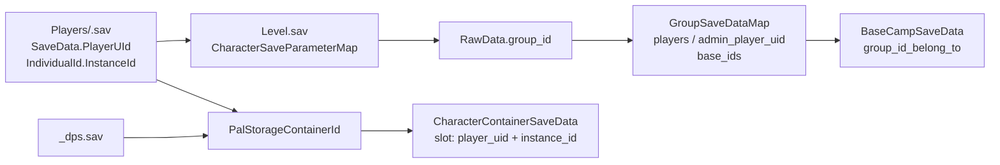

# Palworld 存档迁移二次核验（2026-07）

> 状态：调研结论，尚未授权实现。本文以本地参考源码为证据，取代“只支持 zlib 即可完成首版角色迁移”的判断。
>
> 核验对象：`PalworldSaveTools` 2.1.9（本地快照）与 `zaigie/palworld-server-tool` `f45a48e`；未将宣传页或未落地的本项目设计文档当作事实依据。

## 结论先行

用户要完成的“单机存档搬到新专用服、自己不重玩”，首选是 **整世界迁移**，不是把“角色、世界、公会”拆成三个互不相关的导入操作：

- `Level.sav` 保存世界状态，也保存公会 `GroupSaveDataMap`、角色索引 `CharacterSaveParameterMap`、容器、据点等关联数据。
- `Players/<id>.sav` 保存玩家根数据，如 `PlayerUId`、`IndividualId`、科技点、帕鲁箱容器 ID。
- `Players/<id>_dps.sav` 还保存动态帕鲁箱数据。迁移时必须把实际世界数据目录完整复制，不能只挑 `Level.sav` 或一个玩家文件。
- 单机主机使用特殊的 `0001.sav`；参考工具的 Host/Server 转移流程要求先在目标服生成一个临时角色，从而取得新的游戏 Player UID。要继续使用原主机角色，必须再做 **双向身份交换**。这一步才涉及角色记录、公会成员、所有权和动态帕鲁箱的联动。

因此，网上所说的“转角色、转世界、转公会”方向是对的，但对本产品应表现为一个引导式迁移流程：先完整搬世界，后在需要时修复主机身份；公会数据不应被用户手动拆出来单独导入。

## 已核验的数据模型

本地 Steam 世界目录为 `%LOCALAPPDATA%\\Pal\\Saved\\SaveGames\\<Steam 用户目录>\\<世界目录>\\`；专用服为 `<Palworld>\\Pal\\Saved\\SaveGames\\0\\<世界目录>\\`。这是参考工具 README 的实际发现路径，不代表所有 Steam 库的唯一安装位置。

`.sav` 的处理链是 `容器头 -> 解压 -> GVAS 属性树 -> 已知 RawData 二进制块解码 -> 业务模型`。`PlZ`（类型 50）为双层 zlib，`PlM`（类型 49）为 Oodle；参考项目自己的运行说明明确记录“世界存档为 PLZ，其他存档为 PLM”。所以迁移角色所需的玩家档通常不能靠 zlib-only 实现完成。任何实装都必须对每个输入文件嗅探格式，不能假设 Steam 客户端会把 PLM 重存为 PLZ。

`Level.sav` 的 `worldSaveData` 中，关键关联如下：

角色条目的 `CharacterSaveParameterMap` 同时承载玩家化身和帕鲁；以 `IsPlayer` 区分。玩家昵称、等级、经验等在这张表的 `PalIndividualCharacterSaveParameter` 中，不应从 `Players/<uid>.sav` 顶层推断。该 RawData 的格式为属性块、4 个未知字节、`group_id`、尾部字节，必须保留未知内容才能安全写回。

## 成熟实现给出的边界

`PalworldSaveTools` 的 `fix_host_save.py` 不是简单替换一个 GUID。它交换两份玩家档的 `PlayerUId` / `IndividualId.PlayerUId`，按 `InstanceId` 修正角色键，修正公会的 `individual_character_handle_ids`、`admin_player_uid`、`players`，迁移并更新 `_dps.sav` 的 `OwnerPlayerUId` 与帕鲁箱容器 ID，最后交换玩家文件名。其跨世界 Character Transfer 还将角色、科技、物品、帕鲁、动态数据和公会拆成可控子步骤，并处理 InstanceId 冲突。

另一成熟项目 `zaigie/palworld-server-tool` 把“备份/同步”与“深度改写”分离：整包备份是文件操作，玩家和公会展示来自 SAV 同步。这个边界适合本项目第一版：先把无损世界复制、停服断言、自动备份和回滚做可靠，再开放会改写二进制关联的高级动作。

## 当前仓库的真实状态

当前代码不能宣称已支持本地角色解析或安全迁移：

- `src-tauri/src/save_transfer.rs` 是文件级复制，可用于整包备份/恢复，但不解析或重绑角色。
- `src-tauri/src/save_edit/sav_io.rs` 遇到 `PlM` 直接报错；同时未按参考实现处理 CNK 的双段头。它无法覆盖常见玩家档。
- `src-tauri/src/save_edit/world_copy.rs` 从玩家档顶层读取昵称和等级，但参考实现显示这两个字段位于 `Level.sav` 的角色条目中；摘要会不完整或错误。
- `src-tauri/src/save_edit/fix_host.rs` 是旧 GUID 到新 GUID 的单向原始字节替换，不是双向交换，也没有参考实现所需的玩家档名和容器映射语义。它不能作为 Fix Host Save 的交付实现。

这些模块可保留为探索代码，但在真实存档样本、格式支持和端到端恢复验证完成前，界面必须显示“暂不可用”，不能显示迁移成功。

## 建议的第一版产品流程

1. 选择本地世界，仅读解析并展示：世界名、玩家、公会、存档格式及文件清单；任一 PLM 无可用解码器时明确阻断。
2. 创建并停止目标专用服，先做源和目标两个完整快照。
3. 复制整个世界数据目录；默认保留所有文件，`WorldOption.sav` 由用户明确选择“保留/删除”，不能静默删除。
4. 启动目标服一次，让原主机账号创建临时角色，再优雅停服。
5. 显示旧 `0001` 与新 Player UID 的映射，执行经过字段级验证的双向身份交换；完成后重新加载所有受影响文件，检查 UID 唯一性、角色实例、公会成员、容器和 DPS 引用。
6. 重启服务器，由用户以原账号登录验收原角色、帕鲁箱、公会和基地；任何失败都从本次快照回滚。

单角色跨世界导入应作为第二阶段：它需要 InstanceId 防冲突、目标玩家匹配、公会策略和容器/物品迁移选择，不能伪装成简单文件复制。

## 实现前的硬性验证门槛

- 取得可丢弃的真实 Steam 单机世界和专用服临时世界样本，覆盖 `Level.sav`、一个玩家 `.sav` 和一个 `_dps.sav`，记录每个文件的 magic/type。
- 为每种实际格式建立 `解压 -> 解析 -> 不改写重编码 -> 游戏加载` 测试；只比较顶层字段不足以证明可用。
- 选择并审查可随本项目分发的 PLM/Oodle 解码方案。参考项目的 `palsav-flex` 与 `palooz` 均标为 GPL-3.0-or-later，不能未经许可证评估直接嵌入当前 MIT/Tauri 发布物。
- 对 Fix Host Save 建立真实端到端验收：迁移前后由同一账号登录，验证等级、背包、帕鲁箱、公会和基地；失败路径验证自动回滚。

## 证据索引

- `reference-projects/PalworldSaveTools-main/PalworldSaveTools-main/README.md:318-323,335-476`：本地/专用服路径、`0001.sav`、Host 转移流程。
- `.../AGENTS.md:32`、`src/palsav/palsav/compressor/{enums.py,zlib.py,oozlib.py}`：压缩格式与算法。
- `src/palsav/palsav/{gvas.py,paltypes.py,rawdata/character.py,rawdata/group.py,rawdata/character_container.py,rawdata/base_camp.py}`：GVAS、RawData 与字段关联。
- `src/palworld_toolsets/{fix_host_save.py,character_transfer.py}`：双向 UID 交换和分步骤角色转移。
- `reference-projects/zaigie-palworld-server-tool-vpn/{README.md,api/sync.go,api/backup.go}`：运维产品的同步与备份边界。
- `src-tauri/src/{save_transfer.rs,save_edit/sav_io.rs,save_edit/world_copy.rs,save_edit/fix_host.rs}`：本项目现状核验。
