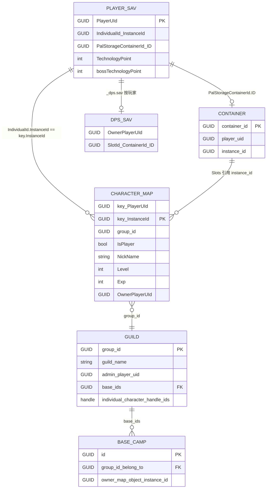
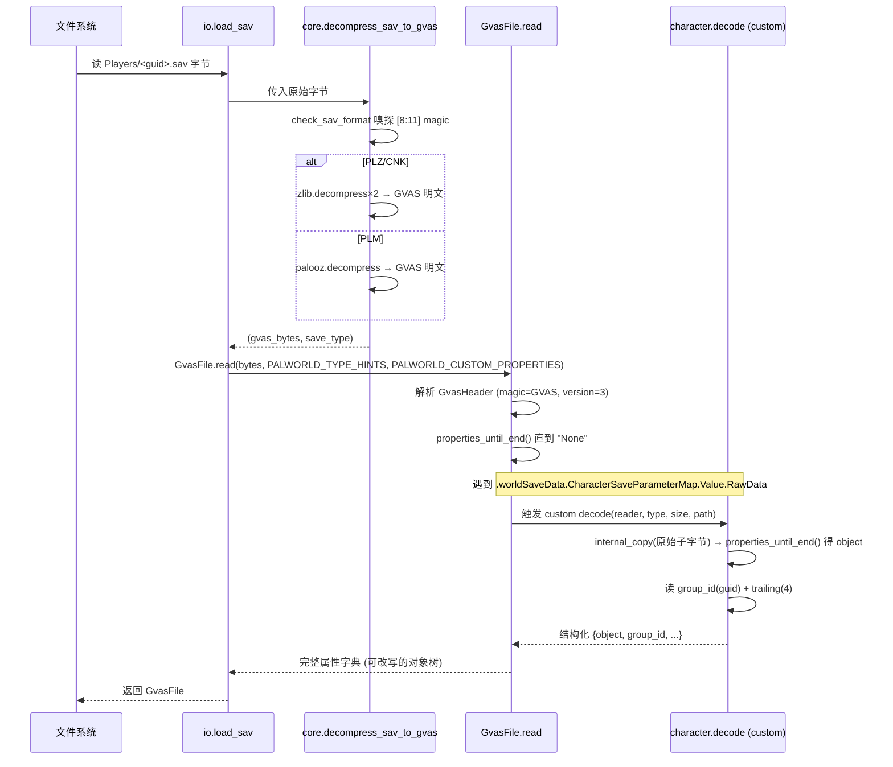

# Palworld 游戏数据库结构 · 初始深研文档

> **二次核验（2026-07-24）**：本文的格式与字段索引应与 [`save-migration-research-validation-2026-07.md`](save-migration-research-validation-2026-07.md) 一同使用。后者基于参考项目源码再次核验了迁移链路，并纠正一项会阻断角色迁移的关键结论：参考项目记录世界存档通常为 PLZ、玩家等其他存档通常为 PLM/Oodle，故“只支持 zlib 即可完成本地角色迁服”不成立。现有 F5 实现也尚未达到可对真实存档宣称成功的标准。

> **文档定位**：Palworld 服务器管理器项目（Tauri2 + Vue3 + Rust）的内部技术深研产物。
> **作者**：架构师 Bob（基于产品经理 Alice 的《竞品功能版图》+ 本地参考项目 `PalworldSaveTools-main` 逐文件读取 + 本项目 `f5-*` 设计文档）。
> **用途**：供后续功能开发（公会/据点/背包/地图/诊断等）作为"游戏真实数据结构"的权威基线，避免重复造轮子、暴露数据准备缺口。
> **方法论**：所有结论均来自实际读取的参考文件（`src/palsav/palsav/*`、`src/palworld_toolsets/*`、`src/palworld_aio/managers/*`、`README.md`）与本项目 `docs/f5-*.md`；字段名/类名/路径尽量给出**可复核出处**。凡无法 100% 确认处，见第 11 章"开放疑问"。

---

## 1. 总览：Palworld 存档数据的本质

Palworld 的存档是 **UE4/UE5 序列化格式（GVAS, *Game Save Archive*）+ 自定义分块压缩容器（`.sav`）** 的组合。理解三条轴线即可把握全局：

| 轴线 | 含义 | 出处 |
|---|---|---|
| **UE 属性树（GVAS）** | 解压后的明文是一个 `GvasHeader` + 一组 `name → {type, size, value}` 的属性，直到哨兵属性 `None`；尾部有 trailer（通常 4 字节 `\x00\x00\x00\x00`）。这是真正"数据库"的部分。 | `palsav/gvas.py::GvasHeader` / `GvasFile`；`palsav/archive.py::FArchiveReader.properties_until_end` |
| **分块压缩容器（.sav）** | 磁盘上的 `.sav` 不是裸 GVAS，而是外面套了一层 12 字节（CNK 为 24 字节）头 + 压缩负载。压缩算法有 **PLZ（zlib 双压缩）** 与 **PLM（Oodle/Kraken）** 两种。 | `palsav/compressor/__init__.py::_parse_sav_header`；`compressor/enums.py::SaveType` |
| **多文件分工** | 一个"世界"由多个 `.sav` 组成：`Level.sav`（世界数据）、`Players/<guid>.sav`（每个玩家一份）、`LevelMeta.sav`、`WorldOption.sav`、`LocalData.sav`，以及每个玩家的 `<guid>_dps.sav`（动态帕鲁箱）。 | `README.md`（路径章节）；`fix_host_save.py`（Players/Level 联动） |

**三种来源形态**（核心差异仅在磁盘路径与"主机 UID"约定，数据内部结构一致）：

- **Steam 单机 / 联机（Host/Co-op）**：`%localappdata%\Pal\Saved\SaveGames\<YOURID>\<RANDOMID>\`。主机固定为 `0001.sav`（UID = `00000001-0000-0000-0000-000000000001`）。
- **专用服（Dedicated）**：`steamapps\common\Palworld\Pal\Saved\SaveGames\0\<RANDOMSERVERID>\`。多一层 `0/` 外层；所有玩家都是随机 GUID，无固定"主机"概念（"主机"= 公会会长）。
- **Xbox / GamePass**：存档被加密在 `.wgs` 容器内（Packages 目录），需先提取（`palworld_xgp_import` + `xgp_save_extract.py`）才能落到上述目录结构。本项目 MVP 明确排除（R10）。

> **关键洞察**：所谓"数据库"，在 Palworld 里是 **一组互相通过 GUID / InstanceId 引用的 GVAS 属性树**。不存在 SQLite/JSON 文件；所有"表"都是 `worldSaveData` 下的某个 `MapProperty`/`ArrayProperty`。

---

## 2. 磁盘布局（本地 vs 服务器）

### 2.1 单世界目录树（两种来源共通）

```
<SaveGames>/
├── Level.sav                      # 世界数据根：GVAS 顶层属性名 = worldSaveData
├── LevelMeta.sav                  # 世界元信息（世界名等）：GVAS 顶层 = SaveData
├── WorldOption.sav                # 世界参数（覆盖 PalWorldSettings.ini）：GVAS 顶层 = SaveData
├── LocalData.sav                  # 本地地图 UI 数据（迷雾/已探索）：GVAS 顶层 = SaveData
└── Players/
    ├── 0001.sav                   # 主机玩家（单机/联机）；专用服为随机 GUID.sav
    ├── 1234.sav                   # 客机玩家（每个在线玩家一份，文件名=其 GUID）
    ├── 0001_dps.sav               # 该玩家的"动态帕鲁箱"（Dynamic Pal Storage）
    └── 1234_dps.sav
```

> 出处：`README.md` 第 318/323 行（`%localappdata%\Pal\Saved\SaveGames\YOURID\RANDOMID\` 与 `...SaveGames\0\RANDOMSERVERID\`）；`fix_host_save.py` 中 `Players/<guid>.sav` 与 `<guid>_dps.sav` 的处理。

### 2.2 各文件"存什么、顶层属性名是什么"

| 文件 | GVAS 顶层属性名 | 根结构体（推断） | 主要内容 | 出处 |
|---|---|---|---|---|
| `Level.sav` | `worldSaveData` | `WorldSaveData` | 公会、角色、容器、地图对象、据点、工事、植被……——**真正的世界数据库** | `palobject.py::MappingCacheObject`；`paltypes.py::PALWORLD_CUSTOM_PROPERTIES`（均挂在 `.worldSaveData.*`） |
| `Players/<guid>.sav` | `SaveData` | `PalPlayerData` | 玩家 UID、自身角色引用（IndividualId）、科技点、帕鲁箱容器 ID、背包/配方等账号级元数据 | `fix_host_save.py`：`SaveData.PlayerUId` / `SaveData.IndividualId` / `SaveData.PalStorageContainerId` |
| `Players/<guid>_dps.sav` | `SaveParameterArray`（根级，非 `SaveData` 包裹） | — | "动态帕鲁箱"内容：`SaveParameterArray → SaveParameter → SlotId.ContainerId.ID` + `OwnerPlayerUId` | `fix_host_save.py::copy_dps_file` |
| `LevelMeta.sav` | `SaveData` | `WorldSaveDataMeta` | 世界名（`WorldName`）、创建时间等 | `fix_host_save.py`：从 `LevelMeta.sav` 读 `SaveData.WorldName` |
| `WorldOption.sav` | `SaveData` | `PalWorldOptionSaveData` | 世界开关/难度/经验倍率等（覆盖 `PalWorldSettings.ini`；专用服须 `DedicatedServerName` 匹配文件夹名） | 竞品版图第 4 节；`f5-local-to-server-design.md`（迁移时提示删除） |
| `LocalData.sav` | `SaveData` | `WorldMapUISaveData` | `WorldMapUISaveDataMap`（地图迷雾/已探索标记）、`WorldMapMaskTextureV4` | `restore_map.py::clear_fog_in_local_data` |

### 2.3 主机（0001）与客机的本质区别

- **单机/联机**：主机玩家角色 `.sav` 文件名恒为 `0001.sav`，其 `PlayerUId` 是固定值 `00000001-0000-0000-0000-000000000001`（`README.md` 第 356 行）。其余玩家是 `1234.sav` 等随机 UID。
- **专用服**：没有 0001 特权 UID，所有玩家随机 GUID；"主机/管理员"只是某公会的 `admin_player_uid`，并无文件级 0001。
- **Fix Host Save 的本质**（本项目的 P0 灵魂步骤）：把"旧主机的 UID/InstanceId"与"新主机的 UID/InstanceId"**互换**——不仅重命名 `.sav` 文件，还要改写 `Players + Level(Character/Group) + _dps.sav + 全量 OwnerPlayerUId 等引用`。详见第 4.4、第 9 章。

### 2.4 Xbox / GamePass 容器（点到为止）

- GamePass 存档位于系统 `Packages/` 下、以 `.wgs`（Windows Game Save）加密容器封装，与 Steam 的明文目录不互通。
- 参考项目管线：`palworld_xgp_import/container_types.py` + `gamepass_manager.py`（提取/写回）+ `palworld_toolsets/xgp_save_extract.py` + `game_pass_save_fix.py`，最终仍落到 2.1 的目录结构、再走与 Steam 相同的 GVAS 解析。
- 本项目 MVP 按 R10 排除；UI 检测到 `.wgs` 应提示"需先提取"。远期可复用上述思路。

---

## 3. 文件格式与压缩：GVAS 头、属性块、`.sav` 分块归档

### 3.1 GVAS 明文结构（解压后的字节流）

`GvasHeader`（`palsav/gvas.py`）：

| 字段 | 类型 | 值/说明 | 出处 |
|---|---|---|---|
| `magic` | i32 | **1396790855 = 0x53564147 = ASCII "GVAS"**；不等于则 `raise Exception('invalid magic')` | `gvas.py::GvasHeader.read` |
| `save_game_version` | i32 | **必须为 3**，否则报错 | 同上 |
| `package_file_version_ue4` / `_ue5` | i32 | UE 包版本 | 同上 |
| `engine_version_major/minor/patch/changelist` | u16/u16/u16/u32 | UE 引擎版本 | 同上 |
| `engine_version_branch` | fstring | 如 `++UE5+Release-...` | 同上 |
| `custom_version_format` | i32 | **必须为 3** | 同上 |
| `custom_versions` | `tarray` of `(guid, i32)` | 自定义版本表（影响结构体布局识别） | `gvas.py::custom_version_reader` |
| `save_game_class_name` | fstring | 如 `PalWorldSaveData` / `PalPlayerData` | 同上 |

> **重要**：GVAS 明文以字节 `GVAS` 开头——这是判断".sav 是否已解压/是否损坏"的最快嗅探标志（`f5-architecture.md` 第 58 行亦引用此点）。

**属性块**：`header` 之后是 `properties_until_end()`——循环读取 `{name: fstring} → {type_name: fstring} → {size: u64} → {value}` 直到 `name == 'None'`。每个属性值的反序列化由 `archive.py::FArchiveReader._READ_PROPERTY_DISPATCH` 按 `type_name` 分派（`StructProperty`/`IntProperty`/`ArrayProperty`/`MapProperty`/`SetProperty`/`BoolProperty`/`EnumProperty`/`ByteProperty`/`StrProperty`/`NameProperty`/`FloatProperty`/`FixedPoint64Property`/`UInt*` 等）。属性块之后是 `trailer`（读到文件尾，通常 `b'\x00\x00\x00\x00'`；若非全零说明可能有未解析尾数据，仅 debug 告警，不致命）。

### 3.2 `.sav` 外层容器（压缩归档）

`compressor/__init__.py::_parse_sav_header` 给出的精确布局：

```
普通头（PLZ / PLM，12 字节）：
  [0:4]   uncompressed_len  (u32 LE)   解压后 GVAS 明文长度
  [4:8]   compressed_len    (u32 LE)   压缩负载长度
  [8:11]  magic_bytes       (3 字节)   "PlZ" / "PlM" / "CNK"
  [11]    save_type         (1 字节)   50 / 49 / 48
  [12:]   payload           (压缩流)

CNK 头（24 字节）：同样的 4 字段重复一遍
  [0:4]  uncompressed_len  [4:8]  compressed_len
  [8:11] magic="CNK"        [11]   save_type=48
  [12:16] uncompressed_len  [16:20] compressed_len
  [20:23] magic="CNK"       [23]   save_type=48
  [24:]  payload
```

`compressor/enums.py::SaveType`：

| 枚举 | 值 | magic | 算法 | 出处 |
|---|---|---|---|---|
| `CNK` | 48 | `CNK` | 分块（chunk）格式，具体解压分支在 `compressor` 内 | `enums.py` |
| `PLM` | 49 | `PlM` | **Oodle / Kraken**（`palooz` 库） | `compressor/oozlib.py::OozLib` |
| `PLZ` | 50 | `PlZ` | **zlib 双压缩**（`zlib.compress(zlib.compress(gvas))`） | `compressor/zlib.py::Zlib` |

**zlib（PLZ）解压逻辑**（`compressor/zlib.py::decompress`）：`payload = data[data_offset:]` → `zlib.decompress(payload)`（第一次）→ 若 `save_type == PLZ` 再 `zlib.decompress(...)`（第二次）→ 得到 GVAS 明文。压缩则是反向：先 `zlib.compress` 两次，再用 `build_sav` 包 12 字节头。

**Oodle（PLM）解压逻辑**（`compressor/oozlib.py`）：`palooz.decompress(compressed_data, uncompressed_len)`，使用 Kraken 算法（`OodleCompressor.Kraken = 8`）。

**压缩算法选择（magic 嗅探）**（`core.py::decompress_sav_to_gvas`）：先看 `check_sav_format(data)`（读 `[8:11]` magic）→ `PLZ/CNK` 走 `Zlib.decompress`，`PLM` 走 `OozLib.decompress`。

### 3.3 zlib 与 Oodle 的许可差异（对应我们 R11 决策）

| 维度 | zlib（PLZ/CNK） | Oodle（PLM） |
|---|---|---|
| 库 | Python 标准 `zlib` / Rust `flate2` | `palooz`（闭源 Oodle 重实现）/ Rust `ooz` |
| 许可 | **Zlib/libpng 风格，宽松自由** | `ooz` 为 **GPL-3.0**（Rust 侧）；Oodle 本体是商用闭源 SDK |
| MVP 策略 | 可处理实际为 PLZ 的世界档 | 角色迁移的阻断项：参考项目记录玩家等其他档通常为 PLM，未获兼容解码方案前不可宣称支持角色迁移 |

> **对我们项目的直接影响（R11，二次核验后）**：仅实现 zlib 可以支持部分世界档，却无法完成通常需要读取、改写和写回玩家 `.sav` 的角色迁移。遇到 `PLM` 必须如实阻断，不能把“优雅拒绝”描述为迁移完成；先完成许可证审查和兼容解码方案，再实现角色链路。参考项目 `io.py::save_sav` 默认 `save_type = 49`，也说明写回时必须保留输入格式，不能把任意来源重编码为 PLZ。

### 3.4 UUID / GUID 的字节序陷阱（`archive.py::UUID`）

`FArchiveReader.guid()` 直接读 16 字节原样存入 `UUID.raw_bytes`；但 `.UUID()`（转标准库 `uuid.UUID`）与 `__str__()`（显示用字符串）会按 UE 的字节重排规则还原（`b[3]<<24 | b[2]<<16 | ...`，且高低 8 字节各自翻转）。`UUID.from_str(s)` 也做同样翻转。

> **对我们 Rust 端的启示**：`gvas` crate 读出的 GUID 是 16 字节原样值。要与玩家 UID 字符串匹配（如 `fix_host_save.py` 里 `fmt()` 把 16 进制 GUID 重新格式化），**必须对齐这套字节序重排**，否则 UID 比对永远错配。这是 UID 互换（Fix Host Save）的最高频 bug 源。

---

## 4. 角色数据模型（重点章节）

### 4.1 `Players/<guid>.sav` 存的是什么（`PalPlayerData`）

GVAS 顶层属性名 = `SaveData`（结构体 `PalPlayerData`）。从 `fix_host_save.py` 与 `player_manager.py` 实测出的关键字段：

| 字段路径 | 类型 | 含义 | 出处 |
|---|---|---|---|
| `SaveData.PlayerUId` | GUID/字符串 | 玩家唯一 ID（UID 互换改写的核心对象） | `fix_host_save.py:202` |
| `SaveData.IndividualId.PlayerUId` | GUID | 玩家自身角色引用的 UID | `fix_host_save.py:203` |
| `SaveData.IndividualId.InstanceId` | GUID | 玩家自身角色的实例 ID（= 其在 `Level.sav` 的 `CharacterSaveParameterMap` 中的 key） | `fix_host_save.py:206` |
| `SaveData.PalStorageContainerId.ID` | GUID | 该玩家"帕鲁箱"容器 ID（指向 `CharacterContainerSaveData` 中的 PalBox 容器） | `fix_host_save.py:209/529` |
| `SaveData.TechnologyPoint` | IntProperty | 普通科技点（账号级） | `player_manager.py:142` |
| `SaveData.bossTechnologyPoint` | IntProperty | 远古/BOSS 科技点（账号级） | `player_manager.py:161` |

> 注意：`NickName`/`Level`/`Exp`/`GotStatusPointList` 等"角色级"字段 **不在** `PalPlayerData` 顶层，而在玩家角色的 `PalIndividualCharacterSaveParameter` 记录里——该记录位于 `Level.sav` 的 `worldSaveData.CharacterSaveParameterMap`（见 4.3）。`player_manager.py` 对 `sp_val`（即 SaveParameter 值）做 NickName/Level/Exp 编辑，正是因为它操作的是那条角色记录。

### 4.2 角色记录（帕鲁 / 玩家化身）的真实载体：`CharacterSaveParameterMap`

`worldSaveData.CharacterSaveParameterMap` 是一个 `ArrayProperty`，每个元素是 **{key, value}**：

- **`key`** = `instance_id_reader` 的结果 `{guid: PlayerUId, instance_id: InstanceId}`（`archive.py`）。
  - 对玩家化身：`key.PlayerUId` = 玩家 UID；`key.InstanceId` = 与 `Players/<guid>.sav` 的 `IndividualId.InstanceId` 一致。
  - 对帕鲁：`key.PlayerUId` = 拥有者玩家 UID；`key.InstanceId` = 该帕鲁实例 ID。
- **`value.RawData`** = 自定义二进制子结构，由 `rawdata/character.py::decode` 解析（`PALWORLD_CUSTOM_PROPERTIES` 注册路径 `.worldSaveData.CharacterSaveParameterMap.Value.RawData`）。解析结果：
  ```
  object: { 属性块 }            # 角色的真实属性（PalIndividualCharacterSaveParameter）
  unknown_bytes: 4 字节
  group_id: GUID                # 该角色所属公会/组（== GroupSaveDataMap 的 group_id）
  trailing_bytes: 4 字节
  [trailing_unknown_bytes]      # 可选
  ```
- **`object` 里的关键字段**（`PalIndividualCharacterSaveParameter`，由 `player_manager.py` / `character_transfer.py` 实测）：
  | 字段 | 类型 | 含义 | 出处 |
  |---|---|---|---|
  | `struct_type` | — | 值恒为 `PalIndividualCharacterSaveParameter` | `character_transfer.py:105` |
  | `IsPlayer` | BoolProperty | `true`=玩家化身；`false`=帕鲁 | `character_transfer.py:108` |
  | `NickName` | StrProperty | 昵称 | `player_manager.py:46` |
  | `Level` | ByteProperty（值类型 `None`） | 等级 | `player_manager.py:118-122` |
  | `Exp` | IntProperty | 经验值 | `player_manager.py:124-127` |
  | `OwnerPlayerUId` | GUID | 拥有者 UID（帕鲁为捕获者；玩家化身为自身） | `character_transfer.py:111` |
  | `GotStatusPointList` | 数组 of `{StatusName, StatusPoint}` | 已分配属性点 | `player_manager.py:186-270` |
  | `GotExStatusPointList` | 同上 | 异常/稀有属性点 | `player_manager.py:198` |
  | `UnusedStatusPoint` | IntProperty | 未分配属性点 | `player_manager.py:210` |
  | `RelicBonusExpTableIndex` | IntProperty | 遗物经验加成索引（Max All 时设 9999） | `player_manager.py:254` |

### 4.3 玩家化身 vs 帕鲁：同处一张"表"，靠 `IsPlayer` 区分

`CharacterSaveParameterMap` 同时容纳 **玩家化身**与**全部帕鲁**（含基地/野生捕获）。二者结构相同（`PalIndividualCharacterSaveParameter`），靠 `IsPlayer` 区分：

- 玩家化身：`IsPlayer=true`，`key.PlayerUId`/`InstanceId` 与 `Players/<guid>.sav` 的 `IndividualId` 对应。
- 帕鲁：`IsPlayer=false`，`OwnerPlayerUId` 指向拥有者；其"归属容器"由 `CharacterContainerSaveData` 里的 Slot 决定（见 4.5）。

> `character_transfer.py::_build_maps` 正是用 `IsPlayer` 把"玩家等级"与"帕鲁计数"从同一张表里分拣出来——这是角色模型最权威的代码级证据。

### 4.4 主机 vs 客机 UID 互换（Fix Host Save 究竟改了什么）

`fix_host_save.py::fix_save` 的实测改写清单（这是字段级"关系绑定"的最强证据）：

1. **`Players/<old>.sav` 与 `<new>.sav` 互换 UID**：
   - `SaveData.PlayerUId` ↔ 对调；`SaveData.IndividualId.PlayerUId` ↔ 对调。
2. **`Players/<old>.sav` / `<new>.sav` 文件本身重命名**（磁盘级）：`old.sav ↔ new.sav`、`old_dps.sav ↔ new_dps.sav`。
3. **`Level.sav` 的 `CharacterSaveParameterMap`**：按 `key.InstanceId` 匹配，把对应条目的 `key.PlayerUId` 对调。
4. **`Level.sav` 的 `GroupSaveDataMap`**（仅 Guild 类型）：
   - `individual_character_handle_ids[].guid`（= 玩家 UID）按 instance_id 对调；
   - `admin_player_uid` 对调；
   - `players[].player_uid` 对调。
5. **深度全量遍历 `Level.sav`**，把所有 `OwnerPlayerUId` / `owner_player_uid` / `build_player_uid` / `private_lock_player_uid` 字段里的旧 UID 替换为新 UID（`fix_host_save.py::deep_swap`）。
6. **`_dps.sav`（动态帕鲁箱）**：改写其中每个帕鲁的 `OwnerPlayerUId` 与 `SlotId.ContainerId.ID`（使其指向新玩家的 `PalStorageContainerId`）。

> **为什么必须这么深**：UID 在存档里被引用了几十处（角色、公会、容器、建筑、物品所有权……）。只改文件名或顶层 UID 会导致"角色数据悬空/被别人拥有"。这正是 R3 风险（UID 互换深度遍历）的来源。

### 4.5 角色 ↔ 帕鲁箱 ↔ 公会 ↔ 据点：字段级关联（ER 视角）



字段级绑定总结：

| 关系 | 绑定字段（左 → 右） | 出处 |
|---|---|---|
| 玩家 `.sav` ↔ 其角色记录 | `Players/<guid>.sav`.`IndividualId.InstanceId` → `CharacterSaveParameterMap.key.InstanceId` | `fix_host_save.py` 比对逻辑 |
| 角色 ↔ 公会 | `CharacterSaveParameterMap.value.RawData.group_id` → `GroupSaveDataMap` 的 `group_id` | `character.py::decode_bytes`（group_id）；`group.py` |
| 公会 ↔ 玩家（成员） | `GroupSaveDataMap.RawData.players[].player_uid` / `individual_character_handle_ids[].guid` → 玩家 UID | `group.py`；`fix_host_save.py` |
| 公会 ↔ 据点 | `GroupSaveDataMap.RawData.base_ids[]` → `BaseCampSaveData` 的 `id`（`key`） | `group.py::guild`（base_ids）；`palobject.py::LoadBaseCampMapping` |
| 据点 ↔ 公会 | `BaseCampSaveData.RawData.group_id_belong_to` → guild `group_id` | `base_camp.py::decode_bytes` |
| 据点 ↔ 地图对象 | `BaseCampSaveData.RawData.owner_map_object_instance_id` → `MapObjectSaveData` 的基地点实例 | `base_camp.py` |
| 玩家 ↔ 帕鲁箱容器 | `Players/<guid>.sav`.`PalStorageContainerId.ID` → `CharacterContainerSaveData` 中 `palbox_id` 容器 | `slot_injector.py:55` |
| 容器 Slot ↔ 角色实例 | `CharacterContainerSaveData.Value.Slots.Slots.RawData` → `{player_uid, instance_id}`（`character_container.py`） | `character_container.py::decode_bytes` |
| 玩家 ↔ 动态帕鲁箱 | `Players/<guid>_dps.sav` 的 `OwnerPlayerUId` / `SlotId.ContainerId.ID` | `fix_host_save.py::copy_dps_file` |

### 4.6 解析流程：`.sav` → 解压 → GVAS → 对象

以玩家角色记录为例（`paltypes.py` + `character.py` + `gvas.py`）：



---

## 5. 公会 / 组（Guild / Group）模型

### 5.1 存放位置与类型

- 全部公会/组位于 **`Level.sav` 的 `worldSaveData.GroupSaveDataMap`**（一个 `MapProperty`，key = Group/InstanceId，value 含 `GroupType` 与 `RawData`）。
- 自定义解析注册于 `paltypes.py`：`.worldSaveData.GroupSaveDataMap → group.decode/encode`。
- `GroupType`（`group.py::decode`，读 `value.GroupType.value.value`）有三种，结构不同：
  - `EPalGroupType::Guild`（玩家公会，结构最复杂，见下）
  - `EPalGroupType::IndependentGuild`（独狼玩家自带的小组）
  - `EPalGroupType::Organization`（组织，含 `org_type` 与 12 字节 trailing）

### 5.2 `Guild` 完整字段（来自 `group.py::decode_bytes`）

```
group_type                                      # "EPalGroupType::Guild"
group_id                          : GUID        # 公会唯一 ID（被角色.group_id / 据点.group_id_belong_to 引用）
group_name                        : fstring
individual_character_handle_ids   : [{guid: 玩家UID, instance_id}]   # 成员角色句柄
# —— Guild 专属 ——
leading_bytes                     : 4 字节
base_ids                          : [GUID]      # 该公会拥有的据点 ID 列表 → BaseCampSaveData.key
unknown_1                         : i32
base_camp_level                   : i32
map_object_instance_ids_base_camp_points : [GUID]   # 基地点地图对象实例
guild_name                        : fstring
last_guild_name_modifier_player_uid : GUID
guild_markers                     : [{marker_id, icon_location(Vector), icon_type(i32), owner_player_uid}]  # 地图标记
# —— 公会尾部（v1/v2 两版布局，靠"是否正好到 EOF"自动判别）——
admin_player_uid                  : GUID        # 会长
players                           : [{player_uid, player_info{last_online_real_time(i64), player_name}, role(byte)}]
role_permissions                  : [{role(byte), permissions([byte])}]   # v2 新增
trailing_bytes                    : 4 字节
```

> **两版布局的判别技巧**（`group.py::_read_guild_tail`）：2026-07 更新后多了"金库角色/每玩家角色/权限"字段；代码先按 v2 试解，若**恰好落到 EOF** 则判定为 v2，否则回退 v1。无版本标志位，只能靠"消费剩余字节是否恰好耗尽"区分。这是版本兼容的脆弱点，写回时务必保持与读取时相同的布局版本。

### 5.3 公会合并 / 转移的难点

- **同世界内转移（如换会长、跨公会移人）**：`guild_manager.py` 给出成熟实现——`move_player_to_guild(player_uid, target_guild_id)` 从源公会 `players`/`individual_character_handle_ids` 移除、加入目标公会、去重；若源公会清空则删空公会；会长不在成员中则顺位指定新会长（`make_member_leader` 直接改 `admin_player_uid`）。**不触碰角色数据**，只改公会记录。
- **跨世界 / 跨服合并**：参考项目 `character_transfer` **刻意不含公会**（竞品版图第 2 节明确标注 ⚠）。原因：跨世界的公会 ID、基地 ID、地图实例 ID 全部不互通，硬合并会产生悬空引用（基地/建筑指向不存在的实例）。本项目规划 P2（仅接口/提示，不做自动合并）。

---

## 6. 据点（Base / Camp）模型

- 据点存于 **`Level.sav` 的 `worldSaveData.BaseCampSaveData`**（MapProperty，key = base camp GUID）。
- 自定义解析：`.worldSaveData.BaseCampSaveData.Value.RawData → base_camp.decode`；另含 `WorkerDirector.RawData`、`WorkCollection.RawData`、`ModuleMap`（后两者在 `paltypes.py` 中 `DISABLED_PROPERTIES` 暂禁用解析，仅存 opaque 字节）。
- 据点核心字段（`base_camp.py::decode_bytes`）：

| 字段 | 类型 | 含义 |
|---|---|---|
| `id` | GUID | 据点唯一 ID（被公会 `base_ids` 引用） |
| `name` | fstring | 据点名 |
| `state` | byte | 状态 |
| `transform` | FTransform | 位置/旋转/缩放 |
| `area_range` | float | 据点半径 |
| `group_id_belong_to` | GUID | **所属公会**（→ GroupSaveDataMap.group_id） |
| `fast_travel_local_transform` | FTransform | 快速旅行点 |
| `owner_map_object_instance_id` | GUID | 关联的世界地图对象（基地点） |

- `palobject.py::LoadBaseCampMapping` 把 `BaseCampSaveData` 建成 `{base_id: base}` 的查表结构，供公会/地图模块快速反查。
- **据点的"内容"（帕鲁/建筑/工事）实际不在 `BaseCampSaveData` 内**，而在 `MapObjectSaveData`（建筑实例）、`CharacterSaveParameterMap`（在该据点工作的帕鲁）、`WorkSaveData`（工事分配）中，通过 GUID 关联。参考项目"据点导出/导入/克隆"正是操作这一组跨文件的 GUID 引用。

---

## 7. 世界 / 地图数据（Map / World object）

### 7.1 `MapObjectSaveData`（建筑 / 帕鲁 / 物品实例）

- 位于 `Level.sav` 的 `worldSaveData.MapObjectSaveData`（ArrayProperty），自定义解析 `paltypes.py:.worldSaveData.MapObjectSaveData → map_object.decode`。
- 每个地图对象由多层结构组成（`map_object.py::decode`）：
  - `MapObjectId`：地图对象实例 ID（GUID）
  - `Model.RawData` → `map_model.decode`：建筑/角色的实例数据（见下）
  - `Model.Connector.RawData` → `connector.decode`：连接信息（`connect_to_model_instance_id`、`index`、`any_place[]`）
  - `Model.BuildProcess.RawData` → `build_process.decode`：建造进度
  - `ConcreteModel.RawData` → `map_concrete_model.decode`：具体模型
  - `ConcreteModel.ModuleMap` → `map_concrete_model_module.decode`：模块（如箱子/熔炉等的功能模块）

- **`map_model.py`（建筑/角色实例，最常用）字段**：

| 字段 | 类型 | 含义 |
|---|---|---|
| `instance_id` | GUID | 本实例 ID |
| `concrete_model_instance_id` | GUID | 具体模型实例 ID |
| `base_camp_id_belong_to` | GUID | **所属据点** |
| `group_id_belong_to` | GUID | **所属公会** |
| `hp` | {current, max} | 耐久 |
| `initital_transform_cache` | FTransform | 初始变换（缓存） |
| `repair_work_id` | GUID | 维修工事 ID |
| `owner_spawner_level_object_instance_id` | GUID | 生成器实例 |
| `owner_instance_id` | GUID | 拥有者实例 |
| `build_player_uid` | GUID | **建造者玩家 UID** |
| `interact_restrict_type` | byte | 交互限制 |
| `deterioration_damage` | float | 劣化损伤 |
| `stage_instance_id_belong_to` | {id, valid} | 阶段实例 |

> 这是"谁建造了哪栋楼、属于哪个公会/据点"的字段级证据——`build_player_uid` 与 `guild_manager.py` 深度遍历要替换的 UID 列表完全对应。

### 7.2 `LevelMeta.sav` / `WorldOption.sav`

- `LevelMeta.sav`（`SaveData.WorldName` 等）：世界名、创建信息。`fix_host_save.py` 在 GamePass 转换时读 `SaveData.WorldName` 作为默认新世界名。
- `WorldOption.sav`（`SaveData` 即 `PalWorldOptionSaveData`）：世界参数（难度、倍率、PvP 等）。**专用服下它会覆盖 `PalWorldSettings.ini`**，且 `DedicatedServerName` 须与文件夹名一致——迁移到专用服时工具会提示删除 `WorldOption.sav`（`f5-local-to-server-design.md`、竞品版图第 4 节）。

### 7.3 其他世界级 Map（同在 `worldSaveData` 下，见 `palobject.py::MappingCacheObject`）

| 顶层 Map | 内容 | 解析注册（paltypes.py） |
|---|---|---|
| `ItemContainerSaveData` | 物品容器（玩家背包/基地箱子/公会金库） | `.Value.RawData`(container_id) + `.Value.Slots.Slots.RawData`(物品槽) |
| `DynamicItemSaveData` | 动态物品（武器/护甲/蛋，含嵌入式帕鲁蛋） | `.DynamicItemSaveData.RawData → dynamic_item.decode` |
| `CharacterContainerSaveData` | 角色容器（队伍 + 帕鲁箱，含 `SlotNum`/`Slots`） | `.Value.Slots.Slots.RawData → character_container.decode` |
| `MapObjectSpawnerInStageSaveData` | 生成器 | 类型提示注册 |
| `WorkSaveData` | 工事分配 | `work.decode` |
| `FoliageGridSaveDataMap` | 植被/树木 | `foliage_model` / `foliage_model_instance` |
| `GuildExtraSaveDataMap` | 公会金库 + 实验室 | `guild_item_storage` / `guild_lab` |
| `EnemyCampSaveData` | 敌方营地 | 类型提示注册 |
| `GameTimeSaveData.RealDateTimeTicks` | 世界时钟（用于"最近在线"计算） | — |

**物品/背包模型要点**：
- 容器由 `ItemContainerSaveData`（key=容器 GUID，value.RawData 含 `container_id`）+ `Slots.Slots.RawData`（每个槽：`slot_index`、`count`、`item{static_id, dynamic_id{created_world_id, local_id_in_created_world}}`）组成（`item_container.py` / `item_container_slots.py`）。
- 动态物品（`dynamic_item.py`）：`id{created_world_id, local_id_in_created_world, static_id}`，按 `type` 分 **egg/armor/weapon/unknown**；**egg 内含 `object`（属性块）= 一枚蛋里的帕鲁数据**，这是"蛋即帕鲁"的存储方式。
- 公会金库：`GuildExtraSaveDataMap.Value.GuildItemStorage.RawData` → `container_id`（`guild_item_storage.py`）。

---

## 8. 完整解析流程（端到端）

从"用户选中一个 .sav"到"内存中可读写的对象树"：

```mermaid
flowchart TD
    A[用户选中 .sav 文件] --> B[io.load_sav: 读字节]
    B --> C{core.decompress_sav_to_gvas: check_sav_format 嗅探 [8:11]}
    C -->|PLZ / CNK| D[Zlib.decompress ×2 → GVAS 明文]
    C -->|PLM| E[OozLib.decompress → GVAS 明文]
    D --> F[GvasFile.read]
    E --> F
    F --> G[解析 GvasHeader: magic=GVAS, version=3, custom_versions, class_name]
    G --> H[properties_until_end: 逐属性 name→type→size→value]
    H --> I{属性路径是否命中 PALWORLD_CUSTOM_PROPERTIES?}
    I -->|是| J[调用对应 rawdata.*.decode 解析二进制子结构\n如 character/group/base_camp/map_object/item_container…]
    I -->|否| K[通用 UE 属性反序列化\nStruct/Int/Array/Map/Set/Bool/Enum…]
    J --> L[合并进属性字典]
    K --> L
    L --> M{还有属性?}
    M -->|是| H
    M -->|否| N[读 trailer 到文件尾]
    N --> O[返回完整 GvasFile 对象树\n可任意读写后写回]
    O --> P[save_sav: 保持源压缩格式重写\nPLZ→zlib×2 / PLM→Oodle]
```

> **写回保真要点**（R8 风险）：参考项目用 `skip_decode`/`_make_decode_safe` 机制——任何自定义 `decode` 抛异常时，自动降级为"保留原始不透明字节"（`skip_decode`），保证**读不懂的字段也能原样写回**，避免隐性损坏。`SaveParameterArray.SaveParameter.RawData`、地图位置/旋转/缩放、`FoliageGridSaveDataMap` 等重路径更被显式替换为 `skip_decode` 以防误操作。我们 Rust 端 `gvas` crate 也需保留未知字段/trailer（见第 10 章）。

---

## 9. 功能 ↔ 数据矩阵（结合竞品版图）

下表把 PM 的《竞品功能版图》每一行，落到"要读写哪些文件 / 哪些顶层对象 / 哪些字段"。引用前面章节命名。

| 竞品功能（版图行） | 涉及文件 | 顶层对象（worldSaveData / SaveData） | 具体字段 / 子结构 | 参考实现出处 |
|---|---|---|---|---|
| **整包备份/恢复** | `Level.sav` + `Players/*.sav` + `WorldOption.sav` + `LocalData.sav` | 整文件 | 文件级拷贝（无需解析） | `f5-architecture.md`（F4 `backup_world`/`restore_world`）；PST 自动备份 |
| **角色导出/导入（保 SteamID）** | `Players/<guid>.sav` + `<guid>_dps.sav` | `SaveData`（`PalPlayerData`）+ `SaveParameterArray`（_dps） | 整玩家文件 + 动态帕鲁箱 | `fix_host_save.py`（导出含 cspm + 玩家 .sav + _dps） |
| **角色跨世界转移 + Fix Host** | `Level.sav` + `Players/<old>.sav` + `<new>.sav` + 各自 `_dps.sav` | `worldSaveData.CharacterSaveParameterMap`、`GroupSaveDataMap`；`SaveData.PlayerUId/IndividualId`、`PalStorageContainerId` | UID/InstanceId 互换；`key.PlayerUId`；`individual_character_handle_ids[].guid`；`admin_player_uid`；`players[].player_uid`；深度 `OwnerPlayerUId/build_player_uid/private_lock_player_uid`；`_dps` 的 `OwnerPlayerUId`+`SlotId.ContainerId.ID` | `fix_host_save.py::fix_save` / `deep_swap` / `copy_dps_file`；本项目 `fix_host.rs`(P0) + `transfer.rs`(P1) |
| **科技点 / 属性编辑** | `Players/<guid>.sav`（角色记录在 `Level.sav` 的 `CharacterSaveParameterMap`） | `SaveData.TechnologyPoint`、`SaveData.bossTechnologyPoint`；角色 `PalIndividualCharacterSaveParameter` | `NickName`、`Level`、`Exp`、`GotStatusPointList[].StatusPoint`、`GotExStatusPointList`、`UnusedStatusPoint`、`RelicBonusExpTableIndex`(Max All 设 9999) | `player_manager.py`（`edit_player` 系列） |
| **公会查看/转移/合并** | `Level.sav` | `GroupSaveDataMap`（Guild 类型） | `players[]`、`admin_player_uid`、`individual_character_handle_ids[]`、`guild_name`、`base_ids`、`base_camp_level`、v2 `role_permissions` | `guild_manager.py`（`move_player_to_guild`/`make_member_leader`/`rebuild_all_guilds`）；本项目 P2 |
| **据点查看/转移/克隆** | `Level.sav` | `BaseCampSaveData`、`MapObjectSaveData`、`CharacterContainerSaveData` | `BaseCampSaveData.*`（见第 6 章）；`MapObjectSaveData`（建筑实例 + `base_camp_id_belong_to`）；跨文件 GUID 偏移 | `base_camp.py` + `map_object.py` + `map_model.py`；本项目 P2 |
| **背包/物品编辑** | `Level.sav`（容器在 world，归属经 `Players`/`GuildExtra`） | `ItemContainerSaveData`、`DynamicItemSaveData`、`GuildExtraSaveDataMap.GuildItemStorage` | `container_id`、槽位 `slot_index/count/item{static_id,dynamic_id}`；`dynamic_item`（蛋/武器/护甲，含嵌入式帕鲁） | `item_container*.py` + `dynamic_item.py` + `guild_item_storage.py`；本项目 P2 |
| **地图/建筑恢复（清迷雾/删对象）** | `LocalData.sav` + `Level.sav` | `LocalData.SaveData.WorldMapUISaveDataMap` / `WorldMapMaskTextureV4`；`worldSaveData.MapObjectSaveData` / `MapObjectSpawnerInStageSaveData` / `FoliageGridSaveDataMap` | 迷雾位图清零；按实例 ID 删除地图对象 | `restore_map.py`（清 `LocalData.sav` 迷雾）；本项目 P2 |
| **世界参数编辑** | `WorldOption.sav` | `SaveData`（`PalWorldOptionSaveData`） | 难度/倍率/PvP 等开关 | 仅 raw `modify_save`；本项目 P3（未规划专用编辑器） |
| **跨平台转换（Xbox↔Steam）** | `.wgs` 容器 → 提取 → 同结构 | 同 Steam | 加密层剥离，数据层不变 | `palworld_xgp_import` + `xgp_save_extract.py` + `game_pass_save_fix.py`；本项目 MVP 排除（R10） |
| **存档诊断/修非法** | `Level.sav` + `Players/*.sav` | 全部顶层 Map | 孤儿玩家/公会异常/损坏条目/负时间戳/非法物品/被动 | `save_diagnostic.py` + `fix_illegal_*`；本项目仅 round-trip 校验（R1/R8），诊断未规划 |

---

## 10. 对我们项目的启示与缺口（基于 F4/F5 现状）

### 10.1 我们已做到哪一步（据 `f5-architecture.md` / `f5-local-to-server-design.md`）

- **F4** = 纯 `std::fs` 文件拷贝，**不解析 .sav**（备份/恢复/整包迁移/导出导入仅文件级）。
- **F5** = 新增 Rust 解析改写支线，内核选 **`gvas` crate（v0.11）+ `flate2`（zlib）**，`ooz`（Oodle）作为 R11 扩展点（暂不支持）。模块规划：`save_edit.rs`（编排）、`sav_io.rs`（`SavFile`：load/save/magic 嗅探/压缩分支/trailer/round-trip）、`models.rs`（`PlayerEntry`/`GuildEntry`/`WorldSummary`）、`path_util.rs`、`fix_host.rs`、`transfer.rs`、`tech_edit.rs`、`world_copy.rs`。
- 已实现/规划：Fix Host Save（P0，UID 深度互换）、跨服转移（P1）、科技点+属性编辑（P1）、迁移前强制备份+失败回滚+停服断言+版本门控（R1/R8）。

### 10.2 "我们现状 vs 游戏真实结构"——需补的数据模型清单

F5 目前是 **路径式 `GvasValue` 树遍历**（`gvas` crate 透明内核）。要做下一步功能，需要在解析层补齐**结构化领域模型**（参考 `palsav/rawdata/*` 的 Python 实现逐条移植）：

| 缺口（下一步功能） | 需在 GVAS 解析层补的模型 / 字段 | 对应参考文件 | 优先级 |
|---|---|---|---|
| 公会查看/管理 UI | `GroupSaveDataMap` 结构化（guild 两版尾部布局判别、`players`/权限/`base_ids`） | `group.py` + `guild_manager.py` | P2 |
| 据点导出/导入/克隆 | `BaseCampSaveData` + `MapObjectSaveData`（含 `map_model` 的 `build_player_uid`/`base_camp_id_belong_to`）+ 跨文件 GUID 偏移 | `base_camp.py` + `map_object.py` + `map_model.py` | P2 |
| 背包/物品深度编辑 | `ItemContainerSaveData`（容器+槽）、`DynamicItemSaveData`（蛋/武器/护甲，蛋内含帕鲁）、`GuildItemStorage` | `item_container*.py` + `dynamic_item.py` + `guild_item_storage.py` | P2 |
| 帕鲁深度编辑（最大缺口） | `CharacterSaveParameterMap` 的 `PalIndividualCharacterSaveParameter`（IV/魂/技能/被动/工作适应/幸运/BOSS 旗标、克隆、GUID 防碰撞 R9） | `character.py` + `character_transfer.py` | P1 |
| **动态帕鲁箱（`_dps.sav`）解析** | `<guid>_dps.sav` 的 `SaveParameterArray → SaveParameter → SlotId.ContainerId.ID` + `OwnerPlayerUId` | `fix_host_save.py::copy_dps_file` | **P0/P1 高优先**（转移保真必需，否则帕鲁箱丢失） |
| 地图迷雾解锁 | `LocalData.sav` 的 `WorldMapUISaveDataMap` / `WorldMapMaskTextureV4` 位图 | `restore_map.py` + `map_data.py` | P2 |
| 存档诊断/修非法 | 孤儿玩家/公会/负时间戳/非法物品检测与修复 | `save_diagnostic.py` + `fix_illegal_*` | P2/P3 |
| SteamID ↔ PlayerUID 换算 | `steamIdToPlayerUid`（CityHash64）/ `PlayerUid2NoSteam` | `palobject.py` + `convertids.py` | P1（UX 显示用） |

### 10.3 关键工程提醒（来自参考项目的"坑"）

1. **写回保留源压缩格式**：参考 `io.py` 默认 `save_type=49`（Oodle），我们**绝不能默认**——必须记录源 `save_type`，PLZ 用 zlib×2 重写（R11）。
2. **GUID 字节序**：`archive.py::UUID` 的翻转规则必须在 Rust 端对齐，否则 UID 比对失败（Fix Host 高频 bug）。
3. **未知字段/trailer 原样保留**：参考 `skip_decode` 机制保证"读不懂也写得出"。Rust `gvas` 写回务必保留 trailer 与未知属性（R8 保真）。
4. **Guild 两版尾部布局**：无版本标志，靠"是否到 EOF"判别；我们移植 `group.py` 时必须复刻该判别，写回保持同版。
5. **`_dps.sav` 是转移保真命门**：忽略它会导致帕鲁箱内容丢失——F5 的 `fix_host.rs`/`transfer.rs` 必须一并处理。
6. **Stale save 检测**：参考项目在保存前检查磁盘 `Level.sav` 自加载后是否被改（如服务器又自动存过），覆盖前告警。我们 F5 也应加此断言（竞品版图 UX 范式第 7 条）。

---

## 11. 开放疑问 / 假设（不假装确定）

1. **玩家化身 vs 帕鲁在 `CharacterSaveParameterMap` 中的"唯一真源"**：代码证据强烈表明玩家角色记录位于 `Level.sav` 的 `CharacterSaveParameterMap`（key = IndividualId.InstanceId），而 `Players/<guid>.sav` 持引用与账号元数据。但**单机/早期版本是否把玩家角色同时冗余存进玩家 `.sav` 内部**未能 100% 确认——存在版本差异可能。建议后续用真实单机存档比对验证。
2. **`_dps.sav`（Dynamic Pal Storage）的启用版本与边界**：`fix_host_save.py` 显示它是帕鲁箱内容的独立存储，但具体从哪个 Palworld 版本开始、是否所有帕鲁箱内容都迁入、还是仅"溢出"部分迁入，未确认。**这是转移保真的最高风险点之一**，需拿多版本存档实测。
3. **`CNK`（save_type=48）的确切解压算法**：参考项目 `compressor/enums.py` 把它列为合法类型，但 `zlib.py`/`oozlib.py` 只实现了 PLZ/PLM；CNK 的解压分支未在已读文件中找到明确实现（可能在 `palooz`/`core` 其他分支）。我们 MVP 以 PLZ 为主，遇 CNK 暂按"未知格式拒绝"。
4. **`MapObjectSaveData` 中 `map_concrete_model` / `map_concrete_model_module` / `build_process` 的完整字段**：已读 `map_object.py` 的编排，但 `map_concrete_model*.py`、`build_process.py`、`connector.py`、`foliage_*` 的逐字段未逐一展开（本章据 `map_model.py` 已覆盖最常用建筑实例字段）。若要做"据点/建筑精细编辑"需补全。
5. **`WorkSaveData` / `FoliageGridSaveDataMap` / `EnemyCampSaveData` 内部字段**：仅知其在 `worldSaveData` 下、有对应 `rawdata` 解析器，未逐字段读取——当前功能（备份/转移/编辑）暂不需要，留待 P2 地图/工事编辑时补全。
6. **GamePass `.wgs` 加密细节与云同步未完成态**：仅知管线入口（`palworld_xgp_import` + `xgp_save_extract.py`），具体加密算法/容器格式未展开；MVP 排除，长期规划时再深研。
7. **Guild v2 尾部的 `role_permissions` 与"金库角色"语义**：`group.py` 已实现 v2 解析，但其业务语义（权限位含义）未逐项确认，仅按字节结构移植。
8. **`WorldOption.sav` 内部字段全集**：仅知其顶层为 `SaveData`（`PalWorldOptionSaveData`）且覆盖 `PalWorldSettings.ini`，具体每个世界参数键名未在已读文件中逐一枚举（P3 功能需要时再补）。

---

> **附：核心字段速查（便于后续开发直接引用）**
> - 玩家 UID：`Players/<guid>.sav` → `SaveData.PlayerUId`（也出现在 `Level.sav` 的 `CharacterSaveParameterMap.key.PlayerUId` 与 `GroupSaveDataMap.RawData.players[].player_uid` / `individual_character_handle_ids[].guid`）
> - 玩家角色实例 ID：`SaveData.IndividualId.InstanceId` ≙ `CharacterSaveParameterMap.key.InstanceId`
> - 帕鲁箱容器：`SaveData.PalStorageContainerId.ID` → `CharacterContainerSaveData`(palbox)
> - 公会 ID：`GroupSaveDataMap` 的 `group_id`（被角色 `RawData.group_id`、据点 `group_id_belong_to`、地图对象 `group_id_belong_to` 引用）
> - 据点 ID：`BaseCampSaveData.key` = `id`（被公会 `base_ids` 引用）
> - 动态帕鲁箱：`<guid>_dps.sav` → `SaveParameterArray[].SaveParameter.{SlotId.ContainerId.ID, OwnerPlayerUId}`
