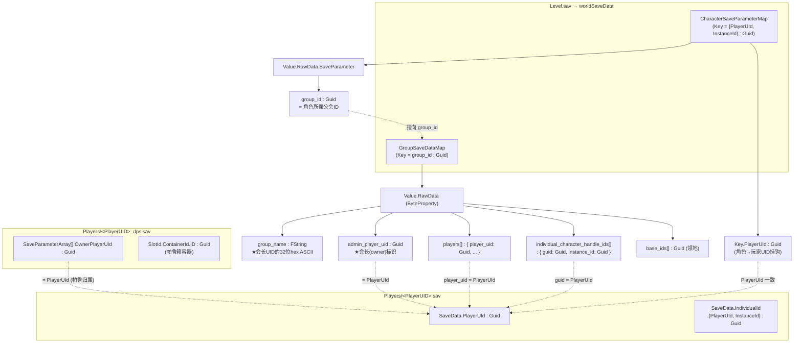

# Palworld 存档数据调研纪要

> **性质：仅调研、不实现。** 本文档不修改任何应用源码、不跑 cargo。
> **目的**：彻底弄清 Palworld 专用服存档"到底包含哪些数据"，重点是世界数据、玩家角色、公会、帕鲁（宠物）、建筑/领地归属之间的**结构与引用关系**，为目标「世界迁移 + 角色/公会迁移」功能提供完整数据覆盖依据，确保不漏数据。
>
> 本文档合并自两份调研纪要：
> - **Part 1**：存档数据全貌（世界 / 角色 / 公会 / 帕鲁 / 建筑领地）—— 补全文件清单、建筑/领地归属链、帕鲁箱关系
> - **Part 2**：公会与角色关系深度调研 —— 为 Fix Host 的「角色继承 + 公会会长修复」提供字段级技术依据
>
> **重要声明**：Fix Host 真机改写仍被 P0 阻塞（见 §5），本调研 ≠ 可以上线。

---

## 目录

- [Part 1 · 存档数据全貌](#part-1--存档数据全貌)
  - [1.1 速读](#11-速读)
  - [1.2 存档文件清单](#12-存档文件清单专用服一个世界)
  - [1.3 Level.sav 内容层级](#13-levelsav-内容层级worldsavedata-下的-map)
  - [1.4 Players/guid.sav 内容](#14-playersguidsav-内容角色本体)
  - [1.5 _dps.sav 帕鲁箱](#15-_dpssav帕鲁箱--distributed-pal-storage)
  - [1.6 引用模型全景图](#16-uid--公会--领地--帕鲁箱-引用模型)
  - [1.7 完整迁移必须同步改写的引用](#17-一次完整迁移必须同步改写的引用汇总)
- [Part 2 · 公会与角色关系深度调研](#part-2--公会与角色关系深度调研)
  - [2.1 调研概览](#21-调研概览给-team-lead-的速读)
  - [2.2 公会/角色关系的数据结构](#22-公会角色关系的数据结构)
  - [2.3 逐项回答（Q1–Q6）](#23-逐项回答团队要求的-1q6)
- [Part 3 · 缺口分析与最小改动集](#part-3--缺口分析与最小改动集)
  - [3.1 当前迁移覆盖 vs 完整迁移的缺口](#31-当前迁移覆盖-vs-完整迁移的缺口对照-fix_hostrs)
  - [3.2 Fix Host 最小改动集](#32-fix-host角色继承--公会会长最小改动集)
- [Part 4 · 阻塞、存疑与引用](#part-4--阻塞存疑与引用)
  - [4.1 实现阻塞清单](#41-实现阻塞清单)
  - [4.2 存疑点（U1–U5）](#42-存疑点u1u5不假装确定)
  - [4.3 关键引用来源](#43-关键引用来源权威)

---

# Part 1 · 存档数据全貌

## 1.1 速读

| 项 | 结论 |
|---|---|
| **一个世界由哪些文件组成** | `Level.sav`（世界状态主体）、`LevelMeta.sav`（元数据）、`LocalData.sav`（本地/迷雾）、`WorldOption.sav`（co-op 设置，**迁专用服应删**）、`Players/<PlayerUID>.sav`（角色本体）、`Players/<PlayerUID>_dps.sav`（帕鲁箱）。 |
| **公会/领地数据在哪** | 公会 = `Level.sav → worldSaveData.GroupSaveDataMap`；领地（基地）= `BaseCampSaveData` + 世界里的 `PalMapObjectBaseCampPoint`（`group_id_belong_to` 指向公会 GUID）。**领地"主人"判定 = 公会的 `admin_player_uid`**，不是某个建筑字段。 |
| **"领地无主人"的根因** | 迁移后公会 `admin_player_uid` / `players[]` / `individual_character_handle_ids[]` 仍指向**已不存在的旧玩家 UID**；基地通过 `group_id_belong_to` 绑定公会，公会会长"消失" → 领地无人可管理。**修好公会即恢复领地归属**（前提是 `group_name` 也一并修正，见 P0-3）。 |
| **建筑/结构归属** | 绝大多数建筑**不直接**存玩家 UID；建造者 UID 在 `MapObjectSaveData → Model.BuildProcess.RawData.id`（builder）。领地/基地通过点位的 `group_id_belong_to`（公会 GUID）归属公会。 |
| **帕鲁箱（_dps）与角色的关系** | 角色文件 `PalStorageContainerId`（容器 GUID）→ `Level.sav → CharacterContainerSaveData` 的 `PalCharacterSlotSaveData`（槽位布局）；帕鲁实例在 `CharacterSaveParameterMap`（活动帕，含 `OwnerPlayerUId`、`SlotID.ContainerId.ID`），而 `_dps.sav` 是该玩家的"异次元帕鲁箱"侧车文件（含 `OwnerPlayerUId` + `SlotId.ContainerId.ID`）。 |
| **身份主键** | **Player UID（16 字节 GUID）** 是贯穿角色/公会/领地/帕鲁箱的唯一身份键。专用服 UID 由 SteamID64 确定性派生（CityHash64），co-op 主机固定为 `00000000000000000000000000000001`。 |
| **与现有 fix_host.rs 的缺口** | 覆盖了所有"16 字节 GUID 形态"的玩家 UID 引用（含 `BuildProcess.id`、箱子锁、告示牌、死亡袋、门禁白名单等，比社区 xNul 工具更全）；**唯一硬缺口仍是 `group_name`（FString，32 字节 ASCII，非 16 字节）未被字节交换命中**（即 P0-3）。另需确认 `group_name` 在"所有出现旧 UID 的公会"中都修正，且多公会/非迁移玩家引用处理正确。 |

---

## 1.2 存档文件清单（专用服一个世界）

路径：`Pal/Saved/SaveGames/0/<WorldGUID>/`（`<WorldGUID>` = 世界 GUID，须与 `GameUserSettings.ini` 的 `DedicatedServerName` 一致）。

| 文件 / 目录 | 内容 | 含玩家 UID 引用？ | 迁移相关性 |
|---|---|---|---|
| `Level.sav` | 世界状态主体（GVAS + 自定义压缩 `CNK`/`PLZ`）。`worldSaveData` 下含全部 Map（公会、角色、建筑、容器、基地、植被、工作…）。 | ✅ 大量（角色/公会/建筑/容器均引用 Player UID） | **P0** — 必须整文件改写引用 |
| `LevelMeta.sav` | 世界名、版本、时间戳等元数据（菜单展示）。 | ❌ | P2 — 原样拷贝 |
| `LocalData.sav` | 本地客户端数据（地图迷雾/探索进度）。 | ❌（世界级，非按玩家） | P2 — 原样拷贝；XGP→Steam 迁移时需替换以恢复地图 |
| `WorldOption.sav` | co-op 世界设置快照。 | ❌ | **P1 — 迁专用服时应删除**（否则会静默覆盖 `PalWorldSettings.ini`，导致服务器设置失效） |
| `Players/<PlayerUID>.sav` | 单个玩家角色本体（背包、属性、`IndividualId`、`PalStorageContainerId`、`OtomoCharacterContainerId` 等）。文件名即 Player UID。 | ✅（文件名 + 内部 PlayerUId） | **P0** — 必须重映射 UID + 改名 |
| `Players/<PlayerUID>_dps.sav` | 该玩家的"异次元帕鲁箱"（Distributed Pal Storage）侧车文件，含帕鲁实例 `{OwnerPlayerUId, SlotId.ContainerId.ID}`。文件名即 Player UID。 | ✅（文件名 + OwnerPlayerUId + ContainerId.ID） | **P0** — 必须重映射 OwnerPlayerUId + 显式设 ContainerId.ID + 改名 |

> 依据：winternode / doomhosting / low.ms / supercraft 多篇服务器管理文档一致确认文件组成；`xgamingserver.com` 确认 `Players/<UID>.sav` 文件名即 Player UID；`supercraft` 转换器产出结构确认 `_dps.sav` 随玩家改名。

---

## 1.3 Level.sav 内容层级（`worldSaveData` 下的 Map）

权威来源 `cheahjs/palworld-save-tools`（`deepwiki` + `README`）列出 Level.sav 内解析的 9 类数据结构，均为 `worldSaveData` 下的 Map：

| 数据结构（Map 名） | 存什么 | 关键归属/引用字段 | 迁移相关性 |
|---|---|---|---|
| `GroupSaveDataMap` | **公会 / 组织**（guild、neutral、organization） | Key = `group_id`（公会 GUID）；Value = `{GroupType, RawData}`；RawData 含 `admin_player_uid`(玩家UID)、`players[]`(玩家UID)、`individual_character_handle_ids[]`(玩家UID+实例)、`base_ids[]`(基地GUID)、`group_name`(FString=会长UID的hex) | **P0** — 公会会长/成员修复核心 |
| `CharacterSaveParameterMap` | **玩家角色 + 帕鲁**（creatures） | Key = `{PlayerUId, InstanceId}`；Value.RawData 末尾 `group_id`(公会GUID)，且含 `OwnerPlayerUId`(玩家UID，帕鲁归属)、`SlotID.ContainerId.ID`(容器GUID) | **P0** — 角色实例键 + 帕鲁归属 |
| `MapObjectSaveData` | **建筑 / 放置物 / 世界物件** | 每条 `Model.{BuildProcess.RawData.id}`(建造者玩家UID)、`ConcreteModel.RawData.group_id_belong_to`(公会GUID，基地点位)、`owner_map_object_instance_id`；另 `PalMapObjectDeathDroppedCharacterModel`/`DeathPenaltyStorageModel` 含 `owner_player_uid` | **P0** — 建筑建造者/领地点位引用 |
| `ItemContainerSaveData` | **箱子 / 储物 / 工作台**等物品容器 | 容器 Slots；箱子锁、隐私锁、门禁密码白名单等引用玩家 UID | **P0/P1** — 箱子归属/锁 |
| `CharacterContainerSaveData` | **帕鲁箱槽位布局**（PalCharacterSlotSaveData） | 按容器 GUID 索引；玩家 `PalStorageContainerId` 指向其中之一 | P1 — 容器 ID 通常不变（非玩家UID） |
| `DynamicItemSaveData` | 世界中的动态物品 | 一般非玩家 UID 专属 | P2 |
| `FoliageGridSaveDataMap` | 植被 / 资源点状态 | 世界级，非玩家 UID | P2 |
| `BaseCampSaveData` | **基地 / 领地**（含 Modules、工作分配） | RawData 含 `group_id`(公会GUID) — 基地归属公会；与 `GroupSaveDataMap.base_ids[]` 互引 | **P0** — 领地归属（经公会解析） |
| `WorkSaveData` | 工作分配 | 引用帕鲁实例 ID（非玩家 UID） | P2 |

> 依据：`deepwiki.com/cheahjs/palworld-save-tools/4-game-data-structures`（数据结构关系图明确：Character ↔ Group ↔ BaseCamp ↔ MapObject 通过 ID 互引；引用完整性约束："Base Camp IDs referenced by Groups must exist in the Base Camp data" 等）；`rawdata/map_object.py`、`rawdata/base_camp.py`、`rawdata/build_process.py`、`rawdata/character.py` 源码字段。

### 关键编码细节

公会 RawData 结构（`rawdata/group.py`，权威）字段顺序与类型：

1. `group_id`：`Guid`（公会自身 ID，与各 Map Key 相同）
2. `group_name`：**`FString`** —— **实测存的是「会长 Player UID 的 32 位十六进制 ASCII」**（如 `"86612e2c000000000000000000000000"`），**不是公会显示名**
3. `individual_character_handle_ids`：数组，元素 `{ guid: Guid, instance_id: Guid }`（公会内每个角色实例的句柄）
4. `org_type`：`byte`
5. `base_ids`：数组（`Guid`）—— 领地/基地 ID
6. `base_camp_level`：`i32`
7. `map_object_instance_ids_base_camp_points`：数组（`Guid`）
8. `guild_name`：**`FString`** —— 这才是公会的**人类可读显示名**（如 `"Your Guild Name"`）
9. `admin_player_uid`：**`Guid`** —— **公会会长（owner）的 Player UID**。← 会长标识
10. `players`：数组，元素 `{ player_uid: Guid, player_info: { last_online_real_time: i64, player_name: FString } }` —— **成员列表**

---

## 1.4 Players/guid.sav 内容（角色本体）

GVAS，`SaveData` 属性下（来源：`xNul/fix_host_save.py` 改写路径 + NGA 炸档修复实录 + `Dreded/Palbox-Slot-Injector`）：

| 字段 | 类型 | 说明 | 迁移处理 |
|---|---|---|---|
| `SaveData.PlayerUId` | Guid | 角色 UID（= 文件名） | **必须改为新 UID** |
| `SaveData.IndividualId.PlayerUId` | Guid | 角色实例归属的玩家 UID | **必须改为新 UID** |
| `SaveData.IndividualId.InstanceId` | Guid | 角色实例 ID（迁移中**不变**，作为跨文件匹配锚） | 保留 |
| `SaveData.PalStorageContainerId` | Guid | 该玩家帕鲁箱容器 ID（→ `CharacterContainerSaveData`） | 容器 ID，**一般不变**（非玩家 UID）；需与 `_dps` 的 ContainerId.ID 保持一致 |
| `SaveData.OtomoCharacterContainerId` | Guid | 随行帕鲁（队伍）容器 ID（NGA 炸档修复指此为"主要坏档原因"①） | 容器 ID，一般不变 |
| 背包容器 | `Items`/`KeyItems`/`Weapons`/`Armor`/`Food`/`DropSlot` | 各物品容器（含 ContainerID） | 容器 ID，一般不变 |
| `Timestamp` / `LastTransform` | DateTime / Transform | 创建时间、最后位置 | 可选同步（NGA 一并改以防万一） |

> 依据：CSDN 伪代码（`PlayerUId`/`IndividualId.PlayerUId`/`IndividualId.InstanceId`）、NGA 修复实录（明确 `OtomoCharacterContainerId` 为首要修复字段）、`Dreded/Palbox-Slot-Injector`（`PalStorageContainerId` 解析）。

---

## 1.5 _dps.sav（帕鲁箱 / Distributed Pal Storage）

- **是什么**：每个玩家一个 `<PlayerUID>_dps.sav`，是该玩家"异次元帕鲁箱"的**侧车文件**（distributed pal storage），文件名即玩家 UID。
- **内容**（来源：现有项目 + supercraft 转换器）：`SaveParameterArray[].SaveParameter.{ OwnerPlayerUId: Guid, SlotId.ContainerId.ID: Guid }`。
  - `OwnerPlayerUId`：帕鲁箱归属的玩家。
  - `SlotId.ContainerId.ID`：帕鲁箱容器 ID——**必须等于该玩家角色文件里的 `PalStorageContainerId`**，游戏据此把箱子内容与正确容器绑定。
- **与角色文件的引用关系**（关键，来源 `Dreded/Palbox-Slot-Injector`）：
  1. 玩家文件 `PalStorageContainerId`(Guid) → 指向 `Level.sav → CharacterContainerSaveData` 中的 `PalCharacterSlotSaveData`（槽位**布局/容量**）。
  2. `CharacterContainerSaveData` 该对象的 `Slots[]` 是箱槽数组。
  3. 帕鲁实例在 `CharacterSaveParameterMap`，每个帕鲁的 `SlotID = {ContainerId(=帕鲁箱), SlotIndex}`。
  4. `_dps.sav` 则是"存入帕鲁箱的帕鲁实例"侧车文件，其 `SlotId.ContainerId.ID` 应与 `PalStorageContainerId` 一致。
- **迁移时的正确做法**（即 fix_host.rs 已实现）：对玩家 X 的 `_dps.sav`，设 `OwnerPlayerUId` = X 的新 UID、`SlotId.ContainerId.ID` = X 新玩家文件中的 `PalStorageContainerId`，并把文件改名为 X 的新 UID。这样帕鲁箱内容与容器 ID 重新对齐。

> 注意：`CharacterContainerSaveData`（槽位布局）与 `_dps.sav`（箱内存放的帕鲁实例）是**两个独立结构**，都要正确。容器 ID 是独立 GUID（≠玩家 UID），全局 16 字节交换不会误改它——这正是为什么 `_dps` 需要"显式设 ContainerId.ID"，而不能靠字节交换。

---

## 1.6 UID / 公会 / 领地 / 帕鲁箱 引用模型

```mermaid
flowchart TD
    subgraph LVL["Level.sav → worldSaveData"]
        GSM["GroupSaveDataMap<br/>Key = group_id(公会GUID)"]
        CSPM["CharacterSaveParameterMap<br/>Key = {PlayerUId, InstanceId}"]
        MOS["MapObjectSaveData<br/>(建筑/领地点位)"]
        BCS["BaseCampSaveData<br/>(基地)"]
        CCS["CharacterContainerSaveData<br/>(帕鲁箱槽位布局)"]
        ICS["ItemContainerSaveData<br/>(箱子/锁)"]
    end

    GSM --> GRAW["RawData"]
    GRAW --> ADMIN["admin_player_uid : Guid<br/>★会长/领地主人=玩家UID"]
    GRAW --> GNAME["group_name : FString<br/>★会长UID的32位hex(非16字节!)"]
    GRAW --> MEM["players[] : {player_uid:Guid}"]
    GRAW --> HANDLE["individual_character_handle_ids[]<br/>: {guid:Guid, instance_id:Guid}"]
    GRAW --> BASES["base_ids[] : Guid (领地)"]

    CSPM --> CRAW["Value.RawData"]
    CRAW --> CGID["group_id : Guid (公会GUID)"]
    CRAW --> COWN["OwnerPlayerUId : Guid (帕鲁归属)"]
    CRAW --> CSLOT["SlotID.ContainerId.ID : Guid (帕鲁箱)"]
    CSPM --> CKEY["Key.PlayerUId : Guid"]

    MOS --> BP["Model.BuildProcess.RawData.id : Guid<br/>★建造者玩家UID"]
    MOS --> BCP["ConcreteModel(PalMapObjectBaseCampPoint)<br/>.group_id_belong_to : Guid (公会GUID)"]
    MOS --> OMID["owner_map_object_instance_id : Guid"]

    BCS --> BGRP["RawData.group_id : Guid (公会GUID)"]

    subgraph PFILE["Players/&lt;PlayerUID&gt;.sav"]
        PUID["SaveData.PlayerUId : Guid"]
        PID["IndividualId.{PlayerUId, InstanceId}"]
        PSC["PalStorageContainerId : Guid (帕鲁箱容器)"]
        POC["OtomoCharacterContainerId : Guid (队伍容器)"]
    end

    subgraph DPS["Players/&lt;PlayerUID&gt;_dps.sav (帕鲁箱)"]
        DPU["SaveParameterArray[].OwnerPlayerUId : Guid"]
        DCID["SlotId.ContainerId.ID : Guid"]
    end

    ADMIN -. "= PlayerUID" .-> PUID
    MEM -. "player_uid = PlayerUID" .-> PUID
    HANDLE -. "guid = PlayerUID" .-> PUID
    CKEY -. "PlayerUId 一致" .-> PUID
    COWN -. "帕鲁归属=PlayerUID" .-> PUID
    BP -. "建造者=PlayerUID" .-> PUID

    CGID -. "指向公会" .-> GSM
    BASES <-. "互引" .-> BCS
    BCP -. "领地点位→公会" .-> GSM
    BGRP -. "基地→公会" .-> GSM

    PSC -. "容器ID索引" .-> CCS
    CSLOT -. "帕鲁箱容器" .-> CCS
    PSC -. "= ContainerId.ID" .-> DCID
    DCID -. "帕鲁箱内容容器" .-> CCS
    DPU -. "= PlayerUID" .-> PUID

    classDef p0 fill:#ffe0e0,stroke:#c00;
    class ADMIN,GNAME,MEM,HANDLE,CKEY,COWN,BP,DPU p0;
```

**核心挂钩键 = Player UID（16 字节 GUID）。** 例外：`group_name` 是**32 字节 ASCII**（会长 UID 的十六进制字符串），`group_id`/`base_ids`/`ContainerId.ID`/`InstanceId` 是**其它 GUID**（公会/基地/容器/实例，≠玩家 UID）。这正是迁移改写策略的分水岭。

### 领地归属链

**基地点位 `group_id_belong_to`(公会GUID) → `BaseCampSaveData.group_id`(公会GUID) → `GroupSaveDataMap.base_ids[]` ↔ `admin_player_uid`(玩家UID)**

所以"领地主人" = 公会会长，修复公会即恢复领地归属。

---

## 1.7 一次"完整迁移"必须同步改写的引用（汇总）

1. **角色继承**：`Players/<old>.sav` 的 `PlayerUId`/`IndividualId.PlayerUId` → new；`CharacterSaveParameterMap.Key.PlayerUId`（按 `InstanceId` 匹配）→ new；文件名 `<old>.sav → <new>.sav`。
2. **公会（全会长/成员 Guid 字段）**：`admin_player_uid`、`players[].player_uid`、`individual_character_handle_ids[].guid`（按 `instance_id` 匹配）→ new。
3. **公会 `group_name`（FString）**：会长 UID 的 32 位 hex ASCII → new（**字节交换命中不了**，须显式改）。
4. **建筑建造者**：`MapObjectSaveData.Model.BuildProcess.RawData.id` → new（16 字节 GUID 形态，字节交换可命中）。
5. **箱子/锁/告示牌/死亡袋/门禁白名单**等玩家 UID 引用 → new（16 字节形态，字节交换可命中）。
6. **帕鲁归属**：`CharacterSaveParameterMap` 中帕鲁的 `OwnerPlayerUId` → new（16 字节形态，字节交换可命中）。
7. **帕鲁箱**：`<old>_dps.sav` → `<new>_dps.sav`；`OwnerPlayerUId` → new；`SlotId.ContainerId.ID` 显式 = new 玩家文件 `PalStorageContainerId`。
8. **不需改**（正确应保持）：公会 `group_id`、基地 `group_id_belong_to`、`base_ids[]`、`ContainerId.ID`/`PalStorageContainerId`/`OtomoCharacterContainerId`（容器/公会/基地 GUID ≠ 玩家 UID）。

---

# Part 2 · 公会与角色关系深度调研

## 2.1 调研概览（给 team-lead 的速读）

| 项 | 内容 |
|---|---|
| **调研覆盖度** | 已读本项目 4 个核心文件（`fix_host.rs`/`world_copy.rs`/`sav_io.rs`/`models.rs`）；已联网核对社区权威实现 `PalworldSaveTools`（`fix_host_save.py`、`palsav.py`、`rawdata/group.py`）、`xNul/palworld-host-save-fix` 及多篇手动修复实录。**公会/角色关系的数据结构已达到可落地实现程度。** |
| **关键结论** | 公会会长 = `admin_player_uid`（Guid 结构）+ `group_name`（FString，存的是会长 UID 的 32 位十六进制 ASCII）。公会成员 = `players[]`（player_uid）+ `individual_character_handle_ids[]`（{guid, instance_id}）。**我们当前的「16 字节 GUID 全局字节交换」能覆盖所有 Guid 结构字段，但会漏掉 `group_name` 这个字符串字段——这是"公会会长修复"的已知盲区。** |
| **引用来源数量** | 9 个（见 §4.3「关键引用来源」），其中 4 个为源码级权威文件（GitHub raw）。 |
| **存疑点** | 5 处（见 §4.2「存疑点 U1–U5」），主要集中在：`group_name` 是否严格必需、对称双向交换语义 vs 社区单向语义、以及容器/基地类边界是否需额外处理。均不影响「公会数据结构」结论，但影响「Fix Host 是否 100% 还原」的判定——需 R-REAL-1 实机验收兜底。 |
| **阻塞状态** | 被 2 个已知 P0（P0-1 GUID 文件名字节序、P0-2 PLZ 头 `compressed_len` 内外层）挡住真机改写；另发现「`group_name` 字符串字段漏改」这一实现盲区（见 §4.1 P0-3）。 |

---

## 2.2 公会/角色关系的数据结构

### 2.2.1 文字说明

Palworld 存档是 GVAS（Unreal 序列化）结构 + 自定义压缩（`CNK`/`PLZ`/`PlM`）封装。世界数据在 `Level.sav` 的 `worldSaveData` 里，**公会**和**角色**各自是 `worldSaveData` 下的一张 Map：

- **公会**：`worldSaveData.GroupSaveDataMap`（字段结构见 §1.3 关键编码细节）
- **角色（玩家/Pal）**：`worldSaveData.CharacterSaveParameterMap`
  - **Key** = `FPalInstanceId` 结构体 `{ PlayerUId: Guid, InstanceId: Guid }`（角色实例键）。
  - **Value** = `FPalSaveParameter`，其中 `RawData` 二进制块含 `SaveParameter` 结构体，`SaveParameter.group_id`（`Guid`）= 该角色所属公会 ID；`IsPlayer==true` 代表是玩家角色。

- **玩家个人存档**：`Players/<PlayerUID>.sav`（文件名即 Player UID）。
  - `SaveData.PlayerUId`（`Guid`）= 该玩家 UID。
  - `SaveData.IndividualId.PlayerUId`（`Guid`）+ `SaveData.IndividualId.InstanceId`（`Guid`）。
  - 帕鲁箱：`Players/<PlayerUID>_dps.sav`，含 `SaveParameterArray[].SaveParameter.{ OwnerPlayerUId: Guid, SlotId.ContainerId.ID: Guid }`。

### 2.2.2 关系示意图

**核心挂钩键 = Player UID（16 字节 GUID）。** 公会成员数组（`players[]`、`individual_character_handle_ids[]`）和会长（`admin_player_uid`）都存 Player UID；角色靠 `SaveParameter.group_id` 指向公会；`_dps` 靠 `OwnerPlayerUId` 指向玩家。

---

## 2.3 逐项回答（团队要求的 1–6）

### Q1：公会数据存在哪？成员列表与会长分别记录在什么字段？会长用什么标识？

- **存在哪**：`Level.sav` → `worldSaveData.GroupSaveDataMap`。Key 是公会 `group_id`（Guid）；Value 是含 `GroupType` + `RawData` 的结构，`RawData` 是二进制块（`rawdata/group.py` 的 `decode_bytes` 权威解码）。
- **成员列表**：`RawData.players[]`（每个元素 `{ player_uid: Guid, player_info }`）与 `RawData.individual_character_handle_ids[]`（每个元素 `{ guid: Guid, instance_id: Guid }`，角色实例级句柄）。
- **会长（owner）**：`RawData.admin_player_uid`（`Guid`，**会长 Player UID**）。**此外还有 `RawData.group_name`（`FString`，实测值 = 会长 Player UID 的 32 位十六进制 ASCII）**，是同一会长 UID 的"字符串镜像"。
- **会长标识指向谁**：指向**玩家角色实例对应的 Player UID**（即 `Players/<UID>.sav` 文件名那个 GUID，也是 `SaveData.PlayerUId`）。不是指向 InstanceId，也不是 SteamID（SteamID 仅用于在 UID 前缀派生时参考，UID 本身即存档内身份主键）。

> 依据：`rawdata/group.py`（`admin_player_uid`、`players`、`individual_character_handle_ids`、`group_name` 字段定义）；`errorism.dev` 手动修复实录（`group_name` 与 `admin_player_uid` 同值为会长 UID）。见引用 [2][3][4]。

### Q2：角色与公会的挂钩方式；为何"只搬世界数据"会在公会里查不到新角色？

- **挂钩方式**：
  - 玩家文件 `Players/<UID>.sav` 内含 `SaveData.PlayerUId` / `IndividualId.PlayerUId` = 该 UID；`IndividualId.InstanceId` = 角色实例 GUID。
  - `Level.sav` 的 `CharacterSaveParameterMap` 用 `Key.{PlayerUId, InstanceId}` 索引每个角色，`SaveParameter.group_id` 记录其所属 `group_id`。
  - 公会侧用 `players[].player_uid` / `individual_character_handle_ids[].guid` 引用玩家 UID、`admin_player_uid` 引用会长 UID。
  - 三者通过 **Player UID（16 字节 GUID）** 对齐。
- **为何查不到新角色（变新建角色、领地无主人）**：
  - "只搬世界数据"后，专用服为两位玩家**各自生成了新 GUID 的新角色**（`Players/<newGUID>.sav`），而 `Level.sav` 的 `GroupSaveDataMap` 仍引用**旧的 Player UID**（旧 `admin_player_uid` / `players[]` / `individual_character_handle_ids[].guid`）。
  - 新角色的 GUID **不在任何公会成员数组里** → 服务器视其为"无公会的新玩家" → 进入即"新建角色"。
  - 领地（基地）归属绑定在公会（`base_ids` 指向的 `BaseCampSaveData`），而公会会长仍是**已不存在于专用服的旧角色** → 使用领地功能需要 `admin_player_uid` 身份，旧会长"已消失" → 领地无主人、无法管理。

> 依据：迁移产生新 GUID 的机制见 `xNul/palworld-host-save-fix` README（"players are identified via GUID… server generates a new GUID that doesn't match"）；[Guild bug] 现象见同 README 与 `errorism.dev`。

### Q3："转移角色 + 修公会身份"到底要重映射/交换哪些 GUID？

把"专用服新角色继承旧单机角色身份，并让公会认其为会长"拆成字段级清单（GUID = 16 字节；UID 字符串 = 32 位 hex）：

**A. 角色继承（让新 GUID 被当作旧角色）**
1. `Players/<oldUID>.sav`：`SaveData.PlayerUId` → new；`SaveData.IndividualId.PlayerUId` → new。（`InstanceId` 不变。）
2. `Level.sav` `CharacterSaveParameterMap`：把 `Key.PlayerUId == old` 的条目改为 new（按 `Key.InstanceId` 匹配最稳，参考 `fix_host_save.py`）。
3. 文件名交换：`<oldUID>.sav → <newUID>.sav`（"文件名 = 身份"）。

**B. 公会会长/成员修复（在 `GroupSaveDataMap` 各 Guild 的 `RawData` 内）**
4. `admin_player_uid`（Guid）：old → new。★会长核心字段。
5. `group_name`（FString，32 位 hex ASCII）：old → new。★会长 UID 的字符串镜像（手动修复实录强调要改，社区自动工具漏改 → 见下文 P0-3）。
6. `players[].player_uid`（Guid）：匹配 old → new。
7. `individual_character_handle_ids[].guid`（Guid）：按 `instance_id == 旧角色 InstanceId` 匹配，将其 `guid` 改为 new。
8. （`SaveParameter.group_id` 是**公会 ID**，不是玩家 UID，**不改**；原存档已指向正确公会。）

**C. 帕鲁箱归属（`_dps.sav`，非公会但常一并修）**
9. `SaveParameterArray[].OwnerPlayerUId`（Guid）：old → new。
10. `SaveParameterArray[].SlotId.ContainerId.ID`（Guid）：显式设为**对方**玩家的 `PalStorageContainerId`（容器 ID，非 UID，不可互换，须按参考 `copy_dps_file` 设值）。

> 依据：`fix_host_save.py` 的 guild fix 段（`admin_player_uid`/`players[]`/`individual_character_handle_ids[].guid` 匹配逻辑）、`errorism.dev` 手动修复（`group_name` 必改 + `SaveParameter.group_id` 回填）、`rawdata/group.py` 字段类型（Guid vs FString）。见引用 [2][3][4]。

### Q4：对照现有代码 `fix_host.rs`——只换 `OwnerPlayerUId` 是否足够？还缺什么？

**结论：当前实现并非"只换 `OwnerPlayerUId`"，而是"Level.sav 全局 16 字节 GUID 字节交换 + `_dps` 结构化改 `OwnerPlayerUId`/`ContainerId` + 文件名交换"。它比"只换 OwnerPlayerUId"覆盖得广，但仍有两个缺口：**

覆盖情况（对照 Q3 清单）：
- ✅ Q3-1/2/3（角色继承）：`fix_host_save_in_dir` 对 `Level.sav` 做 3-pass 双向交换、对两 `Players/*.sav` 单向交换、最后交换文件名——**Guid 结构的 PlayerUId 全部被字节交换覆盖**（含 `CharacterSaveParameterMap.Key.PlayerUId`、`SaveData.PlayerUId`）。
- ✅ Q3-4/6/7（公会 Guid 字段）：Level.sav 全局字节交换**同时覆盖** `admin_player_uid`、`players[].player_uid`、`individual_character_handle_ids[].guid` 的全部 16 字节 GUID 出现处（这些都在 GVAS 树内，字节交换天然命中）。
- ✅ Q3-9/10（`_dps`）：`patch_dps` 显式改 `OwnerPlayerUId` 与 `SlotId.ContainerId.ID`——甚至比社区自动工具（`fix_host_save.py` 不做 `_dps`）更完整。
- ❌ **Q3-5 `group_name`（FString）被漏改**：它是 32 字节 ASCII 十六进制，**不是 16 字节 GUID**，字节交换按 16 字节滑动窗口不会对它生效。这是"公会会长修复"的真实盲区，且**社区自动工具 `fix_host_save.py` 同样漏改**——恰好对应其已知的 [Guild bug]（公会归属不完全）。
- ❌ **健壮性缺口**：当前 `fix_host.rs` 的字节交换假设"old/new 这两个 16 字节在 GVAS 中只作为玩家 UID 出现"。但 `InstanceId` 是不同 GUID、公会 `group_id` 是公会 GUID，均不会被误换（✅）；风险在于 `MapObjectSaveData`/`BaseCampSaveData` 等巨型字段里若以 16 字节形式出现旧 UID，会被一并交换——通常无害（本就是玩家引用），但属"过度交换"风险（设计文档 R-GVAS-1 已用字节级策略规避解析差异，此处继承该权衡）。
- ⚠️ **语义差异（存疑 U3）**：当前 `fix_host.rs` 是**对称双向交换**（old↔new，两玩家互换身份），而社区 `fix_host_save.py` 是**单向**（old→new，再把旧文件改名成新、删掉专用服新建文件）。对"两人都变新建角色、想各回各的旧角色"场景，对称交换需逐人跑；其正确性需与 team-lead/工程师确认（不影响公会数据结构结论）。

> 依据：本项目 `fix_host.rs`（L282–361 交换逻辑、L121–170 `patch_dps`）；`rawdata/group.py`（`group_name` 为 FString）；`xNul/palworld-host-save-fix` README（[Guild bug] / [Pal bug]）。见引用 [1][2][6]。

### Q5：确认用户理解是否正确——"两人变新建角色、领地要公会主人"

**用户理解完全正确。** 机制解释：

1. 用户和朋友联机（多为"合作/co-op"或把世界数据迁到专用服）——**只搬了世界数据**，`Level.sav` 里的 `GroupSaveDataMap` 仍记着**旧 Player UID** 作为 `admin_player_uid` 和 `players[]`。
2. 专用服为两人**各自新建了角色**（新 GUID），这些新 GUID **不在任何公会的成员数组里**。
3. 结果：两人登录时，服务器在公会数据里查不到自己新 GUID → 当成"新建角色"；领地的归属绑定公会，公会会长仍是旧角色（已在专用服"消失"）→ 任何需要 `admin_player_uid` 身份的领地功能都不可用。
4. 因此攻略说"先转移角色（让新 GUID 被认作旧角色），再搞公会身份/权限（把 `admin_player_uid` + `group_name` + 成员数组改成新 GUID）"——这正是 Q3 的 A+B 两步。

> 依据：现象与机制与 `xNul/palworld-host-save-fix` README 的 [Guild bug] 描述一致；`errorism.dev` 实录是同一问题的手动解法。

---

# Part 3 · 缺口分析与最小改动集

## 3.1 当前迁移覆盖 vs 完整迁移的缺口（对照 fix_host.rs）

已知 `fix_host.rs` 实现（来源：任务说明 + §2.3 Q4）：**Level.sav 3-pass 全局 16 字节 GUID 字节交换 + 两个 `Players/*.sav` 单向交换 + 每个 `_dps.sav` 显式改 `OwnerPlayerUId`/`SlotId.ContainerId.ID` + 文件名交换**。该策略本质是"全局 16 字节 UID 单元格改写"，与 supercraft 转换器思路一致（比 xNul 的定点改写更全）。

| # | 引用/字段 | fix_host.rs 现状 | 完整迁移要求 | 缺口 |
|---|---|---|---|---|
| 1 | 角色 `PlayerUId` / `IndividualId.PlayerUId` | ✅ 字节交换 + 文件名 | 改 + 改名 | 无 |
| 2 | `CharacterSaveParameterMap.Key.PlayerUId` | ✅ 字节交换（按 16 字节命中） | 改 | 无 |
| 3 | 公会 `admin_player_uid` / `players[]` / `individual_character_handle_ids[]` | ✅ 字节交换（GVAS 内 16 字节 GUID 全部命中） | 改 | 无 |
| 4 | **公会 `group_name`（FString）** | ❌ **字节交换命中不了**（32 字节 ASCII，非 16 字节滑动窗口） | 必须显式替换 | **P0-3（硬缺口）** — 即"公会归属不完全/[Guild bug]"根因 |
| 5 | 建筑 `BuildProcess.RawData.id`（建造者） | ✅ 字节交换（16 字节 GUID） | 改 | 无（比 xNul 更全） |
| 6 | 箱子锁/隐私锁/门禁白名单/告示牌/死亡袋 | ✅ 字节交换（16 字节 UID 形态） | 改 | 无（xNul 漏改，本会留"未知建造者"） |
| 7 | 帕鲁 `OwnerPlayerUId` | ✅ 字节交换 | 改 | 无 |
| 8 | `_dps.sav` `OwnerPlayerUId` | ✅ 显式改 | 改 | 无 |
| 9 | `_dps.sav` `SlotId.ContainerId.ID` | ✅ 显式设 = 对方 `PalStorageContainerId` | 设 | 无（但需与玩家文件 `PalStorageContainerId` 对齐，见 U-容器） |
| 10 | 公会 `group_id` / 基地 `group_id_belong_to` / `base_ids[]` | ✅ **正确不改**（公会 GUID ≠ 玩家 UID） | 不改 | 无（领地经公会解析恢复） |
| 11 | `PalStorageContainerId` / `OtomoCharacterContainerId` | ✅ **正确不改**（容器 GUID ≠ 玩家 UID） | 不改 | 无 |
| 12 | **多公会同时含旧 UID** | ⚠️ 字节交换覆盖所有公会 Guid 字段；但 `group_name` 须在每个含旧 UID 的公会都修正 | 全部修正 | **需确认实现遍历所有公会改 `group_name`**（不仅会长公会） |
| 13 | **非迁移玩家的引用** | ✅ 只交换两个 UID，其它玩家不受影响 | 仅改目标 | 无（共享公会/基地则公会修复已含） |
| 14 | **过度交换风险** | ⚠️ 全局 16 字节交换会把任何 == 旧 UID 的 16 字节一并换（含 `ItemContainerSaveData` 槽位数据等）；通常为玩家引用，无害，但属"过度交换" | 仅改玩家引用 | 设计已用字节级策略规避解析差异（R-GVAS-1）；可接受 |

### 缺口结论

- **唯一硬缺口 = `group_name`（P0-3）**：必须在 `GroupSaveDataMap` 每个含旧 UID（会长或成员）的公会 RawData 中，将 `group_name` 的 32 位 hex ASCII 显式替换为新 UID 的注册表格式 hex（与文件名一致，用项目已有 `guid_std`）。
- 其余"完整迁移"所需的玩家 UID 引用，**fix_host.rs 的全局字节交换已覆盖**（含 xNul 漏改的建筑建造者、箱子锁等）——这是本项目相对社区工具的**优势**，应在交付说明中肯定。
- **仍建议实机验收（R-REAL）**：社区已知 `[Guild bug]`/`[Pal bug]`/`[Left Click bug]`/`[Viewing Cage bug]`；`group_name` 修好后应可消除 [Guild bug]，但 `[Pal bug]`（帕鲁需重新拾取登记）等需以真机登录验证。

---

## 3.2 Fix Host「角色继承 + 公会会长」最小改动集

**最小改动集（字段清单）**——在保留现有「Level.sav 全局 GUID 字节交换 + `_dps` 结构化改 `OwnerPlayerUId`/`ContainerId` + 文件名交换」框架上，补两处：

| 改动 | 位置 | 说明 |
|---|---|---|
| ① 文件名拼法修正 | `fix_host.rs` L245–246 | `guid_to_stem` → `guid_std`（解决 P0-1） |
| ② PLZ `compressed_len` 改内层 | `sav_io.rs::save()` | 写内层 `zlib.compress(raw)` 长度（解决 P0-2 / R-OODLE-2 根因） |
| ③ 公会 `group_name` 字符串替换 | `fix_host.rs`（新增 Guild RawData 解析） | 会长 = old 的 guild，把 `group_name` 字符串设为 new UID 的 32 位 hex（解决 P0-3，补全公会会长修复） |

> 注：①/② 是"能写出合法、可被读回的 .sav"的**前提**（P0 阻塞）；③ 是"公会会长身份被游戏真正认可"的**正确性补全**。①/② 不修则 Fix Host 根本跑不通；③ 不修则跑通后仍有 [Guild bug]（领地/会长功能异常）。

**被什么挡着**：当前被 **P0-1（文件名字节序）** 与 **P0-2（PLZ 头 compressed_len）** 两个硬阻塞挡住——任一不修都会导致 `fix_host_save_in_dir` 报错或写出游戏/参考工具拒读的 .sav。本调研另发现 **P0-3（`group_name` 漏改）**，是"公会会长修复"语义上必须补的字段。三项均**未实现**（本文档不写代码）。

---

# Part 4 · 阻塞、存疑与引用

## 4.1 实现阻塞清单

**已知 P0（team-lead 已列 2 个，均经本调研核实）：**

- **P0-1 · GUID 文件名字节序不一致（已核实，真阻塞）**
  - 现象：`fix_host.rs` L245–246 用 `old_stem = guid_to_stem(old_bytes)` 拼文件名，而 `guid_to_stem` 把 16 字节**直接**格式化为 32 位大写 hex（`{:02X}` 逐字节）。但磁盘文件名用的是 `world_copy.rs::guid_std` 的**混合字节序（注册表格式：前三组小端、后两组大端）**。
  - 后果：`guid_to_stem(raw)` ≠ 真实磁盘文件名 `guid_std(raw)` → `old_path`/`new_path` 拼错 → `fix_host_save_in_dir` 在 L249/L252 直接 `return Err("...存档不存在")`，**整步失败**。
  - 佐证：同文件 `real_sample_fix_host_swaps_and_verifies` 测试里却用 `old_guid.to_uppercase()`（注册表格式）拼路径（L620–621），与函数内部 `guid_to_stem` **自相矛盾**——侧面印证此 bug。
  - **最小修复**：`fix_host.rs` 拼文件名处改用 `guid_std(old_bytes)` / `guid_std(new_bytes)`（从 `world_copy` 引入或本模块内等价实现），而非 `guid_to_stem`。

- **P0-2 · PLZ 头 `compressed_len` 内外层不符（已核实，真阻塞）**
  - 现象：`sav_io.rs` `save()`（L120–126）写 `compressed_len = compressed.len()`，其中 `compressed = encode_payload(...)` 对 PLZ 是 **双层 zlib 的"外层"payload**。而参考实现 `palsav.py::compress_gvas_to_sav` 对 `0x32`(PLZ) 写的是 **内层** `compressed_len = len(zlib.compress(raw))`（在第二次 `zlib.compress` 之前取值）。
  - 后果：`decode_sav` 侧（参考 `palsav.py`）对 `0x32` 校验 `compressed_len == 第一次 zlib 解压后的长度（内层）`；我们再写"外层"长度 → 校验不通过，参考工具会拒读；游戏引擎虽 zlib 自终结可能宽容，但**这正是设计文档 R-OODLE-2「PLZ 回写被严格校验拒绝」的疑似根因**。
  - **最小修复**：`sav_io.rs::save()` 对 PLZ 计算 `compressed_len` 为**内层** `zlib.compress(raw)` 的长度（先算内层 `inner`，再 `outer = zlib.compress(inner)`；头写 `inner.len()`，payload 写 `outer`）。CNK 单层不受影响（外层即唯一压缩层，当前正确）。

**本调研新发现的实现盲区（建议升为 P0-3）：**

- **P0-3 · 公会 `group_name`（FString）漏改（已核实，公会会长修复盲区）**
  - 如前 Q3-5 / Q4 所述：当前字节交换策略无法修改 `group_name`（32 字节 ASCII 字符串形式的会长 UID）。社区自动工具同样漏改，对应已知 [Guild bug]。要"让公会认新角色为会长"，**必须**在 `GroupSaveDataMap` 的 Guild `RawData` 里把 `group_name` 字符串也替换成新 UID 的 32 位 hex。
  - **最小修复**：对 `worldSaveData.GroupSaveDataMap` 的每个 Guild `RawData`，用 `parse_rawdata_stream`（已有）或镜像 `rawdata/group.py` 的 `decode_bytes` 定位 `admin_player_uid` 与 `group_name`；对会长 = old UID 的 guild，把 `group_name` 字符串设为 `new_uid` 的 32 位 hex（注意用**磁盘/注册表格式**，与文件名一致；本项目已有 `guid_std` 可生成）。`admin_player_uid` 已由字节交换覆盖，此处只需补字符串字段。

**其他需一并处理的字段/边界（非 P0，但实现时要覆盖，团队已提及）：**

- `individual_character_handle_ids[]`（Guild RawData 内，Guid 数组元素）：由 Level.sav 全局字节交换覆盖（✅），无需额外处理。
- 角色 GUID 在 `CharacterSaveParameterMap`（`Key.PlayerUId`）：由全局字节交换覆盖（✅）。
- `CharacterContainerSaveData` / `ItemContainerSaveData` / `BaseCampSaveData`：容器/基地类引用多为 **group_id（公会 GUID）或 instance_id（角色实例）**，不直接是 player UID；默认不在 Fix Host 范围内改。但 `BaseCampSaveData` 的"领地主人判定"依赖公会 `admin_player_uid`——修好 P0-3 后即恢复（U4 存疑：是否还有按 player UID 直引的基地字段，需 R-REAL-1 验证）。
- `_dps.sav` 容器 ID：已实现显式赋值（`patch_dps`），但依赖 gvas 解析成功，失败走 R-DPS-1 降级（仅换 `OwnerPlayerUId`、不动 `ContainerId`）——属已知降级路径，非阻塞。

---

## 4.2 存疑点（U1–U5，不假装确定）

- **U1 · `group_name` 是否严格必需？** 社区自动工具 `fix_host_save.py` 不修改它却仍被广泛使用；但其 README 明载 [Guild bug]，且手动修复实录强调要改。→ 倾向"必需或至少强烈建议"，但游戏内部是否仅以 `admin_player_uid`（Guid，已被字节交换覆盖）判定会长、而 `group_name` 为遗留/冗余，需 R-REAL-1 实机确认。
- **U2 · 仅覆盖 Guid 字段（含 `admin_player_uid`）是否足以恢复领地管理？** 取决于游戏运行时如何裁定"公会主人"。`admin_player_uid` 被字节交换覆盖，理论上够；但 `group_name` 漏改（P0-3）是否与 U1 叠加导致仍异常，未知。
- **U3 · 对称双向交换 vs 社区单向语义**：当前 `fix_host.rs` 是 old↔new 对称交换；社区 `fix_host_save.py` 是 old→new 单向 + 改名。对"两人均变新建角色"的真实场景，对称交换需逐人执行且语义更强——正确性需与 team-lead/工程师对齐（不影响公会数据结构结论）。
- **U4 · 容器/基地类是否还有按 player UID 直引的字段？** `CharacterContainerSaveData`/`ItemContainerSaveData`/`BaseCampSaveData` 多数引用 group_id/instance_id，但存在版本差异（参考 `ibug.io` 提 1.0 ByteProperty 异常），无法 100% 排除个别 player-UID 直引字段；依赖 R-VER-1 + R-REAL-1 兜底。
- **U5 · `guid_bytes()`/`Guid::to_u8()` 的精确字节序**：本调研基于 `world_copy.rs::guid_std` 注释（"gvas 的 `Guid::to_string()/to_u8()` 采用不同字节序"）与 `fix_host.rs` 测试自相矛盾（L620 用注册表格式、L245 用 `guid_to_stem`）判定 P0-1。**未逐行核对 `gvas` crate `Guid::from_str` 对注册表格式输入的解析行为**——但即使解析行为不同，`guid_std` 才是权威磁盘格式这一点是确定的，故改用 `guid_std` 的修复方向无误。

### 补充存疑点（来自存档数据全貌调研）

- **U-基地**：`BaseCampSaveData` 在 `worldSaveData` 的 RawData **具体字段列表未经源码逐字段确认**（§1.3 的 `base_camp.py` 实为"基地点位 ConcreteModel"，非 BaseCampSaveData 本身）。已知其含 `group_id`(公会GUID) 用于领地归属；是否还有直引玩家 UID 的"创建者"字段，未 100% 排除（若有，会被全局字节交换覆盖，无害）。需 R-REAL-1 验证。
- **U-容器**：`CharacterContainerSaveData`（槽位布局）与 `_dps.sav`（箱内存放实例）的精确交互仍有一处待确认——对称交换 A↔B 时，`_dps` 的 `ContainerId.ID` 显式设为"对方 `PalStorageContainerId`"是否与玩家文件的 `PalStorageContainerId` 在交换后保持一致（fix_host.rs 逻辑需与工程师对齐实盘验证）。
- **U-UID 派生**：专用服 UID = CityHash64(SteamID64 渲染 UTF-16 折叠 32 位 + 补零)（`supercraft` 声称已对 Palworld 1.0 实测）；co-op 主机固定 `0001`。这解释了"专用服→专用服（同玩家）UID 不变、无需重映射"，而"co-op→专用服"主机需重映射——但本项目 `fix_host.rs` 当前是对称双向交换语义，对"两人均变新建角色"场景需逐人执行，正确性需与 team-lead/工程师对齐（见 U3）。
- **U-过度交换**：全局 16 字节交换可能命中非玩家 UID 的 16 字节数据（只要恰好等于旧 UID）。通常为玩家引用无害；但巨型 blob（`ItemContainerSaveData` 槽位等）误换的概率虽低，属已知权衡，需实机兜底。

---

## 4.3 关键引用来源（权威）

1. **cheahjs/palworld-save-tools（GitHub 仓库）** —— 社区标准解析器；文档明确支持 `GroupSaveDataMap`（公会/组织）、`CharacterSaveParameterMap`（角色）、`MapObjectSaveData` 等。<https://github.com/cheahjs/palworld-save-tools/>
2. **cheahjs/palworld-save-tools · deepwiki（数据结构总览）** —— 9 类数据结构清单、`worldSaveData` 下 Map 关系图、引用完整性约束。<https://deepwiki.com/cheahjs/palworld-save-tools/4-game-data-structures>
3. **cheahjs/palworld-save-tools · rawdata/group.py（raw 源码）** —— **公会 RawData 字段的权威结构定义**：`group_id`(Guid)、`group_name`(FString)、`individual_character_handle_ids[]`({guid,instance_id})、`admin_player_uid`(Guid)、`players[]`({player_uid, player_info})、以及 `guild_name`(FString 显示名)、`base_ids[]`(Guid)。<https://raw.githubusercontent.com/cheahjs/palworld-save-tools/master/palworld_save_tools/rawdata/group.py>
4. **cheahjs/palworld-save-tools · rawdata/character.py（raw 源码）** —— 角色 RawData 结构（末尾 `group_id` Guid）。<https://raw.githubusercontent.com/cheahjs/palworld-save-tools/master/palworld_save_tools/rawdata/character.py>
5. **cheahjs/palworld-save-tools · rawdata/map_object.py（raw 源码）** —— 建筑/物件 Model 解码（BuildProcess / ConcreteModel / ModuleMap）。<https://raw.githubusercontent.com/cheahjs/palworld-save-tools/master/palworld_save_tools/rawdata/map_object.py>
6. **cheahjs/palworld-save-tools · rawdata/base_camp.py（raw 源码）** —— 基地点位（`PalMapObjectBaseCampPoint`）ConcreteModel：`group_id_belong_to`(公会GUID)、`owner_map_object_instance_id`。<https://raw.githubusercontent.com/cheahjs/palworld-save-tools/master/palworld_save_tools/rawdata/base_camp.py>
7. **cheahjs/palworld-save-tools · rawdata/build_process.py（raw 源码）** —— 建造过程：`{state: byte, id: Guid}`（`id`=建造者玩家 UID）。<https://raw.githubusercontent.com/cheahjs/palworld-save-tools/master/palworld_save_tools/rawdata/build_process.py>
8. **cheahjs/palworld-save-tools · palsav.py（raw 源码）** —— **P0-2 依据**：`compress_gvas_to_sav` 对 `0x32`(PLZ) 写 `compressed_len = len(内层 zlib)`，而非外层 payload 长度。<https://raw.githubusercontent.com/cheahjs/palworld-save-tools/master/palworld_save_tools/palsav.py>
9. **xNul/palworld-host-save-fix · `fix_host_save.py`（raw 源码）** —— 权威参考实现；guild fix 段改写 `admin_player_uid` / `players[].player_uid` / `individual_character_handle_ids[].guid`（按 `instance_id` 匹配）。<https://raw.githubusercontent.com/xNul/palworld-host-save-fix/master/fix_host_save.py>
10. **xNul/palworld-host-save-fix（README）** —— 已知 bug 列表：[Guild bug]（公会归属不完全，疑似漏改配置）、[Pal bug]（帕鲁未注册到正确公会，需重新拾取）、[Viewing Cage bug]、[Left Click bug]。<https://github.com/xNul/palworld-host-save-fix>
11. **errorism.dev · "How I manually fixed the guild problem"** —— 手动修复实录；明确 `group_name` 须替换为新 UID（与 `admin_player_uid` 同值）、`SaveParameter.group_id` 回填公会 ID。<https://errorism.dev/issues/xnul-palworld-host-save-fix-how-i-manually-fixed-the-guild-problem---might-help>
12. **CSDN · palworld-host-save-fix 使用指南** —— 实测流程：`fix_host_save.py <save> <newGUID> <oldGUID> True/False`，迁移公会时 `guild repair` 须为 True。<https://blog.csdn.net/gitblog_00900/article/details/158833484>
13. **supercraft Palworld Save Converter** —— 详尽描述"逐 16 字节单元格结构性重绑所有 UID 引用"（角色/帕鲁箱/公会/建筑建造者/箱子锁/告示牌/死亡袋/门禁白名单），并给出 UID=CityHash64(SteamID64 UTF-16 折叠) 的确定性派生与 `_dps.sav` 随玩家改名。<https://tools.supercraft.host/tools/palworld-save-converter>
14. **xgamingserver.com · Palworld Save Editor** —— 确认 `Players/<UID>.sav` 文件名即 Player UID；Player UID 是 SteamID64 低 32 位 hex；存档为 GVAS + 自定义 zlib 封装。<https://www.xgamingserver.com/tools/palworld/save-editor>
15. **Dreded/Palworld-Palbox-Slot-Injector** —— `PalStorageContainerId` → `CharacterContainerSaveData.PalCharacterSlotSaveData` 关系；帕鲁 `SlotID.ContainerId` 机制。<https://github.com/Dreded/Palworld-Palbox-Slot-Injector>
16. **magicbear/palworld-server-toolkit（被社区引述）** —— 可自动化克隆角色/物品/公会并修复全部 instance（更完整的迁移方案，作为"对称交换 vs 单向"语义的旁证）。<https://github.com/magicbear/palworld-server-toolkit>
17. **NGA 炸档修复实录** —— 退出公会炸档修复；`OtomoCharacterContainerId` 为首要修复字段、其次 `IndividualId.InstanceId`。<https://nga.178.com/read.php?tid=39109512>
18. **服务器管理文档（winternode / doomhosting / low.ms）** —— 文件组成、`Players/<UID>.sav` 文件名即 UID、`WorldOption.sav` 迁专用服应删、co-op 主机固定 `0001`。
    - <https://winternode.com/blog/palworld/palworld-server-updates-how-to-handle-breaking-patches-witho>
    - <https://www.doomhosting.com/help/articles/how-to-transfer-palworld-save-to-dedicated-server>
    - <https://low.ms/de/knowledgebase/palworld-save-location-how-to-upload>

> 本项目相关设计文档（已存在，供交叉印证，不计入上述外部引用）：
> - `docs/palworld-migration-design.md`（迁移设计合集，含 Fix Host 双向交换设计、R-OODLE-2 提及 PLZ 回写被拒风险——本调研指认 P0-2 为其根因）

---

*本纪要为调研产物，不含任何源码改动。Fix Host 真机改写仍被 P0-1 / P0-2 阻塞，P0-3 为公会会长语义补全；是否 100% 还原以 R-REAL-1 老板实机登录验收为最终闸门。*
