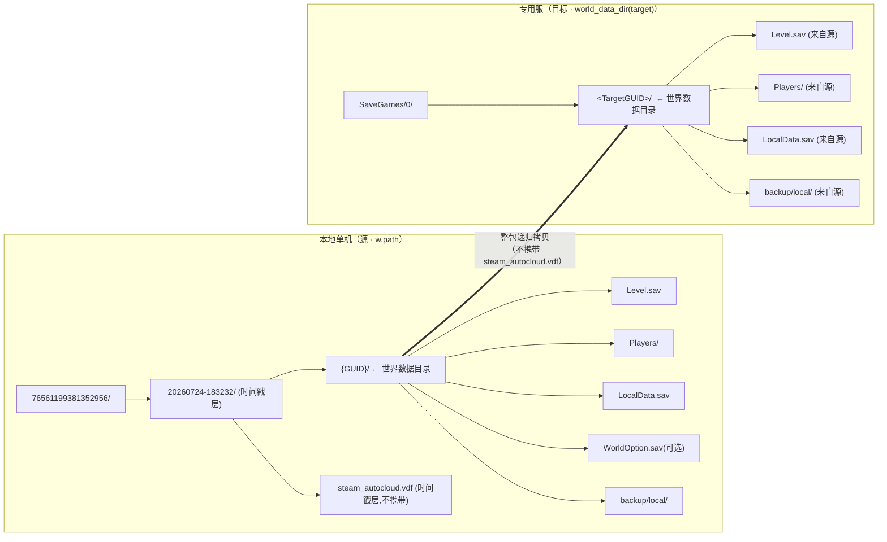
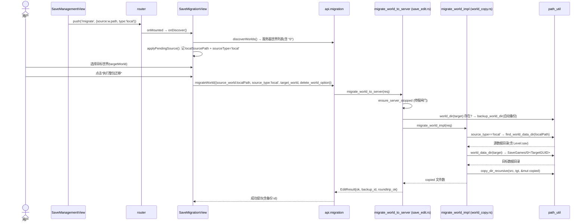
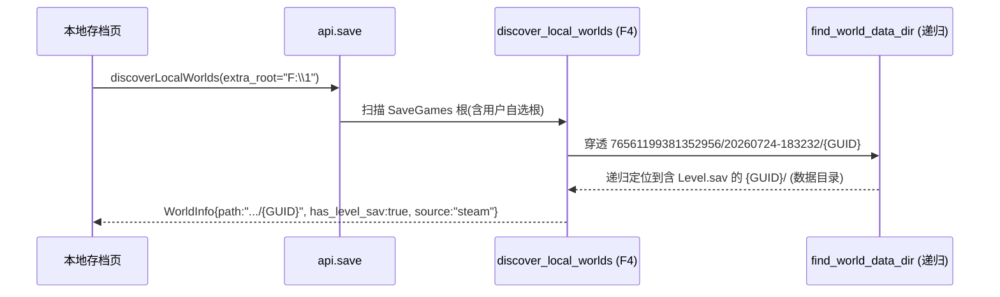
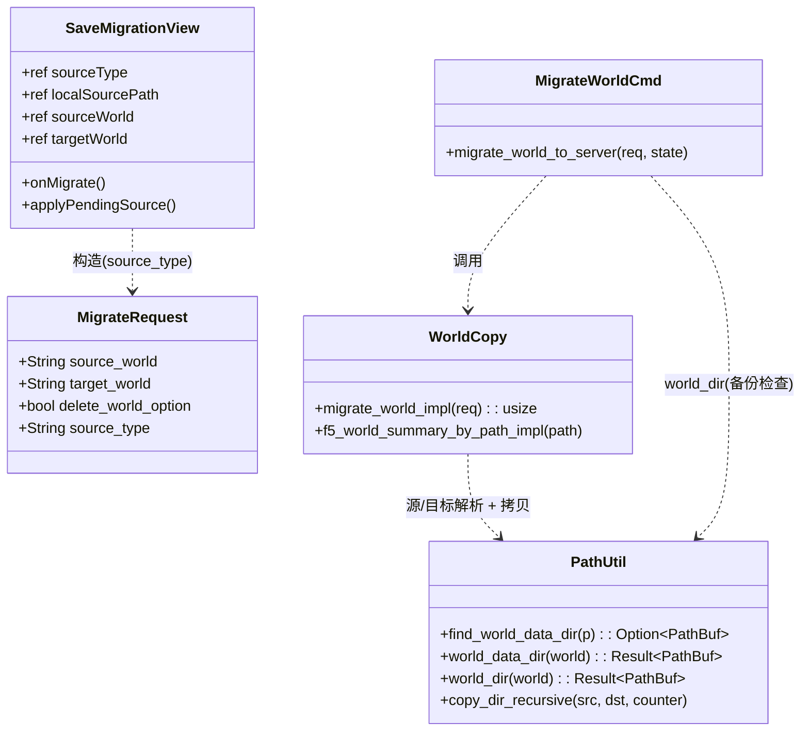

# Palworld 数据迁移 UI「无法使用」诊断 + 世界迁移（本地→专用服）实现设计

> 角色：架构师（Bob）· 性质：**仅调研 + 设计 + 任务分解，不动代码** · 范围：仅打通**世界文件整包拷贝（world copy）**这一条链路。
>
> 实测样本（主理人已探勘 + 本架构师复核）：`F:\1\76561199381352956\20260724-183232\{GUID}\`，其中 `Level.sav` 位于 **两层嵌套**（SteamID 层 + 时间戳层 + GUID 层）之下。
>
> ⚠️ **明确范围边界**：本任务**不含**公会主人身份修复 / 角色转移（那是 Fix Host：T03 双向交换 + `_dps` 容器 ID 赋值，当前有 2 个 P0 阻断——GUID 字节序未转换、PLZ 头长度格式不符——暂不能对真实存档跑）。迁移后玩家将以**新建角色**进入（角色 UID / 实例 ID 未迁移、公会主人身份未迁移），这是用户所述"两人都变新建角色、领地需公会主人身份"的**预期现象**，属 Fix Host 范畴，本次不做。

---

## 〇、结论速览

| 断点 | 位置 | 性质 | 一句话 |
|---|---|---|---|
| **断点 1** | `save_transfer.rs:298` `find_world_data_dir`（F4）/ `path_util.rs:154`（F5 副本） | 发现穿透 | `find_world_data_dir` 只查「直接层 + 一层子目录」，样本 `Level.sav` 在**两层**之下 → 选 `F:\1` 时本地世界被静默过滤 |
| **断点 2** ✅主因 | `SaveMigrationView.vue:382-394` + `:348-360` | 前端接线 | 本地路径 `route.query.source` 存进 `pendingLocalSource` 后**从未进入请求**；`onMigrate` 只发服务器世界**名** → 本地→专用服链路在 UI 上不存在 |
| **断点 3** ✅硬阻塞 | `world_copy.rs:668` `migrate_world_impl` + `path_util.rs:170` `world_dir` | 后端源解析 | 后端把 `source_world` 当「SaveGames 根下的世界名」拼路径；即便传本地绝对路径也会被 `safe_name_segment` 截成末段再拼到 SaveGames 根 → `世界目录不存在` |
| **断点 4** | `world_copy.rs:672` `migrate_world_impl` | 后端目标解析 | 目标拼成 `SaveGames/<tgt_name>`，忽略专用服 `SaveGames/0/<GUID>/` 的 `0/` + GUID 嵌套层 → 拷贝层级错位，专用服不识别 |

→ **修复链路 = 断点1（发现穿透）→ 断点3+4（后端源/目标解析）→ 断点2（前端透传本地路径 + source_type）**。

---

## ① 现状诊断（确切断点 + 文件:行号）

### 断点 1 — 本地世界发现穿透失败（F4 发现层）
- **代码**：`src-tauri/src/save_transfer.rs:298-313`（`find_world_data_dir`），以及 F5 独立副本 `src-tauri/src/save_edit/path_util.rs:154-167`。
- **逻辑**：函数只做两步——① `world_dir/Level.sav` 是否存在；② 遍历 `world_dir` 的**直接子目录**，找首个含 `Level.sav` 的子目录。即**最多向下一层**。
- **样本实测**：`76561199381352956/20260724-183232/{GUID}/Level.sav`（两层嵌套：SteamID + 时间戳 + GUID）。`find_world_data_dir("76561199381352956")`：直接层无 `Level.sav`；子目录 `20260724-183232` 下也无 `Level.sav`（它的子目录才是 `{GUID}`）→ 返回 `None`。
- **后果**：`discover_local_worlds`（`save_transfer.rs:470-535`）对 `world_info_from_dir` 结果做 `if info.has_level_sav` 过滤（`:377`、`:502`、`:525`）。当用户在本地存档发现里选 `F:\1`（或 `F:\1\76561199381352956`）时，世界被**静默丢弃**；只有手动选到 `.../20260724-183232` 这一层（或更深）才能发现。
- **断言**：`find_world_data_dir` 对两层以上嵌套返回 `None` → 样本世界被丢弃（除非精确选到时间戳层）。

### 断点 2 — 前端迁移页把本地源路径丢弃（F5 前端）★ 用户"无法使用"根因
- **代码**：`src/views/SaveMigrationView.vue`
  - `:48-59` 源世界 `<select>` 的 `:options` 仅来自 `onDiscover()` 中的 `api.save.discoverWorlds()`（`:250` → `worlds.value = res.worlds`），即**只有服务器世界**。
  - `:382-394` `applyPendingSource()`：把 `route.query.source`（本地真实路径）写入 `pendingLocalSource`，把末段写入 `pendingLocalName`；但只在「本地目录末段 == 某服务器世界名」时才 `sourceWorld = name`（`:390`）——本地 GUID 末段不可能等于服务器世界名，故 `sourceWorld` 始终为空/未选。
  - **关键**：`pendingLocalSource` 变量**从未被 `onMigrate` 读取**。
  - `:348-360` `onMigrate()`：发送 `source_world: sourceWorld.value`——永远是**服务器世界名**（下拉框选项），从不携带本地路径。
- **触发链**：`SaveManagementView.vue:304` `router.push({ path:'/migrate', query:{ source:w.path, type:'local' } })` → 进入迁移页 → 源下拉框只有服务器世界、**没有本地世界可选** → 点"执行整包迁移"实际是 server→server。
- **断言**：`route.query.source` 的本地真实路径**从未进入 `MigrateRequest`**；`onMigrate` 的 `source_world` 永远是 `sourceWorld.value`（服务器世界名）。本地→专用服链路在 UI 上完全不存在 → 这就是"数据迁移界面是为展示而做、无法使用"。

### 断点 3 — 后端源解析把路径当世界名（F5 后端）★ 硬阻塞
- **代码**：`src-tauri/src/save_edit/world_copy.rs:668` `let src = path_util::world_dir(&req.source_world)?;`；`path_util.rs:170-179` `world_dir`。
- **逻辑**：`world_dir` 假定 `source_world` 是 SaveGames 根下的**世界名**：`safe_name_segment(world)`（`:172`，取末路径段 + 白名单校验）→ `save_root.join(&w)`（`:174`）。
- **后果**：即便前端修好、传入本地绝对路径 `F:\1\76561199381352956\20260724-183232\{GUID}`：
  1. `safe_name_segment` 取末段 `{GUID}`（GUID 为 16 进制，白名单通过）；
  2. `join` 到 SaveGames 根 → `SaveGames/{GUID}`；
  3. `:175` `!dir.is_dir()` → `Err("世界目录不存在: .../SaveGames/{GUID}")`。
- **混淆点**：`world_dir`（按名字拼 SaveGames 根）与 `find_world_data_dir`（按真实路径定位含 Level.sav 的层）**语义不同**。本地源应是"真实路径 + `find_world_data_dir` 定位"，而非"世界名 + SaveGames 根拼接"。
- **断言**：后端**从根本上无法接受本地绝对路径**作为源；`migrate_world_impl` 的源解析对本地场景必失败。

### 断点 4 — 目标解析忽略专用服 `0/` 层（F5 后端）
- **代码**：`src-tauri/src/save_edit/world_copy.rs:672` `let tgt = save_root.join(&tgt_name);`，`:678-684` 把 `src` 拷入 `tgt`。
- **事实**：专用服世界实际位于 `SaveGames/0/<GUID>/`（已由 `save_transfer.rs:789-819` 测试 `discover_real_palserver_world` 在真实 PalServer 目录证实：`find_world_data_dir(SaveGames/0)` → `SaveGames/0/<GUID>`）。
- **后果**：
  - 若 `tgt_name="0"`（专用服默认世界），`tgt=SaveGames/0`，`copy_dir_recursive(src, SaveGames/0)` 把源**平铺**进 `SaveGames/0/` → 得到 `SaveGames/0/Level.sav`（破坏 GUID 嵌套）→ 专用服不识别。
  - 若 `tgt_name="SomeWorld"`，`SaveGames/SomeWorld` 不在专用服 `0/` 容器内 → 专用服读不到。
- **正确做法**：目标应经 `path_util::world_data_dir(&req.target_world)`（内部 `find_world_data_dir` 自动定位 `SaveGames/0/<GUID>`）。
- **断言**：当前目标解析对专用服布局错误，会把世界数据放错层级。

---

## ② 目标布局设计（本地 → 专用服）

### 目录映射图（Mermaid flowchart）



### 拷贝规则（file 级整包拷贝，不解析、不改动 .sav 内容）
1. **拷贝单位 = 世界数据目录**（含 `Level.sav` 的那一层）。递归拷贝源数据目录的**全部内容** → 目标数据目录。
2. **GUID 层不重命名**：源 `{GUID}/` 的内容直接落入目标已有的 `<TargetGUID>/`。专用服世界槽名不变，仅内容换成单机世界的地图/建筑/帕鲁/公会数据。**严格不触碰 GUID 互换**（Fix Host，P0 阻塞，本次不做）。
3. **LocalData.sav**：携带（随整包拷贝自然带入；专用服会忽略或重建，无副作用）。
4. **steam_autocloud.vdf**：**不携带**——它在样本 `20260724-183232/` 层（数据目录之外），拷贝数据目录时自然被排除；且它是 Steam 云元数据，专用服不需要。
5. **WorldOption.sav**：沿用现有 `delete_world_option` 开关——开启则拷贝后删除目标 `WorldOption.sav`（让专用服从 `PalWorldSettings.ini` 重新生成，避免单机旧设置污染，符合 R5）；默认关（携带源 WorldOption.sav，保持世界设置一致）。**无需改语义**。
6. **backup/local/**：随整包携带（无害；专用服忽略）。本次保持忠实拷贝，后续如需瘦身再加排除开关。

### 源 / 目标解析（改造后 `migrate_world_impl` 伪码）
```rust
// —— 源 ——
let src = if req.source_type == "local" {
    path_util::find_world_data_dir(Path::new(&req.source_world))      // 本地：真实路径 → 定位 Level.sav 层
        .ok_or_else(|| format!("未找到本地世界数据(Level.sav)：{}", req.source_world))?
} else {
    path_util::world_data_dir(&req.source_world)?                     // 服务器：按名定位（兼容 0/<GUID> 嵌套）
};

// —— 目标（专用服 SaveGames/0/<GUID> 或服务器世界）——
let tgt = path_util::world_data_dir(&req.target_world).or_else(|_| {
    // 目标世界尚不存在：在专用服 0/ 容器（惯例）或 SaveGames 根下新建 <target_world>/
    let (save_root, _) = path_util::resolve_save_games_root()?;
    let name = path_util::safe_name_segment(&req.target_world)
        .ok_or_else(|| "目标世界名非法".to_string())?;
    let cand = save_root.join("0").join(&name);
    if !cand.exists() {
        std::fs::create_dir_all(&cand)
            .map_err(|e| format!("创建目标 {} 失败: {}", cand.display(), e))?;
    }
    Ok(cand)
})?;

if src == tgt { return Err("源世界与目标世界相同，无需迁移".into()); }
// 清理/创建 tgt 后 copy_dir_recursive(src, tgt, &mut copied)
// delete_world_option: 拷贝后删除 tgt/WorldOption.sav（沿用现有逻辑，无需改语义）
```

---

## ③ 调用流程图（Mermaid sequence）

### A. 本地→专用服迁移（happy path，含修复后的本地源透传）


### B. 本地世界发现穿透（断点 1 修复后）


---

## ④ 类 / 模块关系（Mermaid classDiagram）



---

## ⑤ 文件清单（改动点）

| 文件 | 行号（现状） | 改动 |
|---|---|---|
| `src-tauri/src/save_transfer.rs` | `298-313` | `find_world_data_dir` 改为**递归穿透**（BFS，限深 ~4 层）以定位任意中间层下的 `Level.sav`（断点 1，F4 发现层） |
| `src-tauri/src/save_edit/path_util.rs` | `154-167` | 同上，F5 副本同步递归穿透（与 F4 独立但保持一致） |
| `src-tauri/src/save_edit/models.rs` | `106-113` | `MigrateRequest` 增加 `source_type: String`（默认 `"server"`，向后兼容） |
| `src-tauri/src/save_edit/world_copy.rs` | `667-705` | `migrate_world_impl` 源解析按 `source_type` 分支（local→`find_world_data_dir`；server→`world_data_dir`）；目标解析改用 `world_data_dir`（+ 不存在时 `0/<name>` 兜底新建）。`delete_world_option` 语义沿用 |
| `src/views/SaveMigrationView.vue` | `348-360`、`382-394`、`244`、`48-59` | 新增 `sourceType`/`localSourcePath` ref；`applyPendingSource` 写 `sourceType='local'`+`localSourcePath`；`onMigrate` 按 `sourceType` 发 `source_world`(本地路径或服务器名) + `source_type`；源下拉框加本地源展示；`canMigrate` 兼容本地源 |
| `src/types/tauri.ts` | `406-411` | `MigrateRequest` 增加 `source_type: string` |
| `src/views/SaveManagementView.vue` | `302-306` | **无需改动**（已正确 `push('/migrate',{source:w.path,type:'local'})`）；仅复核 |
| `src/components/save/SaveDetailModal.vue` | `38,66` | **无需改动**（emit `'migrate', world` 已带完整 `WorldInfo` 含 `.path`，统一经 `SaveManagementView.onMigrateToServer` 处理）；仅复核 |

---

## ⑥ 任务分解（有序、依赖、可立即交工程师执行）

> 原则：先打通发现穿透（T01）→ 后端源/目标解析（T02）→ 前端透传（T03）→ 测试（T04）→ 验收文档（T05）。T02/T03 必须落在 T01 之后。

### T01 · 路径穿透：让 `find_world_data_dir` 递归定位（断点 1）
- **源文件**：`src-tauri/src/save_transfer.rs`、`src-tauri/src/save_edit/path_util.rs`（含各自测试模块）
- **依赖**：无
- **优先级**：P0
- **内容**：
  - 把两份 `find_world_data_dir` 由「直接层 + 一层子目录」改为**有界递归 BFS**（限深 4 层），返回首个含 `Level.sav` 的目录。
  - 不破坏现有扁平 / 单层 GUID 嵌套行为（单测 `world_info_from_fake_steam_structure`、`discover_real_palserver_world` 仍须通过）。
  - 新增单测：构造 `SaveGames/<SteamID>/<TS>/<GUID>/Level.sav`（两层嵌套）断言能定位到 `<GUID>`。

### T02 · 后端源/目标解析改造（断点 3 + 断点 4）
- **源文件**：`src-tauri/src/save_edit/models.rs`、`src-tauri/src/save_edit/world_copy.rs`、`src-tauri/src/save_edit/save_edit.rs`（复核 `migrate_world_to_server` 备份路径一致性）
- **依赖**：T01
- **优先级**：P0
- **内容**：
  - `MigrateRequest` 增加 `source_type`（serde 默认 `"server"`）。
  - `migrate_world_impl` 源：`source_type=="local"` → `find_world_data_dir(Path::new(&source_world))`；否则 `world_data_dir`。
  - 目标：`world_data_dir(&target_world)`；不存在时 `SaveGames/0/<safe_name_segment(target)>` 兜底新建。
  - `src == tgt` 守卫保留（比较绝对路径）。
  - `delete_world_option` 沿用（拷贝后删 `tgt/WorldOption.sav`）。
  - 复核 `save_edit.rs:248` 备份检查 `world_dir(target)` 对 `"0"` 仍 `exists()`（是），无需改。

### T03 · 前端透传本地源路径 + 类型（断点 2）
- **源文件**：`src/views/SaveMigrationView.vue`、`src/types/tauri.ts`、`src/components/save/SaveDetailModal.vue`（复核无改）、`src/views/SaveManagementView.vue`（复核无改）
- **依赖**：T02（后端须接受 `source_type`）
- **优先级**：P0
- **内容**：
  - `types/tauri.ts`：`MigrateRequest` 增加 `source_type: string`。
  - `SaveMigrationView.vue`：
    - 新增 `const sourceType = ref('server')`、`const localSourcePath = ref('')`。
    - `applyPendingSource`：`src && type==='local'` 时写 `localSourcePath = src` + `sourceType = 'local'`（保留 `pendingLocalSource`/`pendingLocalName` 用于展示）。
    - 源 `<select>` 在 `sourceType==='local'` 时追加一个 disabled `<option>` 显示本地源名。
    - `canMigrate`：本地源分支校验 `localSourcePath && targetWorld`（路径不可能等于世界名，等号守卫等价恒真）。
    - `onMigrate`：`const source = sourceType==='local' ? localSourcePath : sourceWorld`；发 `{source_world: source, source_type: sourceType, target_world, delete_world_option}`。

### T04 · 测试（样本副本实验 + 防御式）
- **源文件**：`src-tauri/src/save_edit/world_copy.rs`（测试模块）、`src-tauri/src/save_edit/path_util.rs`（测试模块）、`src-tauri/src/save_transfer.rs`（测试模块）
- **依赖**：T01、T02
- **优先级**：P0
- **内容**（复用现有 `path_util` 测试风格：临时副本、字节比对、`[skip]` 守卫样本缺失）：
  1. **样本整包迁移**：把 `F:\1\76561199381352956\20260724-183232\{GUID}` 拷到临时专用服布局 `SaveGames/0/<RANDOM>/`，断言 `Level.sav`/`Players/` 存在、`dirs_byte_equal` 字节一致、`copied>0`。
  2. **缺 Level.sav / 路径非法不 panic**：源指向空目录或非法路径 → `find_world_data_dir` 返回 `None` → `migrate_world_impl` 返回明确 `Err`，**不 panic**。
  3. **递归穿透单测**（T01 已含）。
  4. **`safe_name_segment` 对本地绝对路径**：确认 `world_dir` 仍拒绝对路径输入（防御），而 `find_world_data_dir` 接受。

### T05 · 集成验收清单 + 边界明示（文档）
- **源文件**：`docs/design-palworld-migration.md`（本文件更新验收章节）、`docs/sequence-diagram.mermaid`、`docs/class-diagram.mermaid`
- **依赖**：T03、T04
- **优先级**：P1
- **内容**：
  - 实机验收清单：停服 → 选本地源（自动带入）→ 选目标世界 `0` → 执行 → 启服 → 进服确认世界地图/建筑/帕鲁在。
  - **明示不含 Fix Host**：迁移后玩家为新建角色、公会主人身份未迁移，需后续 Fix Host（P0 阻塞中）解决，本次仅交付世界文件拷贝。

---

## ⑦ 测试方案（样本 `F:\1\76561199381352956`）

1. **整包迁移字节保真**（T04-1）：源 `.../20260724-183232/{GUID}` → 临时 `SaveGames/0/<RANDOM>`，`dirs_byte_equal` 断言 `Level.sav`/`Players/*.sav` 等逐字节一致；`steam_autocloud.vdf` 不应出现于目标（`find` 断言缺失）。
2. **防御式**（T04-2）：源为不含 `Level.sav` 的目录 → `migrate_world_impl` 返回 `Err("未找到本地世界数据...")`；源为非法/空字符串 → 不 panic、返回 `Err`。
3. **递归穿透**（T04-3）：构造两层嵌套 `SaveGames/<ID>/<TS>/<GUID>/Level.sav`，`find_world_data_dir` 返回 `<GUID>`。
4. **回归**：现有 `world_info_from_fake_steam_structure`、`discover_real_palserver_world`、`backup_rollback_simulation` 全部保持通过（不破坏扁平 / 单层 GUID 嵌套）。

---

## ⑧ 显式标注（范围边界）

- ✅ **本次交付**：单机 `F:\1\...\{{GUID}}\` → 专用服 `SaveGames\0\<TargetGUID>\` 的**世界文件成功拷贝**（地图/建筑/帕鲁/公会数据进服）。
- ❌ **本次不做**（Fix Host 范畴，2 个 P0 阻断中）：角色 UID/实例 ID 迁移、公会 `admin_player_uid` 互换、`_dps` 容器 ID 赋值。迁移后玩家以新建角色进入、公会领地需原主人身份——这是预期现象，后续 Fix Host 解决。
- ❌ **不修改** `fix_host.rs` / `transfer.rs` 的改写逻辑；本次仅做 file 级整包拷贝，零 `.sav` 内容解析/改动（安全、版本无关）。

---

## ⑨ 集成验收清单（实机 R-REAL-1 · 用户执行）

> 进入本清单的门槛：**工程师 T01–T04 已通过**（`cargo test` 全绿 + 样本 `F:\1\76561199381352956` 整包迁移字节保真测试通过 + `steam_autocloud.vdf` 确认被排除）。
> 本清单为**用户在真实专用服上的手动验收步骤**，由人工执行——主理人/QA 不碰真实存档（Fix Host 当前 P0 阻塞，更严禁对真实存档跑）。

### 前置
- 专用服已**停止**（`migrate_world_to_server` 内置 `ensure_server_stopped` 停服闸门，未停会先尝试停服；停服失败则不执行迁移）。
- 已知本地单机存档路径（本次样本 `F:\1\76561199381352956\20260724-183232\{GUID}`）。

### 步骤
1. **发现本地世界**：存档管理页 → 额外根目录选 `F:\1`（断点 1 已修，`find_world_data_dir` 递归穿透 SteamID/时间戳/GUID 三层）→ 世界出现在列表（`has_level_sav:true`）。
2. **进入迁移页**：点该世界「迁移」→ 路由带 `{source:w.path, type:'local'}`（断点 2 已修，`pendingLocalSource` 不再被丢弃，本地源进入请求）。
3. **选择目标**：目标世界下拉选专用服 `0`（或已存在的专用服世界槽）。
4. **执行整包迁移**：点「执行整包迁移」→ 后端停服 → 自动备份 → `copy_dir_recursive` 整包拷贝 → 返回 `backup_id`（断点 3/4 已修：源=真实路径经 `find_world_data_dir` 定位、目标=`world_data_dir` → `SaveGames/0/<TargetGUID>`）。
5. **启服进服**：启动专用服 → 进入世界 → 确认地图 / 建筑 / 帕鲁 / 公会据点数据在。

### ⚠️ 预期现象（本次不修复，属 Fix Host 范畴）
- 进入后**两人都是新建角色**——角色 UID / 实例 ID 未迁移。
- 领地需**公会主人**身份才能用——公会 `admin_player_uid` 未迁移。
- 这是**预期且已知**的：本次只交付**世界文件整包拷贝**；角色 / 公会身份转移是 Fix Host（当前 2 个 P0 阻断：① GUID 字节序未转换 `fix_host.rs:245-246`、② PLZ 头 `compressed_len` 格式不符 `sav_io.rs:120-126`）范畴，暂不能对真实存档执行。

### 回滚
- 迁移前已自动备份（返回 `backup_id`）；若世界异常，用备份回滚（复用 `restore_world_dir`）。

### 验证闭环（非实机，工程师侧已完成）
- 样本字节保真：`F:\1\76561199381352956\20260724-183232\{GUID}` → 临时 `SaveGames/0/<RANDOM>/`，断言 `Level.sav`/`Players/` 等逐字节一致，`steam_autocloud.vdf` 不出现在目标。
- 防御式：源缺 `Level.sav` / 非法路径 → `migrate_world_impl` 返回明确 `Err`，**不 panic**。
- 回归：现有 `world_info_from_fake_steam_structure`、`discover_real_palserver_world`、`backup_rollback_simulation` 全部保持通过。
