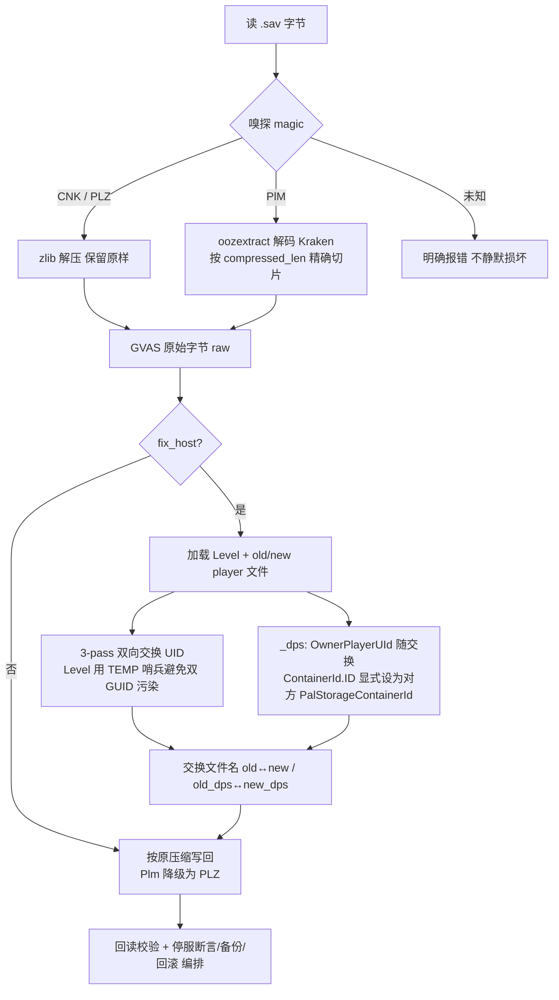

# Palworld 存档改造设计：单机→专用服迁移 + 主机身份修复（推翻 R11）

> 角色：架构师（Bob） · 性质：**仅设计，不写应用代码** · 目标：把同行成熟项目 `PalworldSaveTools`（本地参考实现）验证过的逻辑"抄"进我们的 Rust 项目，打通 Oodle(PLM) 阻塞并修正 `fix_host` 为双向交换。
>
> 配套实测样本：`F:\1\0\20260723-235259\1A91A61548C7B6FD7B58B2B70710F7EE\`（magic=PlM / save_type=49，zlib 系=0）。

---

## ① Oodle 解码路径决策 + 许可证审查结论

### 调研结论（基于实测读码 + 联网）

| 候选方案 | 是什么 | 许可证 | 能否随 MIT/Tauri 分发 | 评估 |
|---|---|---|---|---|
| **A. 纯 Rust Kraken 解码器 `oozextract`** | `lvlvllvlvllvlvl/oozextract` v0.5.4，是 C++ 开源 `ooz`(ryandrake08) 的 Rust 移植；`crate-type=["cdylib","rlib"]`；依赖 `bytemuck/bytes/wide/log` | **MIT**（已核验 Cargo.toml `license = "MIT"`） | ✅ **可以**，无商业/闭源成分 | **首选**。纯 Rust、零外部二进制、覆盖 Kraken/Mermaid/Selkie/Leviathan |
| B. FFI 调官方 Oodle `oo2core` DLL | `meszmate/oodle-rs` 等 wrapper | wrapper 本身 MIT，但**被包装的 `oo2core` 是 Epic 商业闭源库** | ❌ 不能再分发（d-air1 在 PST issue#214 明确："publishing them publicly raises legal concerns"） | 放弃：需用户本机恰好有 Warframe/Steam 的 `oo2core`，且分发违法 |
| C. `sehnryr/oodle-rs` | "Rust reimplementation" | Apache-2.0/MIT | ❌ 其 README 明说需 `download and patch oodle's source code`（即真实 Oodle 源码） | 放弃：本质仍依赖商业 Oodle 源码 |
| D. pyo3 嵌/调参考 Python(`palsav`+`palooz`) | 100% 能用（参考已验证） | MIT（参考） | ✅ 可分发，但违反我们 Q5"无 Python 运行时"、显著增大体积 | 最后兜底，不推荐 |
| E. `kraken-decompressor`(PyPI) | Python 包 | **GPLv3** | ❌ 传染性 copyleft，污染我们 MIT 发布物 | 直接排除 |

### 首选方案（明确推荐）

**方案 A：`oozextract`（MIT，纯 Rust）作为 Oodle(PlM/Kraken) 解码器 + 写回归级为 PLZ(zlib)。**

- **解码（读路径）**：用 `oozextract::decompress(compressed, uncompressed_len)` 替换我们 `sav_io.rs` 里 `PlM → Err(OODLE_ERROR)` 的死路。这与参考 `oozlib.py::OozLib.decompress` 调 `palooz.decompress(compressed_data, uncompressed_len)` **逐字节同构**——`palooz` 本就是同一支开源 Kraken 逆向实现，`oozextract` 是其 Rust 版，完全符合老板"抄同行成熟实现"的指示。
- **编码（写路径）**：开源 Kraken 只有**解码**、没有**压缩**（压缩需真实 Oodle）。但经两处独立社区实证，**把改完的 GVAS 重新压成 PLZ(zlib) 写回，游戏完全读得进，并在下次自动存档时自动升级回 PlM，零数据损失**：
  - `supercraft.host` 存档转换器官方说明："Output is PlZ, which every Palworld version reads and transparently upgrades on its next save."
  - `ibug.io` 实测（Palworld 0.6/Oodle 之后手工改公会箱）："used the previous zlib-based compression method … after sending the edited Level.sav back to the game, our Guild Chest containing 270 slots" ✅
- **许可证结论**：`oozextract` 为 **MIT**，可自由修改/再分发，只需保留版权与许可声明。我们将其 **vendoring 进仓库**（见文件清单），不引入任何 commercial/copyleft 成分，**完全可在 MIT/Tauri 发布物中分发**。

### 风险（已识别）

- **R-OODLE-1（最高优先·开放）**：`oozextract` 覆盖的 Kraken 是否包含最新 Palworld（"Tides of Terraria"/1.0 之后）所用的全部 opcode？`ooz` 上游标注了 "Latest Kraken" 且 `oozextract` 2026-05 仍在维护，样本（save_type=49）实测应能解；但**未来 Oodle 版本可能引入新特性导致解码失败**。→ 缓解：T1 用老板真实样本做字节级保真验收；保留"未知 magic / 解码失败 → 明确报错"的兜底（不静默损坏）。
- **R-OODLE-2**：PLZ 回写是否被某些严格校验的专用服拒绝？目前无证据（社区已大量实跑）。→ 缓解：T5 实机验收；若被发现拒绝，再评估 FFI 加载用户本机 `oo2core`（不分发）。

---

## ② 实现计划（分阶段）

> 原则：先打通**解码保真**（解除 F5 100% 阻塞），再修**摘要读源**，再重写**双向交换**，最后**编排加固 + 端到端验收**。

### 阶段 1：Oodle 解/编码保真（解除阻塞）
- 将 `oozextract` vendoring 为 `src-tauri/crates/oozextract/`（MIT + LICENSE-MIT）。
- `sav_io.rs`：`SavCompression::Plm` 解码分支调用 `oozextract`；写回时 `Plm → PLZ`（降级）。新增 `src/save_edit/oodle.rs` 薄封装。
- **验收**：老板样本 `Level.sav` / `Players/*.sav` / `LevelMeta.sav` 解出的 GVAS 字节，与参考 `palsav`（`sav_to_json`）解出的结构**逻辑一致**；回写 PLZ 后文件可被参考 `palsav` 重新解开（往返无损）。

### 阶段 2：修 `world_copy` 摘要读源
- `read_player_entry` 不再读 `Players/*.sav` 顶层 `Level/NickName`。
- 等级来源 = `Level.sav → worldSaveData → CharacterSaveParameterMap`，按 `key.PlayerUId` 匹配 `SaveParameter.Level`（参照参考 `get_player_level_from_cspm`）。
- 昵称来源 = `GroupSaveDataMap` 公会 `players[].player_info.player_name`（参照参考 `_build_player_list_from_level`）。
- **验收**：摘要等级/昵称与参考 `_build_player_list_from_level` 输出一致。

### 阶段 3：重写 `fix_host` 为双向交换（推翻单向字节替换）
- 删除"单向 `replace_guid_bytes(old→new)`"做法，按参考 `fix_host_save.py::combined_task` / `fix_save` 算法实现**双向交换**：
  1. 加载 `Level.sav` + `Players/<old>.sav` + `Players/<new>.sav`；
  2. 对 **Level.sav**（同时含 old/new 两个 GUID）做 **3-pass 交换**（old→TEMP→new→old 的对称交换，避免单缓冲双 GUID 互相污染）；对两个 player 文件各自做单向 old→new / new→old；
  3. `_dps.sav`：交换 `OwnerPlayerUId`（UID 字面量，随 3-pass 一起处理）+ **显式赋值** `SlotId.ContainerId.ID = 对方角色的 PalStorageContainerId`（容器 ID 不是 UID，不能互换，必须按参考 `copy_dps_file` 设值）；
  4. **最后交换文件名**：`<old>.sav ↔ <new>.sav`、`<old>_dps.sav ↔ <new>_dps.sav`（保证"文件名=身份"一致）。
- **为什么用字节级双向交换而非逐字段**：参考靠完整自定义属性 schema 才能逐字段解析公会/角色 RawData；我们 `gvas` crate（`GameVersion::Palworld`）未必能完整解析这些嵌套 RawData（见 R-GVAS-1）。UID 在 GVAS 中均以 16 字节字面量出现，**字节级双向交换 + 文件名交换 + `_dps` 容器 ID 显式赋值** 能产生与参考**完全相同的最终状态**，且对解析器差异免疫——这是对"抄同行验证过的算法"最稳健的 Rust 移植。
- **验收**：用参考 `fix_host_save.py` 对同一份存档跑一遍做**对拍**（结构一致）；实机：原账号登录后等级/帕鲁/公会/建筑/基地归属正确。

### 阶段 4：迁移编排加固（停服断言 + 自动备份 + 回滚）
- `save_transfer.rs` 整包复制本身稳健，**不改**；但在 `save_edit.rs` 编排入口加：①迁移/修复前**强制停服断言**（运行中替换会被自动存档覆盖，见 R3）；②**自动备份**（复用 `backup_world`）；③**F5 失败/中断自动回滚**到备份。
- **验收**：未停服时拒绝操作；任意步骤失败可一键回滚。

### 阶段 5：全量回滚 / 端到端验收
- 集成测试覆盖：Oodle 往返保真、CNK/PLZ 兼容、双向交换后文件名一致、`_dps` 容器 ID 正确。
- **实机验收（老板用原账号登录）**：这是唯一能确认"游戏内真实可玩"的闸门（见 R-REAL-1）。
- R11 修订文案随本文 §⑥ 落地。

---

## ③ 有序任务清单

> 角色均为**工程师（implementer）**；依赖指前置任务；验收标准可执行、可核验。

| ID | 任务 | 负责角色 | 依赖 | 对应文件 | 验收标准 |
|---|---|---|---|---|---|
| **T1** | Oodle(PlM) 解/编码打通 | 工程师 | — | `Cargo.toml`、`crates/oozextract/*`、`src/save_edit/oodle.rs`、`src/save_edit/sav_io.rs` | 老板样本 `Level.sav`/`Players/*.sav`/`LevelMeta.sav` 经 `oozextract` 解出的 GVAS，与参考 `palsav` 解出的**逻辑结构一致**；回写 PLZ 可被参考 `palsav` 重新解开（往返无损）；未知 magic 仍明确报错 |
| **T2** | `world_copy` 摘要改源 | 工程师 | T1 | `src/save_edit/world_copy.rs` | 摘要中的等级（来自 `CharacterSaveParameterMap` 按 `PlayerUId` 匹配）与昵称（来自公会 `players[].player_info.player_name`）与参考 `_build_player_list_from_level` 输出一致；不再从 `Players/*.sav` 顶层读等级 |
| **T3** | `fix_host` 双向交换重写 | 工程师 | T1 | `src/save_edit/fix_host.rs`、`src/save_edit/sav_io.rs`（3-pass 交换 + `_dps` 解析助手） | 迁移后文件名 `<old>↔<new>`、`<old>_dps↔<new>_dps` 已交换；`_dps` 的 `ContainerId.ID` 被设为对方 `PalStorageContainerId`；与参考 `fix_host_save.py` 对同一存档结果对拍一致；实机登录归属正确 |
| **T4** | 迁移编排加固（停服/备份/回滚） | 工程师 | T3 | `src/save_edit.rs`（编排入口）、`src/save_transfer.rs`（确认不改，仅被编排调用） | 未停服拒绝迁移/修复；执行前自动备份；F5 任意步骤失败自动回滚至备份 |
| **T5** | 全量回滚 + 端到端验收 | 工程师 + 老板 | T4 | `src-tauri/tests/*`、`docs/` | 集成测试全绿；**老板原账号实机登录验收通过**（R-REAL-1）；R11 修订文案落地；回滚脚本可用 |

---

## ④ 文件清单

### 新增
- `src-tauri/Cargo.toml` — 新增 workspace member 或 git dep 指向 vendored `oozextract`。
- `src-tauri/crates/oozextract/Cargo.toml` — vendored 解码器清单（仅 `rlib` + 必需依赖 `bytemuck/bytes/wide/log`，去掉 `unoodle` bin 与 `wasm/cli/tokio` 可选特性）。
- `src-tauri/crates/oozextract/src/lib.rs` — 从上游拷贝的解压实现（`decompress(compressed, uncompressed_len)`）。
- `src-tauri/crates/oozextract/LICENSE-MIT` — 保留上游 MIT 版权与许可声明（分发合规必需）。
- `src-tauri/src/save_edit/oodle.rs` — 薄封装：`oodle_decompress(payload, uncompressed_len) -> Result<Vec<u8>,String>`（调 `oozextract`，错误中文化）；注明"仅解码，编码降级 PLZ"。

### 修改
- `src-tauri/src/save_edit/sav_io.rs`
  - `decode_sav`：逐文件嗅探 magic（保留 CNK/PLZ）；`PlM` 分支改调 `oodle::oodle_decompress(data[12..12+compressed_len], uncompressed_len)`（注意 **按 `compressed_len` 精确切片**，勿传整个剩余字节——Kraken 不像 zlib 会忽略尾部）。
  - `encode_payload`：`Plm → PLZ`（降级写回）；保留 `Cnk/Plz` 原样。
  - 删除 `OODLE_ERROR` 常量（或改文案为"已支持 Oodle"）；`SavCompression::Plm` 注释改为"Oodle(Kraken)，解码用 oozextract(MIT)，写回归级 PLZ"。
  - 新增 `swap_guids(raw, old, new)`：3-pass 双向交换（old→TEMP→new→old），TEMP 由 `old` 末字节翻转派生并校验不在缓冲区内、且 ≠ new。
  - （一致性）对齐参考 `_parse_sav_header`：CNK 为 24 字节头（magic 在 [20:23]），如现有代码尚未处理需补。
- `src-tauri/src/save_edit/fix_host.rs`
  - 删除单向 `replace_guid_bytes(old→new)` 调用；改为 `fix_host_save_impl`：加载 Level + 两 player 文件 → `swap_guids` 双向交换（Level 用 3-pass）→ 解析并赋值两 `_dps.sav` 的 `ContainerId.ID`/`OwnerPlayerUId` → **交换文件名** → 回写 PLZ → 回读校验。
  - 保留 `contains_guid` 防御；新增 `_dps` 解析助手（读 `SaveParameterArray.values[].SaveParameter.value.SlotId.value.ContainerId.value.ID` 与 `OwnerPlayerUId`）。
- `src-tauri/src/save_edit/world_copy.rs`
  - `read_world_summary_from`：先加载 `Level.sav` 一次，构建 `player_uid→level`（来自 `CharacterSaveParameterMap`）与 `player_uid→nickname`（来自公会 `players[].player_info.player_name`）两张表；
  - `read_player_entry(guid, sav_path, &level_map, &name_map)`：从 `Players/*.sav` 的 `SaveData.PlayerUId` 取 uid，查表填 `level`/`nickname`；不再读顶层 `Level/NickName`。
- `src-tauri/src/save_edit.rs`（编排入口，确认存在）
  - 在迁移/修复命令前加**停服断言 + 自动备份 + 失败回滚**包装（T4）。

### 不修改（确认稳健）
- `src-tauri/src/save_transfer.rs` — 整包复制稳健，仅被编排调用。

---

## ⑤ 开放风险（明确列出，不假装确定）

- **R-REAL-1（最高优先·实机验收）**：所有"游戏内真实可玩"结论（等级/帕鲁/公会/建筑/基地归属、PLZ 回写被接受）**只能由老板用原账号登录实机验证**。任何离线字节对拍都不能替代。→ 设为 T5 验收闸门。
- **R-GVAS-1（gvas crate 保真度）**：参考靠 `PALWORLD_TYPE_HINTS` + `SKP_PALWORLD_CUSTOM_PROPERTIES` 全量自定义属性 schema 才能解析公会/角色 RawData 为结构化字段。我们 `gvas` crate（`GameVersion::Palworld`）未必覆盖全部嵌套结构。影响：① T2 结构化读等级/昵称可能取不到（需字节模式兜底）；② T3 若改用逐字段而非字节级，会失败。→ 采用本文"字节级双向交换 + `_dps` 有界解析"规避大部分；T2 等级/昵称若结构化失败，提供 RawData 字节模式最佳努力提取（显示功能，非破坏性）。
- **R-OODLE-1**：`oozextract` 对新版 Kraken opcode 的覆盖度（见 ①）。→ T1 字节级保真验收 + 保留报错兜底。
- **R-OODLE-2**：PLZ 回写在极少数严格校验专用服被拒的可能（无证据）。→ T5 实机验收；必要时才评估 FFI 加载用户本机 `oo2core`（不分发）。
- **R-INST-1（InstanceId 冲突）**：若 `old_inst == new_inst` 或两角色 InstanceId 相同（理论极端），3-pass 交换与 CSPM 匹配会退化。→ `fix_host_save_impl` 加 `old_inst != new_inst` 校验，冲突时报错而非损坏。
- **R-VER-1（跨版本 GVAS 字段差异）**：不同 Palworld 版本 `CharacterSaveParameterMap`/`GroupSaveDataMap` 字段可能增减（参考 `ibug.io` 提到 1.0 的 `ByteProperty` 异常）。→ 解析失败仅影响摘要/T3 结构体定位，保持防御式（单文件失败不整体崩溃），靠 R-REAL-1 兜底。
- **R-DPS-1（`_dps` 结构解析）**：`_dps.sav` 的 `SaveParameterArray` 路径依赖 gvas 解析；若解析不到，退化为"仅做 UID 字节交换、不动 ContainerId"（功能降级但可玩，PL 箱子归属可能需手动整理）。→ 标注降级行为，T5 验收关注。

---

## ⑥ 对 R11 决策的建议措辞（正式修订）

> **R11（原）**：Oodle(PLM) 存档必须明确报错，绝不停默损坏（`sav_io.rs` 遇 `PlM` 直接 `Err(OODLE_ERROR)`）。
>
> **R11（修订版，建议落地文案）**：
>
> R11 · Oodle(PLM) 存档兼容性
> 1. **Oodle(PLM / save_type=49 / Kraken) 现已支持**。解码通过 `oozextract`（MIT，纯 Rust，无商业 Oodle 依赖）实现，与参考 `PalworldSaveTools` 的 `palooz` 同宗同源、逐字节同构。
> 2. **写回统一降级为 PLZ(zlib)**：经社区实证（supercraft.host 转换器、ibug.io 实测），PLZ 可被所有 Palworld 版本读取，并在下次自动存档时透明升级回 PlM，零数据损失。原 R11"Oodle 直接报错"条款**作废**。
> 3. **保留铁律**：任何**无法解码**的格式（未知 magic、解码失败、长度不符）仍须**明确报错、绝不停默损坏**；异常路径不得静默产生损坏存档。
> 4. 原 `OODLE_ERROR` 常量移除或改为"Oodle 已支持（解码 oozextract / 写回归级 PLZ）"。

---

## 附：关键流程（mermaid）

